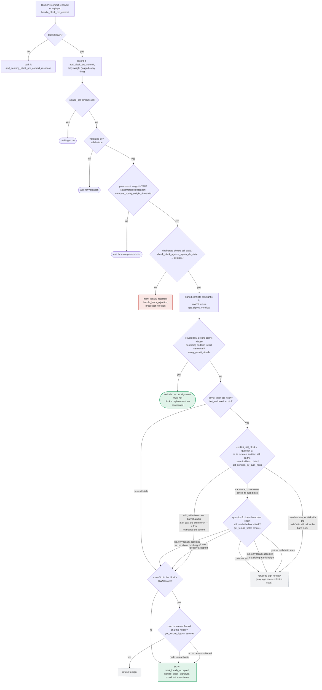
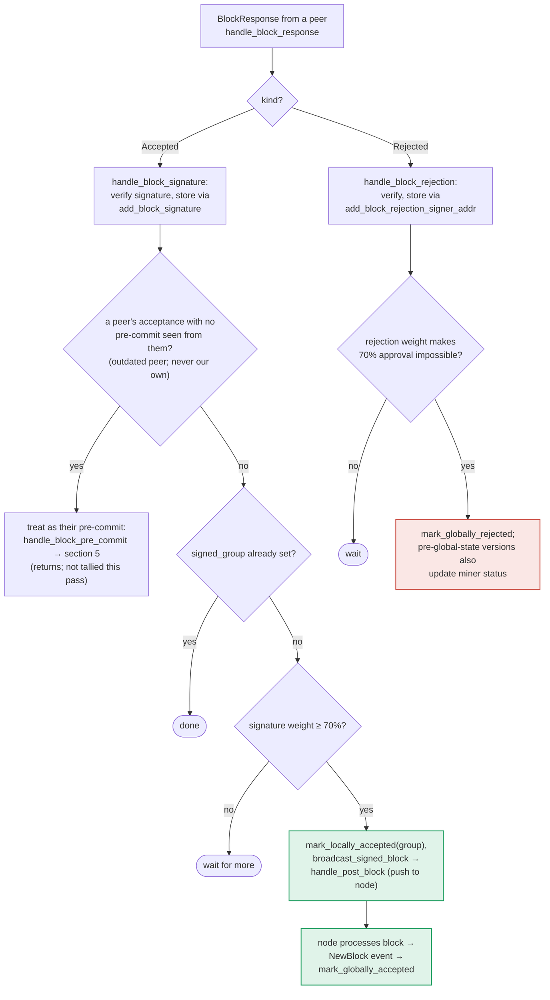

### Title
Signer accepts and pushes a block it locally rejected/never validated once peer signatures reach threshold - `store_and_process_block_signature` never re-checks `block_info.valid` or chainstate state ([File: stacks-signer/src/v0/signer.rs])

### Summary
`store_and_process_block_signature` — the function that tallies observed `BlockAccepted` signatures from other signers toward the 70% weight threshold and, on success, calls `mark_locally_accepted(true)` and `broadcast_signed_block` (which pushes the block to this signer's own node) — never checks this signer's own `block_info.valid` flag, nor re-runs `check_block_against_signer_db_state`, before accepting/pushing. This is unlike the sibling path `handle_block_pre_commit`, which explicitly gates on `!block_info.valid.unwrap_or(false)` and re-runs the chainstate/conflict checks (`check_block_against_signer_db_state`, `get_signed_conflicts`, `reorg_permit_stands`) before this signer places its *own* signature. The result is an authorization gap: the validity/consistency check that gates whether *this* signer treats a block as safe to push is missing on the "observe peers' signatures" path.

### Finding Description
`store_and_process_block_signature` (`stacks-signer/src/v0/signer.rs:2443-2538`) is reached from `handle_block_signature` whenever a valid, authenticated `BlockAccepted` message arrives from a signer who has already pre-committed (`has_committed` true). After storing the signature (`add_block_signature`), the function:

1. Checks only `block_info.signed_group.is_some()` to short-circuit if already globally decided [1](#0-0) .
2. Computes `total_signature_weight` from stored signatures and compares against `min_weight` [2](#0-1) .
3. On reaching threshold, unconditionally calls `block_info.mark_locally_accepted(true)`, persists it, and calls `broadcast_signed_block` → `handle_post_block`, which pushes the block straight to this signer's own stacks-node via `stacks_client.post_block(block)` [3](#0-2) .

At no point does this path check `block_info.valid`, nor re-invoke `check_block_against_signer_db_state` (the chainstate re-check documented in section 7 of `docs/signer-flows.md`) or the fresh-conflict guard (`get_signed_conflicts`/`conflict_still_blocks`/`reorg_permit_stands` documented in section 5). Compare this to `handle_block_pre_commit`, the function that promotes this signer's *own* signature, which explicitly:
- Returns early if `!block_info.valid.unwrap_or(false)` [4](#0-3) 
- Re-runs `check_block_against_signer_db_state` before signing and rejects (`mark_locally_rejected`) if it now fails [5](#0-4) 

`docs/signer-flows.md` documents this asymmetry explicitly: the pre-commit→signature path is "the only place the signer produces a block signature by counting votes" and re-checks chainstate/conflicts before signing [6](#0-5) , whereas the peer-acceptance tally path (`handle_block_response`/`handle_block_signature`) is documented only as "verify signature, store... tally... broadcast" with no mention of a validity or chainstate re-check [7](#0-6) .

The `BlockState` transition table explicitly allows `LocallyRejected --> LocallyAccepted` only "on re-evaluation" [8](#0-7) , but `store_and_process_block_signature` performs no such re-evaluation — it is a blind tally-and-push once weight crosses threshold, regardless of what this signer itself currently believes about the block's validity (`valid == Some(false)`, or a state of `LocallyRejected`/`Unprocessed`).

### Impact Explanation
This breaks the equality between "validated by this signer" and "pushed to this signer's node." A block that this signer's own chainstate view marked invalid, non-canonical, or conflicting (e.g. it lost a fresh-conflict race documented in section 5, or the node's validation returned Reject after this signer had already stored the block, or the block was `LocallyRejected` for a since-resolved reason it never re-evaluated) can still be locally-accepted and posted to this signer's node the moment enough independently-signing peers' signatures accumulate. This is exactly the class of "rejection recounted as an accept" bug the scan is targeting: this signer's own rejection/never-validated state is silently overridden by a tally computed purely from peer signature weight, with no re-verification step analogous to the one the pre-commit path performs. Since `handle_post_block` unconditionally calls `stacks_client.post_block(block)`, a signer in this state actively feeds a block it does not itself believe valid into its own node's processing pipeline.

### Likelihood Explanation
The trigger conditions are narrow but reachable without needing a majority of malicious signers: an honest supermajority reaching threshold on a block is the normal, expected path — the flaw is that *this* signer's local disposition (rejected/never-validated) is not consulted before it treats that external threshold as sufficient to act. Any sequence of events that leaves `block_info.valid` unset or `false`/state `LocallyRejected` on this signer while still allowing enough of `add_block_signature` to accumulate (e.g. via `add_pending_block_signature_response` replay, or via the network simply gossiping already-produced signatures for a block this node individually rejected) triggers the gap. A single miner producing competing/invalid proposals in combination with normal StackerDB gossip of the resulting signature messages is sufficient to create the divergence; no compromise of another signer's key or majority collusion is required to trigger the missing check itself.

### Recommendation
In `store_and_process_block_signature`, before computing/acting on `total_signature_weight`, mirror the guard used in `handle_block_pre_commit`:
- Return/mark-and-reject if `!block_info.valid.unwrap_or(false)`.
- Re-run `check_block_against_signer_db_state` (and the freshness/conflict checks) immediately before calling `mark_locally_accepted(true)` and `broadcast_signed_block`, treating a failure as a rejection rather than silently promoting the block.

### Proof of Concept
1. Signer S receives/validates a block B such that its local chainstate check fails (or S locally rejects B for a reason it never re-evaluates), so `block_info.valid == Some(false)` or `state == LocallyRejected`.
2. A sufficient set of other signers (through ordinary operation, not attacker-controlled majority) sign and gossip `BlockAccepted` for B over StackerDB.
3. S's `handle_block_signature` → `store_and_process_block_signature` receives these, stores them via `add_block_signature`, and — since it never inspects `block_info.valid`/state — tallies weight to threshold and calls `mark_locally_accepted(true)` + `broadcast_signed_block`, pushing B to S's own node via `handle_post_block`/`post_block`, despite S never having validated (or having explicitly rejected) B itself.

Note: I was unable to fully trace `mark_locally_accepted`'s implementation and `BlockInfo::check_state`'s exact enforced transitions (their bodies were not returned by the index), so I cannot rule out that a lower-level invariant in `signerdb.rs` blocks this transition when `valid` is `Some(false)`. Given the size limits on the codebase index, a Devin session with full file access is recommended to confirm the exact transition guard in `stacks-signer/src/signerdb.rs` (`mark_locally_accepted`, `check_state`) before treating this as fully proven.

### Citations

**File:** stacks-signer/src/v0/signer.rs (L1323-1331)
```rust
        if !block_info.valid.unwrap_or(false) {
            // We received a pre-commit for a block that we have not validated or we have already marked this block as invalid.
            // We should not do anything further as we do not know what our response should be and we do not change our votes on rejected
            // blocks unless we receive a new block proposal for it and the reject reason allows us to reconsider.
            debug!(
                "{self}: Received a pre-commit for a block that we have not determined to be valid: {:?}. Doing nothing...", block_info.valid
            );
            return;
        }
```

**File:** stacks-signer/src/v0/signer.rs (L1340-1366)
```rust
        // The chain and signer db state may have changed materially since this block passed the
        // proposal-time checks (e.g. between validation and reaching the pre-commit threshold we
        // may have signed a block that this one would reorg). Re-run the chainstate checks
        // before putting a signature over the block, and respond with a rejection if they no
        // longer pass, just as the block validation response handler does.
        if let Some(block_rejection) =
            self.check_block_against_signer_db_state(stacks_client, &block_info.block)
        {
            warn!(
                "{self}: Reached the pre-commit threshold for a block, but it no longer passes the chainstate checks. Rejecting.";
                "signer_signature_hash" => %block_hash,
                "block_height" => block_info.block.header.chain_length,
                "reject_code" => %block_rejection.reason_code,
                "reject_reason" => &block_rejection.reason,
            );
            if let Err(e) = block_info.mark_locally_rejected() {
                if !block_info.has_reached_consensus() {
                    warn!("{self}: Failed to mark block as locally rejected: {e:?}");
                }
            };
            self.signer_db
                .insert_block(&block_info)
                .unwrap_or_else(|e| self.handle_insert_block_error(e));
            self.handle_block_rejection(&block_rejection, sortition_state);
            self.send_block_response(&block_info.block, block_rejection.into());
            return;
        }
```

**File:** stacks-signer/src/v0/signer.rs (L2468-2471)
```rust
        if block_info.signed_group.is_some() {
            // We have already processed this block to the accepted state. Adding more signatures will not change anything so nothing to check.
            return;
        }
```

**File:** stacks-signer/src/v0/signer.rs (L2474-2514)
```rust
        let signatures = self
            .signer_db
            .get_block_signatures(block_hash)
            .unwrap_or_else(|_| panic!("{self}: Failed to load block signatures"));

        // put signatures in order by signer address (i.e. reward cycle order)
        let addrs_to_sigs: HashMap<_, _> = signatures
            .into_iter()
            .filter_map(|sig| {
                let Ok(public_key) = Secp256k1PublicKey::recover_to_pubkey_without_validating_low_s(
                    block_hash.bits(),
                    &sig,
                ) else {
                    return None;
                };
                let addr = StacksAddress::p2pkh(self.mainnet, &public_key);
                Some((addr, sig))
            })
            .collect();

        let signature_weight = self.signer_weights.get(signer_address).unwrap_or(&0);
        let total_signature_weight = self.compute_signature_signing_weight(addrs_to_sigs.keys());
        let total_weight = self.compute_signature_total_weight();

        let min_weight = NakamotoBlockHeader::compute_voting_weight_threshold(total_weight)
            .unwrap_or_else(|_| {
                panic!("{self}: Failed to compute threshold weight for {total_weight}")
            });

        if min_weight > total_signature_weight {
            info!("{self}: Received block acceptance, but have not yet reached the acceptance threshold.";
                "signer_signature_hash" => %block_hash,
                "signature_weight" => signature_weight,
                "consensus_hash" => %block_info.block.header.consensus_hash,
                "block_height" => block_info.block.header.chain_length,
                "total_weight_approved" => total_signature_weight,
                "total_weight" => total_weight,
                "percent_approved" => (total_signature_weight as f64 / total_weight as f64 * 100.0),
            );
            return;
        }
```

**File:** docs/signer-flows.md (L140-154)
```markdown
    Unprocessed --> PreCommitted : mark_pre_committed
    PreCommitted --> LocallyAccepted : mark_locally_accepted = WE SIGN
    Unprocessed --> LocallyRejected : mark_locally_rejected
    PreCommitted --> LocallyRejected : mark_locally_rejected
    LocallyRejected --> LocallyAccepted : re-evaluated
    LocallyAccepted --> LocallyRejected : re-evaluated
    LocallyAccepted --> GloballyAccepted : mark_globally_accepted
    LocallyRejected --> GloballyRejected : mark_globally_rejected
    GloballyAccepted --> [*]
    GloballyRejected --> [*]
```

Canonical paths shown; the exact rule in `BlockInfo::check_state` is: either
local state is reachable from anything not yet global, `PreCommitted` only from
`Unprocessed`, and each global state is unreachable from the other.
```

**File:** docs/signer-flows.md (L229-272)
```markdown
## 5. Pre-commit threshold → signature

The only place the signer produces a block signature by counting votes.
Pre-commits from peers (and our own) accumulate; at ≥70% weight the signer
decides whether to follow through. Between validation and threshold, we may have
signed a _different_ block at the same height, possibly in another tenure, so
the world must be re-checked before the signature leaves the box.


```

**File:** docs/signer-flows.md (L357-375)
```markdown

```
