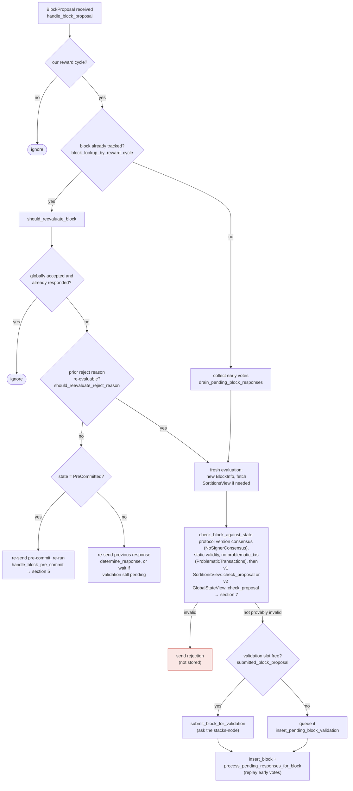

I have enough evidence to write up the finding now.

### Title
Unbounded, self-renewable "miner activity" timer lets a one-slot miner permanently suppress the inactivity fallback - (File: `stacks-signer/src/chainstate/mod.rs`)

### Summary
`check_latest_block_in_tenure` treats a rejected (too-low / conflicting) block proposal as "miner activity" and refreshes `last_activity_time` to `now()`. The refresh is only time-bounded when the tenure's current tip was already **globally** signed (`signed_group` present); when the tip is merely locally accepted (`signed_group == None`), the refresh happens unconditionally on every call, with no freshness window at all. Since the sole gate that lets signers fall back away from an unresponsive/adversarial miner (`SortitionState::is_timed_out`, in both v1 and v2) is driven entirely by `last_activity_time`, a miner who legitimately won the sortition (a "one-slot miner") can keep this timer perpetually fresh by repeatedly submitting cheap, deliberately-losing block proposals, and thereby prevent `check_miner_inactivity` from ever reverting the signer set to the prior/valid miner.

### Finding Description
`SortitionData::get_tenure_last_block_info` / `check_latest_block_in_tenure` is called on every block proposal (during `check_proposal`, at validate-ok, and at signing) to decide whether the proposal confirms the tenure's expected tip: [1](#0-0) 

When the proposal fails this check (its `chain_length` is not higher than the known tip), the code still records it as valid "miner activity" via `update_last_activity_time`, guarded by a freshness condition on the **existing tip's** `signed_group` timestamp:
```rust
if info.signed_group.is_none_or(|signed_time| {
    signed_time + reorg_attempts_activity_timeout.as_secs() > get_epoch_time_secs()
}) {
    ...
    signer_db.update_last_activity_time(&block.header.consensus_hash, get_epoch_time_secs())
}
``` [2](#0-1) 

`Option::is_none_or` evaluates to `true` unconditionally whenever `signed_group` is `None` — i.e. whenever the tenure's current tip was only *locally* accepted and never reached the global (70%) threshold. In that state there is **no time bound at all**: every subsequent invalid/losing proposal refreshes `last_activity_time` to `now()`, forever. The `reorg_attempts_activity_timeout` bound is only enforced once the tip has actually been globally accepted (`signed_group` set), which is precisely the case that does *not* need protection from a runaway timer.

`last_activity_time` is the single input, alongside `has_signed_block_in_tenure`, that both protocol versions use to decide whether the current miner has gone inactive: [3](#0-2) [4](#0-3) 

and that decision is what `check_miner_inactivity` uses to fall back to the prior tenure's miner: [5](#0-4) 

Each proposal only needs a distinct `signer_signature_hash` to force a fresh evaluation rather than being short-circuited as an already-seen block (the docs confirm re-evaluation is skipped only for identical, already-tracked proposals, and the codebase's own sibling-block tests construct distinct hashes for the same tenure/height purely by varying the timestamp field): [6](#0-5) [7](#0-6) 

### Impact Explanation
This is a liveness wedge matching the "signer wedged into never signing valid blocks" High-severity class: as long as the tenure's tip has never crossed the global-acceptance threshold (e.g. a stalled tenure, a persistent minority split, or simply a miner that refuses to let any block reach 70%), the legitimate one-slot miner can indefinitely refresh `last_activity_time` for free by resubmitting trivially-losing/conflicting proposals (varying only the timestamp to get a fresh hash). `is_timed_out` will never return `true`, so `check_miner_inactivity` never triggers, and the signer set can never fall back to `make_miner_state(prior sortition)`. The chain is denied progress for as long as the adversarial miner chooses, without needing a majority of signers, another signer's key, or any node-side bug — purely a signer-side validation gap.

### Likelihood Explanation
Triggering this requires only being the winner of the current sortition (a one-slot miner) plus normal gossip of `BlockProposal` messages over StackerDB — no majority of signers, no other signer's key, and no auth_token/local access is needed. The only precondition is that the tenure's current known tip has not yet gone globally accepted, which is a routine and frequently-occurring state (any tenure before its first block reaches the 70% threshold, or any tenure in a persistent local-accept-only split).

### Recommendation
Apply the same freshness bound to the `signed_group.is_none()` case as to the timed-out case, e.g. base the "still counts as activity" decision on the *proposal's own* timestamp/receive time or a fixed cap since the tenure's local acceptance (`signed_self`) rather than treating "not yet globally accepted" as permission to refresh unconditionally:
```rust
if info.signed_group.is_some_and(|signed_time| {
    signed_time + reorg_attempts_activity_timeout.as_secs() > get_epoch_time_secs()
}) || info.signed_self.is_some_and(|signed_time| {
    signed_time + reorg_attempts_activity_timeout.as_secs() > get_epoch_time_secs()
}) {
    signer_db.update_last_activity_time(...)
}
```
so that a locally-accepted-only tip stops granting free activity renewals once `reorg_attempts_activity_timeout` has elapsed since it was last (locally) signed, closing the unbounded renewal window.

### Proof of Concept
1. Miner M wins sortition for tenure T; proposes block B1 at height H. Signers locally-accept B1 (`signed_self` set, `signed_group` remains `None` because the group never reaches 70%, e.g. due to a persistent 50/50 split as exercised by the existing `deadlock_50_50_split_capitulates_to_node_tip` scenario).
2. `get_tenure_last_block_info(T)` returns `Some(B1)` with `signed_group = None`.
3. M crafts B2 with the same `chain_length` as B1 but a different `timestamp` (hence a different `signer_signature_hash`), so `should_reevaluate_block` treats it as a fresh proposal rather than short-circuiting.
4. `check_latest_block_in_tenure` rejects B2 (`chain_length <= info.block.header.chain_length`), but because `info.signed_group.is_none_or(...)` is `true` (it's `None`), it calls `update_last_activity_time(T, now())` regardless of elapsed time.
5. M repeats step 3–4 indefinitely, at any cadence, well beyond `block_proposal_timeout`; `SortitionState::is_timed_out` (v1: `stacks-signer/src/chainstate/v1.rs:55-94`, v2: `stacks-signer/src/chainstate/v2.rs:48-89`) never observes `elapsed > block_proposal_timeout`, so `check_miner_inactivity` never falls back to the prior miner, stalling the tenure for as long as M continues.

### Citations

**File:** stacks-signer/src/chainstate/mod.rs (L376-420)
```rust
    pub fn check_latest_block_in_tenure(
        tenure_id: &ConsensusHash,
        block: &NakamotoBlock,
        signer_db: &mut SignerDb,
        client: &StacksClient,
        tenure_last_block_proposal_timeout: Duration,
        reorg_attempts_activity_timeout: Duration,
    ) -> Result<bool, ClientError> {
        let last_block_info = SortitionData::get_tenure_last_block_info(
            tenure_id,
            signer_db,
            tenure_last_block_proposal_timeout,
        )?;

        if let Some(info) = last_block_info {
            // N.B. this block might not be the last globally accepted block across the network;
            // it's just the highest one in this tenure that we know about.  If this given block is
            // no higher than it, then it's definitely no higher than the last globally accepted
            // block across the network, so we can do an early rejection here.
            if block.header.chain_length <= info.block.header.chain_length {
                warn!(
                    "Miner's block proposal does not confirm as many blocks as we expect";
                    "proposed_block_consensus_hash" => %block.header.consensus_hash,
                    "signer_signature_hash" => %block.header.signer_signature_hash(),
                    "proposed_chain_length" => block.header.chain_length,
                    "expected_at_least" => info.block.header.chain_length + 1,
                );
                if info.signed_group.is_none_or(|signed_time| {
                    signed_time + reorg_attempts_activity_timeout.as_secs() > get_epoch_time_secs()
                }) {
                    // Note if there is no signed_group time, this is a locally accepted block (i.e. tenure_last_block_proposal_timeout has not been exceeded).
                    // Treat any attempt to reorg a locally accepted block as valid miner activity.
                    // If the call returns a globally accepted block, check its globally accepted time against a quarter of the block_proposal_timeout
                    // to give the miner some extra buffer time to wait for its chain tip to advance
                    // The miner may just be slow, so count this invalid block proposal towards valid miner activity.
                    if let Err(e) = signer_db.update_last_activity_time(
                        &block.header.consensus_hash,
                        get_epoch_time_secs(),
                    ) {
                        warn!("Failed to update last activity time: {e}");
                    }
                }
                return Ok(false);
            }
        }
```

**File:** stacks-signer/src/chainstate/v1.rs (L52-94)
```rust
impl SortitionState {
    /// Check if the given sortition identified by its ConsensusHash has timed out based on current signed blocks
    /// and the time at which the burn block for it was first recorded in the provided signerdb
    pub fn is_timed_out(
        sortition: &ConsensusHash,
        db: &SignerDb,
        block_proposal_timeout: Duration,
    ) -> Result<bool, SignerChainstateError> {
        // If we've already signed a block in this tenure, the miner can't have timed out: we have
        // committed a signature to this tenure and must not help abandon it.
        //
        // Importantly, a block we have only pre-committed to does not count! A pre-commit carries
        // no signature, and if it never reaches the pre-commit threshold the tenure can stall
        // indefinitely. Treating it as signed here would suppress the inactivity timeout for
        // exactly the signers that pre-committed, so they could never fall back to the prior
        // miner and the tenure could never recover.
        let has_block = db.has_signed_block_in_tenure(sortition)?;
        if has_block {
            return Ok(false);
        }
        let Some(received_ts) = db.get_burn_block_receive_time_ch(sortition)? else {
            return Ok(false);
        };
        let received_time = UNIX_EPOCH + Duration::from_secs(received_ts);
        let last_activity = db
            .get_last_activity_time(sortition)?
            .map(|time| UNIX_EPOCH + Duration::from_secs(time))
            .unwrap_or(received_time);

        let Ok(elapsed) = std::time::SystemTime::now().duration_since(last_activity) else {
            return Ok(false);
        };

        if elapsed > block_proposal_timeout {
            info!(
                "Tenure miner was inactive too long and timed out";
                "tenure_ch" => %sortition,
                "elapsed_inactive" => elapsed.as_secs(),
                "config_block_proposal_timeout" => block_proposal_timeout.as_secs()
            );
        }
        Ok(elapsed > block_proposal_timeout)
    }
```

**File:** stacks-signer/src/chainstate/v2.rs (L45-89)
```rust
impl SortitionState {
    /// Check if the sortition identified by the ConsensusHash is timed out based on
    /// the blocks within the signer db and the block proposal timeout
    pub fn is_timed_out(
        sortition: &ConsensusHash,
        signer_db: &SignerDb,
        eval: &GlobalStateEvaluator,
        local_address: &StacksAddress,
        timeout: Duration,
    ) -> Result<bool, SignerChainstateError> {
        // If we've already signed a block in this tenure, the miner can't have timed out: we have
        // committed a signature to this tenure and must not help abandon it.
        //
        // Importantly, a block we have only pre-committed to does not count! A pre-commit carries
        // no signature, and if it never reaches the pre-commit threshold the tenure can stall
        // indefinitely. Treating it as signed here would suppress the inactivity timeout for
        // exactly the signers that pre-committed, so they could never fall back to the prior
        // miner and the tenure could never recover.
        let has_block = signer_db.has_signed_block_in_tenure(sortition)?;
        if has_block {
            return Ok(false);
        }
        let Some(received_ts) =
            signer_db.get_burn_block_received_time_from_signers(eval, sortition, local_address)?
        else {
            return Ok(false);
        };
        let received_time = UNIX_EPOCH + Duration::from_secs(received_ts);
        let last_activity = signer_db
            .get_last_activity_time(sortition)?
            .map(|time| UNIX_EPOCH + Duration::from_secs(time))
            .unwrap_or(received_time);

        let Ok(elapsed) = std::time::SystemTime::now().duration_since(last_activity) else {
            return Ok(false);
        };
        if elapsed > timeout {
            info!("Sortition has timed out";
                "sorition" => %sortition,
                "timeout" => %timeout.as_secs(),
                "elapsed" => %elapsed.as_secs()
            )
        }
        Ok(elapsed > timeout)
    }
```

**File:** stacks-signer/src/v0/signer_state.rs (L284-335)
```rust
    pub fn check_miner_inactivity(
        &mut self,
        db: &mut SignerDb,
        client: &StacksClient,
        proposal_config: &ProposalEvalConfig,
        eval: &GlobalStateEvaluator,
    ) -> Result<(), SignerChainstateError> {
        let Self::Initialized(ref mut state_machine) = self else {
            // no inactivity if the state machine isn't initialized
            return Ok(());
        };

        let MinerState::ActiveMiner { ref tenure_id, .. } = state_machine.current_miner else {
            // no inactivity if there's no active miner
            return Ok(());
        };

        let version = SortitionStateVersion::from_protocol_version(
            state_machine.active_signer_protocol_version,
        );
        let is_timed_out = SortitionState::is_timed_out(
            &version,
            tenure_id,
            db,
            client.get_signer_address(),
            proposal_config,
            eval,
        )?;

        if !is_timed_out {
            return Ok(());
        }

        // the tenure timed out, try to see if we can use the prior tenure instead
        let CurrentAndLastSortition { last_sortition, .. } =
            client.get_current_and_last_sortition()?;
        let Some(last_sortition) = last_sortition
            .and_then(|val| SortitionData::try_from(val).ok())
            .map(|data| SortitionState::new(version, data))
        else {
            warn!("Signer State: Current miner timed out due to inactivity, but could not find a valid prior miner. Allowing current miner to continue");
            return Ok(());
        };

        let sortition_data = last_sortition.data();
        // If we already reverted to the last sortition miner, don't time it out as it means we have already timed out the current sorititon miner
        // as there is no other miner available.
        if &sortition_data.consensus_hash == tenure_id {
            warn!("Signer State: Last sortition miner has timed out, but no prior valid miner. Allowing last sortition miner to continue");
            return Ok(());
        }

```

**File:** stacks-signer/src/v0/tests.rs (L630-638)
```rust
        // Two conflicting sibling tenure-start blocks: same tenure, parent, and height; the only
        // difference is the timestamp (hence the hash). The timestamps are current so that a
        // re-proposal of B passes the proposal age check.
        let now = get_epoch_time_secs();
        let block_a = tenure_start(&miner, &tenure, &parent_tenure, &parent_id, now);
        let block_b = tenure_start(&miner, &tenure, &parent_tenure, &parent_id, now + 1);
        let hash_a = block_a.header.signer_signature_hash();
        let hash_b = block_b.header.signer_signature_hash();
        assert_ne!(hash_a, hash_b);
```

**File:** docs/signer-flows.md (L164-203)
```markdown
## 3. A block proposal arrives

The miner broadcasts a proposal. If we've seen this exact block before,
`should_reevaluate_block` decides whether the old verdict stands; a block we
only pre-committed to is deliberately routed back through the pre-commit
evaluation so a re-proposal cannot shortcut to a signature. A fresh proposal is
checked against our view of the world _before_ spending a node validation on it.



Early votes: acceptances, rejections, and pre-commits that arrived before the
proposal itself are parked in pending tables and replayed once the proposal is
known.

> Anchors: `handle_block_proposal`, `should_reevaluate_block`,
> `should_reevaluate_reject_reason`, `check_block_against_state`,
> `submit_block_for_validation`, `process_pending_responses_for_block`
> (signer.rs); `check_proposal` (chainstate/v1.rs, v2.rs)
```
