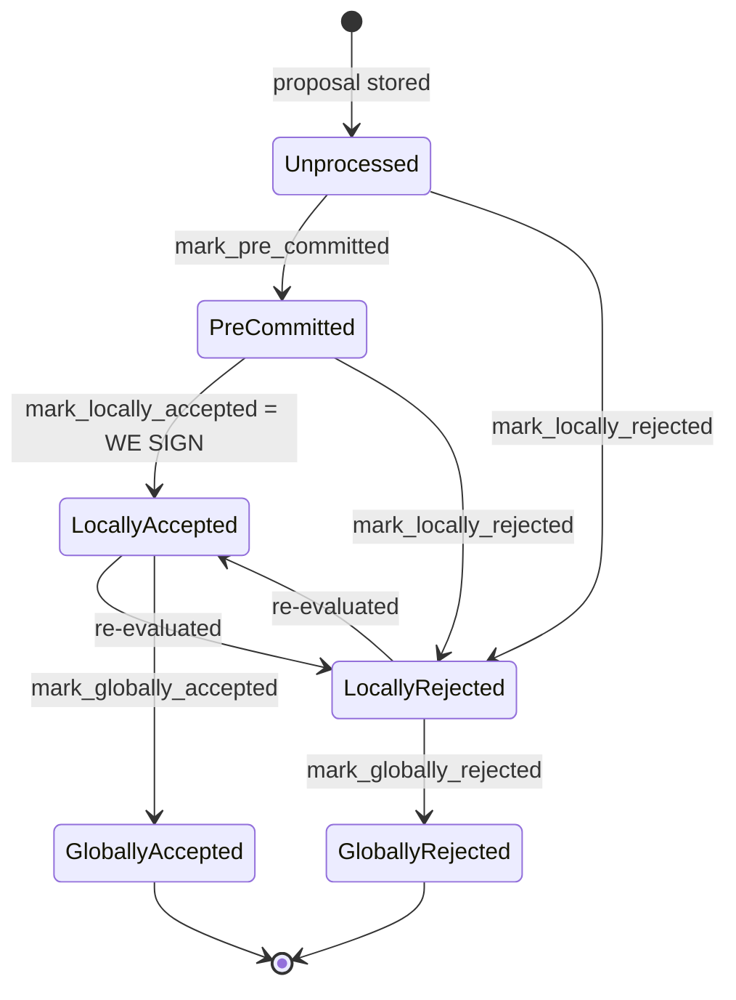

### Title
Stale rejection weight is never retracted when a signer flips Rejected→Accepted, letting the miner-side coordinator wedge a block with genuine supermajority support - ([File: stacks-node/src/nakamoto_node/stackerdb_listener.rs])

### Summary
`StackerDBListener` tallies `total_weight_approved` and `total_weight_rejected` for each proposed block using two different de-duplication keys (`gathered_signatures` for acceptances vs. `responded_signers` for rejections). Because the checks are asymmetric, a signer that first rejects a block and later legitimately re-evaluates and accepts it (a state transition explicitly supported by the v0 signer state machine) has its weight counted in `total_weight_rejected` *and* `total_weight_approved` at the same time, with the stale rejection never removed. `SigningCoordinator::gather_signatures` in `signer_coordinator.rs` checks the rejection-impossibility condition before the acceptance condition, so this stale, uncleared rejection weight can make the miner declare the block permanently rejected even though a real supermajority of current signer weight approves it.

### Finding Description
The signer flow documented in `docs/signer-flows.md` (`should_reevaluate_reject_reason`, section 3) allows a signer to change its verdict on the *same* proposed block from `LocallyRejected` back to `LocallyAccepted` once the reason for rejection becomes stale, and to (re-)broadcast a new `BlockResponse` for it: [1](#0-0) . This is normal, single-signer-triggerable behavior, not an attack requiring a majority.

On the miner side, `StackerDBListener::run` maintains `BlockStatus` per block hash and updates it as `BlockResponse` messages arrive:

- On `Accepted`, the weight is only added if the slot is **not yet present in `gathered_signatures`**: [2](#0-1) 

- On `Rejected`, the weight is only added if `responded_signers.insert(slot_id)` returns `true` (i.e., first time this slot has been *seen at all*): [3](#0-2) 

Because a `Rejected` message also marks the slot as "responded" (via `responded_signers`), a subsequent `Accepted` from the same slot is *not* blocked by the rejection bookkeeping — it is only checked against the disjoint `gathered_signatures` map, which the rejection path never touches. So:

1. Signer S (slot 5, weight w) sends `Rejected` → `responded_signers.insert(5)` succeeds → `total_weight_rejected += w`.
2. S later sends `Accepted` for the *same* `signer_signature_hash` → `gathered_signatures.contains_key(5)` is `false` (rejection never touched this map) → `total_weight_approved += w` as well.

The signer's weight `w` is now counted in **both** tallies, and nothing ever decrements `total_weight_rejected`. This breaks the invariant the miner coordinator relies on — that `total_weight_rejected` reflects only signers *currently* opposing the block.

### Impact Explanation
`SigningCoordinator::gather_signatures` (`signer_coordinator.rs`) evaluates the rejection-impossibility branch before the acceptance branch: [4](#0-3) 

If enough signers (a blocking minority just over 30% of weight, not a majority) each go through a legitimate reject→accept flip, their stale `total_weight_rejected` contributions can push `block_status.total_weight_rejected + weight_threshold > total_weight` to remain true even after all of them currently support the block with more than 70% weight. The coordinator then returns `SignersRejected` and the miner discards a block that in fact has present supermajority approval — a liveness wedge that matches the "acting on a stale threshold" impact class, since the miner is acting on rejection weight that is stale and was never retracted despite the signers involved actively signaling acceptance afterward.

This is directly analogous to the reported Umbrella bug: there, `_coverDeficit()` derived a value from accumulated/shared contract state (`balanceOf(this)`) instead of the delta caused by the specific action, so a later, unrelated mutation of that shared state (a direct transfer) silently poisoned a subsequent calculation. Here, `total_weight_rejected` is accumulated shared state that a later, legitimate action (an `Accepted` message) fails to correct, because the acceptance path checks a different bookkeeping set (`gathered_signatures`) than the one the rejection path uses to guard its own accumulation (`responded_signers`).

### Likelihood Explanation
Reachable by any subset of signers changing their vote in the documented reject→accept order for the same block, which requires no more than a blocking minority (~30%) of signer weight and no majority, no forged signatures, and no protocol violation — only the ordinary re-evaluation flow already implemented in `stacks-signer/src/v0/signer.rs`. Because gossip/StackerDB delivery order is not guaranteed, this reject-then-accept ordering (from the coordinator's point of view) can also occur incidentally due to message reordering/latency even without any signer intentionally trying to trigger it, making the likelihood non-trivial.

### Recommendation
Track approvals and rejections per slot using a single unified state (e.g., `Option<Vote>` per slot) rather than two independently-checked sets (`gathered_signatures` vs `responded_signers`). When a slot's vote flips, subtract the previously counted weight from the old tally before adding it to the new one, so `total_weight_approved` and `total_weight_rejected` never both include the same signer's weight simultaneously and always reflect only that signer's most recent vote.

### Proof of Concept
1. Miner proposes block B; `StackerDBListener` opens `BlockStatus` for B with `total_weight_approved = total_weight_rejected = 0`.
2. Signer S (slot 5, weight w ≈ 31% of total, enough alone or combined with a few others to exceed the 30% blocking-minority threshold) broadcasts `BlockResponse::Rejected` for B (e.g., due to a transient `ReorgNotAllowed`/staleness condition). Listener: `responded_signers.insert(5)` → true → `total_weight_rejected = w`.
3. The condition that caused S's rejection becomes stale (per `should_reevaluate_reject_reason`); S's local state machine transitions `LocallyRejected → LocallyAccepted` and S broadcasts `BlockResponse::Accepted` for the same `signer_signature_hash`.
4. Listener: `gathered_signatures.contains_key(5)` is false → `total_weight_approved = w` (also). `total_weight_rejected` remains `w` — never decremented.
5. Enough other signers approve normally so `total_weight_approved ≥ weight_threshold` (≥70%), and simultaneously `total_weight_rejected + weight_threshold > total_weight` still holds because of S's stale rejection weight.
6. In `SigningCoordinator::gather_signatures`, the rejection branch is checked first and fires, returning `Err(SignersRejected { .. })` even though live signer weight currently supports and would sign the block above the acceptance threshold — the block is wedged/dropped by the miner despite real supermajority approval.

### Citations

**File:** docs/signer-flows.md (L130-150)
```markdown
## 2. Block lifecycle (`BlockState`)

Every proposal tracked in the signer DB carries a `BlockState`. **`PreCommitted`
carries no signature**: it means "validated, willing to sign if the pre-commit
threshold is met." The first signature appears at `mark_locally_accepted`.
Global states are terminal against each other.


```

**File:** stacks-node/src/nakamoto_node/stackerdb_listener.rs (L443-465)
```rust
                        if !block.gathered_signatures.contains_key(&slot_id) {
                            block.total_weight_approved = block
                                .total_weight_approved
                                .saturating_add(signer_entry.weight);

                            info!("StackerDBListener: Signature Added to block";
                                "signer_signature_hash" => %block_sighash,
                                "signer_pubkey" => signer_pubkey.to_hex(),
                                "signer_slot_id" => slot_id,
                                "signature" => %signature,
                                "signer_weight" => signer_entry.weight,
                                "total_weight_approved" => block.total_weight_approved,
                                "percent_approved" => block.total_weight_approved as f64 / self.total_weight as f64 * 100.0,
                                "total_weight_rejected" => block.total_weight_rejected,
                                "percent_rejected" => block.total_weight_rejected as f64 / self.total_weight as f64 * 100.0,
                                "weight_threshold" => self.weight_threshold,
                                "tenure_extend_timestamp" => tenure_extend_timestamp,
                                "read_count_extend_timestamp" => read_count_extend_timestamp,
                                "server_version" => metadata.server_version,
                            );
                        }
                        block.gathered_signatures.insert(slot_id, signature);
                        block.responded_signers.insert(slot_id);
```

**File:** stacks-node/src/nakamoto_node/stackerdb_listener.rs (L515-519)
```rust
                        if block.responded_signers.insert(slot_id) {
                            block.total_weight_rejected = block
                                .total_weight_rejected
                                .saturating_add(signer_entry.weight);

```

**File:** stacks-node/src/nakamoto_node/signer_coordinator.rs (L509-545)
```rust
            if block_status
                .total_weight_rejected
                .saturating_add(self.weight_threshold)
                > self.total_weight
            {
                info!(
                    "{}/{} signer weight votes to reject block",
                    block_status.total_weight_rejected, self.total_weight;
                    "signer_signature_hash" => %block_signer_sighash,
                );
                counters.bump_naka_rejected_blocks();

                // Only act on failed txids that a blocking minority (>30% weight) agrees on
                let blocking_minority = self.total_weight.saturating_sub(self.weight_threshold);
                let mut temporarily_excluded_txids = HashSet::new();
                let mut permanently_excluded_txids = HashSet::new();
                for (txid, info) in &block_status.failed_txids {
                    if info.total_weight > blocking_minority {
                        // Do not perma ban txids that only a small minority of signers reported as problematic
                        // But make sure its removed from the next block proposal
                        if info.problematic_weight > blocking_minority {
                            permanently_excluded_txids.insert(txid.clone());
                        } else {
                            temporarily_excluded_txids.insert(txid.clone());
                        }
                    }
                }

                return Err(NakamotoNodeError::SignersRejected {
                    temporarily_excluded_txids,
                    permanently_excluded_txids,
                });
            } else if block_status.total_weight_approved >= self.weight_threshold {
                info!("Received enough signatures, block accepted";
                    "signer_signature_hash" => %block_signer_sighash,
                );
                return Ok(block_status.gathered_signatures.values().cloned().collect());
```
