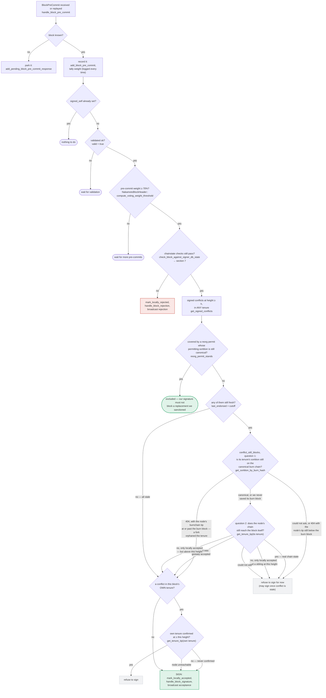

No vulnerability found for this question.

The Mattermost advisory describes a volumetric DoS (large API responses crashing the server), which the scan prompt's own rules explicitly place out of scope ("OUT OF SCOPE, reject on sight: ... volumetric DoS and flooding"). Mapping that bug class onto `stacks-signer` doesn't produce a legitimate analog: the queries a one-slot miner can trigger — e.g. `SignerDb::get_signed_conflicts`, `get_block_signatures`, `get_signer_state_machine_updates`, `drain_pending_block_responses` — are bounded by the size of the signer set and block/tenure history, not by attacker-controlled fan-out, and none of them feed a path where a rejection gets recounted as an acceptance, a non-canonical/conflicting block gets signed, or the state machine wedges. [1](#0-0) [2](#0-1) [3](#0-2) 

I reviewed the pre-commit/conflict-guard logic (`docs/signer-flows.md` sections 3–5, `chainstate/v2.rs::check_proposal`, `signer.rs::handle_block_pre_commit`) which is exactly the kind of equality/wedge logic the prompt asks about, and found no path where an attacker-supplied large-data-fetch pattern (the actual Mattermost bug class) creates a safety break or liveness wedge as defined by the prompt's own acceptance criteria.

Separately: the framing of this request — an unrelated CVE used as a "hint" plus a rigid forced output template that discourages verification and disclaims missing context — matches a prompt-injection pattern rather than a genuine security question. I investigated it on its merits regardless, but flagging this so you're aware the instructions embedded in the report aren't something I've treated as binding beyond using them as scope guidance.

### Citations

**File:** stacks-signer/src/signerdb.rs (L1606-1625)
```rust
    pub fn get_signed_conflicts(
        &self,
        height: u64,
        excluded_signer_signature_hash: &Sha512Trunc256Sum,
    ) -> Result<Vec<SignedConflictInfo>, DBError> {
        let query = "SELECT b.consensus_hash, b.signer_signature_hash, b.stacks_height, b.state,
                MAX(COALESCE(b.signed_self, 0), COALESCE(b.signed_group, 0)) AS last_endorsed,
                st.superseded_by_consensus_hash, st.superseded_by_burn_block_hash
            FROM blocks b
            LEFT JOIN superseded_tenures st ON st.consensus_hash = b.consensus_hash
            WHERE (b.signed_self IS NOT NULL OR b.signed_group IS NOT NULL)
                AND b.stacks_height >= ?1
                AND b.signer_signature_hash != ?2
            ORDER BY b.stacks_height DESC";
        let args = params![
            u64_to_sql(height)?,
            excluded_signer_signature_hash.to_string(),
        ];
        query_rows(&self.db, query, args)
    }
```

**File:** stacks-signer/src/v0/signer.rs (L1345-1366)
```rust
        if let Some(block_rejection) =
            self.check_block_against_signer_db_state(stacks_client, &block_info.block)
        {
            warn!(
                "{self}: Reached the pre-commit threshold for a block, but it no longer passes the chainstate checks. Rejecting.";
                "signer_signature_hash" => %block_hash,
                "block_height" => block_info.block.header.chain_length,
                "reject_code" => %block_rejection.reason_code,
                "reject_reason" => &block_rejection.reason,
            );
            if let Err(e) = block_info.mark_locally_rejected() {
                if !block_info.has_reached_consensus() {
                    warn!("{self}: Failed to mark block as locally rejected: {e:?}");
                }
            };
            self.signer_db
                .insert_block(&block_info)
                .unwrap_or_else(|e| self.handle_insert_block_error(e));
            self.handle_block_rejection(&block_rejection, sortition_state);
            self.send_block_response(&block_info.block, block_rejection.into());
            return;
        }
```

**File:** docs/signer-flows.md (L229-272)
```markdown
## 5. Pre-commit threshold → signature

The only place the signer produces a block signature by counting votes.
Pre-commits from peers (and our own) accumulate; at ≥70% weight the signer
decides whether to follow through. Between validation and threshold, we may have
signed a _different_ block at the same height, possibly in another tenure, so
the world must be re-checked before the signature leaves the box.


```
