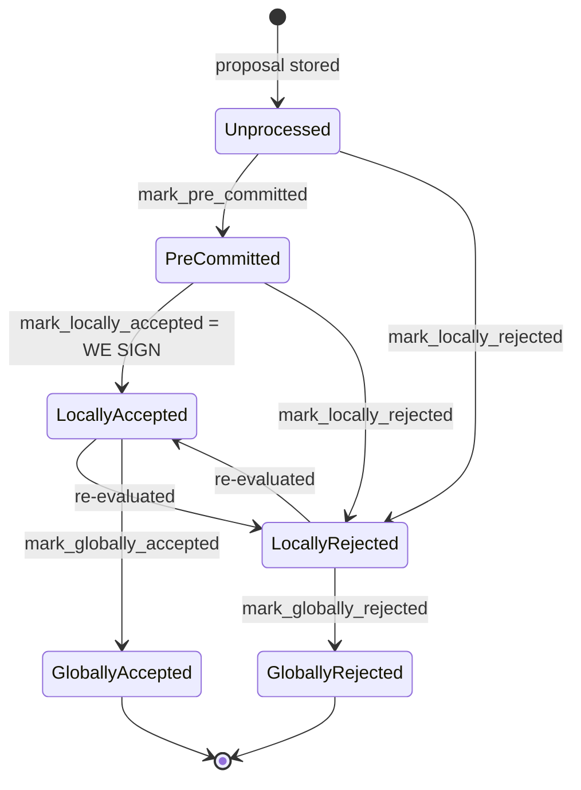

### Title
Signature-threshold path (`store_and_process_block_signature`) never re-checks chainstate/validity before marking a block locally accepted, unlike the pre-commit-threshold path - ([File: stacks-signer/src/v0/signer.rs])

### Summary
`handle_block_pre_commit` re-validates a block against the current chainstate/signer-db state (`check_block_against_signer_db_state`) before crossing the pre-commit threshold and signing, but `store_and_process_block_signature` — the handler that tallies *acceptance signatures* from other signers and can push the block to `LocallyAccepted`/broadcast — performs no equivalent revalidation and does not even check `block_info.valid` before acting.

### Finding Description
Two independent points in `stacks-signer/src/v0/signer.rs` decide whether a locally-tracked block should be treated as "accepted enough":

1. `handle_block_pre_commit` (~L1250-1366): after tallying pre-commit weight and finding the threshold reached, it explicitly checks `block_info.valid.unwrap_or(false)` and re-runs `check_block_against_signer_db_state` before allowing the block to move forward, rejecting it if the chain state has changed in the meantime [1](#0-0) .

2. `store_and_process_block_signature` (~L2442-2538), invoked from `handle_block_signature` whenever a *signature* (not a pre-commit) from another signer arrives, stores the signature, computes the aggregated `total_signature_weight`, and once the threshold is reached calls `block_info.mark_locally_accepted(true)` and `broadcast_signed_block` — with **no** call to `check_block_against_signer_db_state` and **no** check of `block_info.valid` anywhere in the function [2](#0-1) .

The only conditional gate before falling into the unguarded threshold-and-accept logic is whether the sender has already pre-committed (`has_committed`); if the signer sending the acceptance had *not* yet been seen to pre-commit, the code redirects to `handle_block_pre_commit` (which does the safe recheck) and returns early [3](#0-2) . But once a peer has already pre-committed and later sends its actual signature, the local `block_info.valid`/chainstate state is never re-examined, even though a signer's own view of the block can flip between `LocallyAccepted` and `LocallyRejected` over time (the state diagram documents `LocallyAccepted <-> LocallyRejected` transitions as "re-evaluated") [4](#0-3) .

This mirrors the reported pattern exactly: a check ("is this token/block still valid for this operation") that is enforced consistently on the paths that mutate balances/state (pre-commit → sign) is missing on the analogous path (signature tally → accept) that performs the same class of state mutation.

### Impact Explanation
If a local signer transitions a block from `LocallyRejected` back toward acceptance purely because enough *already-recorded* acceptance signatures from peers cross the weight threshold, it will call `mark_locally_accepted` and `broadcast_signed_block` for a block its own chainstate checks currently consider invalid/conflicting — i.e., a locally-rejected verdict gets recounted/promoted to an accepted one without re-validation. This is the "rejection recounted as an accept" class explicitly listed as Critical impact, since it breaks the equality between a signer's validated view of a block and what it reports/broadcasts as accepted.

### Likelihood Explanation
Reachable by any subset of signers that already pre-committed and later gossip their acceptance signatures (ordinary protocol traffic, no majority-controlled key or auth token needed) combined with the local signer's own view changing in between (e.g., via `check_block_against_signer_db_state` failing after an intervening burn-block/tenure update or a fresher conflicting sibling arriving) — both of which are exactly the scenarios the codebase's own comments say motivate the recheck in `handle_block_pre_commit`. The window is timing-dependent but requires no signer majority collusion, satisfying the "reachable by a one-slot miner plus gossip" scoping.

### Recommendation
In `store_and_process_block_signature`, before marking the block `LocallyAccepted`/broadcasting, re-run the same validity/chainstate check used in `handle_block_pre_commit` (`check_block_against_signer_db_state`) and bail out to a rejection path if it no longer passes, mirroring the guard already present at the pre-commit threshold and at `handle_block_validate_ok`.

### Proof of Concept
Not independently reproduced in a test harness within this session; the analysis is based on direct code comparison between `handle_block_pre_commit` (L1250-1366) and `store_and_process_block_signature`/`handle_block_signature` (L2371-2538) in `stacks-signer/src/v0/signer.rs`, which shows the revalidation call present in the former and structurally absent in the latter. Confirming the exploitability precisely (e.g., constructing a timing sequence where `block_info.valid` flips to rejected between pre-commit and signature arrival) would require running the existing test harness (`stacks-signer/src/v0/tests.rs`, e.g. the `run_sibling_scenario` family) with a scenario that induces a local rejection after pre-commit but before the final signature tally.

### Citations

**File:** stacks-signer/src/v0/signer.rs (L1323-1366)
```rust
        if !block_info.valid.unwrap_or(false) {
            // We received a pre-commit for a block that we have not validated or we have already marked this block as invalid.
            // We should not do anything further as we do not know what our response should be and we do not change our votes on rejected
            // blocks unless we receive a new block proposal for it and the reject reason allows us to reconsider.
            debug!(
                "{self}: Received a pre-commit for a block that we have not determined to be valid: {:?}. Doing nothing...", block_info.valid
            );
            return;
        }

        if min_weight > commit_weight {
            debug!(
                "{self}: Not enough pre-committed to block {block_hash} (have {commit_weight}, need at least {min_weight}/{total_weight})"
            );
            return;
        }

        // The chain and signer db state may have changed materially since this block passed the
        // proposal-time checks (e.g. between validation and reaching the pre-commit threshold we
        // may have signed a block that this one would reorg). Re-run the chainstate checks
        // before putting a signature over the block, and respond with a rejection if they no
        // longer pass, just as the block validation response handler does.
        if let Some(block_rejection) =
            self.check_block_against_signer_db_state(stacks_client, &block_info.block)
        {
            warn!(
                "{self}: Reached the pre-commit threshold for a block, but it no longer passes the chainstate checks. Rejecting.";
                "signer_signature_hash" => %block_hash,
                "block_height" => block_info.block.header.chain_length,
                "reject_code" => %block_rejection.reason_code,
                "reject_reason" => &block_rejection.reason,
            );
            if let Err(e) = block_info.mark_locally_rejected() {
                if !block_info.has_reached_consensus() {
                    warn!("{self}: Failed to mark block as locally rejected: {e:?}");
                }
            };
            self.signer_db
                .insert_block(&block_info)
                .unwrap_or_else(|e| self.handle_insert_block_error(e));
            self.handle_block_rejection(&block_rejection, sortition_state);
            self.send_block_response(&block_info.block, block_rejection.into());
            return;
        }
```

**File:** stacks-signer/src/v0/signer.rs (L2442-2538)
```rust
    /// Store the block acceptance signature and check if we have reached a consensus decision on the block because of it. If we have, update the block state accordingly and broadcast the block if accepted.
    fn store_and_process_block_signature(
        &mut self,
        stacks_client: &StacksClient,
        sortition_state: &mut Option<SortitionsView>,
        block_info: &mut BlockInfo,
        signer_address: &StacksAddress,
        signature: &MessageSignature,
    ) {
        let block_hash = &block_info.signer_signature_hash();
        // signature is valid! store it.
        // if this returns false, it means the signature already exists in the DB, so just return.
        if !self
            .signer_db
            .add_block_signature(block_hash, signer_address, signature)
            .unwrap_or_else(|_| panic!("{self}: Failed to save block signature"))
        {
            return;
        }

        // If this isn't our own signature and we haven't seen a pre-commit from this signer yet, try treating it as a pre-commit in case the caller is running an outdated version
        if signer_address != &self.stacks_address && !self.signer_db.has_committed(block_hash, signer_address).inspect_err(|e| warn!("Failed to check if pre-commit message already considered for {signer_address:?} for {block_hash}: {e}")).unwrap_or(false) {
            self.handle_block_pre_commit(stacks_client, sortition_state, signer_address, block_hash);
            return;
        }

        if block_info.signed_group.is_some() {
            // We have already processed this block to the accepted state. Adding more signatures will not change anything so nothing to check.
            return;
        }
        // do we have enough signatures to broadcast?
        // i.e. is the threshold reached?
        let signatures = self
            .signer_db
            .get_block_signatures(block_hash)
            .unwrap_or_else(|_| panic!("{self}: Failed to load block signatures"));

        // put signatures in order by signer address (i.e. reward cycle order)
        let addrs_to_sigs: HashMap<_, _> = signatures
            .into_iter()
            .filter_map(|sig| {
                let Ok(public_key) = Secp256k1PublicKey::recover_to_pubkey_without_validating_low_s(
                    block_hash.bits(),
                    &sig,
                ) else {
                    return None;
                };
                let addr = StacksAddress::p2pkh(self.mainnet, &public_key);
                Some((addr, sig))
            })
            .collect();

        let signature_weight = self.signer_weights.get(signer_address).unwrap_or(&0);
        let total_signature_weight = self.compute_signature_signing_weight(addrs_to_sigs.keys());
        let total_weight = self.compute_signature_total_weight();

        let min_weight = NakamotoBlockHeader::compute_voting_weight_threshold(total_weight)
            .unwrap_or_else(|_| {
                panic!("{self}: Failed to compute threshold weight for {total_weight}")
            });

        if min_weight > total_signature_weight {
            info!("{self}: Received block acceptance, but have not yet reached the acceptance threshold.";
                "signer_signature_hash" => %block_hash,
                "signature_weight" => signature_weight,
                "consensus_hash" => %block_info.block.header.consensus_hash,
                "block_height" => block_info.block.header.chain_length,
                "total_weight_approved" => total_signature_weight,
                "total_weight" => total_weight,
                "percent_approved" => (total_signature_weight as f64 / total_weight as f64 * 100.0),
            );
            return;
        }
        info!("{self}: have reached the block acceptance threshold";
            "signer_signature_hash" => %block_hash,
            "signature_weight" => signature_weight,
            "consensus_hash" => %block_info.block.header.consensus_hash,
            "block_height" => block_info.block.header.chain_length,
            "total_weight_approved" => total_signature_weight,
            "total_weight" => total_weight,
            "percent_approved" => (total_signature_weight as f64 / total_weight as f64 * 100.0),
        );

        // have enough signatures to broadcast!
        // move block to LOCALLY accepted state.
        // It is only considered globally accepted IFF we receive a new block event confirming it OR see the chain tip of the node advance to it.
        if let Err(e) = block_info.mark_locally_accepted(true) {
            if !block_info.has_reached_consensus() {
                warn!("{self}: Failed to mark block as locally accepted: {e:?}");
            }
        }
        let _ = self.signer_db.insert_block(block_info).map_err(|e| {
            warn!("Failed to set group threshold signature timestamp for {block_hash}: {e:?}");
            panic!("{self} Failed to write block to signerdb: {e}");
        });
        self.broadcast_signed_block(stacks_client, block_info.block.clone(), &addrs_to_sigs);
    }
```

**File:** docs/signer-flows.md (L130-150)
```markdown
## 2. Block lifecycle (`BlockState`)

Every proposal tracked in the signer DB carries a `BlockState`. **`PreCommitted`
carries no signature**: it means "validated, willing to sign if the pre-commit
threshold is met." The first signature appears at `mark_locally_accepted`.
Global states are terminal against each other.


```
