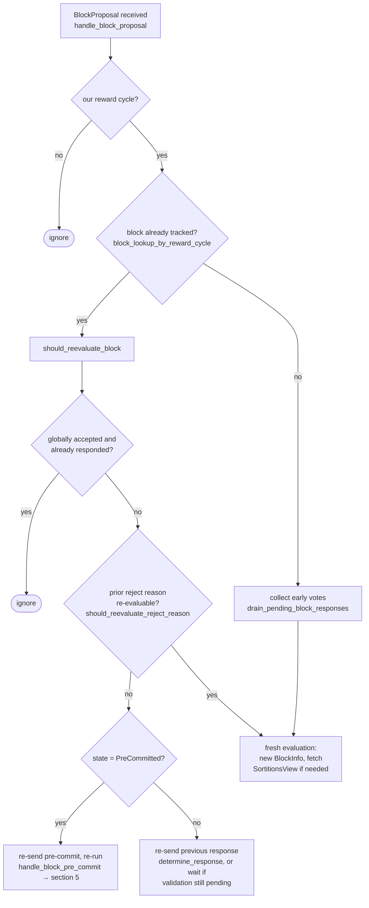

### Title
Rejected-then-Accepted signer votes double-count weight because `total_weight_rejected` is never rolled back — ([File: stacks-node/src/nakamoto_node/stackerdb_listener.rs])

### Summary
`StackerDBListener` tallies signer votes for a block proposal into two independent counters, `total_weight_approved` and `total_weight_rejected`, guarded by two *different* membership sets (`gathered_signatures` for accept, `responded_signers` for reject). When a single signer first rejects and later accepts the same block — a normal, expected flow per the signer's own re-evaluation logic — its weight is added to `total_weight_rejected` and is never removed, then also added to `total_weight_approved` when the accept arrives. This is the "outdated global variable" pattern from the report: a tally computed once and never refreshed when the underlying vote changes, later consumed by a security-relevant threshold check.

### Finding Description
In the accept handler: [1](#0-0) 
weight is added to `block.total_weight_approved` gated only on `!block.gathered_signatures.contains_key(&slot_id)`, and `block.responded_signers.insert(slot_id)` is called unconditionally afterwards, with its return value ignored.

In the reject handler: [2](#0-1) 
weight is added to `block.total_weight_rejected` gated on `block.responded_signers.insert(slot_id)` returning `true` (i.e., first time this slot appears in `responded_signers`, whether via a prior accept or reject).

The two paths share `responded_signers` as the "have we counted this signer" set, but only the accept path also has an independent second gate (`gathered_signatures`). Consequently:
- Accept → Reject (same slot): the reject arrives after `responded_signers` already contains the slot (inserted unconditionally by the earlier accept), so `responded_signers.insert` returns `false` and `total_weight_rejected` is *not* incremented. This direction is safe.
- Reject → Accept (same slot): the reject inserts the slot into `responded_signers` first (`total_weight_rejected += weight`). The later accept checks `gathered_signatures` — a completely separate set that the reject never touched — sees the slot absent, and adds the same weight to `total_weight_approved`. `total_weight_rejected` is never decremented.

A signer legitimately produces exactly this reject→accept sequence for the *same* block hash whenever it rejects for a re-evaluable reason and then re-evaluates favorably, per the documented re-evaluation flow: [3](#0-2) 

Once this happens, `block.total_weight_approved + block.total_weight_rejected` can exceed `self.total_weight`, and the stale `total_weight_rejected` is consumed by the miner's coordinator loop, which checks the rejection-based abort condition *before* checking the approval threshold: [4](#0-3) 

### Impact Explanation
The blocking-minority check `total_weight_rejected.saturating_add(weight_threshold) > total_weight` uses a monotonically-growing, never-corrected tally that includes weight from signers who have since switched to approving the exact same block. This can trip the `SignersRejected` abort path (excluding transaction IDs and giving up on the proposal) even though the *current* set of signers backing the block already meets or exceeds the 70% approval threshold — the aggregated-weight-rejected value no longer reflects the verified, current set of rejecting signers. This is a liveness wedge on the miner/coordinator: a valid block with sufficient real support can be treated as rejected by a phantom "blocking minority" composed partly of signers who no longer object, forcing miners to discard proposals or exclude transactions unnecessarily and stalling block production during retriable validation hiccups.

### Likelihood Explanation
No majority collusion or malicious signer is required. Any single honest signer that rejects a proposal for a transient/re-evaluable reason (e.g. `ConnectivityIssues`, `SortitionViewMismatch`) and subsequently re-evaluates and signs the same block — exactly the flow `should_reevaluate_block`/`should_reevaluate_reject_reason` is designed to allow — triggers the double count. This is reachable by ordinary network conditions (a transient RPC failure to the node, a delayed sortition view refresh) combined with the existing StackerDB gossip path; it needs neither the auth token nor another signer's key.

### Recommendation
Use a single reconciled bookkeeping structure (e.g., store each slot's *current* vote — Accept or Reject — and recompute `total_weight_approved`/`total_weight_rejected` from that map, or explicitly subtract the signer's weight from the opposite tally when its vote changes) instead of two independently-gated running totals. The reject handler should check `gathered_signatures` (or an equivalent "current vote" map) rather than blindly trusting `responded_signers`, and should remove/adjust the stale side of the tally whenever a signer's slot transitions between accept and reject.

### Proof of Concept
1. Miner submits a block proposal; `StackerDBListener::run` starts tracking `BlockStatus` for its `signer_signature_hash`.
2. Signer S (slot X, weight W) sends `BlockResponse::Rejected` for the proposal (e.g. it hit a transient `ConnectivityIssues`/`SortitionViewMismatch` rejection per `check_block_against_signer_db_state`). `responded_signers.insert(X)` → `true`; `total_weight_rejected += W`.
3. Signer S re-evaluates via `should_reevaluate_block`/`should_reevaluate_reject_reason` (legitimate, documented behavior) and now signs the *same* block, broadcasting `BlockResponse::Accepted` for the identical `signer_signature_hash`.
4. The node's accept handler checks `gathered_signatures.contains_key(&X)` → `false` (untouched by step 2) → `total_weight_approved += W`. `total_weight_rejected` remains at its step-2 value forever.
5. Now `total_weight_approved + total_weight_rejected > total_weight` for this block, and `signer_coordinator.rs`'s `total_weight_rejected.saturating_add(weight_threshold) > total_weight` check can fire using the stale rejection weight from S even though S currently approves — causing an incorrect `SignersRejected` outcome despite sufficient real approving weight.

### Citations

**File:** stacks-node/src/nakamoto_node/stackerdb_listener.rs (L443-465)
```rust
                        if !block.gathered_signatures.contains_key(&slot_id) {
                            block.total_weight_approved = block
                                .total_weight_approved
                                .saturating_add(signer_entry.weight);

                            info!("StackerDBListener: Signature Added to block";
                                "signer_signature_hash" => %block_sighash,
                                "signer_pubkey" => signer_pubkey.to_hex(),
                                "signer_slot_id" => slot_id,
                                "signature" => %signature,
                                "signer_weight" => signer_entry.weight,
                                "total_weight_approved" => block.total_weight_approved,
                                "percent_approved" => block.total_weight_approved as f64 / self.total_weight as f64 * 100.0,
                                "total_weight_rejected" => block.total_weight_rejected,
                                "percent_rejected" => block.total_weight_rejected as f64 / self.total_weight as f64 * 100.0,
                                "weight_threshold" => self.weight_threshold,
                                "tenure_extend_timestamp" => tenure_extend_timestamp,
                                "read_count_extend_timestamp" => read_count_extend_timestamp,
                                "server_version" => metadata.server_version,
                            );
                        }
                        block.gathered_signatures.insert(slot_id, signature);
                        block.responded_signers.insert(slot_id);
```

**File:** stacks-node/src/nakamoto_node/stackerdb_listener.rs (L515-518)
```rust
                        if block.responded_signers.insert(slot_id) {
                            block.total_weight_rejected = block
                                .total_weight_rejected
                                .saturating_add(signer_entry.weight);
```

**File:** docs/signer-flows.md (L164-185)
```markdown
## 3. A block proposal arrives

The miner broadcasts a proposal. If we've seen this exact block before,
`should_reevaluate_block` decides whether the old verdict stands; a block we
only pre-committed to is deliberately routed back through the pre-commit
evaluation so a re-proposal cannot shortcut to a signature. A fresh proposal is
checked against our view of the world _before_ spending a node validation on it.



**File:** stacks-node/src/nakamoto_node/signer_coordinator.rs (L487-541)
```rust
            if rejections != block_status.total_weight_rejected {
                rejections = block_status.total_weight_rejected;
                let (rejections_step, new_rejections_timeout) = self
                    .block_rejection_timeout_steps
                    .range((Included(0), Included(rejections)))
                    .last()
                    .ok_or_else(|| {
                        NakamotoNodeError::SigningCoordinatorFailure(
                            "Invalid rejection timeout step function definition".into(),
                        )
                    })?;
                rejections_timeout = new_rejections_timeout;
                info!("Number of received rejections updated, resetting timeout";
                                    "rejections" => rejections,
                                    "rejections_timeout" => rejections_timeout.as_secs(),
                                    "rejections_step" => rejections_step,
                                    "rejections_threshold" => self.total_weight.saturating_sub(self.weight_threshold));

                counters.set_miner_current_rejections_timeout_secs(rejections_timeout.as_secs());
                counters.set_miner_current_rejections(rejections);
            }

            if block_status
                .total_weight_rejected
                .saturating_add(self.weight_threshold)
                > self.total_weight
            {
                info!(
                    "{}/{} signer weight votes to reject block",
                    block_status.total_weight_rejected, self.total_weight;
                    "signer_signature_hash" => %block_signer_sighash,
                );
                counters.bump_naka_rejected_blocks();

                // Only act on failed txids that a blocking minority (>30% weight) agrees on
                let blocking_minority = self.total_weight.saturating_sub(self.weight_threshold);
                let mut temporarily_excluded_txids = HashSet::new();
                let mut permanently_excluded_txids = HashSet::new();
                for (txid, info) in &block_status.failed_txids {
                    if info.total_weight > blocking_minority {
                        // Do not perma ban txids that only a small minority of signers reported as problematic
                        // But make sure its removed from the next block proposal
                        if info.problematic_weight > blocking_minority {
                            permanently_excluded_txids.insert(txid.clone());
                        } else {
                            temporarily_excluded_txids.insert(txid.clone());
                        }
                    }
                }

                return Err(NakamotoNodeError::SignersRejected {
                    temporarily_excluded_txids,
                    permanently_excluded_txids,
                });
            } else if block_status.total_weight_approved >= self.weight_threshold {
```
