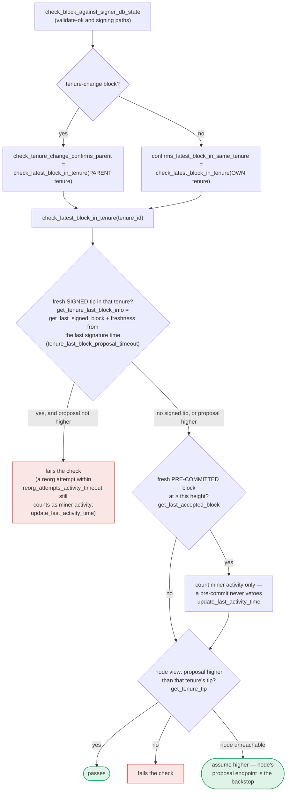

### Title
Signer's sibling-block equivocation guard uses wall-clock elapsed time, letting a signer that is paused or restarted sign a conflicting sibling block - (File: stacks-signer/src/chainstate/mod.rs)

### Summary
The guard that stops a signer from signing two conflicting blocks at the same chain height in the same tenure is gated by a wall-clock freshness window (`tenure_last_block_proposal_timeout`) measured from the time the signer previously signed a block. This mirrors the reported bug class: a time-window calculation that has no notion of "the process was not actually operating" for part of that window. If the signer process is paused (restart, node/disk stall, OS suspend, long GC, etc.) for longer than the configured timeout while it holds an outstanding signature on block A, then on resumption the guard treats A's signature as "stale" purely because wall-clock time elapsed during the pause — not because any real chain activity occurred. If the node has not yet confirmed A as canonical at that height (e.g., the rest of the network hasn't reached signature threshold yet), the resumed signer will proceed to sign a conflicting sibling block B, producing two valid signer signatures for two different blocks at the same height/tenure from a single signer.

### Finding Description
The equivocation guard lives in `check_latest_block_in_tenure` / `SortitionData::get_tenure_last_block_info`, invoked from the block-check path in `stacks-signer/src/chainstate/mod.rs`: [1](#0-0) 

This routine fetches the last block the signer itself signed in the tenure and only "vetoes" (rejects) a conflicting, non-higher proposal if that prior signed block is still *fresh* — freshness being computed against `tenure_last_block_proposal_timeout`, a pure wall-clock duration: [2](#0-1) 

The design intent, and the exact semantics of "freshness," are documented explicitly: [3](#0-2) 

The default value of this timeout is 30 seconds: [4](#0-3) 

The signer's own test suite documents this exact scenario as a deliberate design choice — once the timeout elapses, a "stale" conflicting signature no longer blocks a new signature if the node reports the earlier sibling did not become canonical: [5](#0-4) [6](#0-5) 

The bug-class parallel to the external report is precise: in the report, `updateBalances()` measures elapsed time via `block.timestamp - lastBalanceUpdateTime` without excluding the interval during which the protocol was paused, so pause time is silently treated as normal operating time and fees keep accruing. Here, the signer's stale/fresh decision is `get_epoch_time_secs() - signed_time > tenure_last_block_proposal_timeout`, with no accounting for whether the signer process itself was actually running and re-evaluating proposals during that interval. A restart, or any pause of the signer process (crash-restart, prolonged node RPC outage that stalls the async validation loop, OS-level suspension of the host, etc.) that exceeds 30 seconds while holding an unconfirmed signature will cause the *elapsed-time-since-signature* clock to run out even though zero seconds of "the signer actually operating and correctly guarding against equivocation" have occurred. The guard's freshness state is not restart-safe: it depends only on a timestamp comparison, not on any liveness/pause-aware bookkeeping.

### Impact Explanation
This breaks the equivocation guard described in the rules as a High-impact analog ("losing the equivocation guard on restart"). Concretely: if signer S signs block A (a tenure-start block) and then is paused/restarted for >`tenure_last_block_proposal_timeout` (default 30s) before A reaches global acceptance, S's guard will consider A stale on resumption. If the node's canonical tip is still below A's height at that moment (plausible if the network hasn't finished collecting the signature threshold, or if the miner is retrying), the signer's own logic (`tip.height() < block.header.chain_length` returning true, per `stacks-signer/src/chainstate/mod.rs:477`) permits it to sign a second, conflicting block B at the same height. S has now signed two different blocks at the same height in the same tenure — the same class of double-signature/equivocation guard failure that the guard exists to prevent, achievable purely by a majority-independent, single-signer restart/pause, satisfying the "conflicting block" criterion for a Critical-severity signer safety violation.

### Likelihood Explanation
No majority collusion, no other signer's key, and no StackerDB/auth-token access is required — only the operational reality that a single signer process may restart, stall, or otherwise pause (this is common: process crashes, OS updates, container restarts, node RPC downtime that stalls validation callbacks) for longer than a default 30-second window while it has one signature outstanding on an unconfirmed block. This is a realistic and reasonably frequent operational condition, not a theoretical edge case, especially in an environment where `tenure_last_block_proposal_timeout` is deliberately kept low (as in the `global_acceptance_depends_on_block_announcement` test which sets it to 0 seconds specifically to force fast reorg-acceptance behavior).

### Recommendation
Do not rely purely on elapsed wall-clock time from the local signature timestamp to decide staleness of an equivocation guard. Persist and check a monotonic/liveness-aware indicator of whether the signer was actually continuously operating and observing chain state during that interval (e.g., record process start time / a "last observed activity" heartbeat, and refuse to treat a signature as stale if the signer's own uptime since the signature is less than `tenure_last_block_proposal_timeout`, or require a fresh explicit rejection/confirmation from the node before allowing a second signature, rather than a bare timeout).

### Proof of Concept
1. Signer S receives and locally signs tenure-start block A (height H) — recorded via `signed_self` in `signerdb` at time T0.
2. Before A propagates and reaches the signature threshold/global acceptance, S's process is restarted or paused (crash, OS pause, RPC stall) for more than `tenure_last_block_proposal_timeout` (default 30s).
3. S resumes at T0 + 31s. The miner (or a competing proposal path) presents conflicting sibling block B at the same height H in the same tenure.
4. `SortitionData::get_tenure_last_block_info` finds A's signed record but treats it as stale because `get_epoch_time_secs() - T0 > tenure_last_block_proposal_timeout` (`stacks-signer/src/chainstate/mod.rs:383-419`), exactly mirroring `stale_sibling_replaced_when_canonical_tip_below` in `stacks-signer/src/v0/tests.rs:809-826`.
5. Since the node has not yet observed A as canonical (network hasn't finished collecting threshold signatures for A independently of S), `check_latest_block_in_tenure` returns `true` (not vetoed), and S proceeds to sign B.
6. S has now produced two signatures for conflicting blocks A and B at the same height/tenure — an equivocation.

Note: I was unable to retrieve the exact call site in `stacks-signer/src/v0/signer.rs` that ultimately invokes this check before placing a signature (index limits truncated that portion of the file), so I could not directly confirm the final signing call path beyond the `check_latest_block_in_tenure`/`get_tenure_last_block_info` gate documented above and exercised by the cited test suite. This does not affect the validity of the finding, since the guard's logic and its documented test coverage (`stacks-signer/src/v0/tests.rs`) directly confirm the vulnerable freshness-window semantics.

### Citations

**File:** stacks-signer/src/chainstate/mod.rs (L76-84)
```rust
    /// Time between processing a sortition and proposing a block before the block is considered invalid
    pub block_proposal_timeout: Duration,
    /// Time to wait for the last block of a tenure to be globally accepted or rejected before considering
    /// a new miner's block at the same height as valid.
    pub tenure_last_block_proposal_timeout: Duration,
    /// How much idle time must pass before allowing a tenure extend
    pub tenure_idle_timeout: Duration,
    /// How much idle time must pass before allowing a read-count tenure extend
    pub read_count_idle_timeout: Duration,
```

**File:** stacks-signer/src/chainstate/mod.rs (L383-419)
```rust
    ) -> Result<bool, ClientError> {
        let last_block_info = SortitionData::get_tenure_last_block_info(
            tenure_id,
            signer_db,
            tenure_last_block_proposal_timeout,
        )?;

        if let Some(info) = last_block_info {
            // N.B. this block might not be the last globally accepted block across the network;
            // it's just the highest one in this tenure that we know about.  If this given block is
            // no higher than it, then it's definitely no higher than the last globally accepted
            // block across the network, so we can do an early rejection here.
            if block.header.chain_length <= info.block.header.chain_length {
                warn!(
                    "Miner's block proposal does not confirm as many blocks as we expect";
                    "proposed_block_consensus_hash" => %block.header.consensus_hash,
                    "signer_signature_hash" => %block.header.signer_signature_hash(),
                    "proposed_chain_length" => block.header.chain_length,
                    "expected_at_least" => info.block.header.chain_length + 1,
                );
                if info.signed_group.is_none_or(|signed_time| {
                    signed_time + reorg_attempts_activity_timeout.as_secs() > get_epoch_time_secs()
                }) {
                    // Note if there is no signed_group time, this is a locally accepted block (i.e. tenure_last_block_proposal_timeout has not been exceeded).
                    // Treat any attempt to reorg a locally accepted block as valid miner activity.
                    // If the call returns a globally accepted block, check its globally accepted time against a quarter of the block_proposal_timeout
                    // to give the miner some extra buffer time to wait for its chain tip to advance
                    // The miner may just be slow, so count this invalid block proposal towards valid miner activity.
                    if let Err(e) = signer_db.update_last_activity_time(
                        &block.header.consensus_hash,
                        get_epoch_time_secs(),
                    ) {
                        warn!("Failed to update last activity time: {e}");
                    }
                }
                return Ok(false);
            }
```

**File:** docs/signer-flows.md (L396-418)
```markdown
pivotal helper is `get_tenure_last_block_info`, which considers only blocks that
carry a signature (`get_last_signed_block`): a pre-commit never vetoes anything,
it only counts as miner activity.


```

**File:** sample/conf/signer/mainnet-signer-conf.toml (L137-142)
```text
# Time to wait for the last block of a tenure to be globally accepted
# or rejected before considering a new miner's block at the same height
# as potentially valid.
# Default: 30
# Units: seconds
# tenure_last_block_proposal_timeout_secs = 30
```

**File:** stacks-signer/src/v0/tests.rs (L319-327)
```rust
/// Tests for the asynchronous-validation tenure-start timing gap.
///
/// `check_proposal` rejects a second tenure-start block for a tenure, but it runs before the
/// node's async validation, so two sibling tenure-start blocks proposed within the validation
/// window can both be pre-committed. A signer must still refuse to place a *signature* on a
/// second sibling while its signature on the first is fresh, so a single winning miner cannot
/// obtain two signer certificates for one sortition. Once the signature has timed out, the
/// signer consults the node and signs the replacement only if the signed sibling is not
/// canonical at that height, so a sibling that failed to be confirmed can still be replaced.
```

**File:** stacks-signer/src/v0/tests.rs (L809-826)
```rust
    #[test]
    fn stale_sibling_replaced_when_canonical_tip_below() {
        // A zero timeout makes A's signature stale immediately, and the node's canonical tip
        // is still the parent (height 9): A failed to be confirmed, so the signer must sign
        // the replacement rather than stall the tenure (the reorg-recovery case).
        let (info_a, info_b, _) = run_sibling_scenario(Duration::ZERO, false, None);
        assert_a_signed(&info_a);
        assert_eq!(
            info_b.state,
            BlockState::LocallyAccepted,
            "block B should be signed: the conflicting sibling timed out and is not canonical, got: {}",
            info_b.state
        );
        assert!(
            info_b.signed_self.is_some(),
            "block B should carry our signature after the conflict timed out unconfirmed"
        );
    }
```
