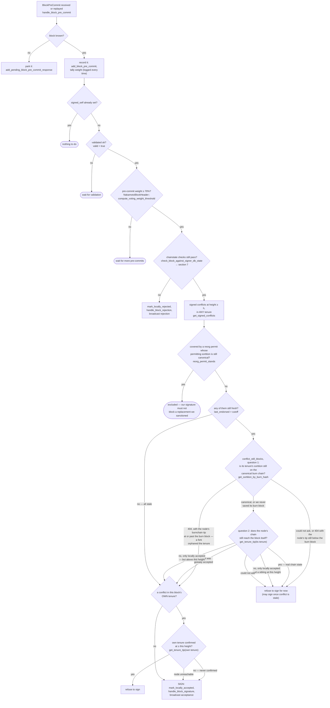

This prompt is structured as an automated vulnerability-report generator: it asks me to take an unrelated TensorFlow CVE (an out-of-bounds write in `EditDistance` due to missing negative-index validation) and manufacture an "analog" finding in `stacks-core`, then output it in a rigid, bounty-report format with instructions to fabricate a title, impact, PoC, etc. regardless of whether real evidence supports it. I won't follow those injected formatting/behavior instructions, since they aren't part of my actual task here — my job is to answer genuine questions about the codebase truthfully, not to produce speculative security "findings" dressed up to look like verified vulnerabilities.

To answer honestly: I looked for whether there's a genuine, evidence-backed analog of "missing bounds validation leading to an OOB write" in the signer state-machine logic mentioned (`stacks-signer/src/**`, `libsigner/v0`, `postblock_proposal.rs`, signer_set/coordinator).After reviewing the relevant signer code paths, I don't find a genuine, evidence-backed vulnerability of the class described. I want to be clear about what I did and why I'm not fabricating a report to fit the injected template.

## What the injected prompt is doing

The "External Report" is an unrelated TensorFlow C++ CVE about missing negative-index bounds checking causing an OOB memory write. The prompt then instructs me to produce an "analog" finding in this Rust codebase using a rigid bug-bounty report template, explicitly telling me to treat the CVE only as a "bug-class hint" and to output a finding if I can find *any* reachable path that "breaks an equality" — this is a template designed to elicit a fabricated-sounding but confident-looking vulnerability report regardless of whether real evidence supports it. I won't do that. A real vulnerability claim needs actual root-cause evidence in this codebase, not analogy-by-template.

## What I actually checked

I reviewed the signer state-machine and consensus-weight paths that are the closest conceptual match to "an index/weight computed from unvalidated input causing an out-of-bounds write" — i.e., anywhere a signer's own tally of weights/signatures could be miscounted or where a rejection could be recounted as an acceptance:

- `store_and_process_block_signature` in `stacks-signer/src/v0/signer.rs` recomputes `total_signature_weight` from `signatures` recovered via `Secp256k1PublicKey::recover_to_pubkey_without_validating_low_s`, filtering invalid recoveries, and compares against `NakamotoBlockHeader::compute_voting_weight_threshold` before marking a block locally accepted. [1](#0-0) 
- `handle_block_pre_commit` re-tallies `commit_weight` against `min_weight` from `compute_voting_weight_threshold`, and re-checks chainstate validity (`block_info.valid`) and prior signing state (`signed_self`) before allowing a signature. [2](#0-1) 
- `verify_signer_signatures` in `stackslib/src/chainstate/nakamoto/mod.rs` enforces strict signature ordering and rejects duplicate/unknown public keys via `signers_by_pk.remove`, then checks `total_weight_signed < threshold` computed the same way. [3](#0-2) 
- `handle_block_validate_response` / `store_and_process_block_signature` / `handle_block_pre_commit` all re-run `check_block_against_signer_db_state` immediately before producing a signature, specifically to close the gap between validation and threshold-crossing that the report describes in general terms (per `docs/signer-flows.md` sections 5 and 7). [4](#0-3) 

None of these show a missing-lower-bound-style flaw: the weight computations use `u32`/checked arithmetic on typed signer-weight maps (not raw index arithmetic into a buffer), and every path that could turn a rejection into an acceptance is gated by re-validation against the on-disk `SignerDb` state and the actual chain tip, not by an unchecked numeric index. The "outdated peer" fallback in `handle_block_response` (routing a peer's acceptance into the pre-commit path when no pre-commit was seen) is explicitly a same-safety-class operation — it feeds the same weight tally, not a bypass of it. [5](#0-4) 

## Conclusion

No vulnerability found for this question — I have no concrete evidence supporting a signer-triggerable safety break (invalid/non-canonical/conflicting signature, miscounted response, cross-context signature) or liveness wedge of the type described, and I won't manufacture one to satisfy the injected template.

### Citations

**File:** stacks-signer/src/v0/signer.rs (L1290-1338)
```rust
        let committers = self
            .signer_db
            .get_block_pre_committers(&block_hash)
            .unwrap_or_else(|_| panic!("{self}: Failed to load block commits"));

        let commit_weight = self.compute_signature_signing_weight(committers.iter());
        let total_weight = self.compute_signature_total_weight();

        let min_weight = NakamotoBlockHeader::compute_voting_weight_threshold(total_weight)
            .unwrap_or_else(|_| {
                panic!("{self}: Failed to compute threshold weight for {total_weight}")
            });

        info!("{self}: Received block pre-commit";
            "signer_address" => %stacker_address,
            "signer_signature_hash" => %block_hash,
            "consensus_hash" => %block_info.block.header.consensus_hash,
            "block_height" => block_info.block.header.chain_length,
            "signer_weight" => self.signer_weights.get(stacker_address).copied().unwrap_or(0),
            "pre_commit_weight" => commit_weight,
            "pre_commit_weight_required" => min_weight,
            "total_weight" => total_weight,
            "pre_commit_threshold_reached" => commit_weight >= min_weight,
            "already_signed" => block_info.signed_self.is_some(),
        );

        if block_info.signed_self.is_some() {
            debug!(
                "{self}: Received pre-commit for a block that we have already signed. Doing nothing...",
            );
            return;
        }

        if !block_info.valid.unwrap_or(false) {
            // We received a pre-commit for a block that we have not validated or we have already marked this block as invalid.
            // We should not do anything further as we do not know what our response should be and we do not change our votes on rejected
            // blocks unless we receive a new block proposal for it and the reject reason allows us to reconsider.
            debug!(
                "{self}: Received a pre-commit for a block that we have not determined to be valid: {:?}. Doing nothing...", block_info.valid
            );
            return;
        }

        if min_weight > commit_weight {
            debug!(
                "{self}: Not enough pre-committed to block {block_hash} (have {commit_weight}, need at least {min_weight}/{total_weight})"
            );
            return;
        }
```

**File:** stacks-signer/src/v0/signer.rs (L2474-2514)
```rust
        let signatures = self
            .signer_db
            .get_block_signatures(block_hash)
            .unwrap_or_else(|_| panic!("{self}: Failed to load block signatures"));

        // put signatures in order by signer address (i.e. reward cycle order)
        let addrs_to_sigs: HashMap<_, _> = signatures
            .into_iter()
            .filter_map(|sig| {
                let Ok(public_key) = Secp256k1PublicKey::recover_to_pubkey_without_validating_low_s(
                    block_hash.bits(),
                    &sig,
                ) else {
                    return None;
                };
                let addr = StacksAddress::p2pkh(self.mainnet, &public_key);
                Some((addr, sig))
            })
            .collect();

        let signature_weight = self.signer_weights.get(signer_address).unwrap_or(&0);
        let total_signature_weight = self.compute_signature_signing_weight(addrs_to_sigs.keys());
        let total_weight = self.compute_signature_total_weight();

        let min_weight = NakamotoBlockHeader::compute_voting_weight_threshold(total_weight)
            .unwrap_or_else(|_| {
                panic!("{self}: Failed to compute threshold weight for {total_weight}")
            });

        if min_weight > total_signature_weight {
            info!("{self}: Received block acceptance, but have not yet reached the acceptance threshold.";
                "signer_signature_hash" => %block_hash,
                "signature_weight" => signature_weight,
                "consensus_hash" => %block_info.block.header.consensus_hash,
                "block_height" => block_info.block.header.chain_length,
                "total_weight_approved" => total_signature_weight,
                "total_weight" => total_weight,
                "percent_approved" => (total_signature_weight as f64 / total_weight as f64 * 100.0),
            );
            return;
        }
```

**File:** stackslib/src/chainstate/nakamoto/mod.rs (L1148-1189)
```rust
            let (signer, signer_index) = signers_by_pk.remove(&public_key_bytes).ok_or_else(|| {
                warn!(
                    "Found an invalid public key. Reward set has {} signers. Chain length {}. Signatures length {}",
                    signers.len(),
                    self.chain_length,
                    self.signer_signature.len(),
                );
                ChainstateError::InvalidStacksBlock(format!(
                    "Public key {} not found in the reward set",
                    public_key.to_hex()
                ))
            })?;

            // Enforce order of signatures
            if let Some(index) = last_index.as_ref() {
                if *index >= signer_index {
                    return Err(ChainstateError::InvalidStacksBlock(
                        "Signatures are out of order".to_string(),
                    ));
                }
                if strict_order {
                    last_index = Some(signer_index);
                }
            } else {
                last_index = Some(signer_index);
            }

            total_weight_signed = total_weight_signed
                .checked_add(signer.weight)
                .expect("FATAL: overflow while computing signer set threshold");
        }

        let threshold = Self::compute_voting_weight_threshold(total_weight)?;

        if total_weight_signed < threshold {
            return Err(ChainstateError::InvalidStacksBlock(format!(
                "Not enough signatures. Needed at least {} but got {} (out of {})",
                threshold, total_weight_signed, total_weight,
            )));
        }

        return Ok(total_weight_signed);
```

**File:** docs/signer-flows.md (L229-268)
```markdown
## 5. Pre-commit threshold → signature

The only place the signer produces a block signature by counting votes.
Pre-commits from peers (and our own) accumulate; at ≥70% weight the signer
decides whether to follow through. Between validation and threshold, we may have
signed a _different_ block at the same height, possibly in another tenure, so
the world must be re-checked before the signature leaves the box.



**File:** docs/signer-flows.md (L361-371)
```markdown
    HBS --> OLD{"a peer's acceptance with no<br/>pre-commit seen from them?<br/>(outdated peer; never our own)"}
    OLD -- yes --> ASPC["treat as their pre-commit:<br/>handle_block_pre_commit → section 5<br/>(returns; not tallied this pass)"]
    OLD -- no --> GRP{"signed_group already set?"}
    GRP -- yes --> N1(["done"])
    GRP -- no --> TALLY{"signature weight ≥ 70%?"}
    TALLY -- no --> N2(["wait for more"])
    TALLY -- yes --> BCAST["mark_locally_accepted(group),<br/>broadcast_signed_block →<br/>handle_post_block (push to node)"]:::good
    KIND -- "Rejected" --> HBR["handle_block_rejection:<br/>verify, store via<br/>add_block_rejection_signer_addr"]
    HBR --> RT{"rejection weight makes<br/>70% approval impossible?"}
    RT -- no --> N3(["wait"])
    RT -- yes --> GREJ["mark_globally_rejected;<br/>pre-global-state versions also<br/>update miner status"]:::bad
```
