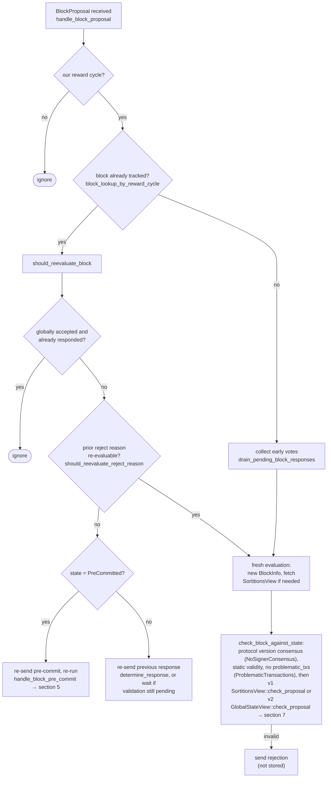

### Title
Stale signer votes are never retracted from `BlockStatus` weight tallies, letting a single flip-flopping signer desynchronize `total_weight_approved`/`total_weight_rejected` from the signer set's actual current votes - ([File: stacks-node/src/nakamoto_node/stackerdb_listener.rs])

### Summary
`StackerDBListener`'s per-block vote aggregation (`BlockStatus`) tracks `total_weight_approved` and `total_weight_rejected` as monotonically-increasing accumulators keyed only by "has this signer's slot ever been counted." When a signer changes its vote for the same block (Accept→Reject or Reject→Accept), the code adds the new weight to the new bucket but never subtracts the old weight from the previous bucket. This is structurally the same root cause as the reported bug: an amount is applied to one side of the accounting (weight added to approved/rejected) without the corresponding retraction from the other side (the market's `sy_balance` analog here is the opposing weight tally), producing a state that no longer matches the real, current set of votes.

### Finding Description
In `handle_block_response`-equivalent code in `stacks-node/src/nakamoto_node/stackerdb_listener.rs`, two independent branches update the shared `BlockStatus`:

- Accepted branch [1](#0-0) : adds `signer_entry.weight` to `total_weight_approved` guarded only by `!block.gathered_signatures.contains_key(&slot_id)`, then unconditionally does `block.responded_signers.insert(slot_id)`.
- Rejected branch [2](#0-1) : adds `signer_entry.weight` to `total_weight_rejected` only if `block.responded_signers.insert(slot_id)` returns `true` (i.e., first time this slot is seen at all, across *both* message kinds).

`BlockStatus` holds both `total_weight_approved` and `total_weight_rejected` as separate accumulators with no reconciliation step [3](#0-2) .

Two divergent, reachable sequences by a single signer (no majority required) break the intended equality "aggregate weight == weight of currently-held votes":

1. **Reject first, then Accept:** Signer sends `Rejected` → `responded_signers.insert` succeeds → weight added to `total_weight_rejected`. Signer later sends `Accepted` for the same block → the accepted branch only checks `gathered_signatures.contains_key(&slot_id)` (false) and adds the weight to `total_weight_approved` too. The stale rejected weight is never removed. Both tallies now include this signer's weight simultaneously, and `total_weight_rejected` remains artificially inflated even though the signer currently accepts the block.

2. **Accept first, then Reject:** Signer sends `Accepted` → weight added to `total_weight_approved`, and critically `responded_signers.insert(slot_id)` is also called here [4](#0-3) . Signer later sends `Rejected` (e.g., because it detected a reorg/invalidity after its own local chainstate advanced) → `block.responded_signers.insert(slot_id)` returns `false` since the slot was already marked by the earlier Accepted message, so the entire weight-accounting/logging block is skipped [5](#0-4) . The rejection is silently dropped: `total_weight_approved` keeps counting a signer that has since withdrawn/reversed its approval, i.e., a rejection is effectively "recounted" as a standing acceptance in the tally used to reach threshold.

This directly maps onto the report's bug class: value is added to one accounting bucket while the necessary corresponding subtraction from the other bucket never happens, so the miner-facing tally in `stacks-node/src/nakamoto_node/signer_coordinator.rs` (which reads `block_status.total_weight_approved`/`total_weight_rejected` to decide "block accepted"/"block rejected") [6](#0-5)  can diverge from the true, current state of the signer set's opinions.

### Impact Explanation
- Scenario 2 (Accept-then-Reject silently dropped) breaks "aggregated-weight vs verified-accepts": the miner's threshold check `block_status.total_weight_approved >= self.weight_threshold` [7](#0-6)  continues to count a signer who has withdrawn approval (e.g., because they subsequently detected the block is invalid/non-canonical per their local chainstate view). This can let the miner reach and act on an acceptance threshold that no longer reflects a legitimate majority, potentially pushing/broadcasting a block that should have been blocked.
- Scenario 1 (stale rejection persists after acceptance) inflates `total_weight_rejected`, which is compared against `blocking_minority` to abort block assembly and permanently/temporarily exclude transactions [8](#0-7) . A stale rejection weight can cause the miner to wrongly treat the block as rejected (or exclude transactions) even after the signer switched to acceptance — a liveness/availability wedge.

Both are triggerable by a single non-majority signer (or a signer whose behavior/network causes duplicate/out-of-order delivery of its own two responses), matching the "one-slot miner plus gossip" reachability bar and the "aggregated-weight vs verified-accepts" equality-break / liveness-wedge impact classes named in scope.

### Likelihood Explanation
This requires only one signer to emit two different `BlockResponse` messages (Accepted then Rejected, or vice versa) for the same `signer_signature_hash` — which is a normal, legitimate occurrence in the existing state machine (e.g., a signer's local chainstate view flips validity of a block between messages, as documented in `docs/signer-flows.md`'s re-evaluation logic [9](#0-8) ). No cryptographic forgery or majority collusion is needed; both messages are validly signed by the same signer's real key. It is a reachable ordinary sequence, not a contrived edge case.

### Recommendation
Track a single, authoritative "current vote" (kind + weight) per signer slot in `BlockStatus` rather than two independent monotonic accumulators keyed off different guards. Whenever a signer's message changes their recorded vote, subtract the previously-tallied weight from whichever bucket it was in before adding the new weight to the new bucket, mirroring the discipline already used in `stacks-signer/src/signerdb.rs::add_block_signature`, which explicitly deletes any prior rejection row before inserting a new signature [10](#0-9) . Apply the equivalent decrement-then-increment logic to `total_weight_approved`/`total_weight_rejected` in `stackerdb_listener.rs`.

### Proof of Concept
1. Miner is soliciting signatures for block `B` via `StackerDBListener`.
2. Signer `S` (weight `w`) sends `BlockResponse::Rejected(B)`. `responded_signers` now contains `S`'s slot; `total_weight_rejected += w`.
3. Signer `S` later re-evaluates (e.g., its local pending-response replay or a new proposal re-evaluation) and sends `BlockResponse::Accepted(B)`. Because the accepted branch only guards on `gathered_signatures`, `total_weight_approved += w` as well; `total_weight_rejected` is never decremented.
4. Now `total_weight_rejected` still reflects `S`'s old rejection even though `S` currently approves `B`, and `total_weight_approved` + `total_weight_rejected` exceeds the real total signer weight ever cast for `B`. If enough other signers accept, the miner's threshold logic in `signer_coordinator.rs` can be reached, or blocked, using this stale, uncorrected weight — an outcome that would not occur if the accounting properly retracted `S`'s earlier rejection weight upon accepting.

### Citations

**File:** stacks-node/src/nakamoto_node/stackerdb_listener.rs (L70-82)
```rust
#[derive(Debug, Clone)]
pub struct BlockStatus {
    /// Set of the slot ids of signers who have responded
    pub responded_signers: HashSet<u32>,
    /// Map of the slot id of signers who have signed the block and their signature
    pub gathered_signatures: BTreeMap<u32, MessageSignature>,
    /// Total weight of signers who have signed the block
    pub total_weight_approved: u32,
    /// Total weight of signers who have rejected the block
    pub total_weight_rejected: u32,
    /// Per-txid rejection tracking from signers
    pub failed_txids: HashMap<Txid, FailedTxInfo>,
}
```

**File:** stacks-node/src/nakamoto_node/stackerdb_listener.rs (L443-465)
```rust
                        if !block.gathered_signatures.contains_key(&slot_id) {
                            block.total_weight_approved = block
                                .total_weight_approved
                                .saturating_add(signer_entry.weight);

                            info!("StackerDBListener: Signature Added to block";
                                "signer_signature_hash" => %block_sighash,
                                "signer_pubkey" => signer_pubkey.to_hex(),
                                "signer_slot_id" => slot_id,
                                "signature" => %signature,
                                "signer_weight" => signer_entry.weight,
                                "total_weight_approved" => block.total_weight_approved,
                                "percent_approved" => block.total_weight_approved as f64 / self.total_weight as f64 * 100.0,
                                "total_weight_rejected" => block.total_weight_rejected,
                                "percent_rejected" => block.total_weight_rejected as f64 / self.total_weight as f64 * 100.0,
                                "weight_threshold" => self.weight_threshold,
                                "tenure_extend_timestamp" => tenure_extend_timestamp,
                                "read_count_extend_timestamp" => read_count_extend_timestamp,
                                "server_version" => metadata.server_version,
                            );
                        }
                        block.gathered_signatures.insert(slot_id, signature);
                        block.responded_signers.insert(slot_id);
```

**File:** stacks-node/src/nakamoto_node/stackerdb_listener.rs (L515-546)
```rust
                        if block.responded_signers.insert(slot_id) {
                            block.total_weight_rejected = block
                                .total_weight_rejected
                                .saturating_add(signer_entry.weight);

                            // Track transactions that failed validation, accumulating
                            // per-txid signer weight and whether any signer flagged
                            // the tx as genuinely problematic.
                            if let Some(txid) = &rejected_data.response_data.failed_txid {
                                match &rejected_data.reason_code {
                                    RejectCode::ValidationFailed(
                                        ValidateRejectCode::BadTransaction
                                        | ValidateRejectCode::ProblematicTransaction,
                                    ) => {
                                        let info =
                                            block.failed_txids.entry(txid.clone()).or_default();
                                        info.total_weight =
                                            info.total_weight.saturating_add(signer_entry.weight);
                                        if matches!(
                                            rejected_data.reason_code,
                                            RejectCode::ValidationFailed(
                                                ValidateRejectCode::ProblematicTransaction
                                            )
                                        ) {
                                            info.problematic_weight = info
                                                .problematic_weight
                                                .saturating_add(signer_entry.weight);
                                        }
                                    }
                                    _ => {}
                                }
                            }
```

**File:** stacks-node/src/nakamoto_node/signer_coordinator.rs (L512-545)
```rust
                > self.total_weight
            {
                info!(
                    "{}/{} signer weight votes to reject block",
                    block_status.total_weight_rejected, self.total_weight;
                    "signer_signature_hash" => %block_signer_sighash,
                );
                counters.bump_naka_rejected_blocks();

                // Only act on failed txids that a blocking minority (>30% weight) agrees on
                let blocking_minority = self.total_weight.saturating_sub(self.weight_threshold);
                let mut temporarily_excluded_txids = HashSet::new();
                let mut permanently_excluded_txids = HashSet::new();
                for (txid, info) in &block_status.failed_txids {
                    if info.total_weight > blocking_minority {
                        // Do not perma ban txids that only a small minority of signers reported as problematic
                        // But make sure its removed from the next block proposal
                        if info.problematic_weight > blocking_minority {
                            permanently_excluded_txids.insert(txid.clone());
                        } else {
                            temporarily_excluded_txids.insert(txid.clone());
                        }
                    }
                }

                return Err(NakamotoNodeError::SignersRejected {
                    temporarily_excluded_txids,
                    permanently_excluded_txids,
                });
            } else if block_status.total_weight_approved >= self.weight_threshold {
                info!("Received enough signatures, block accepted";
                    "signer_signature_hash" => %block_signer_sighash,
                );
                return Ok(block_status.gathered_signatures.values().cloned().collect());
```

**File:** docs/signer-flows.md (L164-187)
```markdown
## 3. A block proposal arrives

The miner broadcasts a proposal. If we've seen this exact block before,
`should_reevaluate_block` decides whether the old verdict stands; a block we
only pre-committed to is deliberately routed back through the pre-commit
evaluation so a re-proposal cannot shortcut to a signature. A fresh proposal is
checked against our view of the world _before_ spending a node validation on it.



**File:** stacks-signer/src/signerdb.rs (L1876-1889)
```rust
    ) -> Result<bool, DBError> {
        // Remove any block rejection entry for this signer and block hash
        let del_qry = "DELETE FROM block_rejection_signer_addrs WHERE signer_signature_hash = ?1 AND signer_addr = ?2";
        let del_args = params![block_sighash, signer_addr.to_string()];
        self.db.execute(del_qry, del_args)?;

        // Insert the block signature
        let qry = "INSERT OR IGNORE INTO block_signatures (signer_signature_hash, signer_addr, signature) VALUES (?1, ?2, ?3);";
        let args = params![
            block_sighash,
            signer_addr.to_string(),
            serde_json::to_string(signature).map_err(DBError::SerializationError)?
        ];
        let rows_added = self.db.execute(qry, args)?;
```
