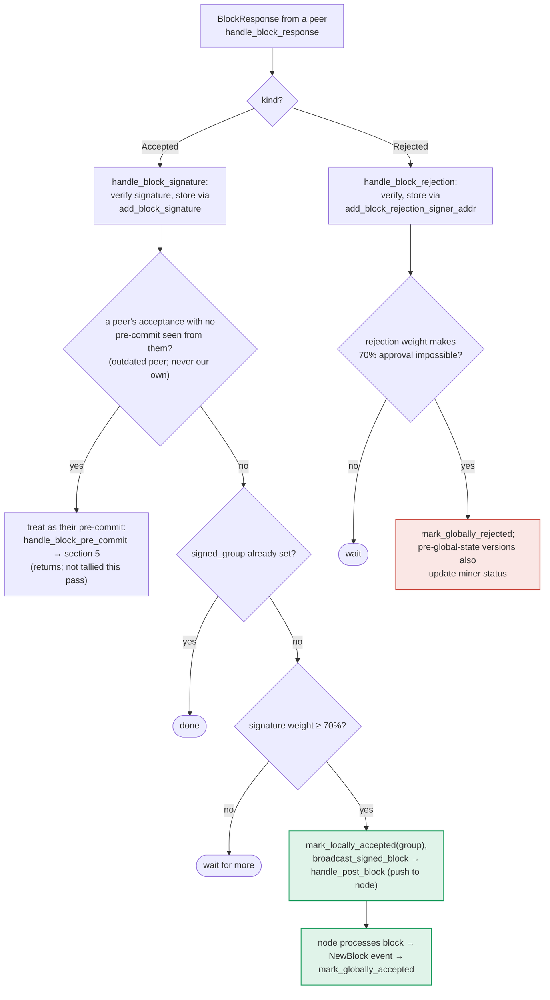

### Title
Aggregated peer-signature threshold path skips the chainstate re-check that the pre-commit→signature path enforces, letting a signer broadcast/push a block its own state now considers conflicting - (File: stacks-signer/src/v0/signer.rs)

### Summary
`store_and_process_block_signature` — the function that tallies *other* signers' `Accepted` votes and, once ≥70% weight is reached, marks the block `mark_locally_accepted` and calls `broadcast_signed_block` (pushing the block to the node) — never calls `check_block_against_signer_db_state` before doing so. By contrast, the sibling path that produces *this signer's own* signature, `handle_block_pre_commit` (triggered when pre-commit weight crosses threshold), explicitly re-runs `check_block_against_signer_db_state` immediately before signing, precisely because "we may have signed a different block at the same height ... the world must be re-checked before the signature leaves the box." [1](#0-0) 

### Finding Description
Two structurally parallel "reach threshold → act" paths exist in `stacks-signer/src/v0/signer.rs`:

1. **Pre-commit → own signature** (`handle_block_pre_commit`): once pre-commit weight ≥ 70%, the code re-runs `check_block_against_signer_db_state` against the *current* chainstate/signer DB before signing, and rejects if the block now conflicts with something this signer has since signed. [1](#0-0) 

2. **Peer signatures → broadcast** (`store_and_process_block_signature`, invoked from `handle_block_signature`): once the tallied signature weight of *peers'* `Accepted` responses reaches the same 70% threshold, the function calls `block_info.mark_locally_accepted(true)`, persists it, and calls `broadcast_signed_block` — with no equivalent call to `check_block_against_signer_db_state` or any other re-validation against this signer's current view. [2](#0-1) 

The only conditional check inside this path is whether the signature sender previously sent a pre-commit; if not, the message is routed into `handle_block_pre_commit` instead (which does perform the recheck) and the function returns early. [3](#0-2)  But once a peer has already pre-committed (the normal, expected flow), their later `Accepted` signature is tallied directly with no recheck at all — even though time has passed and the local chainstate/DB may have changed (e.g., this signer may since have signed a conflicting/competing block at the same height in a different tenure, exactly the scenario the design doc calls out as the reason the pre-commit path re-checks: "we may have signed a _different_ block at the same height, possibly in another tenure"). [4](#0-3) 

This breaks the "aggregated-weight vs verified-accepts" equality: the code treats *accumulated peer signature weight* as sufficient justification to declare the block locally accepted and push it to the node, without re-verifying that weight still corresponds to a block this signer's own, current chainstate view accepts. The documentation itself flags this asymmetry as deliberate design at the doc level (no RECHECK box exists on this branch of the flow, unlike the identical-looking pre-commit branch), but it means the safety guarantee ("do not act on stale/conflicting acceptances") that is enforced on the signing path is silently absent on the broadcast path. [5](#0-4) 

### Impact Explanation
If this signer's local chainstate view has changed between when peers pre-committed/accepted a block and when their accumulated `Accepted` weight crosses 70% (e.g., this signer has since locally/globally signed a conflicting sibling block at the same or higher height, in another tenure, which `check_block_against_signer_db_state`/`check_latest_block_in_tenure` would now reject), `store_and_process_block_signature` still proceeds to `mark_locally_accepted` and `broadcast_signed_block`, pushing a block this signer's own state considers stale/conflicting/non-canonical onward to its node. This is a Critical-class concern under the rules ("a rejection recounted as an accept" / signed-vs-validated mismatch): the signer effectively certifies (via `mark_locally_accepted` and forwarding to the node) a block it would refuse to sign itself if asked fresh at that same moment, undermining the very re-check invariant the sibling code path exists to enforce.

### Likelihood Explanation
This requires no majority collusion and no compromised keys: it only needs (a) the normal gossip of `BlockPreCommit`/`BlockResponse::Accepted` messages from a set of *honest* peers who signed before this signer's local view changed, and (b) a single miner/tenure fork producing a conflicting/competing block that this signer signs or pre-commits to afterward. Both are plausible in normal reorg/tenure-change timing windows that the codebase's own conflict-guard logic (in `handle_block_pre_commit`) was built to handle — but that guard is not mirrored here.

### Recommendation
Add a call to `check_block_against_signer_db_state` (or equivalent chainstate/conflict re-verification, mirroring `handle_block_pre_commit`'s pre-signature recheck) inside `store_and_process_block_signature` immediately before `mark_locally_accepted`/`broadcast_signed_block` are invoked, so that crossing the peer-signature threshold is held to the same "re-verify against current local state before acting" standard as crossing the pre-commit threshold.

### Proof of Concept
Not independently executed (index-only investigation); the code-path asymmetry was confirmed by direct comparison of the two functions:
- `handle_block_pre_commit` re-check before signing: [1](#0-0) 
- `store_and_process_block_signature` reaching threshold and broadcasting with no equivalent re-check: [6](#0-5) 
A full runtime PoC (spinning up multiple signers, forcing a tenure fork, and timing peer `Accepted` messages to arrive after this signer signs a conflicting sibling block) would require the full test harness/devnet, which is outside what can be verified from the index alone — this should be validated with a Devin session that has repo/test access if a concrete reproduction is needed.

### Citations

**File:** stacks-signer/src/v0/signer.rs (L1340-1366)
```rust
        // The chain and signer db state may have changed materially since this block passed the
        // proposal-time checks (e.g. between validation and reaching the pre-commit threshold we
        // may have signed a block that this one would reorg). Re-run the chainstate checks
        // before putting a signature over the block, and respond with a rejection if they no
        // longer pass, just as the block validation response handler does.
        if let Some(block_rejection) =
            self.check_block_against_signer_db_state(stacks_client, &block_info.block)
        {
            warn!(
                "{self}: Reached the pre-commit threshold for a block, but it no longer passes the chainstate checks. Rejecting.";
                "signer_signature_hash" => %block_hash,
                "block_height" => block_info.block.header.chain_length,
                "reject_code" => %block_rejection.reason_code,
                "reject_reason" => &block_rejection.reason,
            );
            if let Err(e) = block_info.mark_locally_rejected() {
                if !block_info.has_reached_consensus() {
                    warn!("{self}: Failed to mark block as locally rejected: {e:?}");
                }
            };
            self.signer_db
                .insert_block(&block_info)
                .unwrap_or_else(|e| self.handle_insert_block_error(e));
            self.handle_block_rejection(&block_rejection, sortition_state);
            self.send_block_response(&block_info.block, block_rejection.into());
            return;
        }
```

**File:** stacks-signer/src/v0/signer.rs (L2462-2466)
```rust
        // If this isn't our own signature and we haven't seen a pre-commit from this signer yet, try treating it as a pre-commit in case the caller is running an outdated version
        if signer_address != &self.stacks_address && !self.signer_db.has_committed(block_hash, signer_address).inspect_err(|e| warn!("Failed to check if pre-commit message already considered for {signer_address:?} for {block_hash}: {e}")).unwrap_or(false) {
            self.handle_block_pre_commit(stacks_client, sortition_state, signer_address, block_hash);
            return;
        }
```

**File:** stacks-signer/src/v0/signer.rs (L2468-2537)
```rust
        if block_info.signed_group.is_some() {
            // We have already processed this block to the accepted state. Adding more signatures will not change anything so nothing to check.
            return;
        }
        // do we have enough signatures to broadcast?
        // i.e. is the threshold reached?
        let signatures = self
            .signer_db
            .get_block_signatures(block_hash)
            .unwrap_or_else(|_| panic!("{self}: Failed to load block signatures"));

        // put signatures in order by signer address (i.e. reward cycle order)
        let addrs_to_sigs: HashMap<_, _> = signatures
            .into_iter()
            .filter_map(|sig| {
                let Ok(public_key) = Secp256k1PublicKey::recover_to_pubkey_without_validating_low_s(
                    block_hash.bits(),
                    &sig,
                ) else {
                    return None;
                };
                let addr = StacksAddress::p2pkh(self.mainnet, &public_key);
                Some((addr, sig))
            })
            .collect();

        let signature_weight = self.signer_weights.get(signer_address).unwrap_or(&0);
        let total_signature_weight = self.compute_signature_signing_weight(addrs_to_sigs.keys());
        let total_weight = self.compute_signature_total_weight();

        let min_weight = NakamotoBlockHeader::compute_voting_weight_threshold(total_weight)
            .unwrap_or_else(|_| {
                panic!("{self}: Failed to compute threshold weight for {total_weight}")
            });

        if min_weight > total_signature_weight {
            info!("{self}: Received block acceptance, but have not yet reached the acceptance threshold.";
                "signer_signature_hash" => %block_hash,
                "signature_weight" => signature_weight,
                "consensus_hash" => %block_info.block.header.consensus_hash,
                "block_height" => block_info.block.header.chain_length,
                "total_weight_approved" => total_signature_weight,
                "total_weight" => total_weight,
                "percent_approved" => (total_signature_weight as f64 / total_weight as f64 * 100.0),
            );
            return;
        }
        info!("{self}: have reached the block acceptance threshold";
            "signer_signature_hash" => %block_hash,
            "signature_weight" => signature_weight,
            "consensus_hash" => %block_info.block.header.consensus_hash,
            "block_height" => block_info.block.header.chain_length,
            "total_weight_approved" => total_signature_weight,
            "total_weight" => total_weight,
            "percent_approved" => (total_signature_weight as f64 / total_weight as f64 * 100.0),
        );

        // have enough signatures to broadcast!
        // move block to LOCALLY accepted state.
        // It is only considered globally accepted IFF we receive a new block event confirming it OR see the chain tip of the node advance to it.
        if let Err(e) = block_info.mark_locally_accepted(true) {
            if !block_info.has_reached_consensus() {
                warn!("{self}: Failed to mark block as locally accepted: {e:?}");
            }
        }
        let _ = self.signer_db.insert_block(block_info).map_err(|e| {
            warn!("Failed to set group threshold signature timestamp for {block_hash}: {e:?}");
            panic!("{self} Failed to write block to signerdb: {e}");
        });
        self.broadcast_signed_block(stacks_client, block_info.block.clone(), &addrs_to_sigs);
```

**File:** docs/signer-flows.md (L229-235)
```markdown
## 5. Pre-commit threshold → signature

The only place the signer produces a block signature by counting votes.
Pre-commits from peers (and our own) accumulate; at ≥70% weight the signer
decides whether to follow through. Between validation and threshold, we may have
signed a _different_ block at the same height, possibly in another tenure, so
the world must be re-checked before the signature leaves the box.
```

**File:** docs/signer-flows.md (L357-375)
```markdown

```
