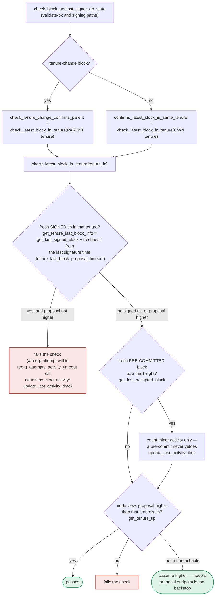

## Analog Finding [1](#0-0) 

### Title
Signer can sign a conflicting sibling block at the same height once the earlier signature goes "stale," even though the earlier block is still canonical and live - (File: stacks-signer/src/v0/signer.rs)

### Summary
The report describes a class of bug where an enforcement check that "could" run before a state-changing action is instead optional/conditional, letting the actor reach a final state that skips a consequence it should have incurred. In `handle_block_pre_commit`, the signer's cross-tenure equivocation guard is gated by *both* freshness and liveness (`last_endorsed > freshness_cutoff && conflict_still_blocks(...)`), short-circuited on freshness. This mirrors the analog: the "real" liveness check (`conflict_still_blocks`, which asks the node whether the conflicting block is dead) is never even reached once the earlier signature is stale, exactly like `forceReplenish`'s consequence-adjustment never firing once nobody calls it in time.

### Finding Description
`handle_block_pre_commit` re-validates chainstate before signing (`check_block_against_signer_db_state`), then applies a second, height-based conflict guard via `get_signed_conflicts` [2](#0-1) . That guard only blocks signing when a conflict is *both* fresh (`last_endorsed > freshness_cutoff`) *and* `conflict_still_blocks` returns true [3](#0-2) . Because Rust's `&&` short-circuits, once `last_endorsed <= freshness_cutoff` (i.e., the earlier conflicting signature is older than `tenure_last_block_proposal_timeout`), `conflict_still_blocks` is never invoked at all — the code falls straight through to "no conflict is both fresh and still live," as the comment itself states [4](#0-3) .

The chainstate re-check (`check_block_against_signer_db_state`) is claimed to be the compensating control for exactly this case, but it only inspects a *single* tenure per block: the block's own tenure for a normal block, or its *declared parent* tenure for a tenure-change block [5](#0-4) . If the conflicting, already-globally-accepted sibling block at the same height lives in a tenure that is neither the proposal's own tenure nor its declared parent tenure (e.g., a tenure-change block that reorgs past its immediate parent, or an unrelated sibling in a third tenure), the chainstate check never looks at that tenure at all. In that configuration, `get_signed_conflicts`'s ANY-tenure, height-based scan is the *only* remaining guard — and it is neutralized purely by the passage of time (`tenure_last_block_proposal_timeout`), independent of whether the node still considers the earlier block canonical and reachable.

This is structurally the same failure the external report flags: a second, deterministic safety check (`forceReplenish`/`conflict_still_blocks`) exists precisely to enforce a real-world consequence, but the code path that would invoke it is conditioned on something optional (a replenisher noticing in time / a signature staying "fresh"), so an attacker (or ordinary network delay) can walk past it into a state the check was designed to prevent.

### Impact Explanation
If this path is reachable, a signer can end up putting its signature over two conflicting blocks at the same Stacks height in different tenures — the exact double-sign/equivocation scenario the pre-commit conflict guard exists to prevent (see the guard's own doc comment: "The guard exists to stop us endorsing two blocks that could both end up in the chain" [6](#0-5) ). This maps to the "Critical" impact bucket: a signer signing a conflicting/non-canonical block, breaking the one-signature-per-height invariant that the aggregated 70% threshold is supposed to enforce.

### Likelihood Explanation
Reaching the stale-but-still-live state requires no signer majority and no key compromise — it only requires elapsed time exceeding `tenure_last_block_proposal_timeout` between the first signature and the competing sibling's pre-commit threshold being reached, and a topology where the conflicting block's tenure is outside the single tenure inspected by `check_block_against_signer_db_state`. This can occur from ordinary network delay/miner behavior (a one-slot miner plus gossip), not just adversarial action, since staleness alone (not liveness) determines whether the guard fires.

### Recommendation
Do not let `conflict_still_blocks` be short-circuited by freshness for conflicts outside the tenure(s) covered by `check_block_against_signer_db_state`. Freshness should only be used to skip the extra node round-trip when a conflict is *provably* covered by the chainstate re-check's single-tenure scope; for any conflict tenure the chainstate re-check does not examine, `conflict_still_blocks` (or an equivalent liveness check) must still run regardless of staleness before a signature is produced.

### Proof of Concept
1. Signer signs block A (tenure T1, height H); A is globally accepted and canonical.
2. Time passes beyond `tenure_last_block_proposal_timeout` with no further pre-commits on A (network conditions or a stalled tenure).
3. A miner proposes block B, a tenure-change block whose declared parent tenure is T0 (not T1), at the same height H, in tenure T2.
4. `check_block_against_signer_db_state` only checks B's confirmation of parent tenure T0 — it never inspects T1.
5. In `handle_block_pre_commit`, `get_signed_conflicts` finds A as a same-height conflict, but `conflict.last_endorsed <= freshness_cutoff`, so the `&&` short-circuits and `conflict_still_blocks` is never called [3](#0-2) .
6. The signer signs B, having already signed A at the same height in a different, still-canonical tenure.

### Citations

**File:** stacks-signer/src/v0/signer.rs (L1110-1136)
```rust
    /// The guard exists to stop us endorsing two blocks that could both end up in the chain. It
    /// must not, however, outlive the block it protects: a Bitcoin reorg can kill a block we
    /// signed, and a dead signature must not stall the chain restarting beneath it.
    ///
    /// Two questions, each answerable by the node at any time:
    ///
    /// 1. Is the tenure's sortition still on the canonical burn chain? We saved the tenure's
    ///    burn block when it arrived, and `/v3/sortitions` resolves it against the node's
    ///    canonical fork. A 404 means a burnchain fork orphaned the tenure: everything it built
    ///    is void, so the conflict is dead no matter what state its block is in.
    ///
    /// 2. Does the node's canonical Stacks chain still reach the block?
    ///    * If it does, the block is real chain state, so it keeps blocking. (If the reorg-timing
    ///      rules sanctioned replacing it, the tenure is recorded as superseded and the conflict
    ///      never reaches this check at all.)
    ///    * If it does not, and the block was once globally accepted, the node had it and a
    ///      reorg moved past it. That is proof it is dead, so it stops blocking.
    ///    * If it does not, and the block was never globally accepted, the node may simply never
    ///      have been handed it, since that only happens once the whole signer set has signed. We
    ///      cannot tell "dead" from "not yet known", so a sibling at the same height keeps
    ///      blocking (signing both would be the double-sign this guard is for), while a block
    ///      above the proposal does not: it is no sibling, and abandoning an unconfirmed block to
    ///      restart beneath it is a reorg rather than an equivocation.
    ///
    /// If we have no saved burn block, or the node is unreachable, the conflict keeps blocking.
    /// That only delays the replacement until our signature goes stale, whereas wrongly signing
    /// cannot be taken back.
```

**File:** stacks-signer/src/v0/signer.rs (L1340-1421)
```rust
        // The chain and signer db state may have changed materially since this block passed the
        // proposal-time checks (e.g. between validation and reaching the pre-commit threshold we
        // may have signed a block that this one would reorg). Re-run the chainstate checks
        // before putting a signature over the block, and respond with a rejection if they no
        // longer pass, just as the block validation response handler does.
        if let Some(block_rejection) =
            self.check_block_against_signer_db_state(stacks_client, &block_info.block)
        {
            warn!(
                "{self}: Reached the pre-commit threshold for a block, but it no longer passes the chainstate checks. Rejecting.";
                "signer_signature_hash" => %block_hash,
                "block_height" => block_info.block.header.chain_length,
                "reject_code" => %block_rejection.reason_code,
                "reject_reason" => &block_rejection.reason,
            );
            if let Err(e) = block_info.mark_locally_rejected() {
                if !block_info.has_reached_consensus() {
                    warn!("{self}: Failed to mark block as locally rejected: {e:?}");
                }
            };
            self.signer_db
                .insert_block(&block_info)
                .unwrap_or_else(|e| self.handle_insert_block_error(e));
            self.handle_block_rejection(&block_rejection, sortition_state);
            self.send_block_response(&block_info.block, block_rejection.into());
            return;
        }

        // A pre-commit may be superseded by a competing proposal at the same height (e.g. a
        // re-proposed tenure-start block after the first failed to reach consensus), but a
        // signature must not be superseded while it's still "fresh". A signed block at the
        // same or higher height in ANY tenure is a conflict: two blocks at the same height are
        // siblings no matter which tenure they belong to (e.g. the next tenure's tenure-start
        // block conflicts with the current tenure's block at the same height). Blocks in
        // tenures whose reorg we sanctioned under the reorg-timing rules are excluded, but
        // only while the sortition the permit was granted to is still canonical
        // (`check_parent_tenure_choice` records the permit, `reorg_permit_stands` re-derives
        // its validity from the node); every other question about whether a conflict is
        // still live is derived from the node in `conflict_still_blocks`.
        //
        // Unlike the chainstate check above, a refusal here is "for now" rather than a
        // broadcast rejection: a later pre-commit re-evaluation may still sign the block once
        // the conflicting signature has gone stale.
        let conflicts = match self
            .signer_db
            .get_signed_conflicts(block_info.block.header.chain_length, &block_hash)
        {
            Ok(conflicts) => conflicts,
            Err(e) => {
                warn!("{self}: Failed to query the signed blocks. Refusing to sign block {block_hash}: {e:?}");
                return;
            }
        };
        let freshness_cutoff = get_epoch_time_secs().saturating_sub(
            self.proposal_config
                .tenure_last_block_proposal_timeout
                .as_secs(),
        );
        // A fresh signature only blocks while the block it covers could still be part of the
        // chain: see `conflict_still_blocks`, which asks the node whether it is. Check
        // freshness first: it is a local timestamp comparison, while `reorg_permit_stands`
        // and `conflict_still_blocks` each query the node, so stale conflicts cost no
        // round-trips.
        if let Some(conflict) = conflicts.iter().find(|conflict| {
            conflict.last_endorsed > freshness_cutoff
                && !self.reorg_permit_stands(stacks_client, conflict)
                && self.conflict_still_blocks(
                    stacks_client,
                    conflict,
                    block_info.block.header.chain_length,
                )
        }) {
            warn!(
                "{self}: Reached the pre-commit threshold for a block, but we have recently signed or accepted a different block at the same or higher height. Refusing to sign.";
                "signer_signature_hash" => %block_hash,
                "block_height" => block_info.block.header.chain_length,
                "conflicting_signer_signature_hash" => %conflict.signer_signature_hash,
                "conflicting_block_height" => conflict.stacks_height,
                "conflicting_consensus_hash" => %conflict.consensus_hash,
            );
            return;
        }
```

**File:** stacks-signer/src/v0/signer.rs (L1423-1431)
```rust
        // No conflict is both fresh and still live. A conflict that no longer matters, i.e.
        // stale, or provably dead per `conflict_still_blocks`, cannot veto on its own. A
        // stale conflict in another tenure in particular no longer speaks for us: whether this
        // block may replace what another tenure built is settled by the chainstate checks above.
        // A stale conflict in this block's own tenure still blocks if the node already has that
        // tenure at or above the proposed height, since the proposal then duplicates state the
        // node has already built on. (The chainstate checks don't cover this for tenure-change
        // blocks: those check the parent tenure instead of their own.)
        // The permit check is deferred to here so that only same-tenure conflicts pay for it.
```

**File:** docs/signer-flows.md (L391-418)
```markdown
`check_latest_block_in_tenure` answers "does this block confirm the tip we
expect?" and it runs in three places: at proposal arrival (inside
`check_proposal`), at validate-ok, and at the moment of signing. _Which_ tenure
it is asked about depends on the block: a tenure-change block is checked against
its **parent** tenure, every other block against its **own**. Never both. The
pivotal helper is `get_tenure_last_block_info`, which considers only blocks that
carry a signature (`get_last_signed_block`): a pre-commit never vetoes anything,
it only counts as miner activity.


```
