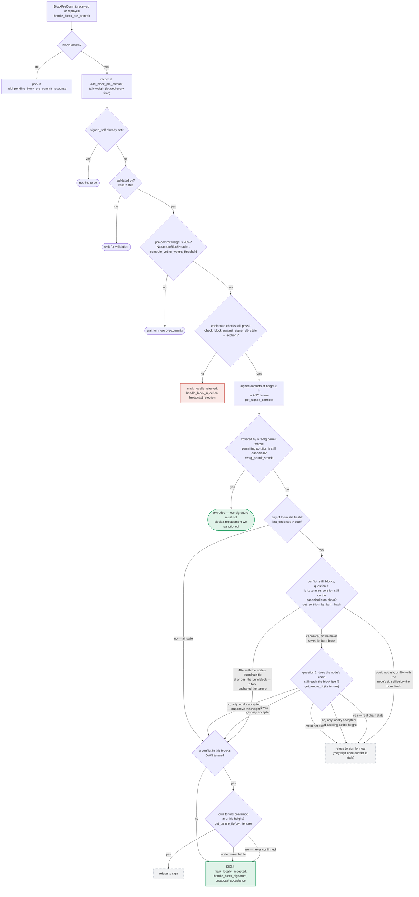

Based on my investigation, I found a strong structural analog. The equivocation guard against double-signing (`get_signed_conflicts`, `has_signed_block_in_tenure`, `conflict_still_blocks`) depends entirely on rows in the local `blocks` table of `signerdb.rs`, and on restart the `Signer::new` constructor only rehydrates `StateMachineUpdate` messages from StackerDB — never `BlockResponse`/signature data — into that table.

### Title
Equivocation Guard Is Silently Lost on SignerDB Reset/Loss, Enabling a Restarted Signer to Double-Sign a Conflicting Block - ([File: stacks-signer/src/v0/signer.rs, stacks-signer/src/signerdb.rs])

### Summary
The signer's protection against signing two conflicting blocks at the same height (`get_signed_conflicts` in [1](#0-0) , backed by the `blocks` table) exists **only** in the local SignerDB. On startup, `Signer::new` ( [2](#0-1) ) rehydrates only `StateMachineUpdate` chunks from StackerDB into the fresh DB; it never reconstructs prior `BlockResponse`/signature records. If the local SignerDB is lost or reset (crash + fresh file, disk issue, migration mistake) while the signer's own previously-broadcast signature is still gossiped/visible to peers, the restarted signer behaves as if it never signed anything, exactly like `_updateImpl` treating a zeroed `_addresses[id]` as "no proxy yet" and building fresh state that discards prior commitments.

### Finding Description
The double-sign / equivocation guard is implemented per the documented flow in section 5 of `docs/signer-flows.md` ( [3](#0-2) ): before finalizing a signature at pre-commit threshold, the signer calls `get_signed_conflicts(height, ...)` which queries the local `blocks` table for any block this signer has ever signed (`signed_self`/`signed_group`) at or above that height, in **any** tenure [4](#0-3) . This is the only backstop for a sibling block in a *different* tenure at the same height, since the chainstate re-check (`check_block_against_signer_db_state`) only ever examines one tenure (own or parent) [5](#0-4) , and the `DuplicateBlockFound` proposal-time check never re-runs later [6](#0-5) .

This guard is entirely a function of rows present in the local `blocks` table ( [7](#0-6) ). `Signer::new` reconstructs *only* `MessageSlotID::StateMachineUpdate` chunks from StackerDB on startup [8](#0-7) ; there is no equivalent step that queries the `BlockResponse` StackerDB slot to reconstruct which blocks this signer previously signed. The `signer_loads_stackerdb_updates_on_startup` test itself documents this: after clearing the SignerDB and restarting, the test verifies only that *state machine updates* are recovered from StackerDB, not that prior block signatures are [9](#0-8) .

Consequently, once the SignerDB's `blocks` table is empty (fresh file after a crash, corruption, or operational reset), `get_signed_conflicts` returns no rows for any height, `has_signed_block_in_tenure` returns `false` for every tenure, and the check in `handle_block_pre_commit`/threshold-signing path ( [10](#0-9) ) that would refuse or hold back a signature over a conflicting sibling never triggers — because from that signer's perspective, no prior signature exists. This is functionally identical to `RizLendingPoolAddressesProvider::_updateImpl` treating a zeroed `_addresses[id]` slot as "not yet deployed," discarding the module's real prior state and starting over.

### Impact Explanation
A one-slot miner (plus ordinary block gossip) that proposes a second, conflicting block at the same height in a different tenure — after this signer's DB has been wiped/reset — can get this signer to sign both the original (pre-wipe) and the new (post-wipe) block, since the guard's memory of the first signature no longer exists locally. This is a direct instance of the "High - a signer... losing the equivocation guard on restart" impact class: it does not require a majority of signers, another signer's key, or the auth token — only the operational event of DB loss/reset plus normal miner/gossip activity that would otherwise be exactly what the guard is designed to catch (see the explicit test cases `signer_refuses_to_sign_second_sibling_tenure_start` and `fresh_conflict_in_another_tenure_blocks_signing` in `stacks-signer/src/v0/tests.rs`, which show the guard working when the DB is intact).

### Likelihood Explanation
DB loss/reset is a realistic operational event for a long-running signer process (disk failure, backup/restore, accidental file deletion, migration issues), and the codebase explicitly anticipates and tests for signerdb loss scenarios (see the `signer_loads_stackerdb_updates_on_startup` test's "Shutdown signers db is cleared" step). The gap is that this recovery path only restores the miner-state machine, not the block-signature history that backs the equivocation guard, so the likelihood of hitting the exposed window is tied directly to a scenario the project already exercises in tests but does not fully close.

### Recommendation
On signer startup, in addition to reloading `StateMachineUpdate` chunks, also fetch the signer's own last-known `BlockResponse` (`MessageSlotID::BlockResponse`) chunk(s) from StackerDB per relevant tenure/height and use them to repopulate the `blocks` table's `signed_self`/`signed_group` markers before the signer begins evaluating new proposals, so that `get_signed_conflicts` and `has_signed_block_in_tenure` reflect true prior commitments even after a local DB loss. Alternatively, treat an empty/freshly-created SignerDB at startup as an untrusted state and hold off signing (delay) until the signer has synced enough StackerDB/chain history to be confident no unrecorded prior signature exists.

### Proof of Concept
1. Signer S1 signs block A at height H in tenure T1 (`mark_locally_accepted`/`mark_globally_accepted`, recorded in `blocks` table).
2. S1's SignerDB is lost/reset (e.g., process crash and disk corruption, or an operator mistakenly clears the DB as in the `signer_loads_stackerdb_updates_on_startup` test).
3. S1 restarts; `Signer::new` only reloads `StateMachineUpdate` chunks ( [8](#0-7) ) — the `blocks` table remains empty.
4. A miner (or a competing tenure) proposes block B at height H in tenure T2, conflicting with A.
5. S1 validates B, reaches pre-commit threshold, and calls `get_signed_conflicts(H, ...)` ( [1](#0-0) ) which returns empty since the row for A no longer exists.
6. S1 signs B, producing two signatures from the same signer over conflicting blocks at height H — the exact double-sign the guard exists to prevent.

### Citations

**File:** stacks-signer/src/signerdb.rs (L391-414)
```rust
static CREATE_BLOCKS_TABLE_1: &str = "
CREATE TABLE IF NOT EXISTS blocks (
    reward_cycle INTEGER NOT NULL,
    signer_signature_hash TEXT NOT NULL,
    block_info TEXT NOT NULL,
    consensus_hash TEXT NOT NULL,
    signed_over INTEGER NOT NULL,
    stacks_height INTEGER NOT NULL,
    burn_block_height INTEGER NOT NULL,
    PRIMARY KEY (reward_cycle, signer_signature_hash)
) STRICT";

static CREATE_BLOCKS_TABLE_2: &str = "
CREATE TABLE IF NOT EXISTS blocks (
    reward_cycle INTEGER NOT NULL,
    signer_signature_hash TEXT NOT NULL,
    block_info TEXT NOT NULL,
    consensus_hash TEXT NOT NULL,
    signed_over INTEGER NOT NULL,
    broadcasted INTEGER,
    stacks_height INTEGER NOT NULL,
    burn_block_height INTEGER NOT NULL,
    PRIMARY KEY (reward_cycle, signer_signature_hash)
) STRICT";
```

**File:** stacks-signer/src/signerdb.rs (L1587-1625)
```rust
    /// Return every signed block at or above the given Stacks height, in ANY tenure, excluding
    /// the block with the given signer signature hash, ordered by height (highest first). A
    /// block is considered signed if a signature was ever put over it, ours (`signed_self`)
    /// or the observed group's (`signed_group`). Blocks that were only pre-committed carry no
    /// signature and are never returned. Each row carries the most recent endorsement time
    /// (`signed_self`/`signed_group`, whichever is later) so the caller can judge freshness per
    /// conflict.
    ///
    /// The search deliberately spans all tenures: two blocks at the same height are siblings
    /// no matter which tenure they belong to (e.g. a tenure-start block conflicts with the
    /// previous tenure's block at the same height), so a signature over either may conflict
    /// with a fresh signature over the other.
    ///
    /// Blocks in tenures whose reorg we sanctioned under the reorg-timing rules (see
    /// [`SignerDb::mark_tenure_superseded`]) are still returned, but annotated with the
    /// permitting tenure's sortition (`superseded_by_*`): the permit only holds while that
    /// sortition is canonical, which the caller derives from the node per evaluation (see
    /// `Signer::reorg_permit_stands`) -- like every other question about whether a conflict is
    /// still *live* (`Signer::conflict_still_blocks`), it is not recorded.
    pub fn get_signed_conflicts(
        &self,
        height: u64,
        excluded_signer_signature_hash: &Sha512Trunc256Sum,
    ) -> Result<Vec<SignedConflictInfo>, DBError> {
        let query = "SELECT b.consensus_hash, b.signer_signature_hash, b.stacks_height, b.state,
                MAX(COALESCE(b.signed_self, 0), COALESCE(b.signed_group, 0)) AS last_endorsed,
                st.superseded_by_consensus_hash, st.superseded_by_burn_block_hash
            FROM blocks b
            LEFT JOIN superseded_tenures st ON st.consensus_hash = b.consensus_hash
            WHERE (b.signed_self IS NOT NULL OR b.signed_group IS NOT NULL)
                AND b.stacks_height >= ?1
                AND b.signer_signature_hash != ?2
            ORDER BY b.stacks_height DESC";
        let args = params![
            u64_to_sql(height)?,
            excluded_signer_signature_hash.to_string(),
        ];
        query_rows(&self.db, query, args)
    }
```

**File:** stacks-signer/src/v0/signer.rs (L208-272)
```rust
impl SignerTrait<SignerMessage> for Signer {
    /// Create a new signer from the given configuration
    fn new(stacks_client: &StacksClient, signer_config: SignerConfig) -> Self {
        let mut stackerdb = StackerDB::from(&signer_config);
        let mode = match signer_config.signer_mode {
            SignerConfigMode::DryRun => SignerMode::DryRun,
            SignerConfigMode::Normal { signer_id, .. } => SignerMode::Normal { signer_id },
        };

        debug!("Reward cycle #{} {mode}", signer_config.reward_cycle);

        let mut signer_db =
            SignerDb::new(&signer_config.db_path).expect("Failed to connect to signer Db");
        let proposal_config = ProposalEvalConfig::from(&signer_config);

        let stacks_address = StacksAddress::p2pkh(
            signer_config.mainnet,
            &StacksPublicKey::from_private(&signer_config.stacks_private_key),
        );

        let session = stackerdb
            .get_session_mut(&MessageSlotID::StateMachineUpdate)
            .expect("Invalid stackerdb session");
        let signer_slot_ids: Vec<_> = signer_config
            .signer_entries
            .signer_id_to_addr
            .keys()
            .copied()
            .collect();
        for (chunk_opt, slot_id) in session
            .get_latest_chunks(&signer_slot_ids)
            .inspect_err(|e| {
                warn!("Error retrieving state machine updates from stacker DB: {e}");
            })
            .unwrap_or_default()
            .into_iter()
            .zip(signer_slot_ids.iter())
        {
            let Some(chunk) = chunk_opt else {
                continue;
            };

            let Ok(SignerMessage::StateMachineUpdate(update)) =
                read_next::<SignerMessage, _>(&mut &chunk[..])
            else {
                continue;
            };

            let Some(signer_addr) = signer_config.signer_entries.signer_id_to_addr.get(slot_id)
            else {
                continue;
            };

            // This might update the received time/cause a discrepency between when we receive it at our event queue, but it
            // allows signers to potentially evaluate blocks immediately regardless of its nodes event queue state on startup
            if let Err(e) = signer_db.insert_state_machine_update(
                signer_config.reward_cycle,
                signer_addr,
                &update,
                &SystemTime::now(),
            ) {
                warn!("Error submitting state machine update to signer DB: {e}");
            };
        }

```

**File:** stacks-signer/src/v0/signer.rs (L1432-1466)
```rust
        if conflicts.iter().any(|conflict| {
            conflict.consensus_hash == block_info.block.header.consensus_hash
                && !self.reorg_permit_stands(stacks_client, conflict)
        }) {
            match stacks_client.get_tenure_tip(&block_info.block.header.consensus_hash) {
                Ok(tip) => {
                    let tip_height = tip.anchored_header.height();
                    if tip_height >= block_info.block.header.chain_length {
                        warn!(
                            "{self}: Reached the pre-commit threshold for a block that conflicts with previously signed or accepted blocks, and the canonical tip of its tenure is already at or above the proposed height. Refusing to sign.";
                            "signer_signature_hash" => %block_hash,
                            "block_height" => block_info.block.header.chain_length,
                            "canonical_tip_height" => tip_height,
                        );
                        return;
                    }
                }
                Err(e) => {
                    warn!(
                        "{self}: Failed to fetch the canonical tip of the proposed block's tenure: {e:?}. Treating the tenure as unconfirmed.";
                        "signer_signature_hash" => %block_hash,
                        "consensus_hash" => %block_info.block.header.consensus_hash,
                    );
                }
            }
        }
        if !conflicts.is_empty() {
            info!(
                "{self}: Reached the pre-commit threshold for a block that conflicts with previously signed or accepted blocks, but none of those conflicts still blocks it. Signing the replacement.";
                "signer_signature_hash" => %block_hash,
                "block_height" => block_info.block.header.chain_length,
                "num_conflicts" => conflicts.len(),
            );
        }
        // It is only considered globally accepted IFF we receive a new block event confirming it OR see the chain tip of the node advance to it.
```

**File:** docs/signer-flows.md (L229-272)
```markdown
## 5. Pre-commit threshold → signature

The only place the signer produces a block signature by counting votes.
Pre-commits from peers (and our own) accumulate; at ≥70% weight the signer
decides whether to follow through. Between validation and threshold, we may have
signed a _different_ block at the same height, possibly in another tenure, so
the world must be re-checked before the signature leaves the box.


```

**File:** docs/signer-flows.md (L280-286)
```markdown
- the re-check only ever looks at _one_ tenure (a tenure-change block's parent,
  or any other block's own), so a signed sibling at the same height in a third
  tenure is invisible to it;
- the `DuplicateBlockFound` check that would catch a second block in the same
  tenure lives in `check_proposal` and runs only at proposal arrival, never
  again. A block that crosses the pre-commit threshold minutes later has no
  other guard, which is what the own-tenure branch above covers.
```

**File:** docs/signer-flows.md (L425-437)
```markdown
Two things belong to the proposal path only and are **not** re-run at validate-ok
or at signing:

- `validate_tenure_change_payload` rejects with `DuplicateBlockFound` when we
  have already accepted a block in the tenure a tenure-change block is starting.
  v2 counts locally or globally accepted blocks (`get_last_signed_block`); v1
  counts only globally accepted ones (`get_last_globally_accepted_block`).
- the v2 `check_proposal` wrapper checks miner pubkey hash, consensus hash, the
  pox bitvec, and tenure-extend rules before delegating here.

Because the duplicate check never runs again, a block that crosses the pre-commit
threshold long after it was proposed relies on section 5's own-tenure conflict
guard to cover the same ground.
```

**File:** stacks-node/src/tests/signer/v0/mod.rs (L8862-8893)
```rust
    .expect("Not all signers accepted the block");

    info!("------------------------- Shutdown Signer at idx {stop_idx} -------------------------");
    let stopped_signer_config = miners.signer_test.stop_signer(stop_idx);
    {
        let mut signer_db = SignerDb::new(stopped_signer_config.db_path.clone()).unwrap();
        signer_db
            .clear_state_machine_updates()
            .expect("Failed to clear state machine updates");
    }
    info!("------------------------- Restart Signer at idx {stop_idx} -------------------------");
    miners
        .signer_test
        .restart_signer(stop_idx, stopped_signer_config);

    // Wait until signer boots up BEFORE proposing the next block
    miners.signer_test.wait_for_registered();
    info!("------------------------- Miner B Mines Block N+2 (Transfer) -------------------------");
    let (accepting, ignoring) = all_signers.split_at(4);
    // Make some of the signers ignore so that we CANNOT advance without approval from the restarted signer (its at index 0)
    TEST_IGNORE_ALL_BLOCK_PROPOSALS.set(ignoring.into());
    miners.send_transfer_tx();
    let block_n_2 =
        wait_for_block_pushed_by_miner_key(30, chain_after.stacks_tip_height + 2, &miner_pk_2)
            .expect("Failed to mine block N+2");
    wait_for_block_acceptance_from_signers(
        30,
        &block_n_2.header.signer_signature_hash(),
        &accepting,
    )
    .expect("Not all signers accepted the block");

```
