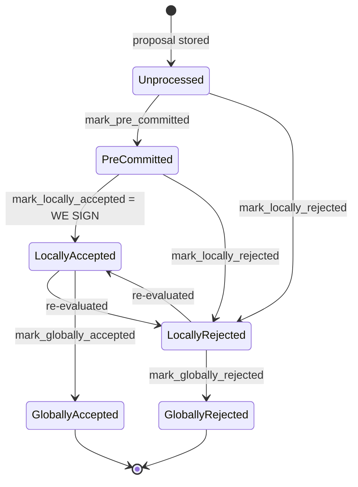

### Title
V1 Chainstate Tenure-Duplicate Check Only Considers Globally-Accepted Blocks, Missing Locally-Signed Conflicts - ([File: stacks-signer/src/chainstate/v1.rs])

### Summary
`SortitionsView::validate_tenure_change_payload` (protocol v1) is the function responsible for preventing a signer from approving a second, competing tenure-start block for a tenure it has already signed a block in. It performs this check with `signer_db.get_last_globally_accepted_block(...)`, which only matches rows in `BlockState::GloballyAccepted`. The protocol-v2 equivalent, `GlobalStateView::validate_tenure_change_payload`, performs the *same* logical check but deliberately uses `get_last_signed_block`, which matches both `GloballyAccepted` **and** `LocallyAccepted` — and documents why: a block that has only been locally signed still carries our signature and must count as "already signed in this tenure." [1](#0-0) [2](#0-1) 

### Finding Description
Both v1 and v2 tenure-change validators are supposed to enforce the same invariant: "don't approve a competing tenure-start block if we already put a signature over one in this tenure." v2 states the rule explicitly:

> "Only blocks we have signed (locally or globally accepted) count here: a block we have merely pre-committed to carries no signature from us, so it is safe to accept a competing tenure-start block in its place if it failed to reach consensus."

and implements it with `get_last_signed_block`, whose definition confirms it matches `GloballyAccepted` or `LocallyAccepted`: [3](#0-2) 

v1's implementation of the identical rule instead calls `get_last_globally_accepted_block`, which — by contrast to the `get_last_signed_block`/`get_last_accepted_block` family whose state-filtering is explicit in the surrounding code — only matches the `GloballyAccepted` state. This is exactly the same class of bug as the report's `isabs()` check: a boundary check that correctly handles one condition (globally-accepted duplicates) but silently omits an adjacent, equally-dangerous condition (locally-accepted-but-not-yet-globally-accepted duplicates).

Concretely: if a v1-protocol signer has already `mark_locally_accepted`'d (signed) a tenure-start block B1 for tenure T, but B1 has not yet reached the 70% pre-commit/signature threshold needed for `GloballyAccepted` (e.g. a network partition, a slow miner, or a competing proposal splitting weight), `get_last_globally_accepted_block(T)` returns `None`. A second, conflicting tenure-start proposal B2 for the same tenure T then passes `validate_tenure_change_payload`'s duplicate check and is not rejected with `RejectReason::DuplicateBlockFound`, unlike what the v2 code path guarantees.

### Impact Explanation
This breaks the "no conflicting signature" equality that the signer state machine is built to guarantee (see `docs/signer-flows.md`'s explicit design goal: "Nobody signs alone" / a signature is never given away cheaply, and the BlockState machine treats global states as terminal against each other) [4](#0-3) . `check_block_against_state` → `check_proposal` (v1) is the gate invoked before a proposal is even submitted for node validation and pre-commit [5](#0-4) , so a business-logic guard specifically meant to stop this scenario silently passes a proposal it should reject. While the pre-commit/signing path has an independent, state-agnostic conflict check (`get_signed_conflicts`, keyed off `signed_self`/`signed_group` rather than `BlockState`) that can still intervene later, that later logic has documented escape valves (e.g., signing anyway when the node has not yet confirmed the tenure tip), meaning the v1-specific loophole in `validate_tenure_change_payload` removes a layer of defense-in-depth against exactly the "signer signs a conflicting block" outcome the rules classify as Critical.

### Likelihood Explanation
Triggerable by a single miner (plus ordinary network-timing conditions, no majority of signers required): the miner (or its equivalent under a fork/tenure-change race) simply needs to get one signer to locally accept a first tenure-start block for tenure T, and before that block reaches global acceptance, propose a second, different tenure-start block for the same tenure T to the same signer. This requires only normal proposal/gossip traffic already in scope, and depends purely on which protocol version (v1 vs v2) the signer is currently operating under.

### Recommendation
Change `stacks-signer/src/chainstate/v1.rs`'s `validate_tenure_change_payload` to use `signer_db.get_last_signed_block(&block.header.consensus_hash)` instead of `get_last_globally_accepted_block`, matching the v2 implementation and its documented rationale, so that a `LocallyAccepted` (signed) block in the tenure is also treated as a duplicate and triggers `RejectReason::DuplicateBlockFound`.

### Proof of Concept
1. Signer S is on the v1 chainstate protocol.
2. Miner proposes tenure-start block B1 for tenure T. S validates it, pre-commits, reaches the 70% pre-commit threshold, and signs it: `mark_locally_accepted` sets `BlockState::LocallyAccepted` [6](#0-5) . B1 does not yet reach `GloballyAccepted` (not enough other signers/weight yet, or the node hasn't announced it).
3. Miner (or a competing miner after a tenure/fork race) proposes B2, a different tenure-start block for the same tenure T.
4. `SortitionsView::check_proposal` → `validate_tenure_change_payload` calls `signer_db.get_last_globally_accepted_block(T)`, which returns `None` because B1 is only `LocallyAccepted`, not `GloballyAccepted` [7](#0-6) .
5. The duplicate-tenure check is bypassed; B2 proceeds to node validation and pre-commit rather than being rejected with `DuplicateBlockFound`, unlike the v2 path which would catch this via `get_last_signed_block`.

Note: full confirmation of whether the downstream `get_signed_conflicts`-based pre-commit check always blocks the actual second signature in every timing scenario could not be exhaustively traced within the available context (its "TIP unconfirmed → SIGN anyway" branch is a documented escape valve whose exact interaction with this specific v1 loophole would need further tracing in `handle_block_pre_commit`).

### Citations

**File:** stacks-signer/src/chainstate/v1.rs (L496-519)
```rust
        // now, we have to check if the parent tenure was a valid choice.
        let is_valid_parent_tenure = proposed_by.state().data.check_parent_tenure_choice(
            signer_db,
            client,
            &self.config.first_proposal_burn_block_timing,
        )?;
        if !is_valid_parent_tenure {
            return Err(RejectReason::ReorgNotAllowed);
        }
        let last_in_current_tenure = signer_db
            .get_last_globally_accepted_block(&block.header.consensus_hash)
            .map_err(|e| {
                SignerChainstateError::from(ClientError::InvalidResponse(e.to_string()))
            })?;
        if let Some(last_in_current_tenure) = last_in_current_tenure {
            warn!(
                "Miner block proposal contains a tenure change, but we've already signed a block in this tenure. Considering proposal invalid.";
                "proposed_block_consensus_hash" => %block.header.consensus_hash,
                "proposed_block_signer_signature_hash" => %block.header.signer_signature_hash(),
                "last_in_tenure_signer_signature_hash" => %last_in_current_tenure.block.header.signer_signature_hash(),
            );
            return Err(RejectReason::DuplicateBlockFound);
        }
        Ok(())
```

**File:** stacks-signer/src/chainstate/v2.rs (L340-358)
```rust
        // We already confirmed in check miner activity that the current tenure is valid. So check we are not
        // reorging the tenure blocks. Only blocks we have signed (locally or globally accepted) count
        // here: a block we have merely pre-committed to carries no signature from us, so it is safe to
        // accept a competing tenure-start block in its place if it failed to reach consensus.
        let last_in_current_tenure = signer_db
            .get_last_signed_block(&block.header.consensus_hash)
            .map_err(|e| {
                SignerChainstateError::from(ClientError::InvalidResponse(e.to_string()))
            })?;
        if let Some(last_in_current_tenure) = last_in_current_tenure {
            warn!(
                "Miner block proposal contains a tenure change, but we've already signed a block in this tenure. Considering proposal invalid.";
                "proposed_block_consensus_hash" => %block.header.consensus_hash,
                "proposed_block_signer_signature_hash" => %block.header.signer_signature_hash(),
                "last_in_tenure_signer_signature_hash" => %last_in_current_tenure.block.header.signer_signature_hash(),
            );
            return Err(RejectReason::DuplicateBlockFound);
        }
        Ok(())
```

**File:** stacks-signer/src/signerdb.rs (L1564-1585)
```rust
    /// Return the last signed block in a tenure (identified by its consensus hash).
    /// A block is considered signed if it is locally or globally accepted. Blocks that
    /// have only been pre-committed are excluded, because a pre-commit does not put a
    /// signature over the block and may be safely superseded by a competing proposal.
    ///
    /// This answers "what is the tenure's signed tip?", a different question from
    /// [`SignerDb::has_signed_block_in_tenure`]'s "does a signature bind us to this tenure?",
    /// which is why the predicates deliberately differ on rejected blocks (see there).
    pub fn get_last_signed_block(
        &self,
        tenure: &ConsensusHash,
    ) -> Result<Option<BlockInfo>, DBError> {
        let query = "SELECT block_info FROM blocks WHERE consensus_hash = ?1 AND state IN (?2, ?3) ORDER BY stacks_height DESC LIMIT 1";
        let args = params![
            tenure,
            &BlockState::GloballyAccepted.to_string(),
            &BlockState::LocallyAccepted.to_string(),
        ];
        let result: Option<String> = query_row(&self.db, query, args)?;

        try_deserialize(result)
    }
```

**File:** docs/signer-flows.md (L130-162)
```markdown
## 2. Block lifecycle (`BlockState`)

Every proposal tracked in the signer DB carries a `BlockState`. **`PreCommitted`
carries no signature**: it means "validated, willing to sign if the pre-commit
threshold is met." The first signature appears at `mark_locally_accepted`.
Global states are terminal against each other.



Canonical paths shown; the exact rule in `BlockInfo::check_state` is: either
local state is reachable from anything not yet global, `PreCommitted` only from
`Unprocessed`, and each global state is unreachable from the other.

Timestamps: `approved_time` is stamped at pre-commit _or_ local acceptance
(first wins), `signed_self` only when we sign, `signed_group` when the group
threshold is observed.

> Anchors: `BlockInfo::check_state`, `move_to`, `mark_pre_committed`,
> `mark_locally_accepted`, `mark_globally_accepted`, `mark_locally_rejected`,
> `mark_globally_rejected` (signerdb.rs)
```

**File:** stacks-signer/src/v0/signer.rs (L1670-1680)
```rust
        // Check if proposal can be rejected now if not valid against sortition view
        let block_rejection =
            self.check_block_against_state(stacks_client, sortition_state, &block_info);

        #[cfg(any(test, feature = "testing"))]
        let block_rejection =
            self.test_reject_block_proposal(block_proposal, &mut block_info, block_rejection);

        if let Some(block_rejection) = block_rejection {
            // We know proposal is invalid. Send rejection message, do not do further validation and do not store it.
            self.send_block_response(&block_info.block, block_rejection.into());
```

**File:** stacks-signer/src/v0/signer.rs (L1960-1985)
```rust
        } else {
            if let Err(e) = block_info.mark_pre_committed() {
                // The block may have reached enough signatures before we validated the block so should fail to mark pre-committed
                // but still call to make sure the timestamps and validity are updated correctly.
                if !block_info.has_reached_consensus()
                    && block_info.state != BlockState::LocallyAccepted
                {
                    warn!("{self}: Failed to mark block as approved: {e:?}",);
                    return;
                }
            }

            self.signer_db
                .insert_block(&block_info)
                .unwrap_or_else(|e| self.handle_insert_block_error(e));
            self.send_block_pre_commit(signer_signature_hash.clone());
            // have to save the signature _after_ the block info
            let address = self.stacks_address.clone();
            self.handle_block_pre_commit(
                stacks_client,
                sortition_state,
                &address,
                signer_signature_hash,
            );
        }
    }
```
