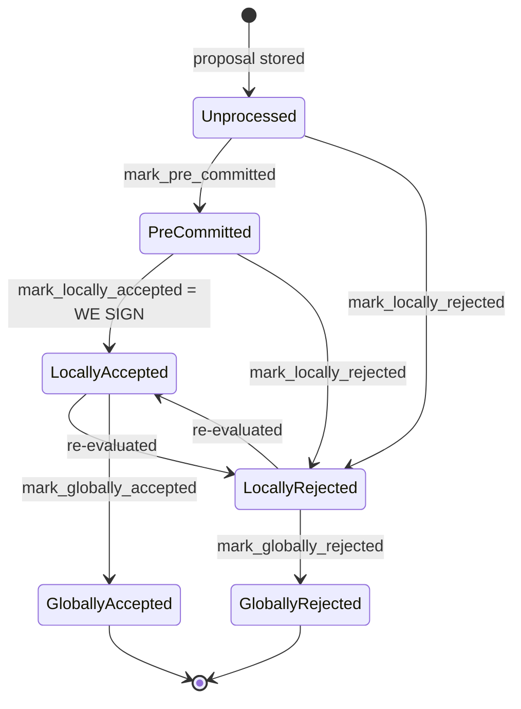

### Title
Stale rejection weight is never cleared when a signer flips from Rejected to Accepted, letting the node-side coordinator spuriously block an actually-approved-threshold block - (File: `stacks-node/src/nakamoto_node/stackerdb_listener.rs`)

### Summary
`StackerDBListener::run` maintains a per-block `BlockStatus { total_weight_approved, total_weight_rejected, responded_signers, gathered_signatures, .. }` used by `SignerCoordinator::get_block_status` to decide whether a proposed block has reached the 70% acceptance threshold or the >30% rejection threshold. [1](#0-0)  The `Rejected` branch only credits `total_weight_rejected` if the slot has not already `responded_signers`, which correctly prevents double counting when a signer *accepts and then rejects*. [2](#0-1)  But the `Accepted` branch only checks `gathered_signatures.contains_key(&slot_id)` — not `responded_signers` — before crediting `total_weight_approved`, so a signer who *rejects and later accepts* the same block gets its weight added to `total_weight_approved` while the earlier `total_weight_rejected` credit is never removed. [3](#0-2) 

### Finding Description
The signer-side local DB (`stacks-signer/src/signerdb.rs`) explicitly fixed this exact class of bug: `add_block_signature` clears any prior rejection record for that address, and `add_block_rejection_signer_addr` refuses to record a rejection once a signature already exists — verified by the `reject_then_accept` / `accept_then_reject` tests and documented in the changelog ("Do not count both a block acceptance and a block rejection for the same signer/block"). [4](#0-3) [5](#0-4) 

This protection was never mirrored on the node-side coordinator's in-memory tally in `stackerdb_listener.rs`. There, `responded_signers` is used asymmetrically:
- `Rejected` handling: increments `total_weight_rejected` only if `responded_signers.insert(slot_id)` succeeds (i.e., guards against a signer that already responded, in either direction). [2](#0-1) 
- `Accepted` handling: increments `total_weight_approved` based solely on `!gathered_signatures.contains_key(&slot_id)`, ignoring whether that slot already contributed weight to `total_weight_rejected`. [3](#0-2) 

Flipping from reject to accept on the same block is a first-class, non-adversarial signer behavior: the signer's own state machine explicitly allows `LocallyRejected -> LocallyAccepted` "re-evaluated" transitions, [6](#0-5)  and the changelog documents that "for some rejection reasons, a signer will reconsider a block proposal that it previously rejected." [7](#0-6)  A very plausible trigger is a signer that rejects a proposal because its node has not yet processed the parent block, then re-evaluates and accepts once the parent lands — exactly the scenario the `signer_can_accept_rejected_block` test exercises. [8](#0-7) 

Once this happens, that signer's weight is counted in *both* `total_weight_approved` and `total_weight_rejected` simultaneously, breaking the invariant that `total_weight_approved + total_weight_rejected` should never double-count a single signer's weight — directly analogous to the ERC20 budget-cap bug counting the same balance twice via two different code paths.

### Impact Explanation
`SignerCoordinator::get_block_status` checks the rejection condition *before* the acceptance condition:
```
if block_status.total_weight_rejected.saturating_add(self.weight_threshold) > self.total_weight { … reject … }
else if block_status.total_weight_approved >= self.weight_threshold { … accept … }
``` [9](#0-8) 
Because a flipped signer's stale rejection weight is never removed from `total_weight_rejected`, this counter can cross the ">30% blocking minority" threshold using weight that no longer represents a live rejection (the signer has since signed). Since the rejection branch is evaluated first, the miner can conclude a block is "impossible to approve" and abandon/retry it, excluding transactions and re-proposing, even though the real, current signer support (including the flipped signer) may already meet or exceed the 70% acceptance threshold. This is a liveness wedge on block production driven purely by stale, double-counted weight bookkeeping in the node-side coordinator — no majority collusion required, only a single signer's legitimate re-evaluation.

### Likelihood Explanation
High. The flip from `Rejected` to `Accepted` for the same block is an explicitly supported and documented signer behavior (`LocallyRejected -> LocallyAccepted` re-evaluation), and a concrete example (parent-not-yet-processed rejection followed by later acceptance) is already covered by an existing test scenario. [10](#0-9)  No adversarial coordination or majority weight is needed — a single signer naturally producing this response sequence during normal operation is sufficient to trigger the stale double count on the node side.

### Recommendation
Mirror the signer-side fix in `stacks-signer/src/signerdb.rs` (clear rejection weight when a signature arrives; treat acceptance and rejection as mutually exclusive per signer) inside `stackerdb_listener.rs`'s `BlockStatus` tracking: when handling `BlockResponse::Accepted`, check `responded_signers` (not just `gathered_signatures`) before crediting `total_weight_approved`, and if the slot was previously counted in `total_weight_rejected`, subtract that signer's weight from `total_weight_rejected` (and remove any associated `failed_txids` weight contributions) before adding it to `total_weight_approved`.

### Proof of Concept
1. Node proposes block B; signer S (weight w) sends `BlockResponse::Rejected` (e.g., `InvalidParentBlock`-type reason). `stackerdb_listener` sets `responded_signers.insert(S)`, `total_weight_rejected += w`. [2](#0-1) 
2. S's node later processes the parent block; S re-evaluates and sends a valid `BlockResponse::Accepted` signature for the same `block_sighash`. In the `Accepted` handler, `gathered_signatures.contains_key(&S)` is `false` (S was never in `gathered_signatures`), so the guard passes and `total_weight_approved += w` is applied, while `total_weight_rejected` still includes `w` from step 1. [3](#0-2) 
3. Now `total_weight_approved + total_weight_rejected` exceeds `total_weight` by `w`. If enough other signers are near the rejection blocking-minority threshold, `total_weight_rejected.saturating_add(self.weight_threshold) > self.total_weight` can become true purely due to S's stale rejection credit, even though S's current (and only valid) vote is an acceptance — causing `get_block_status` to return the rejection branch and abandon a block that in reality has legitimate accepting weight. [9](#0-8)

### Citations

**File:** stacks-node/src/nakamoto_node/stackerdb_listener.rs (L70-82)
```rust
#[derive(Debug, Clone)]
pub struct BlockStatus {
    /// Set of the slot ids of signers who have responded
    pub responded_signers: HashSet<u32>,
    /// Map of the slot id of signers who have signed the block and their signature
    pub gathered_signatures: BTreeMap<u32, MessageSignature>,
    /// Total weight of signers who have signed the block
    pub total_weight_approved: u32,
    /// Total weight of signers who have rejected the block
    pub total_weight_rejected: u32,
    /// Per-txid rejection tracking from signers
    pub failed_txids: HashMap<Txid, FailedTxInfo>,
}
```

**File:** stacks-node/src/nakamoto_node/stackerdb_listener.rs (L443-465)
```rust
                        if !block.gathered_signatures.contains_key(&slot_id) {
                            block.total_weight_approved = block
                                .total_weight_approved
                                .saturating_add(signer_entry.weight);

                            info!("StackerDBListener: Signature Added to block";
                                "signer_signature_hash" => %block_sighash,
                                "signer_pubkey" => signer_pubkey.to_hex(),
                                "signer_slot_id" => slot_id,
                                "signature" => %signature,
                                "signer_weight" => signer_entry.weight,
                                "total_weight_approved" => block.total_weight_approved,
                                "percent_approved" => block.total_weight_approved as f64 / self.total_weight as f64 * 100.0,
                                "total_weight_rejected" => block.total_weight_rejected,
                                "percent_rejected" => block.total_weight_rejected as f64 / self.total_weight as f64 * 100.0,
                                "weight_threshold" => self.weight_threshold,
                                "tenure_extend_timestamp" => tenure_extend_timestamp,
                                "read_count_extend_timestamp" => read_count_extend_timestamp,
                                "server_version" => metadata.server_version,
                            );
                        }
                        block.gathered_signatures.insert(slot_id, signature);
                        block.responded_signers.insert(slot_id);
```

**File:** stacks-node/src/nakamoto_node/stackerdb_listener.rs (L515-518)
```rust
                        if block.responded_signers.insert(slot_id) {
                            block.total_weight_rejected = block
                                .total_weight_rejected
                                .saturating_add(signer_entry.weight);
```

**File:** stacks-signer/src/signerdb.rs (L3234-3298)
```rust
    #[test]
    fn reject_then_accept() {
        let db_path = tmp_db_path();
        let db = SignerDb::new(db_path).expect("Failed to create signer db");

        let block_id = Sha512Trunc256Sum::from_data("foo".as_bytes());
        let address = StacksAddress::burn_address(false);
        let sig1 = MessageSignature([0x11; 65]);

        assert_eq!(db.get_block_signatures(&block_id).unwrap(), vec![]);

        assert!(db
            .add_block_rejection_signer_addr(
                &block_id,
                &address,
                RejectReasonPrefix::InvalidParentBlock
            )
            .unwrap());
        assert_eq!(
            db.get_block_rejection_signer_addrs(&block_id).unwrap(),
            vec![(address.clone(), RejectReasonPrefix::InvalidParentBlock)]
        );

        assert!(db.add_block_signature(&block_id, &address, &sig1).unwrap());
        assert_eq!(db.get_block_signatures(&block_id).unwrap(), vec![sig1]);
        assert!(db
            .get_block_rejection_signer_addrs(&block_id)
            .unwrap()
            .is_empty());
    }

    #[test]
    fn accept_then_reject() {
        let db_path = tmp_db_path();
        let db = SignerDb::new(db_path).expect("Failed to create signer db");

        let block_id = Sha512Trunc256Sum::from_data("foo".as_bytes());
        let address = StacksAddress::burn_address(false);
        let sig1 = MessageSignature([0x11; 65]);

        assert_eq!(db.get_block_signatures(&block_id).unwrap(), vec![]);

        assert!(db.add_block_signature(&block_id, &address, &sig1).unwrap());
        assert_eq!(
            db.get_block_signatures(&block_id).unwrap(),
            vec![sig1.clone()]
        );
        assert!(db
            .get_block_rejection_signer_addrs(&block_id)
            .unwrap()
            .is_empty());

        assert!(!db
            .add_block_rejection_signer_addr(
                &block_id,
                &address,
                RejectReasonPrefix::InvalidParentBlock
            )
            .unwrap());
        assert_eq!(db.get_block_signatures(&block_id).unwrap(), vec![sig1]);
        assert!(db
            .get_block_rejection_signer_addrs(&block_id)
            .unwrap()
            .is_empty());
    }
```

**File:** stacks-signer/CHANGELOG.md (L132-135)
```markdown
### Changed

- Do not count both a block acceptance and a block rejection for the same signer/block. Also ignore repeated responses (mainly for logging purposes).
- Database schema updated to version 16
```

**File:** stacks-signer/CHANGELOG.md (L176-181)
```markdown
## [3.1.0.0.8.0]

### Changed

- For some rejection reasons, a signer will reconsider a block proposal that it previously rejected ([#5880](https://github.com/stacks-network/stacks-core/pull/5880))

```

**File:** docs/signer-flows.md (L130-150)
```markdown
## 2. Block lifecycle (`BlockState`)

Every proposal tracked in the signer DB carries a `BlockState`. **`PreCommitted`
carries no signature**: it means "validated, willing to sign if the pre-commit
threshold is met." The first signature appears at `mark_locally_accepted`.
Global states are terminal against each other.


```

**File:** stacks-node/src/tests/signer/v0/mod.rs (L7153-7159)
```rust
#[test]
#[ignore]
/// This test verifies that a a signer will accept a rejected block if it is
/// re-proposed and determined to be legitimate. This can happen if the block
/// is initially rejected due to a test flag or because the stacks-node had
/// not yet processed the block's parent.
fn signer_can_accept_rejected_block() {
```

**File:** stacks-node/src/nakamoto_node/signer_coordinator.rs (L509-545)
```rust
            if block_status
                .total_weight_rejected
                .saturating_add(self.weight_threshold)
                > self.total_weight
            {
                info!(
                    "{}/{} signer weight votes to reject block",
                    block_status.total_weight_rejected, self.total_weight;
                    "signer_signature_hash" => %block_signer_sighash,
                );
                counters.bump_naka_rejected_blocks();

                // Only act on failed txids that a blocking minority (>30% weight) agrees on
                let blocking_minority = self.total_weight.saturating_sub(self.weight_threshold);
                let mut temporarily_excluded_txids = HashSet::new();
                let mut permanently_excluded_txids = HashSet::new();
                for (txid, info) in &block_status.failed_txids {
                    if info.total_weight > blocking_minority {
                        // Do not perma ban txids that only a small minority of signers reported as problematic
                        // But make sure its removed from the next block proposal
                        if info.problematic_weight > blocking_minority {
                            permanently_excluded_txids.insert(txid.clone());
                        } else {
                            temporarily_excluded_txids.insert(txid.clone());
                        }
                    }
                }

                return Err(NakamotoNodeError::SignersRejected {
                    temporarily_excluded_txids,
                    permanently_excluded_txids,
                });
            } else if block_status.total_weight_approved >= self.weight_threshold {
                info!("Received enough signatures, block accepted";
                    "signer_signature_hash" => %block_signer_sighash,
                );
                return Ok(block_status.gathered_signatures.values().cloned().collect());
```
