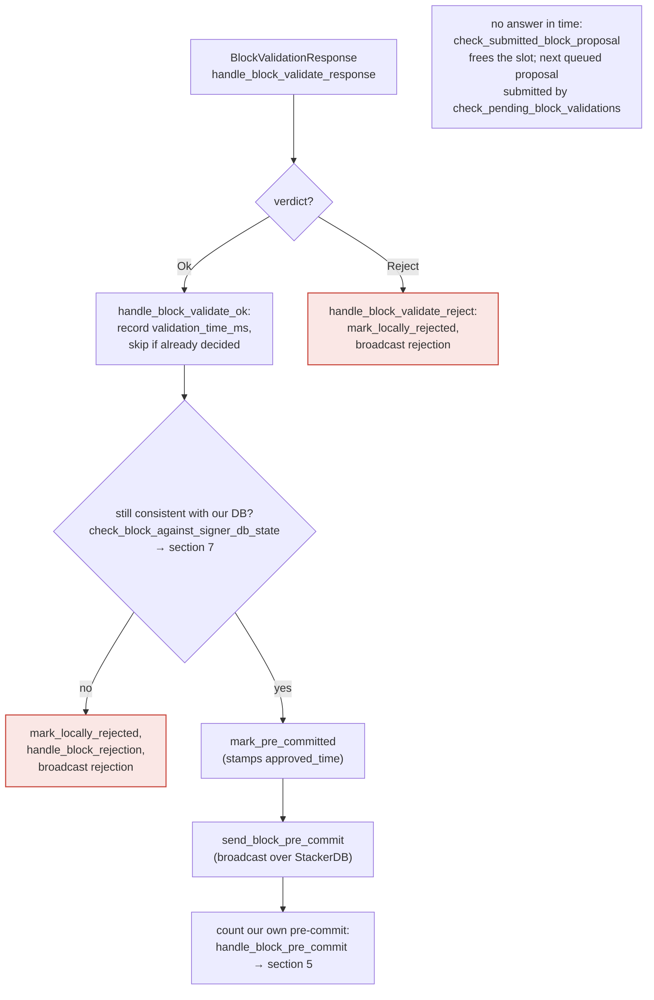
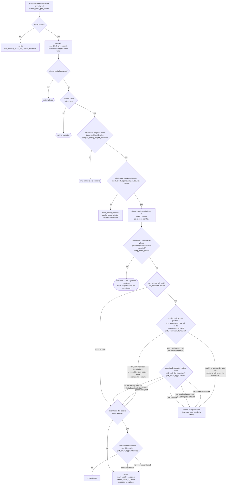
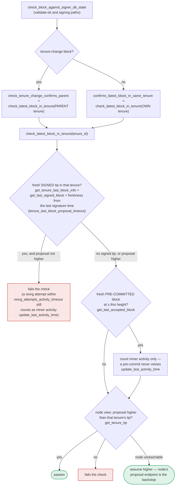

### Title
Miner-identity checks (pubkey hash / consensus hash / bitvec) are enforced only at proposal time and never re-verified before a signature is emitted - ([File: stacks-signer/src/chainstate/v2.rs])

### Summary
`GlobalStateView::check_proposal` (v2 chainstate) is the only place that verifies a proposed block still belongs to the currently active miner (`ConsensusHashMismatch`, `PubkeyHashMismatch`, `InvalidBitvec`, unsupported-tenure-extend checks). This function runs once, when the proposal first arrives. The re-checks that run later — at validate-ok and again immediately before a signature is emitted (`check_block_against_signer_db_state`) — only re-verify tenure/parent confirmation (`check_latest_block_in_tenure`), not miner identity. This is the same class of bug as the referenced report: a validating predicate (`_checkBalances` in the analog) is wired into some code paths (`_swap`, `_lpTokenSpecified`) but omitted from others (`_reserveTokenSpecified`), letting the invariant be violated on the unchecked path.

### Finding Description
`docs/signer-flows.md` explicitly documents the asymmetry: [1](#0-0) 

and the actual v2 check that is skipped afterward: [2](#0-1) 

The pre-commit → signature path (section 5 of the flow doc) re-runs only `check_block_against_signer_db_state`, which is documented to call `check_tenure_change_confirms_parent`/`confirms_latest_block_in_same_tenure` (i.e. `check_latest_block_in_tenure`), not the miner-pubkey/consensus-hash/bitvec assertions: [3](#0-2) 

The `RECHECK` step that runs both at validate-ok and immediately before `SIGN` uses this same narrow function: [4](#0-3) [5](#0-4) 

So the signer's local notion of "who is the active/current miner for this tenure" (`MinerState::ActiveMiner { current_miner_pkh, tenure_id, .. }`) is only compared against the block at the moment the proposal is first evaluated inside `check_block_against_global_state` → `GlobalStateView::check_proposal`: [6](#0-5) 

Between that first evaluation and the moment 70% pre-commit weight is reached and the signer actually signs, the signer's `global_state_evaluator`/`local_state_machine` can change (a burn-chain event, a `StateMachineUpdate` from peers, or `capitulate_miner_view` adopting a different miner view — see section 8 of the flow doc). If the signer's view of the "current miner" shifts to a different pubkey hash or tenure id after the proposal was accepted for validation, nothing in the RECHECK path (`check_block_against_signer_db_state`) re-asserts `PubkeyHashMismatch`/`ConsensusHashMismatch`/`InvalidBitvec` against the *new* current view before the signature is produced.

### Impact Explanation
If exploitable, this breaks the "signed vs validated" equality: the signer would end up placing its signature on a block whose consensus_hash/miner pubkey it would reject if evaluated fresh under its now-current view — i.e., a signer signing a block for a miner/tenure it itself no longer considers valid. That maps to the required Critical impact category ("a signer signing an invalid, non-canonical, or conflicting block").

### Likelihood Explanation
Likelihood is speculative rather than proven. The tenure/parent-confirmation recheck (`check_latest_block_in_tenure`) does catch many state changes (reorgs, stale tips), and `docs/signer-flows.md` itself only calls out the `DuplicateBlockFound`/tenure-extend gaps as intentionally uncovered, without asserting the pubkey/consensus/bitvec gap is safe or unsafe. Whether the signer's local `MinerState` can actually flip to a *different* active miner between proposal-acceptance and pre-commit-threshold while stale pre-commits/signatures for the old miner's block keep accumulating (via the "outdated peer" fallback path noted in section 6 of the flow doc) was not something I could fully trace through `capitulate_miner_view`/`update_parent_tenure_last_block` within the available context. This needs to be validated against the actual state-machine transition logic (`stacks-signer/src/v0/signer_state.rs`) and a concrete repro before treating it as a confirmed break, rather than a documented structural gap.

### Recommendation
Re-run the miner-identity checks (`ConsensusHashMismatch`, `PubkeyHashMismatch`, `InvalidBitvec`) — not just tenure/parent confirmation — inside `check_block_against_signer_db_state`, so the recheck immediately preceding `mark_locally_accepted`/signature emission validates the block against the signer's *current* `MinerState`, not just its state at proposal time.

### Proof of Concept
Not independently reproduced. A concrete PoC would need to construct a test analogous to `stacks-signer/src/chainstate/tests/v2.rs::check_proposal_units` / `check_proposal_miner_pkh_mismatch` [7](#0-6) , but instead of calling `check_proposal` a second time with an updated `MinerState`, drive the block through `handle_block_validate_ok` → `handle_block_pre_commit` (as in `stacks-signer/src/v0/signer.rs` lines 1888-1985 and 1670-1727) after mutating `self.global_state_evaluator`/`local_state_machine` to a different active miner, and confirm whether `check_block_against_signer_db_state` still lets the signature through. I was not able to build and run this within the available tooling.

### Citations

**File:** docs/signer-flows.md (L211-223)
```markdown

```

**File:** docs/signer-flows.md (L237-268)
```markdown


**File:** docs/signer-flows.md (L389-423)
```markdown
## 7. The chainstate checks (shared)

`check_latest_block_in_tenure` answers "does this block confirm the tip we
expect?" and it runs in three places: at proposal arrival (inside
`check_proposal`), at validate-ok, and at the moment of signing. _Which_ tenure
it is asked about depends on the block: a tenure-change block is checked against
its **parent** tenure, every other block against its **own**. Never both. The
pivotal helper is `get_tenure_last_block_info`, which considers only blocks that
carry a signature (`get_last_signed_block`): a pre-commit never vetoes anything,
it only counts as miner activity.



A failed check becomes a different rejection depending on who asked.
`check_block_against_signer_db_state` returns `SortitionViewMismatch`, or
`ConnectivityIssues` when the lookup itself errored rather than answering; the v2
`check_proposal` path returns `InvalidParentBlock`.
```

**File:** docs/signer-flows.md (L425-433)
```markdown
Two things belong to the proposal path only and are **not** re-run at validate-ok
or at signing:

- `validate_tenure_change_payload` rejects with `DuplicateBlockFound` when we
  have already accepted a block in the tenure a tenure-change block is starting.
  v2 counts locally or globally accepted blocks (`get_last_signed_block`); v1
  counts only globally accepted ones (`get_last_globally_accepted_block`).
- the v2 `check_proposal` wrapper checks miner pubkey hash, consensus hash, the
  pox bitvec, and tenure-extend rules before delegating here.
```

**File:** stacks-signer/src/chainstate/v2.rs (L118-163)
```rust
    ) -> Result<(), RejectReason> {
        let MinerState::ActiveMiner {
            current_miner_pkh,
            tenure_id,
            parent_tenure_id,
            ..
        } = &self.signer_state.current_miner
        else {
            info!(
                "No valid current miner. Considering invalid.";
                "block_height" => block.header.chain_length,
                "signer_signature_hash" => %block.header.signer_signature_hash()
            );
            return Err(RejectReason::InvalidMiner);
        };
        if &block.header.consensus_hash != tenure_id {
            info!("Miner block proposal consensus hash does not match the current miner's tenure id. Considering invalid.";
                "block_height" => block.header.chain_length,
                "signer_signature_hash" => %block.header.signer_signature_hash(),
                "block_consensus_hash" => %block.header.consensus_hash,
                "active_miner_tenure_id" => %tenure_id,
                "active_miner_parent_tenure_id" => %parent_tenure_id,
            );
            return Err(RejectReason::ConsensusHashMismatch {
                actual: block.header.consensus_hash.clone(),
                expected: tenure_id.clone(),
            });
        }
        let Some(miner_pk) = block.header.recover_miner_pk() else {
            warn!("Failed to recover miner pubkey";
                  "signer_signature_hash" => %block.header.signer_signature_hash(),
                  "consensus_hash" => %block.header.consensus_hash);
            return Err(RejectReason::IrrecoverablePubkeyHash);
        };
        let miner_pkh = Hash160::from_data(&miner_pk.to_bytes_compressed());
        if current_miner_pkh != &miner_pkh {
            warn!(
                "Miner block proposal pubkey does not match the winning pubkey hash for its sortition. Considering invalid.";
                "proposed_block_consensus_hash" => %block.header.consensus_hash,
                "signer_signature_hash" => %block.header.signer_signature_hash(),
                "proposed_block_pubkey" => &miner_pk.to_hex(),
                "proposed_block_pubkey_hash" => %miner_pkh,
                "active_miner_pubkey_hash" => %current_miner_pkh,
            );
            return Err(RejectReason::PubkeyHashMismatch);
        }
```

**File:** stacks-signer/src/v0/signer.rs (L944-975)
```rust
    fn check_block_against_global_state(
        &mut self,
        stacks_client: &StacksClient,
        block: &NakamotoBlock,
    ) -> Option<BlockRejection> {
        let signer_signature_hash = block.header.signer_signature_hash();
        let block_id = block.block_id();
        let Some(global_state) = self.global_state_evaluator.determine_global_state() else {
            warn!(
                "{self}: Cannot validate block, no global signer state";
                "signer_signature_hash" => %signer_signature_hash,
                "block_id" => %block_id,
                "local_signer_state" => ?self.local_state_machine
            );
            return Some(self.create_block_rejection(RejectReason::NoSignerConsensus, block));
        };

        let global_state_view = GlobalStateView {
            signer_state: global_state,
            config: self.proposal_config.clone(),
        };

        info!(
            "{self}: Evaluating proposal against global state";
            "signer_state" => ?global_state_view.signer_state,
            "signer_signature_hash" => %signer_signature_hash,
            "block_id" => %block_id,
            "local_signer_state" => ?self.local_state_machine,
        );

        // Check if proposal can be rejected now if not valid against the global state
        match global_state_view.check_proposal(stacks_client, &mut self.signer_db, block) {
```

**File:** stacks-signer/src/chainstate/tests/v2.rs (L220-236)
```rust
#[test]
fn check_proposal_miner_pkh_mismatch() {
    let (stacks_client, mut signer_db, miner_sk, mut block, current_sortition, _, sortitions_view) =
        setup_test_environment(function_name!());
    block.header.consensus_hash = current_sortition.data.consensus_hash;
    let different_block_privk = StacksPrivateKey::from_seed(&[2, 3]);
    assert_ne!(different_block_privk, miner_sk);
    block.header.miner_signature = different_block_privk
        .sign(block.header.miner_signature_hash().as_bytes())
        .unwrap();
    assert!(matches!(
        sortitions_view
            .check_proposal(&stacks_client, &mut signer_db, &block)
            .expect_err("Should fail to validate"),
        RejectReason::PubkeyHashMismatch
    ));
}
```
