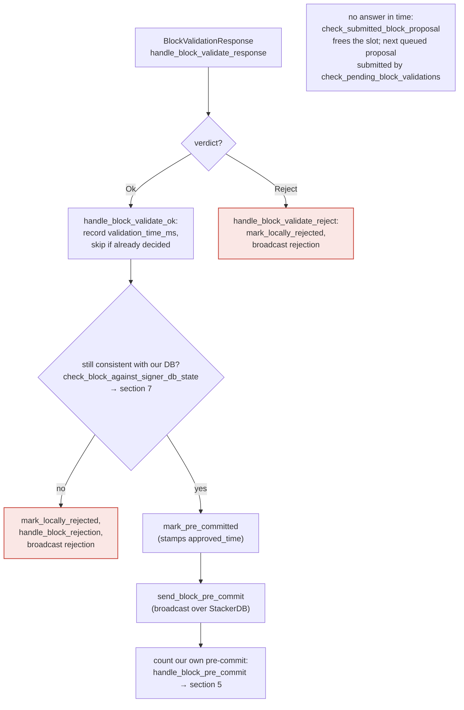

## Finding

### Title
Incomplete `check_block_against_signer_db_state` recheck lets signers pre-commit/sign a block from a miner already locally marked invalid — ([File: stacks-signer/src/v0/signer.rs])

### Summary
`check_block_against_signer_db_state` is explicitly documented as an incomplete check, yet it is the *only* re-validation the signer performs between the node's OK verdict and the pre-commit-threshold signature. It omits the miner/pubkey/reorg checks that the full `check_proposal` performs, so a miner that has been locally invalidated via peer gossip in the interim can still get pre-committed to and signed.

### Finding Description
`check_proposal` (`stacks-signer/src/chainstate/v1.rs` and `v2.rs`) is the full validity gate: it checks the current miner's status (`SortitionMinerStatus`/`MinerState::ActiveMiner`), the miner pubkey hash, the bitvec, tenure-change legitimacy (`ReorgNotAllowed`), etc. It only runs once, on the initial proposal, before the block is submitted to the node for execution validation: [1](#0-0) 

After that, two later re-checks precede the actual state transitions that matter — `mark_pre_committed` (after node validation OK) and `mark_locally_accepted` (at the pre-commit weight threshold) — and both call the same, narrower function: [2](#0-1) 

That function's own doc comment states the limitation plainly: [3](#0-2) 

Its logic only checks tenure-change parent confirmation or "is this the latest block in tenure" — it never re-checks `SortitionMinerStatus`/`MinerState`, the miner pubkey hash, or the bitvec: [4](#0-3) 

It is invoked at both critical downstream points:
- After node validation succeeds, right before `mark_pre_committed`: [5](#0-4) 
- At the pre-commit weight threshold, right before signing: [6](#0-5) 

Meanwhile, a *separate*, gossip-driven path can locally invalidate the current miner asynchronously: once >30%-weight of signers reject a proposal from that miner as an invalid reorg (`RejectReason::ReorgNotAllowed`), `handle_block_rejection` flips `sortition_state.cur_sortition.miner_status` to `InvalidatedBeforeFirstBlock`: [7](#0-6) 

Because `check_block_against_signer_db_state` never consults `sortition_state`/miner status at all, this invalidation has no effect on any *other* block from the same miner/tenure that is already mid-flight through validation or pre-commit. Only a fresh `handle_block_proposal` re-runs the full `check_proposal` (see the "FRESH" path in the proposal-arrival flow); a block already stored and awaiting node validation or pre-commit accumulation skips straight to the incomplete recheck. [8](#0-7) 

### Impact Explanation
This breaks the "signer signs only from a miner it considers valid" invariant. Concretely: a miner proposes block A (an improper reorg attempt) and block B (a separate, otherwise-plausible block in the same tenure, submitted for node validation before A's rejection tally completes). Gossip from other signers pushes A's rejection weight over the ReorgNotAllowed threshold, marking the miner invalid in this signer's own `SortitionsView`/`GlobalStateView`. When the node's validation response for B arrives, or when B's pre-commit weight crosses 70%, the signer only runs `check_block_against_signer_db_state`, which has no notion of miner validity — so it pre-commits to and ultimately signs B, contributing its signature toward a block produced by a miner this same signer instance has already locally flagged as behaving improperly. This is a Critical-class outcome: a signer contributing a signature to a non-canonical/attacker-favorable block despite already possessing evidence (via legitimate peer gossip, no majority key/control needed) that the miner is invalid.

### Likelihood Explanation
Reachable by a single miner (which controls block timing/ordering within its own tenure) plus ordinary signer-to-signer gossip that is part of normal protocol operation — no majority of signers, no key compromise, and no auth-token access is required. The race window (node validation round-trip, plus the pre-commit gossip round) is exactly the gap `check_block_against_signer_db_state`'s doc comment acknowledges but that the call sites do not compensate for.

### Recommendation
Extend `check_block_against_signer_db_state` (or add an additional cheap check alongside it) to re-verify `sortition_state.cur_sortition`/`GlobalStateView`'s current miner status (and ideally pubkey hash) for the block's consensus hash before `mark_pre_committed` and before `mark_locally_accepted`, mirroring the `InvalidMiner`/`ReorgNotAllowed` checks performed in `check_proposal`. Alternatively, route both call sites through a full `check_proposal` re-evaluation rather than the documented "incomplete" tenure-only recheck.

### Proof of Concept
1. Miner M proposes block A for tenure T, structured as an improper reorg (fails `check_parent_tenure_choice`).
2. Miner M also proposes block B, a later, otherwise-valid block for the same tenure T, and the signer under test submits B to its node for validation before A's rejection tally resolves.
3. Other signers broadcast rejections of A with `RejectReason::ReorgNotAllowed`; once weight exceeds 30%, `handle_block_rejection` sets `cur_sortition.miner_status = InvalidatedBeforeFirstBlock` on the signer under test (`stacks-signer/src/v0/signer.rs:2354-2368`).
4. The node's validation for B returns OK; `handle_block_validate_ok` calls `check_block_against_signer_db_state`, which only checks `SortitionData::check_latest_block_in_tenure` — passes despite the now-invalid miner status — and the block is `mark_pre_committed`.
5. Once B's pre-commit weight crosses threshold, `check_block_against_signer_db_state` is called again at `signer.rs:1345`, again omitting miner-status re-verification, and the signer proceeds to `mark_locally_accepted`/sign.

### Citations

**File:** stacks-signer/src/v0/signer.rs (L875-939)
```rust
    fn check_block_against_local_state(
        &mut self,
        stacks_client: &StacksClient,
        sortition_state: &mut Option<SortitionsView>,
        block: &NakamotoBlock,
    ) -> Option<BlockRejection> {
        let signer_signature_hash = block.header.signer_signature_hash();
        let block_id = block.block_id();
        // Get sortition view if we don't have it
        if sortition_state.is_none() {
            *sortition_state =
                SortitionsView::fetch_view(self.proposal_config.clone(), stacks_client)
                    .inspect_err(|e| {
                        warn!(
                            "{self}: Failed to update sortition view: {e:?}";
                            "signer_signature_hash" => %signer_signature_hash,
                            "block_id" => %block_id,
                        )
                    })
                    .ok();
        }

        // Check if proposal can be rejected now if not valid against sortition view
        if let Some(sortition_state) = sortition_state {
            match sortition_state.check_proposal(
                stacks_client,
                &mut self.signer_db,
                block,
                true,
                self.global_state_evaluator
                    .get_global_tx_replay_set()
                    .unwrap_or_default(),
            ) {
                // Error validating block
                Err(RejectReason::ConnectivityIssues(e)) => {
                    warn!(
                        "{self}: Error checking block proposal: {e}";
                        "signer_signature_hash" => %signer_signature_hash,
                        "block_id" => %block_id,
                    );
                    Some(self.create_block_rejection(RejectReason::ConnectivityIssues(e), block))
                }
                // Block proposal is bad
                Err(reject_code) => {
                    warn!(
                        "{self}: Block proposal invalid";
                        "signer_signature_hash" => %signer_signature_hash,
                        "block_id" => %block_id,
                        "reject_reason" => %reject_code,
                        "reject_code" => ?reject_code,
                    );
                    Some(self.create_block_rejection(reject_code, block))
                }
                // Block proposal passed check, still don't know if valid
                Ok(_) => None,
            }
        } else {
            warn!(
                "{self}: Cannot validate block, no sortition view";
                "signer_signature_hash" => %signer_signature_hash,
                "block_id" => %block_id,
            );
            Some(self.create_block_rejection(RejectReason::NoSortitionView, block))
        }
    }
```

**File:** stacks-signer/src/v0/signer.rs (L1345-1366)
```rust
        if let Some(block_rejection) =
            self.check_block_against_signer_db_state(stacks_client, &block_info.block)
        {
            warn!(
                "{self}: Reached the pre-commit threshold for a block, but it no longer passes the chainstate checks. Rejecting.";
                "signer_signature_hash" => %block_hash,
                "block_height" => block_info.block.header.chain_length,
                "reject_code" => %block_rejection.reason_code,
                "reject_reason" => &block_rejection.reason,
            );
            if let Err(e) = block_info.mark_locally_rejected() {
                if !block_info.has_reached_consensus() {
                    warn!("{self}: Failed to mark block as locally rejected: {e:?}");
                }
            };
            self.signer_db
                .insert_block(&block_info)
                .unwrap_or_else(|e| self.handle_insert_block_error(e));
            self.handle_block_rejection(&block_rejection, sortition_state);
            self.send_block_response(&block_info.block, block_rejection.into());
            return;
        }
```

**File:** stacks-signer/src/v0/signer.rs (L1799-1826)
```rust
    /// WARNING: This is an incomplete check. Do NOT call this function PRIOR to check_proposal or block_proposal validation succeeds.
    ///
    /// Re-verify a block's chain length against the last signed block within signerdb.
    /// This is required in case a block has been approved since the initial checks of the block validation endpoint.
    fn check_block_against_signer_db_state(
        &mut self,
        stacks_client: &StacksClient,
        proposed_block: &NakamotoBlock,
    ) -> Option<BlockRejection> {
        let signer_signature_hash = proposed_block.header.signer_signature_hash();
        // If this is a tenure change block, ensure that it confirms the correct number of blocks from the parent tenure.
        if let Some(tenure_change) = proposed_block.get_tenure_change_tx_payload() {
            // Ensure that the tenure change block confirms the expected parent block
            match SortitionData::check_tenure_change_confirms_parent(
                tenure_change,
                proposed_block,
                &mut self.signer_db,
                stacks_client,
                self.proposal_config.tenure_last_block_proposal_timeout,
                self.proposal_config.reorg_attempts_activity_timeout,
            ) {
                Ok(true) => return None,
                Ok(false) => {
                    return Some(self.create_block_rejection(
                        RejectReason::SortitionViewMismatch,
                        proposed_block,
                    ))
                }
```

**File:** stacks-signer/src/v0/signer.rs (L1841-1880)
```rust

        // Ensure that the block is the last block in the chain of its current tenure.
        match SortitionData::check_latest_block_in_tenure(
            &proposed_block.header.consensus_hash,
            proposed_block,
            &mut self.signer_db,
            stacks_client,
            self.proposal_config.tenure_last_block_proposal_timeout,
            self.proposal_config.reorg_attempts_activity_timeout,
        ) {
            Ok(is_latest) => {
                if !is_latest {
                    warn!(
                        "Miner's block proposal does not confirm as many blocks as we expect";
                        "proposed_block_consensus_hash" => %proposed_block.header.consensus_hash,
                        "proposed_block_signer_signature_hash" => %signer_signature_hash,
                        "proposed_chain_length" => proposed_block.header.chain_length,
                    );
                    Some(self.create_block_rejection(
                        RejectReason::SortitionViewMismatch,
                        proposed_block,
                    ))
                } else {
                    None
                }
            }
            Err(e) => {
                warn!("{self}: Failed to check block against signer db: {e}";
                    "signer_signature_hash" => %signer_signature_hash,
                    "block_id" => %proposed_block.block_id()
                );
                Some(self.create_block_rejection(
                    RejectReason::ConnectivityIssues(
                        "failed to check block against signer db".to_string(),
                    ),
                    proposed_block,
                ))
            }
        }
    }
```

**File:** stacks-signer/src/v0/signer.rs (L1946-1975)
```rust
        if let Some(block_rejection) =
            self.check_block_against_signer_db_state(stacks_client, &block_info.block)
        {
            // The signer db state has changed. We no longer view this block as valid. Override the validation response.
            if let Err(e) = block_info.mark_locally_rejected() {
                if !block_info.has_reached_consensus() {
                    warn!("{self}: Failed to mark block as locally rejected: {e:?}");
                }
            };
            self.signer_db
                .insert_block(&block_info)
                .unwrap_or_else(|e| self.handle_insert_block_error(e));
            self.handle_block_rejection(&block_rejection, sortition_state);
            self.send_block_response(&block_info.block, block_rejection.into());
        } else {
            if let Err(e) = block_info.mark_pre_committed() {
                // The block may have reached enough signatures before we validated the block so should fail to mark pre-committed
                // but still call to make sure the timestamps and validity are updated correctly.
                if !block_info.has_reached_consensus()
                    && block_info.state != BlockState::LocallyAccepted
                {
                    warn!("{self}: Failed to mark block as approved: {e:?}",);
                    return;
                }
            }

            self.signer_db
                .insert_block(&block_info)
                .unwrap_or_else(|e| self.handle_insert_block_error(e));
            self.send_block_pre_commit(signer_signature_hash.clone());
```

**File:** stacks-signer/src/v0/signer.rs (L2342-2368)
```rust
        // NOTE: This is only used by active signer protocol versions < Global state activation
        // If 30% of the signers have rejected the block due to an invalid
        // reorg, mark the miner as invalid.
        // If we cannot determine the active signer protocol version it means we are
        // running a global state machine version that couldn't reach consensus, so we can skip this check
        if self
            .determine_active_signer_protocol_version()
            .map(|version| version.uses_global_state())
            .unwrap_or(true)
        {
            return;
        };
        let total_reorg_reject_weight = self.compute_reject_code_signing_weight(
            rejection_addrs.iter(),
            RejectReasonPrefix::ReorgNotAllowed,
        );
        if total_reorg_reject_weight.saturating_add(min_weight) > total_weight {
            // Mark the miner as invalid
            if let Some(sortition_state) = sortition_state {
                let ch = block_info.block.header.consensus_hash.clone();
                if sortition_state.cur_sortition.data.consensus_hash == ch {
                    info!("{self}: Marking miner as invalid for attempted reorg");
                    sortition_state.cur_sortition.miner_status =
                        SortitionMinerStatus::InvalidatedBeforeFirstBlock;
                }
            }
        }
```

**File:** docs/signer-flows.md (L205-227)
```markdown
## 4. The node's validation verdict

The stacks-node answers the `/v3/block_proposal` submission. On OK, the signer
re-checks its own DB state and only then advertises willingness to sign by
broadcasting a **pre-commit**. A signature is _not_ produced here.



> Anchors: `handle_block_validate_response`, `handle_block_validate_ok`,
> `handle_block_validate_reject`, `check_block_against_signer_db_state`,
> `send_block_pre_commit` (signer.rs)
```
