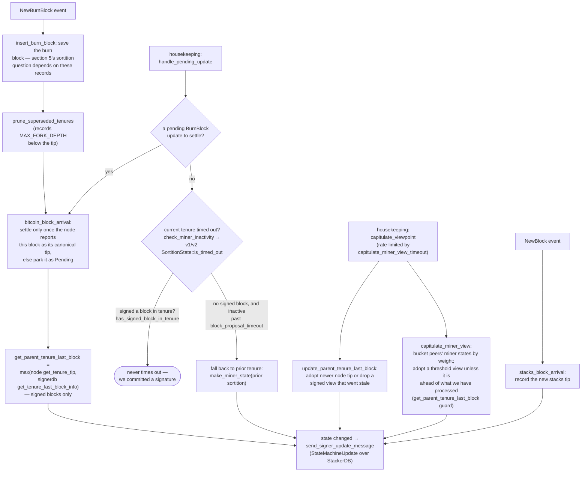

### Title
Stale miner-identity authorization on the validate-ok / pre-commit signing paths — ([File: stacks-signer/src/v0/signer.rs])

### Summary
The signer's full authorization check for a proposed block — miner pubkey-hash match, consensus-hash match to the active miner, pox bitvec, tenure-extend cause, and duplicate-block-in-tenure — is only dispatched once, at proposal arrival, via `check_block_against_state` → `check_block_against_global_state`/`check_block_against_local_state` → `GlobalStateView::check_proposal` / `SortitionsView::check_proposal`. The two later paths that actually gate the signer's votes — `handle_block_validate_ok` (after node validation) and the pre-commit-threshold path in `handle_block_pre_commit` — instead call the narrower `check_block_against_signer_db_state`, which only re-verifies tenure-tip confirmation (`check_tenure_change_confirms_parent` / `check_latest_block_in_tenure`). This is explicitly documented as an intentional asymmetry in `docs/signer-flows.md:425-437`, but the miner-identity fields it *doesn't* re-check are exactly the fields that can change out from under a long-pending proposal.

### Finding Description
`check_block_against_state` (`stacks-signer/src/v0/signer.rs:811-870`) is the only call site that invokes the full `check_proposal` logic, which for v2 (`GlobalStateView::check_proposal`, `stacks-signer/src/chainstate/v2.rs:113-198`) checks:
- the block's `consensus_hash` matches the state machine's `current_miner.tenure_id` (else `ConsensusHashMismatch`/`InvalidMiner`),
- the recovered miner pubkey hash matches `current_miner_pkh` (else `PubkeyHashMismatch`),
- the pox bitvec is all-1s (else `InvalidBitvec`),
- tenure-change/tenure-extend payload validity.

This full check runs exactly once, at `handle_block_proposal` time (`stacks-signer/src/v0/signer.rs:1670-1727`).

After that, the block is submitted to the node for async validation. When the `Ok` verdict returns, and again when pre-commit weight crosses the 70% threshold, the signer re-runs only `check_block_against_signer_db_state` (`stacks-signer/src/v0/signer.rs:1803-1880`, invoked from the pre-commit path at `stacks-signer/src/v0/signer.rs:1345-1366`). That function only re-derives `check_tenure_change_confirms_parent` / `check_latest_block_in_tenure` — it never re-checks `current_miner_pkh`, `tenure_id` vs. the (possibly now-updated) `MinerState::ActiveMiner`, or the bitvec.

Between the initial proposal check and the pre-commit threshold being reached, the signer's `local_state_machine`/`global_state_evaluator` view of "who the current miner is" (`current_miner: MinerState::ActiveMiner`) can change — it is updated independently by burn-block arrival and gossiped `StateMachineUpdate`s (docs/signer-flows.md section 8, "Burn blocks & the miner-view state machine"). Node validation itself is asynchronous and can take arbitrarily long (this is exactly the race the `signer_waits_for_validation_before_signing` test exercises, `stacks-node/src/tests/signer/v0/signers_wait_for_validation.rs:33-56`). If, during that window, the active-miner view rotates away from the miner that produced the pending proposal (e.g., a new burn block/sortition changes `current_miner`), the previously "authorized" proposal is now for a miner the signer's own state machine no longer recognizes as canonical — yet nothing in `check_block_against_signer_db_state` catches this, so the block can still cross the pre-commit threshold and be signed by `handle_block_pre_commit`'s SIGN branch.

This mirrors the GHSA-jfj5-wrj9-63x4 bug class precisely: one code path (proposal-time `check_proposal`) enforces the full authorization set (miner-identity fields), while the paths that gate the actual privileged action (signing) use an incomplete check that omits those same fields, silently treating a previously-good but now-stale authorization as still valid.

### Impact Explanation
This is a Critical-class break: it lets the signer produce a valid signature over a block whose miner is no longer the miner its own state machine currently endorses (i.e. potentially a non-canonical/invalid block relative to the signer's up-to-date view), because the equality "the block's consensus_hash/miner-pubkey matches the *currently active* miner" is checked once and never re-verified before the signature is emitted.

### Likelihood Explanation
Reachable by a single miner/proposer plus ordinary gossip (state-machine updates, burn-block arrival) with no majority-signer collusion needed: the miner only needs to keep a proposal's async node-validation pending (naturally, or by being slow) long enough for a normal tenure/miner rotation event to update the signer's `current_miner` view before pre-commit threshold is reached. The signer-flows documentation itself flags the analogous `DuplicateBlockFound` gap as relying on a separate guard (section 5's own-tenure conflict check) to "cover the same ground" — but no equivalent fallback is documented or evident for the miner-pubkey/consensus-hash/bitvec fields, so this specific gap has no such compensating control on the signing path.

### Recommendation
Re-run (or an equivalent lightweight re-check of) the miner-identity portion of `check_proposal` — consensus-hash-vs-current-miner and pubkey-hash-vs-current-miner-pkh — inside `check_block_against_signer_db_state`, so both `handle_block_validate_ok` and the pre-commit/signing path in `handle_block_pre_commit` reject a block whose authorizing miner state has since changed, matching the guarantee already provided at proposal time.

### Proof of Concept
1. Miner M proposes tenure-start block B (`consensus_hash` = M's tenure, pubkey = M). `check_block_against_state` passes; B is submitted to the node for validation (`submit_block_for_validation`, `stacks-signer/src/v0/signer.rs:1696`).
2. Before the node's async validation returns, a new burn block / sortition arrives and the signer's state-machine (`GlobalStateView`/`local_state_machine`) updates `current_miner` to a different miner M' (section 8 of docs/signer-flows.md), or a gossiped `StateMachineUpdate` from peers rotates the adopted global view.
3. Node validation returns `Ok` for B; `handle_block_validate_ok` calls `check_block_against_signer_db_state`, which only checks `check_latest_block_in_tenure`/`check_tenure_change_confirms_parent` — passes, since B still legitimately confirms its parent tenure tip.
4. Peers (still on the older view, or via the "outdated peer" pre-commit fallback, docs/signer-flows.md:361-362) push pre-commit weight over 70% for B.
5. `handle_block_pre_commit`'s threshold branch (`stacks-signer/src/v0/signer.rs:1340-1366`) re-runs only `check_block_against_signer_db_state` — again omitting the miner-identity check — and proceeds to `SIGN`, producing a signature over B even though the signer's own current state machine no longer recognizes M as the active/canonical miner for that height. [1](#0-0) [2](#0-1) [3](#0-2) [4](#0-3) [5](#0-4) [6](#0-5)

### Citations

**File:** docs/signer-flows.md (L425-437)
```markdown
Two things belong to the proposal path only and are **not** re-run at validate-ok
or at signing:

- `validate_tenure_change_payload` rejects with `DuplicateBlockFound` when we
  have already accepted a block in the tenure a tenure-change block is starting.
  v2 counts locally or globally accepted blocks (`get_last_signed_block`); v1
  counts only globally accepted ones (`get_last_globally_accepted_block`).
- the v2 `check_proposal` wrapper checks miner pubkey hash, consensus hash, the
  pox bitvec, and tenure-extend rules before delegating here.

Because the duplicate check never runs again, a block that crosses the pre-commit
threshold long after it was proposed relies on section 5's own-tenure conflict
guard to cover the same ground.
```

**File:** docs/signer-flows.md (L450-476)
```markdown
## 8. Burn blocks & the miner-view state machine

Independent of any single block, the signer maintains a view of _who the current
miner is and what they should build on_, and broadcasts it as a
`StateMachineUpdate`. The whole miner state, including
`parent_tenure_last_block`, is the equality key for global agreement, so what
this flow computes is consensus-visible.


```

**File:** stacks-signer/src/v0/signer.rs (L811-870)
```rust
    fn check_block_against_state(
        &mut self,
        stacks_client: &StacksClient,
        sortition_state: &mut Option<SortitionsView>,
        block_info: &BlockInfo,
    ) -> Option<BlockRejection> {
        // First update our global state evaluator with our local state if we have one
        let local_version = self.get_signer_protocol_version();
        if let Ok(update) = self
            .local_state_machine
            .try_into_update_message_with_version(local_version)
        {
            self.global_state_evaluator
                .insert_update(self.stacks_address.clone(), update);
        };
        let Some(state_version) = self.determine_active_signer_protocol_version() else {
            warn!(
                "{self}: No consensus on signer protocol version. Unable to validate block. Rejecting.";
                "signer_signature_hash" => %block_info.block.header.signer_signature_hash(),
                "block_id" => %block_info.block.block_id(),
            );
            return Some(
                self.create_block_rejection(RejectReason::NoSignerConsensus, &block_info.block),
            );
        };

        // reject if the block itself is malformed
        if !block_info.check_static_valid_block() {
            debug!("{self}: Block is syntatically invalid; will not process");
            return Some(self.create_block_rejection(
                RejectReason::ValidationFailed(ValidateRejectCode::InvalidBlock),
                &block_info.block,
            ));
        }

        // For this first version, reject any block that marks transactions as
        // problematic. The criteria for what may legitimately appear in
        // `problematic_txs` has not been decided yet, so signers reject all
        // such blocks until that policy is established.
        if !block_info.block.header.problematic_txs.is_empty() {
            warn!(
                "{self}: Block proposal marks transactions as problematic, which signers do not yet allow; rejecting";
                "signer_signature_hash" => %block_info.block.header.signer_signature_hash(),
                "block_id" => %block_info.block.block_id(),
                "problematic_tx_count" => block_info.block.header.problematic_txs.len(),
            );
            return Some(
                self.create_block_rejection(
                    RejectReason::ProblematicTransactions,
                    &block_info.block,
                ),
            );
        }

        if state_version.uses_global_state() {
            self.check_block_against_global_state(stacks_client, &block_info.block)
        } else {
            self.check_block_against_local_state(stacks_client, sortition_state, &block_info.block)
        }
    }
```

**File:** stacks-signer/src/v0/signer.rs (L1332-1374)
```rust

        if min_weight > commit_weight {
            debug!(
                "{self}: Not enough pre-committed to block {block_hash} (have {commit_weight}, need at least {min_weight}/{total_weight})"
            );
            return;
        }

        // The chain and signer db state may have changed materially since this block passed the
        // proposal-time checks (e.g. between validation and reaching the pre-commit threshold we
        // may have signed a block that this one would reorg). Re-run the chainstate checks
        // before putting a signature over the block, and respond with a rejection if they no
        // longer pass, just as the block validation response handler does.
        if let Some(block_rejection) =
            self.check_block_against_signer_db_state(stacks_client, &block_info.block)
        {
            warn!(
                "{self}: Reached the pre-commit threshold for a block, but it no longer passes the chainstate checks. Rejecting.";
                "signer_signature_hash" => %block_hash,
                "block_height" => block_info.block.header.chain_length,
                "reject_code" => %block_rejection.reason_code,
                "reject_reason" => &block_rejection.reason,
            );
            if let Err(e) = block_info.mark_locally_rejected() {
                if !block_info.has_reached_consensus() {
                    warn!("{self}: Failed to mark block as locally rejected: {e:?}");
                }
            };
            self.signer_db
                .insert_block(&block_info)
                .unwrap_or_else(|e| self.handle_insert_block_error(e));
            self.handle_block_rejection(&block_rejection, sortition_state);
            self.send_block_response(&block_info.block, block_rejection.into());
            return;
        }

        // A pre-commit may be superseded by a competing proposal at the same height (e.g. a
        // re-proposed tenure-start block after the first failed to reach consensus), but a
        // signature must not be superseded while it's still "fresh". A signed block at the
        // same or higher height in ANY tenure is a conflict: two blocks at the same height are
        // siblings no matter which tenure they belong to (e.g. the next tenure's tenure-start
        // block conflicts with the current tenure's block at the same height). Blocks in
        // tenures whose reorg we sanctioned under the reorg-timing rules are excluded, but
```

**File:** stacks-signer/src/v0/signer.rs (L1782-1880)
```rust
    /// Handle block response messages from a signer
    fn handle_block_response(
        &mut self,
        stacks_client: &StacksClient,
        block_response: &BlockResponse,
        sortition_state: &mut Option<SortitionsView>,
    ) {
        match block_response {
            BlockResponse::Accepted(accepted) => {
                self.handle_block_signature(stacks_client, sortition_state, accepted);
            }
            BlockResponse::Rejected(block_rejection) => {
                self.handle_block_rejection(block_rejection, sortition_state);
            }
        };
    }

    /// WARNING: This is an incomplete check. Do NOT call this function PRIOR to check_proposal or block_proposal validation succeeds.
    ///
    /// Re-verify a block's chain length against the last signed block within signerdb.
    /// This is required in case a block has been approved since the initial checks of the block validation endpoint.
    fn check_block_against_signer_db_state(
        &mut self,
        stacks_client: &StacksClient,
        proposed_block: &NakamotoBlock,
    ) -> Option<BlockRejection> {
        let signer_signature_hash = proposed_block.header.signer_signature_hash();
        // If this is a tenure change block, ensure that it confirms the correct number of blocks from the parent tenure.
        if let Some(tenure_change) = proposed_block.get_tenure_change_tx_payload() {
            // Ensure that the tenure change block confirms the expected parent block
            match SortitionData::check_tenure_change_confirms_parent(
                tenure_change,
                proposed_block,
                &mut self.signer_db,
                stacks_client,
                self.proposal_config.tenure_last_block_proposal_timeout,
                self.proposal_config.reorg_attempts_activity_timeout,
            ) {
                Ok(true) => return None,
                Ok(false) => {
                    return Some(self.create_block_rejection(
                        RejectReason::SortitionViewMismatch,
                        proposed_block,
                    ))
                }
                Err(e) => {
                    warn!("{self}: Error checking block proposal: {e}";
                        "signer_signature_hash" => %signer_signature_hash,
                        "block_id" => %proposed_block.block_id()
                    );
                    return Some(self.create_block_rejection(
                        RejectReason::ConnectivityIssues(
                            "error checking block proposal".to_string(),
                        ),
                        proposed_block,
                    ));
                }
            }
        }

        // Ensure that the block is the last block in the chain of its current tenure.
        match SortitionData::check_latest_block_in_tenure(
            &proposed_block.header.consensus_hash,
            proposed_block,
            &mut self.signer_db,
            stacks_client,
            self.proposal_config.tenure_last_block_proposal_timeout,
            self.proposal_config.reorg_attempts_activity_timeout,
        ) {
            Ok(is_latest) => {
                if !is_latest {
                    warn!(
                        "Miner's block proposal does not confirm as many blocks as we expect";
                        "proposed_block_consensus_hash" => %proposed_block.header.consensus_hash,
                        "proposed_block_signer_signature_hash" => %signer_signature_hash,
                        "proposed_chain_length" => proposed_block.header.chain_length,
                    );
                    Some(self.create_block_rejection(
                        RejectReason::SortitionViewMismatch,
                        proposed_block,
                    ))
                } else {
                    None
                }
            }
            Err(e) => {
                warn!("{self}: Failed to check block against signer db: {e}";
                    "signer_signature_hash" => %signer_signature_hash,
                    "block_id" => %proposed_block.block_id()
                );
                Some(self.create_block_rejection(
                    RejectReason::ConnectivityIssues(
                        "failed to check block against signer db".to_string(),
                    ),
                    proposed_block,
                ))
            }
        }
    }
```

**File:** stacks-signer/src/chainstate/v2.rs (L113-163)
```rust
    pub fn check_proposal(
        &self,
        client: &StacksClient,
        signer_db: &mut SignerDb,
        block: &NakamotoBlock,
    ) -> Result<(), RejectReason> {
        let MinerState::ActiveMiner {
            current_miner_pkh,
            tenure_id,
            parent_tenure_id,
            ..
        } = &self.signer_state.current_miner
        else {
            info!(
                "No valid current miner. Considering invalid.";
                "block_height" => block.header.chain_length,
                "signer_signature_hash" => %block.header.signer_signature_hash()
            );
            return Err(RejectReason::InvalidMiner);
        };
        if &block.header.consensus_hash != tenure_id {
            info!("Miner block proposal consensus hash does not match the current miner's tenure id. Considering invalid.";
                "block_height" => block.header.chain_length,
                "signer_signature_hash" => %block.header.signer_signature_hash(),
                "block_consensus_hash" => %block.header.consensus_hash,
                "active_miner_tenure_id" => %tenure_id,
                "active_miner_parent_tenure_id" => %parent_tenure_id,
            );
            return Err(RejectReason::ConsensusHashMismatch {
                actual: block.header.consensus_hash.clone(),
                expected: tenure_id.clone(),
            });
        }
        let Some(miner_pk) = block.header.recover_miner_pk() else {
            warn!("Failed to recover miner pubkey";
                  "signer_signature_hash" => %block.header.signer_signature_hash(),
                  "consensus_hash" => %block.header.consensus_hash);
            return Err(RejectReason::IrrecoverablePubkeyHash);
        };
        let miner_pkh = Hash160::from_data(&miner_pk.to_bytes_compressed());
        if current_miner_pkh != &miner_pkh {
            warn!(
                "Miner block proposal pubkey does not match the winning pubkey hash for its sortition. Considering invalid.";
                "proposed_block_consensus_hash" => %block.header.consensus_hash,
                "signer_signature_hash" => %block.header.signer_signature_hash(),
                "proposed_block_pubkey" => &miner_pk.to_hex(),
                "proposed_block_pubkey_hash" => %miner_pkh,
                "active_miner_pubkey_hash" => %current_miner_pkh,
            );
            return Err(RejectReason::PubkeyHashMismatch);
        }
```
