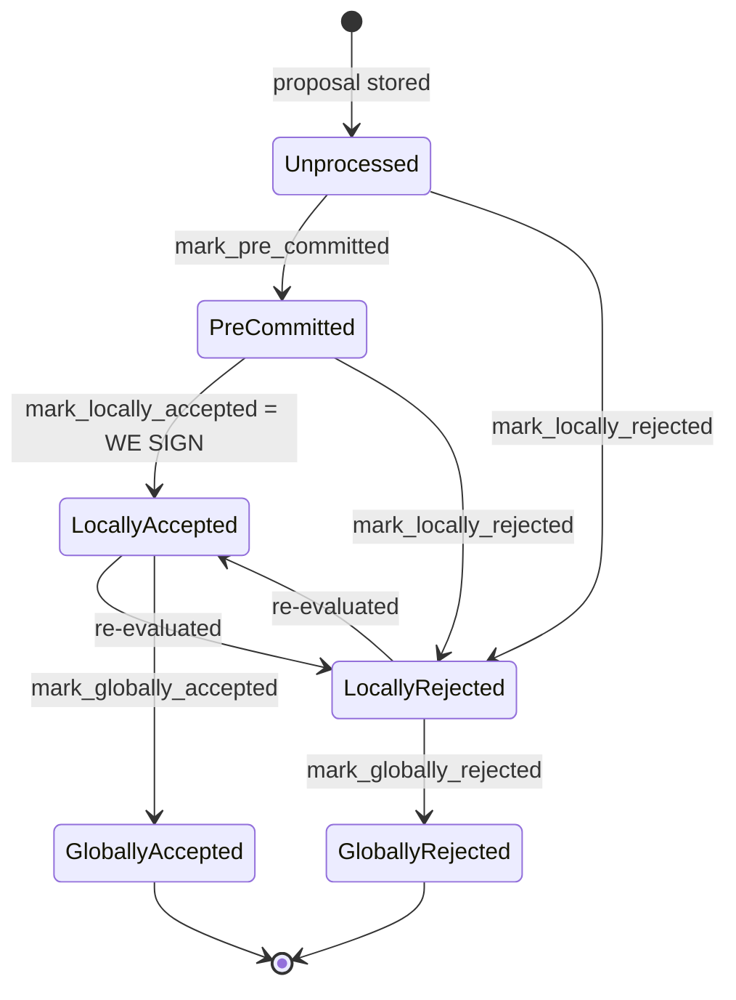

### Title
`BlockInfo::mark_pre_committed()` mutates validity state before checking transition success, letting a signer resurrect and re-sign a `GloballyRejected` block - (File: stacks-signer/src/signerdb.rs)

### Summary
`BlockInfo::mark_pre_committed()` sets `self.valid = Some(true)` and stamps `approved_time` *before* attempting the actual state transition via `move_to()`, and its only caller, `handle_block_validate_ok`, deliberately swallows the transition error and persists the block anyway whenever the block has already "reached consensus." This mirrors the reported class of bug (effects applied before/regardless of the operation's success), and here it lets a signer overwrite the `valid` flag of a block that is already in the terminal `GloballyRejected` state, then broadcast a pre-commit and potentially a signature for it.

### Finding Description
`mark_pre_committed` is:
```
pub fn mark_pre_committed(&mut self) -> Result<(), String> {
    self.valid = Some(true);
    self.approved_time.get_or_insert(get_epoch_time_secs());
    self.move_to(BlockState::PreCommitted)
}
``` [1](#0-0) 

`self.valid` and `self.approved_time` are written unconditionally, then `move_to` is checked. `move_to`/`check_state` only allow `PreCommitted` to be reached from `Unprocessed`, and treats `GloballyAccepted`/`GloballyRejected` as terminal with respect to each other [2](#0-1) , matching the documented terminal-state guarantee ("Global states are terminal against each other") [3](#0-2) .

The sole production call site, `handle_block_validate_ok`, is reached whenever a delayed `BlockValidateOk` arrives for a block this signer has not yet locally decided (`block_info.valid.is_some()` is `None`) [4](#0-3) . Crucially, `valid` can still be `None` even after the block has reached `GloballyRejected`, because `store_and_process_block_rejection` (triggered by *other* signers' rejections crossing the 30% blocking threshold) marks the block `GloballyRejected` without touching this signer's own `valid` field at all [5](#0-4) .

When the signer's own delayed validation then comes back `Ok` and `check_block_against_signer_db_state` still returns `None` (no re-detected conflict), the code calls `mark_pre_committed()`:
```
if let Err(e) = block_info.mark_pre_committed() {
    if !block_info.has_reached_consensus()
        && block_info.state != BlockState::LocallyAccepted
    {
        warn!(...); return;
    }
}
self.signer_db.insert_block(&block_info)...;
self.send_block_pre_commit(signer_signature_hash.clone());
self.handle_block_pre_commit(stacks_client, sortition_state, &address, signer_signature_hash);
``` [6](#0-5) 

If `block_info.state` is already `GloballyRejected`, `move_to` fails, but `has_reached_consensus()` is `true`, so the early-return guard is skipped by design ("but still call to make sure the timestamps and validity are updated correctly"). The corrupted `valid = Some(true)` is then persisted via `insert_block`, and the signer broadcasts a `BlockPreCommit` and immediately re-processes its own pre-commit through `handle_block_pre_commit`, whose only validity gate is `if !block_info.valid.unwrap_or(false) { return; }` [7](#0-6)  — now satisfied. From there the pre-commit tally, and ultimately `store_and_process_block_signature` / `mark_locally_accepted`, can proceed for a block the signer set already terminally rejected.

### Impact Explanation
This breaks the documented invariant that `GloballyRejected` is terminal [8](#0-7) : a rejection can be recounted as movement toward acceptance for at least one signer, who re-broadcasts a pre-commit/acceptance for an already-rejected block. This matches the Critical impact category "a rejection recounted as an accept."

### Likelihood Explanation
Requires no majority-signer collusion, only ordinary asynchrony: one signer's own `/v3/block_proposal` validation response must arrive *after* peers have already pushed the block to `GloballyRejected` via their own rejections, and `check_block_against_signer_db_state` must not independently re-detect the same problem. This is a plausible one-slot-miner-plus-gossip timing race (slow node validation, network delay), not a majority-controlled attack. I was not able to fully verify, within the available exploration, whether `check_block_against_signer_db_state`'s chainstate re-check would in all realistic scenarios also catch and reject at this point — this depends on runtime chain state not visible from static analysis, so likelihood should be treated as plausible but not proven end-to-end without live/integration testing.

### Recommendation
In `mark_pre_committed` (and similarly check other `mark_*` methods), do not mutate `self.valid`/`self.approved_time` until after `move_to` succeeds — follow Checks-Effects-Interactions: check the transition first, then apply metadata effects only on success. In `handle_block_validate_ok`, treat a `mark_pre_committed` failure caused by `has_reached_consensus()` as terminal (no insert/broadcast), rather than as a special case that still persists and re-propagates a validity flag.

### Proof of Concept
1. Signer S receives a block proposal but has not yet gotten its own `/v3/block_proposal` result (slow/queued validation), so `block_info.valid == None`.
2. A supermajority of other signers reject the block over StackerDB; S accumulates their rejections via `handle_block_rejection` → `store_and_process_block_rejection`, crossing the 30% blocking threshold and calling `mark_globally_rejected()` — `block_info.state = GloballyRejected`, `valid` untouched (still `None`) [9](#0-8) .
3. S's stacks-node now returns the delayed `BlockValidateOk` for the same block; `handle_block_validate_ok` passes the `valid.is_some()` early-return (since it's `None`) and reaches the `mark_pre_committed()` call [10](#0-9) .
4. `mark_pre_committed` sets `valid = Some(true)` and fails the `move_to(PreCommitted)` transition (current state is `GloballyRejected`), returning `Err`.
5. Because `has_reached_consensus()` is `true`, the guard in `handle_block_validate_ok` does not return; it persists the corrupted `block_info` (with `valid = Some(true)`) and calls `send_block_pre_commit` + `handle_block_pre_commit` for a block already globally rejected [11](#0-10) .
6. `handle_block_pre_commit`'s validity gate now passes (`valid.unwrap_or(false)` is `true`) [7](#0-6) , allowing S to progress toward signing/broadcasting acceptance of a block the signer set had already terminally rejected.

### Citations

**File:** stacks-signer/src/signerdb.rs (L272-277)
```rust
    /// Mark this block as valid, record the approved time timestamp if not already set and attempt to mark it as pre-committed.
    pub fn mark_pre_committed(&mut self) -> Result<(), String> {
        self.valid = Some(true);
        self.approved_time.get_or_insert(get_epoch_time_secs());
        self.move_to(BlockState::PreCommitted)
    }
```

**File:** stacks-signer/src/signerdb.rs (L313-341)
```rust
    /// Check if the block state transition is valid
    fn check_state(&self, state: BlockState) -> bool {
        let prev_state = &self.state;
        if *prev_state == state {
            return true;
        }
        match state {
            BlockState::Unprocessed => false,
            BlockState::LocallyAccepted | BlockState::LocallyRejected => !matches!(
                prev_state,
                BlockState::GloballyRejected | BlockState::GloballyAccepted
            ),
            BlockState::GloballyAccepted => !matches!(prev_state, BlockState::GloballyRejected),
            BlockState::GloballyRejected => !matches!(prev_state, BlockState::GloballyAccepted),
            BlockState::PreCommitted => matches!(prev_state, BlockState::Unprocessed),
        }
    }

    /// Attempt to transition the block state
    pub fn move_to(&mut self, state: BlockState) -> Result<(), String> {
        if !self.check_state(state) {
            return Err(format!(
                "Invalid state transition from {} to {state}",
                self.state
            ));
        }
        self.state = state;
        Ok(())
    }
```

**File:** docs/signer-flows.md (L130-150)
```markdown
## 2. Block lifecycle (`BlockState`)

Every proposal tracked in the signer DB carries a `BlockState`. **`PreCommitted`
carries no signature**: it means "validated, willing to sign if the pre-commit
threshold is met." The first signature appears at `mark_locally_accepted`.
Global states are terminal against each other.


```

**File:** stacks-signer/src/v0/signer.rs (L1323-1331)
```rust
        if !block_info.valid.unwrap_or(false) {
            // We received a pre-commit for a block that we have not validated or we have already marked this block as invalid.
            // We should not do anything further as we do not know what our response should be and we do not change our votes on rejected
            // blocks unless we receive a new block proposal for it and the reject reason allows us to reconsider.
            debug!(
                "{self}: Received a pre-commit for a block that we have not determined to be valid: {:?}. Doing nothing...", block_info.valid
            );
            return;
        }
```

**File:** stacks-signer/src/v0/signer.rs (L1928-1984)
```rust
        self.signer_db
            .insert_block(&block_info)
            .unwrap_or_else(|e| self.handle_insert_block_error(e));

        if block_info.valid.is_some() {
            // We should only have valid set if we have already processed a validation response for this block OR we locally marked it as rejected
            // and responded to it. If we received a new proposal for it that we wished to consider, we would have reset valid to None.
            // This is only really possible when a signer is sharing a node or we have timed out a pending validation and it suddenly arrives.
            warn!(
                "{self}: Already processed a block validate response for block {}. Ignoring validation response.", block_info.block.header.signer_signature_hash(); "valid" => ?block_info.valid,
            );
            return;
        }
        if !block_info.check_static_valid_block() {
            debug!("{self}: Block is syntatically invalid; will not store");
            return;
        }

        if let Some(block_rejection) =
            self.check_block_against_signer_db_state(stacks_client, &block_info.block)
        {
            // The signer db state has changed. We no longer view this block as valid. Override the validation response.
            if let Err(e) = block_info.mark_locally_rejected() {
                if !block_info.has_reached_consensus() {
                    warn!("{self}: Failed to mark block as locally rejected: {e:?}");
                }
            };
            self.signer_db
                .insert_block(&block_info)
                .unwrap_or_else(|e| self.handle_insert_block_error(e));
            self.handle_block_rejection(&block_rejection, sortition_state);
            self.send_block_response(&block_info.block, block_rejection.into());
        } else {
            if let Err(e) = block_info.mark_pre_committed() {
                // The block may have reached enough signatures before we validated the block so should fail to mark pre-committed
                // but still call to make sure the timestamps and validity are updated correctly.
                if !block_info.has_reached_consensus()
                    && block_info.state != BlockState::LocallyAccepted
                {
                    warn!("{self}: Failed to mark block as approved: {e:?}",);
                    return;
                }
            }

            self.signer_db
                .insert_block(&block_info)
                .unwrap_or_else(|e| self.handle_insert_block_error(e));
            self.send_block_pre_commit(signer_signature_hash.clone());
            // have to save the signature _after_ the block info
            let address = self.stacks_address.clone();
            self.handle_block_pre_commit(
                stacks_client,
                sortition_state,
                &address,
                signer_signature_hash,
            );
        }
```

**File:** stacks-signer/src/v0/signer.rs (L2290-2341)
```rust
        if block_info.has_reached_consensus() {
            // Checking the rejection signatures is pointless. We have already reached consensus on this block.
            return;
        }

        // do we have enough signatures to mark a block a globally rejected?
        // i.e. is (set-size) - (threshold) + 1 reached.
        let rejection_addrs = match self.signer_db.get_block_rejection_signer_addrs(block_hash) {
            Ok(addrs) => addrs,
            Err(e) => {
                warn!("{self}: Failed to load block rejection addresses: {e:?}.",);
                return;
            }
        };
        let signature_weight = self.signer_weights.get(signer_address).unwrap_or(&0);
        let total_reject_weight =
            self.compute_signature_signing_weight(rejection_addrs.iter().map(|(addr, _)| addr));
        let total_weight = self.compute_signature_total_weight();

        let min_weight = NakamotoBlockHeader::compute_voting_weight_threshold(total_weight)
            .unwrap_or_else(|_| {
                panic!("{self}: Failed to compute threshold weight for {total_weight}")
            });
        if total_reject_weight.saturating_add(min_weight) <= total_weight {
            // Not enough rejection signatures to make a decision
            info!("{self}: Have not yet received enough block rejections to reach a consensus decision on this block";
                "signer_signature_hash" => %block_hash,
                "signature_weight" => signature_weight,
                "consensus_hash" => %block_info.block.header.consensus_hash,
                "block_height" => block_info.block.header.chain_length,
                "total_weight_rejected" => total_reject_weight,
                "total_weight" => total_weight,
                "percent_rejected" => (total_reject_weight as f64 / total_weight as f64 * 100.0),
            );
            return;
        }
        info!("{self}: have reached the block rejection threshold";
            "signer_signature_hash" => %block_hash,
            "signature_weight" => signature_weight,
            "consensus_hash" => %block_info.block.header.consensus_hash,
            "block_height" => block_info.block.header.chain_length,
            "total_weight_rejected" => total_reject_weight,
            "total_weight" => total_weight,
            "percent_rejected" => (total_reject_weight as f64 / total_weight as f64 * 100.0),
        );
        if let Err(e) = block_info.mark_globally_rejected() {
            warn!("{self}: Failed to mark block as globally rejected: {e:?}",);
        }
        if let Err(e) = self.signer_db.insert_block(block_info) {
            error!("{self}: Failed to update block state: {e:?}",);
            panic!("{self} Failed to update block state: {e}");
        }
```
