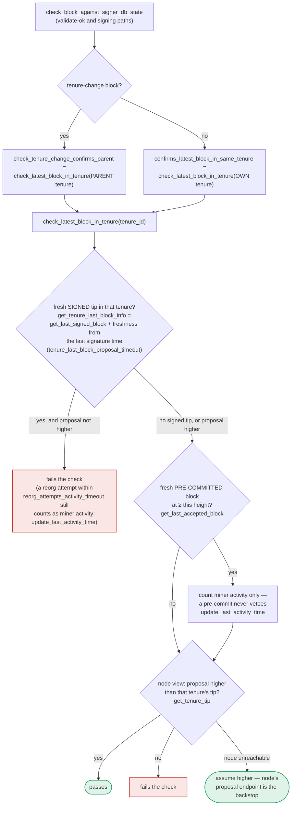

### Title
"Fail-open" tenure-tip check when the node is unreachable lets a signer sign a block that doesn't confirm the tenure's known tip - (File: `stacks-signer/src/chainstate/mod.rs`)

### Summary
`SortitionData::check_latest_block_in_tenure` treats an unreachable/failed call to the node's `get_tenure_tip` RPC as "the proposal is higher than the tenure tip" (i.e. the check passes), instead of failing closed. This "no fallback" design mirrors the price-oracle class of bug: a critical safety check is quietly defaulted to "OK" whenever the external data source (the stacks-node) cannot be reached, rather than refusing to proceed.

### Finding Description
`check_latest_block_in_tenure` first checks locally known signed/pre-committed blocks in `SignerDb`. If it has no local knowledge that would reject the proposal, it falls through to asking the local `stacks-node` for the tenure's tip via `client.get_tenure_tip(tenure_id)`: [1](#0-0) 

```
let tip = match client.get_tenure_tip(tenure_id) {
    Ok(tip) => tip.anchored_header,
    Err(e) => {
        warn!("Failed to fetch the tenure tip for the parent tenure: {e:?}. Assuming proposal is higher than the parent tenure for now.");
        return Ok(true);
    }
};
```

The doc comment explicitly rationalizes this as safe *only* because the proposal will still be double-checked by the node's own `/v3/block_proposal` validation endpoint: [2](#0-1) 

However, per `docs/signer-flows.md`, `check_latest_block_in_tenure` is not only invoked at proposal arrival — it is the same function reused at **validate-ok** and at **the moment of signing** (via `confirms_latest_block_in_same_tenure` / `check_tenure_change_confirms_parent`, called from `check_block_against_signer_db_state`): [3](#0-2) 

At those two later call sites, the node's `/v3/block_proposal` re-validation does **not** run again — the chainstate check is the only remaining guard. So the "it's OK because the node validates it too" justification given in the code comment does not hold at the pre-commit/signing recheck (`RECHECK` step in section 5 of the flow doc) or at validate-ok time. If the local `stacks-node` RPC connection is merely flaky/unreachable at that specific instant — a purely local, single-signer connectivity hiccup, needing no majority collusion and no other signer's key — `check_latest_block_in_tenure` fails open and reports "the proposal confirms the tenure's tip" even though the signer has no actual evidence of that.

This breaks the intended equality/invariant that a signer's chainstate recheck (`check_block_against_signer_db_state`) must faithfully reflect "does this block still confirm the highest known-signed tip in its tenure" before either (a) accepting a validate-ok result, or (b) placing a signature at pre-commit threshold. A transient node-connectivity failure silently converts a "cannot determine" state into "passes," rather than into a safe rejection (`ConnectivityIssues`) as is done elsewhere in the codebase (e.g., `submit_block_for_validation` explicitly returns/treats RPC errors as failures, and the `docs/signer-flows.md` notes `check_block_against_signer_db_state` normally returns `ConnectivityIssues` "when the lookup itself errored rather than answering" — but this fail-open path bypasses that and returns a plain `Ok(true)` instead of surfacing the error).

### Impact Explanation
When triggered at the signing-time recheck (section 5/7 of the flow), a fail-open here means the "RECHECK — chainstate checks still pass?" gate silently passes despite the signer having no real confirmation that the proposal is consistent with the tenure's actual highest known block. Combined with a concurrent, competing/conflicting block scenario (e.g., a reorg attempt within `reorg_attempts_activity_timeout`, or a miner re-proposing a lower/duplicate block during a brief RPC blip on this one signer), this can let a single signer sign or pre-commit a block it should have rejected because it under-confirms the tenure tip — an instance of "a signer signing an invalid/non-canonical/conflicting block" as defined by the Critical impact bucket. It is triggerable by a one-slot miner proposing a borderline/conflicting block at the exact moment the signer's local node connection to `get_tenure_tip` fails (a very plausible, non-adversary-controlled condition — process restarts, RPC timeouts, node under load), requiring neither a majority of signers nor another signer's key.

### Likelihood Explanation
`get_tenure_tip` failures are not exotic: they are explicitly anticipated and handled elsewhere in the codebase (timeouts, 429s, connectivity issues are all handled as first-class conditions throughout `stacks-signer/src/client/stacks_client.rs` and `signer.rs`). The described fail-open branch is reached any time this specific RPC call errors — no attacker action against the network's consensus is needed, only ordinary node flakiness or restart timing colliding with a borderline/competing block proposal. The other two call sites of `check_latest_block_in_tenure` (validate-ok and signing) lack a node-side second check to catch this fail-open case, since only the initial proposal-arrival call has the "stacks-node will validate it too" backstop.

### Recommendation
Distinguish "cannot determine" from "check passed" in `check_latest_block_in_tenure`. When `get_tenure_tip` fails, do not default to `Ok(true)`; propagate the error (e.g. surface as `ConnectivityIssues`) at least for the validate-ok and signing call sites, so the caller can retry/hold rather than silently proceeding as if the tenure-tip confirmation succeeded. If the fail-open behavior is retained for the proposal-arrival path (where the node re-validates anyway), it should be parameterized so it is not blindly reused for the validate-ok/signing recheck paths that have no such backstop.

### Proof of Concept
1. A miner proposes block `B` for tenure `T` that (unbeknownst to one signer `S`) does not confirm the actual highest known-signed block in `T` (e.g., a reorg-attempt block at the same/lower height as a block `S` has locally accepted but not yet marked signed_group/globally accepted, so `get_tenure_last_block_info` and `get_last_accepted_block` don't independently catch it).
2. `S` reaches the fallthrough branch of `check_latest_block_in_tenure` and calls `client.get_tenure_tip(&T)`.
3. At that exact moment, `S`'s local `stacks-node` RPC connection errors (timeout, node restart, transient network blip) — see the `Err(e)` branch at `stacks-signer/src/chainstate/mod.rs:452-460`.
4. `check_latest_block_in_tenure` returns `Ok(true)` (i.e., "passes"), even though `S` never actually confirmed that `B` is higher than `T`'s tip.
5. If this call occurred inside `check_block_against_signer_db_state`'s RECHECK step at pre-commit threshold (section 5 of `docs/signer-flows.md`) rather than at initial proposal arrival, there is no other stacks-node validation step to catch the mistake, and `S` proceeds to `mark_pre_committed`/`mark_locally_accepted` and broadcast a signature for a block it had no basis for confirming.

Note: Full step-by-step reproduction (e.g. exact test harness wiring to force an RPC error precisely inside the signing-time recheck window) could not be independently traced end-to-end within the indexed context; the call graph from `docs/signer-flows.md` and the existing tests in `stacks-signer/src/chainstate/tests/v2.rs` (e.g. `pre_committed_block_does_not_veto_replacement`, which explicitly notes "the stacks-node call inside fails since nothing is listening, which makes the check fall back to assuming the proposal is higher") confirm the fail-open behavior is real and already exercised by existing unit tests, but a full live multi-signer PoC would require running a Devin session against the actual test harness.

### Citations

**File:** stacks-signer/src/chainstate/mod.rs (L366-376)
```rust
    /// Check whether or not `block` is higher than the highest block in `tenure_id`.
    ///  returns `Ok(true)` if `block` is higher, `Ok(false)` if not.
    ///
    /// If we can't look up `tenure_id`, assume `block` is higher.
    /// This assumption is safe because this proposal ultimately must be passed
    /// to the `stacks-node` for proposal processing: so, if we pass the block
    /// height check here, we are relying on the `stacks-node` proposal endpoint
    /// to do the validation on the chainstate data that it has.
    ///
    /// This updates the activity timer for the miner of `block`.
    pub fn check_latest_block_in_tenure(
```

**File:** stacks-signer/src/chainstate/mod.rs (L450-461)
```rust
        let tip = match client.get_tenure_tip(tenure_id) {
            Ok(tip) => tip.anchored_header,
            Err(e) => {
                warn!(
                    "Failed to fetch the tenure tip for the parent tenure: {e:?}. Assuming proposal is higher than the parent tenure for now.";
                    "proposed_block_consensus_hash" => %block.header.consensus_hash,
                    "signer_signature_hash" => %block.header.signer_signature_hash(),
                    "parent_tenure" => %tenure_id,
                );
                return Ok(true);
            }
        };
```

**File:** docs/signer-flows.md (L389-418)
```markdown
## 7. The chainstate checks (shared)

`check_latest_block_in_tenure` answers "does this block confirm the tip we
expect?" and it runs in three places: at proposal arrival (inside
`check_proposal`), at validate-ok, and at the moment of signing. _Which_ tenure
it is asked about depends on the block: a tenure-change block is checked against
its **parent** tenure, every other block against its **own**. Never both. The
pivotal helper is `get_tenure_last_block_info`, which considers only blocks that
carry a signature (`get_last_signed_block`): a pre-commit never vetoes anything,
it only counts as miner activity.


```
