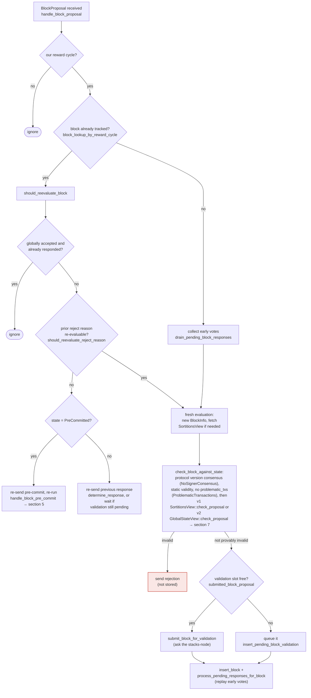
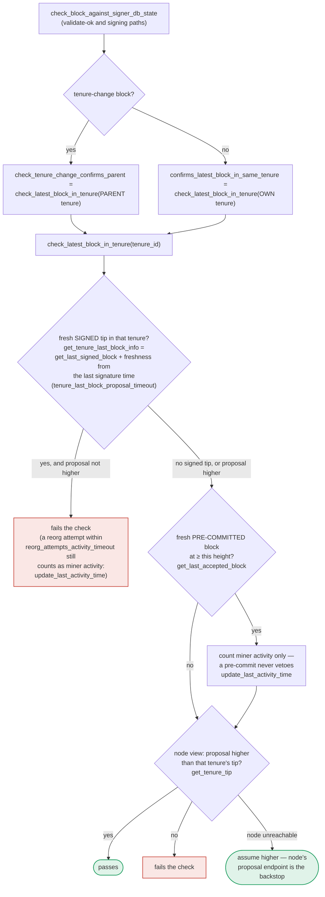

### Title
Signer double-signs conflicting tenure-start blocks under the local (v1) chainstate protocol because `validate_tenure_change_payload` only checks globally-accepted blocks, not locally-accepted ones — ([File: stacks-signer/src/chainstate/v1.rs])

### Summary
`SortitionsView::validate_tenure_change_payload` (the v1/local-state chainstate check used when the active signer protocol negotiates a non-global-state version) rejects a duplicate tenure-start proposal only if a block in the same tenure was already **globally** accepted, via `signer_db.get_last_globally_accepted_block(...)` [1](#0-0) . The equivalent v2/global-state check (`chainstate/v2.rs`) was hardened to also catch **locally**-accepted blocks by querying `get_last_signed_block` instead [2](#0-1) , and the changelog documents this exact fix ("When checking tenure change blocks, ensure there are no locally accepted blocks in the tenure, not just globally accepted blocks") [3](#0-2)  — but the fix was never propagated to the v1/local-state path, leaving the exact asymmetry pattern from the Craft CMS report (fix applied to one sibling code path, not the other).

### Finding Description
The signer's proposal-time duplicate check for tenure-start blocks (`DuplicateBlockFound`) is the only place `check_proposal` catches a second tenure-start block in the same tenure; it deliberately does not re-run at validate-ok or at signing time [4](#0-3) . Both v1 and v2 implement this check via a `validate_tenure_change_payload` function, but they query different signerdb predicates:

- v1 (`SortitionsView::validate_tenure_change_payload`) queries `get_last_globally_accepted_block(&block.header.consensus_hash)` [5](#0-4) 
- v2 (`GlobalStateView::validate_tenure_change_payload`) queries `get_last_signed_block(&block.header.consensus_hash)`, which the code comment explicitly notes is "locally or globally accepted" [6](#0-5) 

`get_last_signed_block` matches blocks in `GloballyAccepted` **or** `LocallyAccepted` state [7](#0-6) , while `get_last_globally_accepted_block` only matches the global state. A test explicitly documents this exact class of bug and its fix for v2: `check_tenure_change_rejects_when_locally_accepted_block_exists` was added as "a regression test: previously, the check used `get_last_globally_accepted_block`, which would miss blocks in `LocallyAccepted` or `PreCommitted` state and incorrectly allow a duplicate tenure change" [8](#0-7) . No equivalent regression test or fix exists for v1's version of this check.

Path to exploitation: a miner (a one-slot actor) proposes tenure-start block A for a new tenure; enough weight signs A so it becomes `LocallyAccepted` by this signer, but the block never reaches the 70% weight needed for global acceptance (e.g., because it is not otherwise propagated/pushed, or a fraction of signers reject it for an unrelated reason). While A sits at `LocallyAccepted`, the miner (or an equivocating actor with the miner's key for that tenure) proposes a second, conflicting tenure-start block B for the exact same tenure. Under the v1/local-state protocol, `check_proposal` → `validate_tenure_change_payload` calls `get_last_globally_accepted_block`, which returns `None` (A is only locally accepted), so B is **not** rejected with `DuplicateBlockFound` and is submitted for node validation and pre-commit [9](#0-8) .

Once B's pre-commits cross the 70% threshold, the shared re-check (`check_block_against_signer_db_state`) runs, but it only re-verifies the parent-tenure confirmation via `check_tenure_change_confirms_parent`, which never inspects the block's *own* tenure for a signed sibling [10](#0-9) . The backstop for same-tenure siblings is the conflict guard in `handle_block_pre_commit`, which asks the node for `get_tenure_tip` of the conflicting tenure and refuses to sign only if the node's tip has already reached or passed the conflicting block's height [11](#0-10) . Because A was only locally accepted (never pushed to the node, since global acceptance/push requires 70% signatures), the node's tenure tip has not reached A's height, so this guard treats A as "unconfirmed" and lets the signer proceed to sign B [12](#0-11) , exactly matching the "OWN -- no — never confirmed --> SIGN" branch documented in the pre-commit flow [13](#0-12) .

The signer's own database records `signed_self` for both A and B, i.e. it has now placed two distinct signatures on two conflicting tenure-start blocks in the same tenure — a direct equivocation. This breaks the "one-per-tenure/height" equality that `DuplicateBlockFound` and the conflict guard exist to enforce.

### Impact Explanation
This is a Critical-class break per the scan's own criteria: a signer signing a conflicting block (equivocation) within its own tenure-start guard, undermining the anti-double-sign invariant the pre-commit/conflict-guard machinery is explicitly designed to uphold. If enough signers on the v1/local-state protocol independently hit the same asymmetric gap (which they would, since it's the same code path for everyone still running that protocol version), two competing tenure-start blocks could each individually gather signatures from the same signer set across time, undermining the guarantee that a signer never signs two rival blocks at the same height/tenure. This can feed directly into fork-choice ambiguity for anyone relying on that signer's non-equivocation guarantee.

### Likelihood Explanation
Requires only: (1) at least one signer running the v1/local-state chainstate path (a live, still-shipped code path selected via protocol-version negotiation, not dead/legacy code — it is dispatched from `check_block_against_state` based on `determine_active_signer_protocol_version` [14](#0-13) ), and (2) a tenure-start block that gets locally (but not globally) accepted, followed by a competing tenure-start proposal for the same tenure — a scenario the codebase's own v2 regression test shows is realistic enough to have needed a dedicated fix. No majority collusion or additional keys are required beyond the one miner slot's ability to propose two competing blocks for its own tenure, which is within the threat model given (one-slot miner + gossip).

### Recommendation
Change `SortitionsView::validate_tenure_change_payload` in `stacks-signer/src/chainstate/v1.rs` to query `signer_db.get_last_signed_block(&block.header.consensus_hash)` instead of `get_last_globally_accepted_block`, mirroring the v2 fix, so that a `LocallyAccepted` (not just `GloballyAccepted`) block in the tenure also triggers `DuplicateBlockFound`. Add a v1-equivalent of `check_tenure_change_rejects_when_locally_accepted_block_exists` to lock in the fix and prevent regression.

### Proof of Concept
1. Configure a signer to negotiate the local-state (v1) signer protocol version (i.e. `determine_active_signer_protocol_version` resolves to a version where `uses_global_state()` is false).
2. Miner proposes tenure-start block A (TenureChange + Coinbase) for tenure `CH`. The signer validates and locally accepts A (`mark_locally_accepted`), setting `signed_self`, but A never accumulates 70% weight and is never pushed to the node (`get_last_globally_accepted_block(CH)` returns `None`).
3. Miner (or an equivocating actor) proposes a second, distinct tenure-start block B for the same tenure `CH`.
4. `SortitionsView::check_proposal` → `validate_tenure_change_payload` calls `get_last_globally_accepted_block(CH)`, gets `None`, and does not reject with `DuplicateBlockFound` (contrast with the v2 test `check_tenure_change_rejects_when_locally_accepted_block_exists`, which asserts rejection in the analogous scenario using `get_last_signed_block`).
5. B is validated by the node and gathers pre-commits; at the 70% pre-commit threshold, `handle_block_pre_commit`'s conflict guard queries `get_tenure_tip(CH)` from the node — since A was never pushed, the node's tip is below A's height, so the guard treats the conflict as unconfirmed and lets the signer sign B.
6. The signer's `signerdb` now shows `signed_self` set on both A and B — two signatures over conflicting tenure-start blocks in the same tenure.

*(Note: I could not execute this against a live/test signer network in this environment; the trace above is derived from static analysis of `chainstate/v1.rs`, `chainstate/v2.rs`, `signerdb.rs`, and `v0/signer.rs`, cross-checked against the existing v2 regression test and changelog entry that document the identical bug class having already been fixed for the v2 path only.)*

### Citations

**File:** stacks-signer/src/chainstate/v1.rs (L505-518)
```rust
        let last_in_current_tenure = signer_db
            .get_last_globally_accepted_block(&block.header.consensus_hash)
            .map_err(|e| {
                SignerChainstateError::from(ClientError::InvalidResponse(e.to_string()))
            })?;
        if let Some(last_in_current_tenure) = last_in_current_tenure {
            warn!(
                "Miner block proposal contains a tenure change, but we've already signed a block in this tenure. Considering proposal invalid.";
                "proposed_block_consensus_hash" => %block.header.consensus_hash,
                "proposed_block_signer_signature_hash" => %block.header.signer_signature_hash(),
                "last_in_tenure_signer_signature_hash" => %last_in_current_tenure.block.header.signer_signature_hash(),
            );
            return Err(RejectReason::DuplicateBlockFound);
        }
```

**File:** stacks-signer/src/chainstate/v2.rs (L340-357)
```rust
        // We already confirmed in check miner activity that the current tenure is valid. So check we are not
        // reorging the tenure blocks. Only blocks we have signed (locally or globally accepted) count
        // here: a block we have merely pre-committed to carries no signature from us, so it is safe to
        // accept a competing tenure-start block in its place if it failed to reach consensus.
        let last_in_current_tenure = signer_db
            .get_last_signed_block(&block.header.consensus_hash)
            .map_err(|e| {
                SignerChainstateError::from(ClientError::InvalidResponse(e.to_string()))
            })?;
        if let Some(last_in_current_tenure) = last_in_current_tenure {
            warn!(
                "Miner block proposal contains a tenure change, but we've already signed a block in this tenure. Considering proposal invalid.";
                "proposed_block_consensus_hash" => %block.header.consensus_hash,
                "proposed_block_signer_signature_hash" => %block.header.signer_signature_hash(),
                "last_in_tenure_signer_signature_hash" => %last_in_current_tenure.block.header.signer_signature_hash(),
            );
            return Err(RejectReason::DuplicateBlockFound);
        }
```

**File:** stacks-signer/CHANGELOG.md (L43-48)
```markdown
### Fixed

* Fix duplicated binary name when running `stacks-signer --version` cli command
* Fixed an issue in the signer where it would return early if it detected a message from an unrecognized signer.
* Fixed flakiness in `check_capitulate_miner_view` test.
* When checking tenure change blocks, ensure there are no locally accepted blocks in the tenure, not just globally accepted blocks.
```

**File:** docs/signer-flows.md (L172-194)
```markdown

```

**File:** docs/signer-flows.md (L263-268)
```markdown
    FRESH -- "no — all stale" --> OWN{"a conflict in this block's<br/>OWN tenure?"}
    OWN -- yes --> TIP{"own tenure confirmed<br/>at ≥ this height?<br/>get_tenure_tip(own tenure)"}
    TIP -- yes --> HOLD2["refuse to sign"]:::hold
    TIP -- "no — never confirmed" --> SIGN
    TIP -- "node unreachable" --> SIGN
    OWN -- no --> SIGN["SIGN: mark_locally_accepted,<br/>handle_block_signature,<br/>broadcast acceptance"]:::good
```

**File:** docs/signer-flows.md (L391-418)
```markdown
`check_latest_block_in_tenure` answers "does this block confirm the tip we
expect?" and it runs in three places: at proposal arrival (inside
`check_proposal`), at validate-ok, and at the moment of signing. _Which_ tenure
it is asked about depends on the block: a tenure-change block is checked against
its **parent** tenure, every other block against its **own**. Never both. The
pivotal helper is `get_tenure_last_block_info`, which considers only blocks that
carry a signature (`get_last_signed_block`): a pre-commit never vetoes anything,
it only counts as miner activity.


```

**File:** docs/signer-flows.md (L425-437)
```markdown
Two things belong to the proposal path only and are **not** re-run at validate-ok
or at signing:

- `validate_tenure_change_payload` rejects with `DuplicateBlockFound` when we
  have already accepted a block in the tenure a tenure-change block is starting.
  v2 counts locally or globally accepted blocks (`get_last_signed_block`); v1
  counts only globally accepted ones (`get_last_globally_accepted_block`).
- the v2 `check_proposal` wrapper checks miner pubkey hash, consensus hash, the
  pox bitvec, and tenure-extend rules before delegating here.

Because the duplicate check never runs again, a block that crosses the pre-commit
threshold long after it was proposed relies on section 5's own-tenure conflict
guard to cover the same ground.
```

**File:** stacks-signer/src/signerdb.rs (L1572-1585)
```rust
    pub fn get_last_signed_block(
        &self,
        tenure: &ConsensusHash,
    ) -> Result<Option<BlockInfo>, DBError> {
        let query = "SELECT block_info FROM blocks WHERE consensus_hash = ?1 AND state IN (?2, ?3) ORDER BY stacks_height DESC LIMIT 1";
        let args = params![
            tenure,
            &BlockState::GloballyAccepted.to_string(),
            &BlockState::LocallyAccepted.to_string(),
        ];
        let result: Option<String> = query_row(&self.db, query, args)?;

        try_deserialize(result)
    }
```

**File:** stacks-signer/src/chainstate/tests/v2.rs (L748-756)
```rust
/// Test that a tenure change proposal is rejected when a locally-accepted
/// (but not globally-accepted) block already exists in the same tenure.
///
/// This is a regression test: previously, the check used
/// `get_last_globally_accepted_block`, which would miss blocks in
/// `LocallyAccepted` or `PreCommitted` state and incorrectly allow
/// a duplicate tenure change.
#[test]
fn check_tenure_change_rejects_when_locally_accepted_block_exists() {
```

**File:** stacks-signer/src/v0/signer.rs (L865-869)
```rust
        if state_version.uses_global_state() {
            self.check_block_against_global_state(stacks_client, &block_info.block)
        } else {
            self.check_block_against_local_state(stacks_client, sortition_state, &block_info.block)
        }
```

**File:** stacks-signer/src/v0/signer.rs (L1432-1466)
```rust
        if conflicts.iter().any(|conflict| {
            conflict.consensus_hash == block_info.block.header.consensus_hash
                && !self.reorg_permit_stands(stacks_client, conflict)
        }) {
            match stacks_client.get_tenure_tip(&block_info.block.header.consensus_hash) {
                Ok(tip) => {
                    let tip_height = tip.anchored_header.height();
                    if tip_height >= block_info.block.header.chain_length {
                        warn!(
                            "{self}: Reached the pre-commit threshold for a block that conflicts with previously signed or accepted blocks, and the canonical tip of its tenure is already at or above the proposed height. Refusing to sign.";
                            "signer_signature_hash" => %block_hash,
                            "block_height" => block_info.block.header.chain_length,
                            "canonical_tip_height" => tip_height,
                        );
                        return;
                    }
                }
                Err(e) => {
                    warn!(
                        "{self}: Failed to fetch the canonical tip of the proposed block's tenure: {e:?}. Treating the tenure as unconfirmed.";
                        "signer_signature_hash" => %block_hash,
                        "consensus_hash" => %block_info.block.header.consensus_hash,
                    );
                }
            }
        }
        if !conflicts.is_empty() {
            info!(
                "{self}: Reached the pre-commit threshold for a block that conflicts with previously signed or accepted blocks, but none of those conflicts still blocks it. Signing the replacement.";
                "signer_signature_hash" => %block_hash,
                "block_height" => block_info.block.header.chain_length,
                "num_conflicts" => conflicts.len(),
            );
        }
        // It is only considered globally accepted IFF we receive a new block event confirming it OR see the chain tip of the node advance to it.
```
