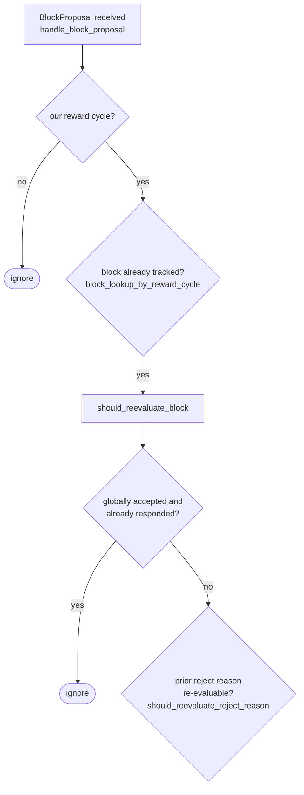

## Analysis

I found a direct analog of the reported bug class in the miner-side signer response tally, `StackerDBListener::process_message` (in `stacks-node/src/nakamoto_node/stackerdb_listener.rs`). The report's core defect is: code assumes an invariant ("the residual can always be repaid as debt") that is not actually guaranteed, and the mismatch corrupts accounting/blocks legitimate flows. The signer-side analog is an accounting asymmetry between the `Accepted` and `Rejected` arms that lets a single signer's weight land in *both* the approved and rejected buckets for the same block, corrupting the aggregated-weight vs. verified-accepts equality the miner relies on to decide a block's fate.

### Title
Miner's StackerDBListener double-counts a signer's weight in both `total_weight_approved` and `total_weight_rejected` when a signer legitimately rejects then later accepts the same block - (File: `stacks-node/src/nakamoto_node/stackerdb_listener.rs`)

### Summary
`StackerDBListener::process_message` maintains, per proposed block, two independently-accumulated weight totals: `total_weight_approved` and `total_weight_rejected`. The `Rejected` arm is guarded against double counting via `responded_signers.insert(slot_id)` (only first response per slot counts), but the `Accepted` arm is guarded by a *different* set, `gathered_signatures.contains_key(&slot_id)`. Because these two guards track disjoint state, a signer that first rejects (adding weight to `total_weight_rejected` and inserting into `responded_signers`) and later legitimately reconsiders and accepts the same `signer_signature_hash` will also have its weight added to `total_weight_approved`, since `gathered_signatures` never contained that slot. The signer's weight is now counted in *both* buckets simultaneously and is never reconciled.

### Finding Description
In the `Accepted` arm: [1](#0-0) 

the dedup check is `!block.gathered_signatures.contains_key(&slot_id)`.

In the `Rejected` arm: [2](#0-1) 

the dedup check is `block.responded_signers.insert(slot_id)`.

These are two different sets. `responded_signers` is inserted into by *both* arms (`block.responded_signers.insert(slot_id)` also appears at line 465 in the `Accepted` arm), so a Reject followed by an Accept is not blocked by `responded_signers` (that only blocks a second identical-type message, or a later Reject after an earlier Accept — because `responded_signers.insert` will return `false` the second time). But going the other direction — Reject first, then Accept — passes the `Accepted` arm's own guard (`gathered_signatures` is still empty for that slot), so the weight is added to `total_weight_approved` on top of the weight already added to `total_weight_rejected` by the earlier rejection. Nothing ever subtracts the earlier rejected weight.

This transition (reject, then later reconsider and accept the *same* block) is not a hypothetical or malicious edge case — it is an explicitly supported and tested signer behavior: [3](#0-2) [4](#0-3) 

and is exercised in integration tests such as `signer_can_accept_rejected_block` and `signer_reevaluates_proposal_with_missing_burn_view`: [5](#0-4) [6](#0-5) 

Notably, the project's own CHANGELOG records an earlier attempt to fix exactly this class of bug ("Do not count both a block acceptance and a block rejection for the same signer/block"): [7](#0-6) 
but that fix appears to have been applied on the `SignerDb` side (`add_block_rejection_signer_addr` refusing a rejection once a signature already exists): [8](#0-7) 
which governs a *signer's own local database of its own decision*, not the *miner's* independent `StackerDBListener` tally of *other signers'* responses. The miner-side tally in `stackerdb_listener.rs` was left with the asymmetric guard described above.

### Impact Explanation
The miner's `SignerCoordinator` decides a block's fate purely from these two totals: [9](#0-8) 
`total_weight_rejected + weight_threshold > total_weight` declares the block dead (`SignersRejected`); `total_weight_approved >= weight_threshold` declares it signed and pushes it to the node. Because a signer's weight can now be counted in both buckets simultaneously without ever being reconciled, `total_weight_approved + total_weight_rejected` can legitimately exceed `total_weight` for a given block hash. This breaks the safety property that aggregated weight must equal (or at most equal) verified, mutually-exclusive signer decisions ("aggregated-weight vs. verified-accepts equality").

The concrete liveness consequence: rejected weight is never decremented once added. A signer that rejects for a transient, re-evaluable reason (`ConnectivityIssues`, `NotFoundError`, `UnknownParent`, etc. — see `should_reevaluate_reject_reason`) and later, correctly, accepts the same block still leaves its rejection weight "stuck" in `total_weight_rejected` in the miner's `BlockStatus` for that `signer_signature_hash`, on top of now also being counted as an approval. If enough such transient rejections accumulate (e.g. during a burn-block-processing race across a distributed signer set, as exercised in `signers_reprocess_bitcoin_block_not_found_proposals`), the stale, un-reconciled rejected weight can push `total_weight_rejected` over the 30% blocking-minority threshold and cause the miner to declare the block `SignersRejected` even though every signer that rejected has, in fact, since accepted — a liveness wedge that forces the miner to abandon and re-mine a block that legitimately has enough support, without requiring any signer to act maliciously or in majority.

### Likelihood Explanation
This requires only ordinary, protocol-sanctioned signer behavior (rejecting a proposal for a transient/re-evaluable reason and later reconsidering to accept the identical block), which the codebase explicitly supports and tests for. No majority collusion, no key compromise, and no malformed message is needed — a normal network hiccup (e.g. a Bitcoin block not yet processed on some signer's node, as in the existing regression test) combined with the miner's re-proposal/timeout retry logic is sufficient to produce a Reject-then-Accept sequence for the same block hash from one or more signers.

### Recommendation
Make the two arms share a single per-slot decision state (e.g., track each slot's *current* vote kind, not just "has responded"), and when a slot transitions from Rejected to Accepted (or vice versa), subtract the weight from the old bucket before adding it to the new one, mirroring the fix already applied in `SignerDb::add_block_rejection_signer_addr`/`add_block_signature` but applied consistently to `StackerDBListener`'s `total_weight_approved`/`total_weight_rejected` accounting.

### Proof of Concept
1. Miner proposes block `B` with signer weights such that no single signer exceeds the 30% blocking minority alone, but two signers together do.
2. Signer A rejects `B` for a transient reason (e.g. `NotFoundError` because its node hasn't processed the referenced Bitcoin block yet) → `StackerDBListener` records this: `responded_signers.insert(A)`, `total_weight_rejected += weight(A)`.
3. The underlying condition resolves (Bitcoin block processed); signer A reconsiders per `should_reevaluate_reject_reason` and sends `Accepted` for the *same* `signer_signature_hash` → the `Accepted` arm checks only `gathered_signatures.contains_key(A)` (false) and adds `total_weight_approved += weight(A)`. `total_weight_rejected` is not decremented.
4. A second, independent signer B (whose weight alone is below the blocking minority) also rejects `B` for any reason and never reconsiders.
5. `total_weight_rejected` now equals `weight(A) + weight(B)`, which — solely because of A's un-reconciled stale rejection weight — can exceed the blocking-minority threshold (`total_weight - weight_threshold`), causing `SignerCoordinator::get_block_status`/wait loop to return `NakamotoNodeError::SignersRejected` even though A has since accepted the block and the true aggregate support may be sufficient.

### Citations

**File:** stacks-node/src/nakamoto_node/stackerdb_listener.rs (L443-465)
```rust
                        if !block.gathered_signatures.contains_key(&slot_id) {
                            block.total_weight_approved = block
                                .total_weight_approved
                                .saturating_add(signer_entry.weight);

                            info!("StackerDBListener: Signature Added to block";
                                "signer_signature_hash" => %block_sighash,
                                "signer_pubkey" => signer_pubkey.to_hex(),
                                "signer_slot_id" => slot_id,
                                "signature" => %signature,
                                "signer_weight" => signer_entry.weight,
                                "total_weight_approved" => block.total_weight_approved,
                                "percent_approved" => block.total_weight_approved as f64 / self.total_weight as f64 * 100.0,
                                "total_weight_rejected" => block.total_weight_rejected,
                                "percent_rejected" => block.total_weight_rejected as f64 / self.total_weight as f64 * 100.0,
                                "weight_threshold" => self.weight_threshold,
                                "tenure_extend_timestamp" => tenure_extend_timestamp,
                                "read_count_extend_timestamp" => read_count_extend_timestamp,
                                "server_version" => metadata.server_version,
                            );
                        }
                        block.gathered_signatures.insert(slot_id, signature);
                        block.responded_signers.insert(slot_id);
```

**File:** stacks-node/src/nakamoto_node/stackerdb_listener.rs (L515-519)
```rust
                        if block.responded_signers.insert(slot_id) {
                            block.total_weight_rejected = block
                                .total_weight_rejected
                                .saturating_add(signer_entry.weight);

```

**File:** docs/signer-flows.md (L164-180)
```markdown
## 3. A block proposal arrives

The miner broadcasts a proposal. If we've seen this exact block before,
`should_reevaluate_block` decides whether the old verdict stands; a block we
only pre-committed to is deliberately routed back through the pre-commit
evaluation so a re-proposal cannot shortcut to a signature. A fresh proposal is
checked against our view of the world _before_ spending a node validation on it.



**File:** stacks-signer/src/v0/signer.rs (L2705-2739)
```rust
/// Determine if a block should be re-evaluated based on its rejection reason˝
fn should_reevaluate_reject_reason(block_info: &BlockInfo) -> bool {
    if let Some(reject_reason) = &block_info.reject_reason {
        match reject_reason {
            RejectReason::ValidationFailed(ValidateRejectCode::UnknownParent)
            | RejectReason::ValidationFailed(ValidateRejectCode::NotFoundError)
            | RejectReason::NoSortitionView
            | RejectReason::ConnectivityIssues(_)
            | RejectReason::TestingDirective
            | RejectReason::InvalidTenureExtend
            | RejectReason::ConsensusHashMismatch { .. }
            | RejectReason::NoSignerConsensus
            | RejectReason::NotRejected
            | RejectReason::Unknown(_) => true,
            RejectReason::ValidationFailed(_)
            | RejectReason::RejectedInPriorRound
            | RejectReason::SortitionViewMismatch
            | RejectReason::ReorgNotAllowed
            | RejectReason::InvalidBitvec
            | RejectReason::PubkeyHashMismatch
            | RejectReason::InvalidMiner
            | RejectReason::NotLatestSortitionWinner
            | RejectReason::InvalidParentBlock
            | RejectReason::DuplicateBlockFound
            | RejectReason::IrrecoverablePubkeyHash
            | RejectReason::ProblematicTransactions
            | RejectReason::ProposalTooOld => {
                // No need to re-validate these types of rejections.
                false
            }
        }
    } else {
        false
    }
}
```

**File:** stacks-node/src/tests/signer/v0/mod.rs (L7153-7159)
```rust
#[test]
#[ignore]
/// This test verifies that a a signer will accept a rejected block if it is
/// re-proposed and determined to be legitimate. This can happen if the block
/// is initially rejected due to a test flag or because the stacks-node had
/// not yet processed the block's parent.
fn signer_can_accept_rejected_block() {
```

**File:** stacks-node/src/tests/signer/v0/missing_burn_block_proposal.rs (L64-67)
```rust
///   `ValidationFailed(NotFoundError)`.
/// - Upon reproposal, the block is fully revalidated and rejected again
///   with the same error.
/// - The rejection is treated as re-evaluable rather than terminal.
```

**File:** stacks-signer/CHANGELOG.md (L132-136)
```markdown
### Changed

- Do not count both a block acceptance and a block rejection for the same signer/block. Also ignore repeated responses (mainly for logging purposes).
- Database schema updated to version 16

```

**File:** stacks-signer/src/signerdb.rs (L1922-1940)
```rust
    /// Record an observed block rejection_signature
    pub fn add_block_rejection_signer_addr(
        &self,
        block_sighash: &Sha512Trunc256Sum,
        addr: &StacksAddress,
        reject_reason: RejectReasonPrefix,
    ) -> Result<bool, DBError> {
        // If this signer/block already has a signature, do not allow a rejection
        let sig_qry = "SELECT EXISTS(SELECT 1 FROM block_signatures WHERE signer_signature_hash = ?1 AND signer_addr = ?2)";
        let sig_args = params![block_sighash, addr.to_string()];
        let exists = self.db.query_row(sig_qry, sig_args, |row| row.get(0))?;
        if exists {
            warn!("Cannot add block rejection because a signature already exists.";
                "signer_signature_hash" => %block_sighash,
                "signer_address" => %addr,
                "reject_reason" => ?reject_reason
            );
            return Ok(false);
        }
```

**File:** stacks-node/src/nakamoto_node/signer_coordinator.rs (L509-545)
```rust
            if block_status
                .total_weight_rejected
                .saturating_add(self.weight_threshold)
                > self.total_weight
            {
                info!(
                    "{}/{} signer weight votes to reject block",
                    block_status.total_weight_rejected, self.total_weight;
                    "signer_signature_hash" => %block_signer_sighash,
                );
                counters.bump_naka_rejected_blocks();

                // Only act on failed txids that a blocking minority (>30% weight) agrees on
                let blocking_minority = self.total_weight.saturating_sub(self.weight_threshold);
                let mut temporarily_excluded_txids = HashSet::new();
                let mut permanently_excluded_txids = HashSet::new();
                for (txid, info) in &block_status.failed_txids {
                    if info.total_weight > blocking_minority {
                        // Do not perma ban txids that only a small minority of signers reported as problematic
                        // But make sure its removed from the next block proposal
                        if info.problematic_weight > blocking_minority {
                            permanently_excluded_txids.insert(txid.clone());
                        } else {
                            temporarily_excluded_txids.insert(txid.clone());
                        }
                    }
                }

                return Err(NakamotoNodeError::SignersRejected {
                    temporarily_excluded_txids,
                    permanently_excluded_txids,
                });
            } else if block_status.total_weight_approved >= self.weight_threshold {
                info!("Received enough signatures, block accepted";
                    "signer_signature_hash" => %block_signer_sighash,
                );
                return Ok(block_status.gathered_signatures.values().cloned().collect());
```
