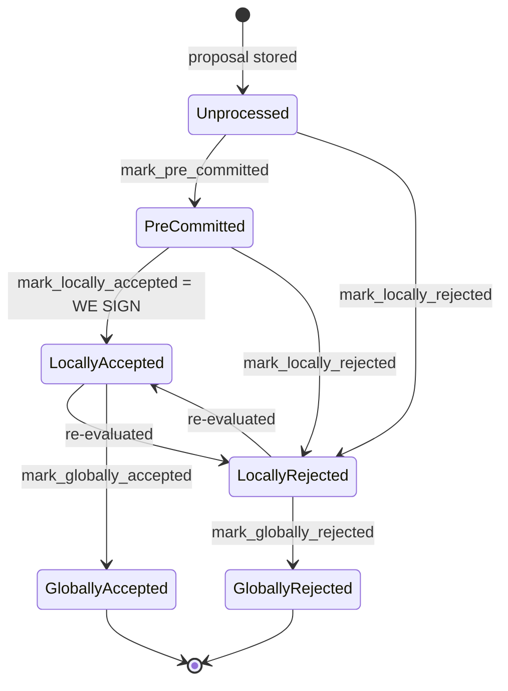

### Title
Order-dependent double counting of a single signer's weight into both `total_weight_approved` and `total_weight_rejected` — ([File: stacks-node/src/nakamoto_node/stackerdb_listener.rs])

### Summary
`StackerDBListener::run` (the node-side handler that aggregates signer `BlockResponse`s into a `BlockStatus`) uses two different, independent guards to decide whether to add a signer's weight to the two mutually-exclusive tallies (`total_weight_approved` vs `total_weight_rejected`). Because the guards are not symmetric, a single signer that first rejects and later accepts the same block (a normal, legitimate, non-majority state transition explicitly supported by the signer's own state machine: `LocallyRejected → LocallyAccepted` via re-evaluation) gets its weight counted in **both** buckets simultaneously, corrupting the aggregate weight invariant the miner relies on to decide whether a block is signed or dead.

### Finding Description
`StackerDBListener::run` maintains a `BlockStatus` per block hash with `total_weight_approved`, `total_weight_rejected`, `responded_signers`, and `gathered_signatures`.

- On `BlockResponse::Accepted`: weight is added only if `!block.gathered_signatures.contains_key(&slot_id)`, and then `responded_signers.insert(slot_id)` is called unconditionally. [1](#0-0) 

- On `BlockResponse::Rejected`: weight is added only if `block.responded_signers.insert(slot_id)` returns `true` (i.e. this is the first time this slot_id appears in `responded_signers`, from *either* an accept or a reject). [2](#0-1) 

The two guards check different sets (`gathered_signatures` for accept, `responded_signers` for reject), so the outcome depends on message order for the same `slot_id`:

- Accept-then-Reject: the reject's `responded_signers.insert(slot_id)` returns `false` (already inserted by the accept), so `total_weight_rejected` is correctly *not* incremented — no double count.
- Reject-then-Accept: the reject's `responded_signers.insert(slot_id)` returns `true` on first arrival, incrementing `total_weight_rejected`. When the later accept for the *same block* arrives, the accept guard only checks `gathered_signatures` (not yet populated), so it also increments `total_weight_approved`. The prior `total_weight_rejected` contribution is never decremented anywhere in the file. The same signer's weight is now counted toward both tallies at once, breaking the implicit invariant that `total_weight_approved + total_weight_rejected ≤ total_weight` and that a signer only ever counts toward one side of a decision.

This reject→accept transition is not exotic: it is an explicitly documented, expected signer behavior — a block that was `LocallyRejected` can be re-evaluated and moved to `LocallyAccepted` (e.g., after `should_reevaluate_block`/`should_reevaluate_reject_reason` decide the prior rejection reason no longer applies), causing the same signer to broadcast a `Rejected` response and later an `Accepted` response for the identical `signer_signature_hash`. [3](#0-2) 

`get_block_status` (the miner/coordinator consumer of this aggregated `BlockStatus`) checks the rejection condition first on every loop iteration, before checking approval: [4](#0-3) 

Because the stale rejection weight from the earlier vote is never cleared, `total_weight_rejected` can remain permanently inflated by weight that has, in reality, moved to acceptance. If that residual rejection weight (plus `weight_threshold`) exceeds `total_weight`, the coordinator will return `NakamotoNodeError::SignersRejected` and give up on the block — even though the actual, current distinct signer support may be sufficient to reach the 70% approval threshold. `reset_rejections` only clears rejections on a timeout retry path, and even then it re-derives `responded_signers` purely from `gathered_signatures`, but it does nothing to fix the ongoing corruption while the original proposal round is still live. [5](#0-4) 

### Impact Explanation
This is a liveness wedge on the miner/coordinator side of the signer protocol: a single non-majority signer, simply by exercising the normal reject→accept re-evaluation path, can leave phantom rejection weight permanently attributed to a block. If enough signers do this (still well under a blocking majority, since this is about *order of two messages from the same signer*, not colluding weight), the coordinator can conclude `SignersRejected` for a block that in fact has enough real, current approving weight, causing the miner to abandon a validly-supported block. This matches the "High" impact category: a wedge that prevents legitimate blocks from ever completing the signing/acceptance flow, i.e., the coordinator is fooled into treating verified-accepts as if they were still rejections (breaking the aggregated-weight vs. verified-accepts equality).

### Likelihood Explanation
The reject→accept transition is a standard, sanctioned part of the signer's state machine, not an attack requiring a malicious majority, a stolen key, or unusual capital. All that is required is timing: for a signer's own local view to move from `LocallyRejected` to `LocallyAccepted` after having already broadcast the rejection (e.g., after a reorg-attempt or transaction-validity re-evaluation resolves in the miner's favor). This can happen organically, and can also be deliberately triggered by any single signer (or by network conditions delivering messages out of order) without needing coordination with other signers, making it a comparatively easy trigger for a one-slot participant.

### Recommendation
Use a single symmetric bookkeeping structure that tracks, per `slot_id`, at most one "current vote" and its weight, and update both tallies atomically when a vote changes:
- On accept: if the slot previously contributed to `total_weight_rejected`, subtract that weight from `total_weight_rejected` before adding it to `total_weight_approved`.
- On reject: if the slot previously contributed to `total_weight_approved`, subtract that weight from `total_weight_approved` before adding it to `total_weight_rejected` (mirroring the existing behavior where accept-after-reject correctly no-ops on the reject side, but this direction is currently missing the compensating removal from the reject side when moving to accept).
- Alternatively, track a `HashMap<slot_id, Vote>` and recompute `total_weight_approved`/`total_weight_rejected` as pure functions over the map, guaranteeing the invariant `total_weight_approved + total_weight_rejected ≤ total_weight` always holds regardless of message arrival order.

### Proof of Concept
1. Miner proposes block `B`; coordinator calls `insert_block`, initializing `BlockStatus` with zeroed tallies.
2. Signer `S` (weight `w`) initially rejects `B` (e.g., due to a transient reorg-attempt condition) — `StackerDBListener` processes `BlockResponse::Rejected`, `responded_signers.insert(slot_S)` returns `true`, so `total_weight_rejected += w`.
3. Signer `S` re-evaluates (per `should_reevaluate_block`/`should_reevaluate_reject_reason`), determines the block is now valid, and broadcasts `BlockResponse::Accepted` for the same `signer_signature_hash`.
4. `StackerDBListener` processes the `Accepted` message: `gathered_signatures.contains_key(slot_S)` is `false` (first accept), so `total_weight_approved += w` — with no corresponding decrement of `total_weight_rejected`.
5. Now `total_weight_approved` and `total_weight_rejected` both include `w`, violating the intended mutual exclusivity. If accumulated over several such flips, `total_weight_rejected` can cross the rejection threshold in `get_block_status` purely from stale votes, causing the coordinator to abandon a block that currently has sufficient real approving weight.

(This trace is derived from the linked code and documented state-machine behavior; I did not run the node to empirically reproduce the timing, so the exact reachability under production message-ordering/latency should be validated in a live/test harness such as `stacks-node/src/tests/signer/v0/reorg.rs`.)

### Citations

**File:** stacks-node/src/nakamoto_node/stackerdb_listener.rs (L443-465)
```rust
                        if !block.gathered_signatures.contains_key(&slot_id) {
                            block.total_weight_approved = block
                                .total_weight_approved
                                .saturating_add(signer_entry.weight);

                            info!("StackerDBListener: Signature Added to block";
                                "signer_signature_hash" => %block_sighash,
                                "signer_pubkey" => signer_pubkey.to_hex(),
                                "signer_slot_id" => slot_id,
                                "signature" => %signature,
                                "signer_weight" => signer_entry.weight,
                                "total_weight_approved" => block.total_weight_approved,
                                "percent_approved" => block.total_weight_approved as f64 / self.total_weight as f64 * 100.0,
                                "total_weight_rejected" => block.total_weight_rejected,
                                "percent_rejected" => block.total_weight_rejected as f64 / self.total_weight as f64 * 100.0,
                                "weight_threshold" => self.weight_threshold,
                                "tenure_extend_timestamp" => tenure_extend_timestamp,
                                "read_count_extend_timestamp" => read_count_extend_timestamp,
                                "server_version" => metadata.server_version,
                            );
                        }
                        block.gathered_signatures.insert(slot_id, signature);
                        block.responded_signers.insert(slot_id);
```

**File:** stacks-node/src/nakamoto_node/stackerdb_listener.rs (L515-519)
```rust
                        if block.responded_signers.insert(slot_id) {
                            block.total_weight_rejected = block
                                .total_weight_rejected
                                .saturating_add(signer_entry.weight);

```

**File:** stacks-node/src/nakamoto_node/stackerdb_listener.rs (L706-723)
```rust
    /// Reset rejections for a block proposal.
    /// This is used when a block proposal times out and we need to retry it by
    /// clearing the block's rejections. Block approvals cannot be cleared
    /// because an old approval could always be used to make a block reach
    /// the approval threshold.
    pub fn reset_rejections(&self, signer_sighash: &Sha512Trunc256Sum) {
        let (lock, _cvar) = &*self.blocks;
        let mut blocks = lock.lock().expect("FATAL: failed to lock block status");
        if let Some(block) = blocks.get_mut(signer_sighash) {
            block.responded_signers.clear();
            block.total_weight_rejected = 0;

            // Add approving signers back to the responded signers set
            for (slot_id, _) in block.gathered_signatures.iter() {
                block.responded_signers.insert(*slot_id);
            }
        }
    }
```

**File:** docs/signer-flows.md (L130-150)
```markdown
## 2. Block lifecycle (`BlockState`)

Every proposal tracked in the signer DB carries a `BlockState`. **`PreCommitted`
carries no signature**: it means "validated, willing to sign if the pre-commit
threshold is met." The first signature appears at `mark_locally_accepted`.
Global states are terminal against each other.


```

**File:** stacks-node/src/nakamoto_node/signer_coordinator.rs (L509-541)
```rust
            if block_status
                .total_weight_rejected
                .saturating_add(self.weight_threshold)
                > self.total_weight
            {
                info!(
                    "{}/{} signer weight votes to reject block",
                    block_status.total_weight_rejected, self.total_weight;
                    "signer_signature_hash" => %block_signer_sighash,
                );
                counters.bump_naka_rejected_blocks();

                // Only act on failed txids that a blocking minority (>30% weight) agrees on
                let blocking_minority = self.total_weight.saturating_sub(self.weight_threshold);
                let mut temporarily_excluded_txids = HashSet::new();
                let mut permanently_excluded_txids = HashSet::new();
                for (txid, info) in &block_status.failed_txids {
                    if info.total_weight > blocking_minority {
                        // Do not perma ban txids that only a small minority of signers reported as problematic
                        // But make sure its removed from the next block proposal
                        if info.problematic_weight > blocking_minority {
                            permanently_excluded_txids.insert(txid.clone());
                        } else {
                            temporarily_excluded_txids.insert(txid.clone());
                        }
                    }
                }

                return Err(NakamotoNodeError::SignersRejected {
                    temporarily_excluded_txids,
                    permanently_excluded_txids,
                });
            } else if block_status.total_weight_approved >= self.weight_threshold {
```
