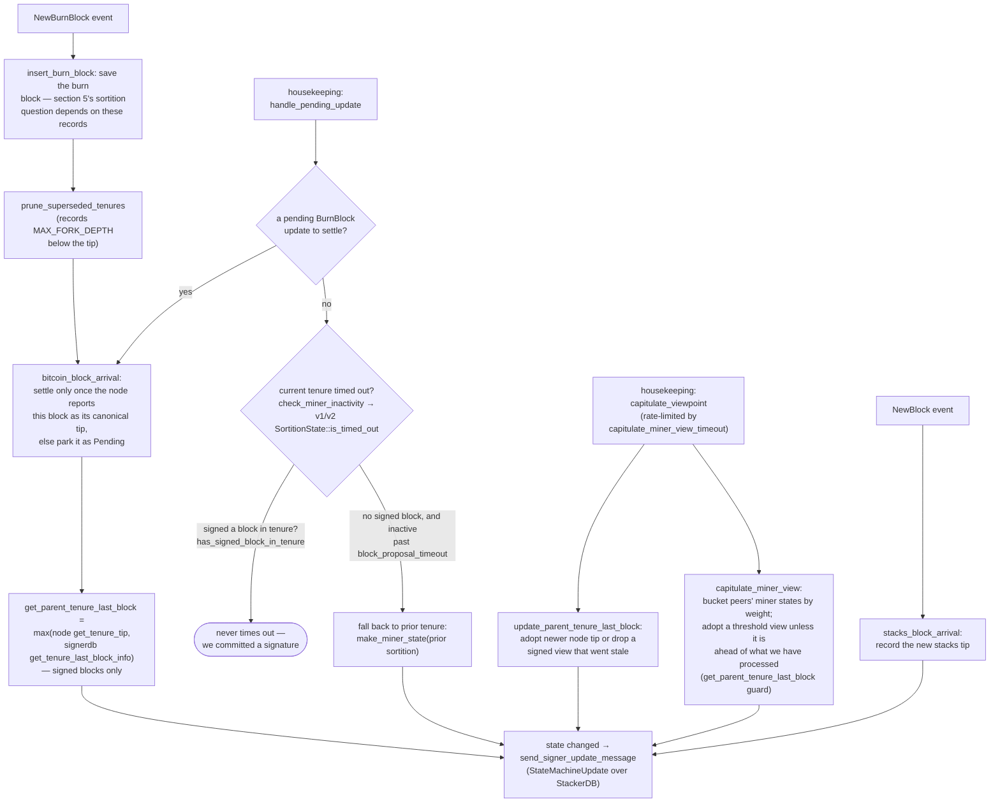

### Title
Global signer-state checks (`check_proposal` / `check_block_against_global_state`) are evaluated once at proposal time and never re-run before the signature is placed - ([File: stacks-signer/src/v0/signer.rs])

### Summary
This is the direct structural analog of the `sellVotes()` bug: a "preview" check is computed once, and the irreversible action (the signature) is later executed on the strength of that stale preview instead of being re-validated against current state. `buyVotes()`'s analog here is the re-check that *does* happen (`check_block_against_signer_db_state`, run at validate-ok and again at pre-commit-threshold time); `sellVotes()`'s analog is the miner/tenure/bitvec validity check (`GlobalStateView::check_proposal` / `check_block_against_global_state`), which is documented to run only once, at proposal arrival, and is never re-invoked before the signer actually signs.

### Finding Description
Per `docs/signer-flows.md` section 3, a fresh proposal is validated via `check_block_against_state`, which calls `v1 SortitionsView::check_proposal` or `v2 GlobalStateView::check_proposal` [1](#0-0) . This is the only place miner-pubkey-hash, consensus-hash, pox-bitvec, and tenure-extend legality are checked against the signer's *current* global-state view [2](#0-1) , implemented in `check_block_against_global_state` which pulls `self.global_state_evaluator.determine_global_state()` at call time [3](#0-2) .

The doc explicitly calls out that this check is proposal-path-only: "Two things belong to the proposal path only and are not re-run at validate-ok or at signing: ... the v2 `check_proposal` wrapper checks miner pubkey hash, consensus hash, the pox bitvec, and tenure-extend rules before delegating here" [4](#0-3) .

What *is* re-run before signing (at validate-ok, and again when the pre-commit threshold is reached) is only the narrower `check_block_against_signer_db_state`, which checks whether the block still confirms the correct parent/tenure tip in the signer's local DB (`check_latest_block_in_tenure`) [5](#0-4) [6](#0-5) . That function's own doc comment even warns: "WARNING: This is an incomplete check. Do NOT call this function PRIOR to check_proposal or block_proposal validation succeeds" [7](#0-6)  — an admission that this recheck is not a substitute for `check_proposal`.

Between proposal arrival and the moment 70% pre-commit weight accumulates (which can take an arbitrary amount of time while pre-commits trickle in over gossip), the signer's global state machine can legitimately change: `current_miner` can move from `ActiveMiner(tenure_id=T)` to a different `ActiveMiner` (new tenure won) or to `MinerState::NoValidMiner`, driven purely by incoming `StateMachineUpdate` gossip and `NewBurnBlock` events (section 8 of the flow doc) [8](#0-7) . None of the pre-commit-threshold-time rechecks (`check_block_against_signer_db_state`, the conflict guard) verify that the block's `consensus_hash`/miner pubkey still match the *current* `current_miner`/`tenure_id` in the global state — that equality is only ever checked once, in `check_proposal`, at proposal time [9](#0-8) .

### Impact Explanation
A signer can end up placing its signature (`mark_locally_accepted` / `handle_block_signature`, the irreversible act per the flow doc's own framing [10](#0-9) ) over a block whose miner/tenure is no longer the one the signer's own current global state considers valid — i.e., a signer signing a block it would reject as `InvalidMiner`/`ConsensusHashMismatch`/`PubkeyHashMismatch` if `check_proposal` were re-run at that instant. This falls squarely under the specified Critical impact: "a signer signing an invalid, non-canonical, or conflicting block."

### Likelihood Explanation
Reachable purely by the ordinary passage of time plus gossip/burn-chain events — no majority collusion or key compromise is required, only that pre-commit accumulation for one proposal is slow enough (network delay, partial connectivity, a slow signer) for the local/global state machine to move on in the interim. The maintainers' own documentation flags proposal-only checks as a known gap for the *duplicate-block* case and papers over it with the conflict guard, but no equivalent compensating re-check exists for the miner-pubkey/consensus-hash/bitvec/tenure-extend legality established by `check_proposal`.

### Recommendation
Re-run `check_block_against_global_state` (`GlobalStateView::check_proposal`, and the v1 equivalent `SortitionsView::check_proposal`) immediately before placing the signature at the pre-commit-threshold crossing point (`stacks-signer/src/v0/signer.rs`, the same site that already re-runs `check_block_against_signer_db_state` around line 1345), not just the narrower tenure-tip check. If the current global state no longer matches, reject/withhold the signature rather than allowing it through on the stale proposal-time verdict.

### Proof of Concept
Not independently reproduced in a test harness; this is derived from the documented control flow and code comments explicitly marking `check_block_against_global_state`/`check_proposal` as proposal-time-only and `check_block_against_signer_db_state` as an "incomplete check." I was unable to fully trace `global_state_evaluator`/`local_state_machine` transition timing in this session to construct a concrete step-by-step PoC scenario within the available iterations — this should be verified by tracing `determine_global_state()` update triggers relative to pre-commit accumulation timing before treating this as confirmed-exploitable rather than a structural gap.

### Citations

**File:** docs/signer-flows.md (L186-186)
```markdown
    FRESH --> CHECK["check_block_against_state:<br/>protocol version consensus (NoSignerConsensus),<br/>static validity, no problematic_txs<br/>(ProblematicTransactions), then<br/>v1 SortitionsView::check_proposal or<br/>v2 GlobalStateView::check_proposal → section 7"]
```

**File:** docs/signer-flows.md (L425-433)
```markdown
Two things belong to the proposal path only and are **not** re-run at validate-ok
or at signing:

- `validate_tenure_change_payload` rejects with `DuplicateBlockFound` when we
  have already accepted a block in the tenure a tenure-change block is starting.
  v2 counts locally or globally accepted blocks (`get_last_signed_block`); v1
  counts only globally accepted ones (`get_last_globally_accepted_block`).
- the v2 `check_proposal` wrapper checks miner pubkey hash, consensus hash, the
  pox bitvec, and tenure-extend rules before delegating here.
```

**File:** docs/signer-flows.md (L450-476)
```markdown
## 8. Burn blocks & the miner-view state machine

Independent of any single block, the signer maintains a view of _who the current
miner is and what they should build on_, and broadcasts it as a
`StateMachineUpdate`. The whole miner state, including
`parent_tenure_last_block`, is the equality key for global agreement, so what
this flow computes is consensus-visible.


```

**File:** docs/signer-flows.md (L1373-1373)
```markdown

```

**File:** stacks-signer/src/chainstate/v2.rs (L111-163)
```rust
impl GlobalStateView {
    /// Apply checks from the signer state machine on the block proposal.
    pub fn check_proposal(
        &self,
        client: &StacksClient,
        signer_db: &mut SignerDb,
        block: &NakamotoBlock,
    ) -> Result<(), RejectReason> {
        let MinerState::ActiveMiner {
            current_miner_pkh,
            tenure_id,
            parent_tenure_id,
            ..
        } = &self.signer_state.current_miner
        else {
            info!(
                "No valid current miner. Considering invalid.";
                "block_height" => block.header.chain_length,
                "signer_signature_hash" => %block.header.signer_signature_hash()
            );
            return Err(RejectReason::InvalidMiner);
        };
        if &block.header.consensus_hash != tenure_id {
            info!("Miner block proposal consensus hash does not match the current miner's tenure id. Considering invalid.";
                "block_height" => block.header.chain_length,
                "signer_signature_hash" => %block.header.signer_signature_hash(),
                "block_consensus_hash" => %block.header.consensus_hash,
                "active_miner_tenure_id" => %tenure_id,
                "active_miner_parent_tenure_id" => %parent_tenure_id,
            );
            return Err(RejectReason::ConsensusHashMismatch {
                actual: block.header.consensus_hash.clone(),
                expected: tenure_id.clone(),
            });
        }
        let Some(miner_pk) = block.header.recover_miner_pk() else {
            warn!("Failed to recover miner pubkey";
                  "signer_signature_hash" => %block.header.signer_signature_hash(),
                  "consensus_hash" => %block.header.consensus_hash);
            return Err(RejectReason::IrrecoverablePubkeyHash);
        };
        let miner_pkh = Hash160::from_data(&miner_pk.to_bytes_compressed());
        if current_miner_pkh != &miner_pkh {
            warn!(
                "Miner block proposal pubkey does not match the winning pubkey hash for its sortition. Considering invalid.";
                "proposed_block_consensus_hash" => %block.header.consensus_hash,
                "signer_signature_hash" => %block.header.signer_signature_hash(),
                "proposed_block_pubkey" => &miner_pk.to_hex(),
                "proposed_block_pubkey_hash" => %miner_pkh,
                "active_miner_pubkey_hash" => %current_miner_pkh,
            );
            return Err(RejectReason::PubkeyHashMismatch);
        }
```

**File:** stacks-signer/src/v0/signer.rs (L944-975)
```rust
    fn check_block_against_global_state(
        &mut self,
        stacks_client: &StacksClient,
        block: &NakamotoBlock,
    ) -> Option<BlockRejection> {
        let signer_signature_hash = block.header.signer_signature_hash();
        let block_id = block.block_id();
        let Some(global_state) = self.global_state_evaluator.determine_global_state() else {
            warn!(
                "{self}: Cannot validate block, no global signer state";
                "signer_signature_hash" => %signer_signature_hash,
                "block_id" => %block_id,
                "local_signer_state" => ?self.local_state_machine
            );
            return Some(self.create_block_rejection(RejectReason::NoSignerConsensus, block));
        };

        let global_state_view = GlobalStateView {
            signer_state: global_state,
            config: self.proposal_config.clone(),
        };

        info!(
            "{self}: Evaluating proposal against global state";
            "signer_state" => ?global_state_view.signer_state,
            "signer_signature_hash" => %signer_signature_hash,
            "block_id" => %block_id,
            "local_signer_state" => ?self.local_state_machine,
        );

        // Check if proposal can be rejected now if not valid against the global state
        match global_state_view.check_proposal(stacks_client, &mut self.signer_db, block) {
```

**File:** stacks-signer/src/v0/signer.rs (L1340-1366)
```rust
        // The chain and signer db state may have changed materially since this block passed the
        // proposal-time checks (e.g. between validation and reaching the pre-commit threshold we
        // may have signed a block that this one would reorg). Re-run the chainstate checks
        // before putting a signature over the block, and respond with a rejection if they no
        // longer pass, just as the block validation response handler does.
        if let Some(block_rejection) =
            self.check_block_against_signer_db_state(stacks_client, &block_info.block)
        {
            warn!(
                "{self}: Reached the pre-commit threshold for a block, but it no longer passes the chainstate checks. Rejecting.";
                "signer_signature_hash" => %block_hash,
                "block_height" => block_info.block.header.chain_length,
                "reject_code" => %block_rejection.reason_code,
                "reject_reason" => &block_rejection.reason,
            );
            if let Err(e) = block_info.mark_locally_rejected() {
                if !block_info.has_reached_consensus() {
                    warn!("{self}: Failed to mark block as locally rejected: {e:?}");
                }
            };
            self.signer_db
                .insert_block(&block_info)
                .unwrap_or_else(|e| self.handle_insert_block_error(e));
            self.handle_block_rejection(&block_rejection, sortition_state);
            self.send_block_response(&block_info.block, block_rejection.into());
            return;
        }
```

**File:** stacks-signer/src/v0/signer.rs (L1799-1802)
```rust
    /// WARNING: This is an incomplete check. Do NOT call this function PRIOR to check_proposal or block_proposal validation succeeds.
    ///
    /// Re-verify a block's chain length against the last signed block within signerdb.
    /// This is required in case a block has been approved since the initial checks of the block validation endpoint.
```

**File:** stacks-signer/src/v0/signer.rs (L1803-1850)
```rust
    fn check_block_against_signer_db_state(
        &mut self,
        stacks_client: &StacksClient,
        proposed_block: &NakamotoBlock,
    ) -> Option<BlockRejection> {
        let signer_signature_hash = proposed_block.header.signer_signature_hash();
        // If this is a tenure change block, ensure that it confirms the correct number of blocks from the parent tenure.
        if let Some(tenure_change) = proposed_block.get_tenure_change_tx_payload() {
            // Ensure that the tenure change block confirms the expected parent block
            match SortitionData::check_tenure_change_confirms_parent(
                tenure_change,
                proposed_block,
                &mut self.signer_db,
                stacks_client,
                self.proposal_config.tenure_last_block_proposal_timeout,
                self.proposal_config.reorg_attempts_activity_timeout,
            ) {
                Ok(true) => return None,
                Ok(false) => {
                    return Some(self.create_block_rejection(
                        RejectReason::SortitionViewMismatch,
                        proposed_block,
                    ))
                }
                Err(e) => {
                    warn!("{self}: Error checking block proposal: {e}";
                        "signer_signature_hash" => %signer_signature_hash,
                        "block_id" => %proposed_block.block_id()
                    );
                    return Some(self.create_block_rejection(
                        RejectReason::ConnectivityIssues(
                            "error checking block proposal".to_string(),
                        ),
                        proposed_block,
                    ));
                }
            }
        }

        // Ensure that the block is the last block in the chain of its current tenure.
        match SortitionData::check_latest_block_in_tenure(
            &proposed_block.header.consensus_hash,
            proposed_block,
            &mut self.signer_db,
            stacks_client,
            self.proposal_config.tenure_last_block_proposal_timeout,
            self.proposal_config.reorg_attempts_activity_timeout,
        ) {
```
