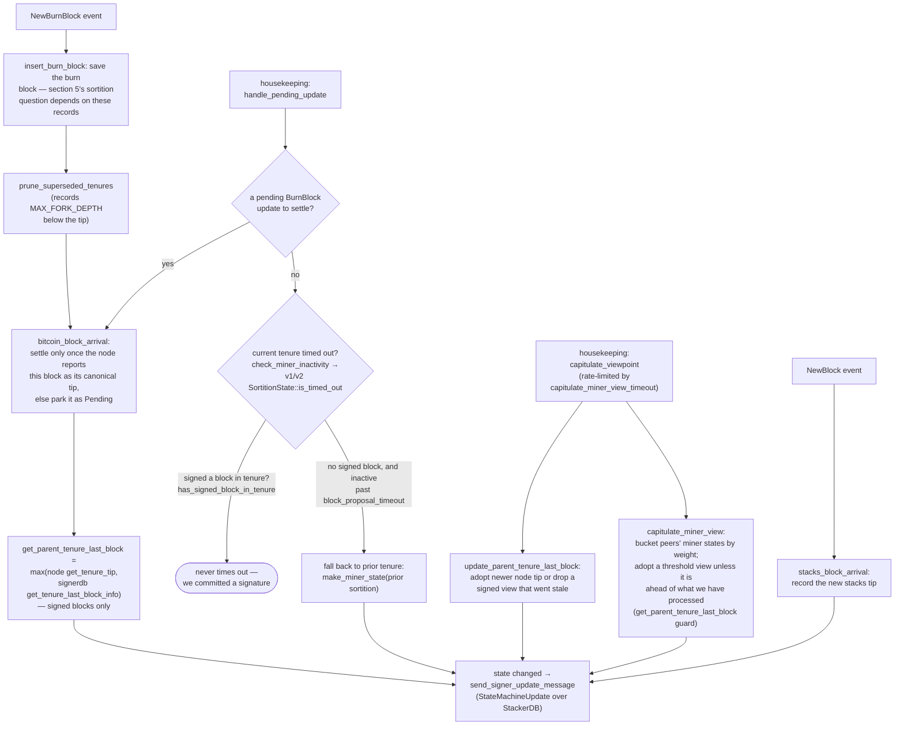

## Finding

### Title
Stale active-miner state can let a signer sign a block whose miner/consensus-hash/bitvec no longer match its current view - ([File: stacks-signer/src/v0/signer.rs])

### Summary
The signer only fully re-validates a block proposal against its *current* active-miner view (`GlobalStateView::check_proposal` / `SortitionsView::check_proposal`) once, at proposal-arrival time. The re-checks performed later — at validate-ok time and again right before the irreversible signature is produced when the pre-commit threshold is crossed — go through `check_block_against_signer_db_state`, which is explicitly documented as an *incomplete* check and only re-verifies tenure/parent-confirmation logic, not the miner-identity, consensus-hash, or bitvec conditions that `check_proposal` enforces.

### Finding Description
`GlobalStateView::check_proposal` (v2) validates, among other things:
- the block's `consensus_hash` matches the signer's current active miner's `tenure_id` [1](#0-0) 
- the recovered miner pubkey hash matches the current active miner's pubkey hash [2](#0-1) 
- the pox `bitvec` is all 1s [3](#0-2) 

These checks are only run once, at proposal arrival, as part of `check_block_against_state` → `check_proposal` (see the documented flow in `docs/signer-flows.md` section 3, anchored to `check_block_against_state` and `check_proposal`). [4](#0-3) 

Both later re-validation points — the validate-ok handler and the pre-commit-threshold handler right before signing — call `check_block_against_signer_db_state` instead, which is explicitly marked incomplete and only re-runs `check_tenure_change_confirms_parent` / `check_latest_block_in_tenure`: [5](#0-4) [6](#0-5) 

This same incomplete recheck is what runs immediately before a signature is actually produced, once ≥70% pre-commit weight is reached: [7](#0-6) 

Between the initial `check_proposal` pass and the moment the pre-commit threshold is crossed, the signer's `current_miner` view can change: burn-block arrival, `capitulate_viewpoint`/`capitulate_miner_view`, or a `StateMachineUpdate` from peers can shift `MinerState::ActiveMiner` (tenure_id, parent_tenure_id, current_miner_pkh) to a different miner/tenure, as documented in the state-machine flow (`docs/signer-flows.md` section 8, anchored to `capitulate_miner_view`, `update_parent_tenure_last_block`). [8](#0-7) 

Because the recheck at pre-commit-threshold time does not repeat the `consensus_hash`/`current_miner_pkh`/`bitvec_all_1s` checks, a block that was valid against the *old* active-miner view when first proposed, and reached the pre-commit weight threshold before that view changed enough to be re-evaluated, can still cross into `mark_locally_accepted` / `handle_block_signature` and receive this signer's signature even though it is proposed by a miner or for a tenure the signer's *current* state machine no longer recognizes as active. This is precisely the class of bug the report describes for Morpho/Compound: a validation performed once at entry is not re-verified before the final, irreversible action (Compound's per-call `borrowCaps`/`borrowGuardianPaused` check vs. Morpho's borrow that skips re-checking these at the point where P2P borrow is actually executed).

### Impact Explanation
This breaks the "signed reflects current-canonical-view" equality: the signer's irreversible act (a signature) is produced based on a stale snapshot of miner/tenure identity rather than the view active at signing time. If exploited at scale this could contribute to signatures being placed on blocks from a miner/tenure the signer's own state machine has since abandoned, which is the Critical-tier concern ("a signer signing an invalid, non-canonical, or conflicting block").

### Likelihood Explanation
This requires no majority and no other signer's key: it only requires a single miner and normal gossip timing — a fully compliant proposal at time T is accepted and pre-committed; later (before the pre-commit threshold is crossed) the local `current_miner` view moves on due to routine state-machine capitulation, gossip `StateMachineUpdate`s from other signers, or burn-block arrival, exactly the mechanism `docs/signer-flows.md` documents as expected, ordinary behavior, not an edge case requiring adversarial control.

### Recommendation
Re-run the full `check_proposal` (or at minimum the active-miner-identity, consensus-hash, and bitvec checks) as part of `check_block_against_signer_db_state`, both at validate-ok time and immediately before a signature is produced in `handle_block_pre_commit`, rather than relying solely on the tenure/parent-confirmation subset.

### Proof of Concept
1. Signer receives block proposal P for tenure/consensus_hash CH1 from miner M1; `check_proposal` passes because `current_miner` == M1/CH1; proposal is submitted to node and returns Ok; signer sends pre-commit.
2. Before pre-commit weight reaches 70%, the signer's local state machine capitulates (via `capitulate_miner_view`) to a different active miner/tenure view, e.g. because peers gossip a `StateMachineUpdate` for a newer burn block. `current_miner` is updated away from M1/CH1.
3. Remaining peers' pre-commits for P arrive and cross the 70% threshold. `handle_block_pre_commit` calls `check_block_against_signer_db_state`, which only checks `check_tenure_change_confirms_parent`/`check_latest_block_in_tenure` — it does not compare P's `consensus_hash`/miner pubkey against the now-updated `current_miner`.
4. The check passes (parent/tenure confirmation logic is unaffected), and the signer calls `mark_locally_accepted`/`handle_block_signature`, signing P even though its own state machine's `current_miner` no longer matches P's tenure/miner.

### Citations

**File:** stacks-signer/src/chainstate/v2.rs (L119-145)
```rust
        let MinerState::ActiveMiner {
            current_miner_pkh,
            tenure_id,
            parent_tenure_id,
            ..
        } = &self.signer_state.current_miner
        else {
            info!(
                "No valid current miner. Considering invalid.";
                "block_height" => block.header.chain_length,
                "signer_signature_hash" => %block.header.signer_signature_hash()
            );
            return Err(RejectReason::InvalidMiner);
        };
        if &block.header.consensus_hash != tenure_id {
            info!("Miner block proposal consensus hash does not match the current miner's tenure id. Considering invalid.";
                "block_height" => block.header.chain_length,
                "signer_signature_hash" => %block.header.signer_signature_hash(),
                "block_consensus_hash" => %block.header.consensus_hash,
                "active_miner_tenure_id" => %tenure_id,
                "active_miner_parent_tenure_id" => %parent_tenure_id,
            );
            return Err(RejectReason::ConsensusHashMismatch {
                actual: block.header.consensus_hash.clone(),
                expected: tenure_id.clone(),
            });
        }
```

**File:** stacks-signer/src/chainstate/v2.rs (L146-163)
```rust
        let Some(miner_pk) = block.header.recover_miner_pk() else {
            warn!("Failed to recover miner pubkey";
                  "signer_signature_hash" => %block.header.signer_signature_hash(),
                  "consensus_hash" => %block.header.consensus_hash);
            return Err(RejectReason::IrrecoverablePubkeyHash);
        };
        let miner_pkh = Hash160::from_data(&miner_pk.to_bytes_compressed());
        if current_miner_pkh != &miner_pkh {
            warn!(
                "Miner block proposal pubkey does not match the winning pubkey hash for its sortition. Considering invalid.";
                "proposed_block_consensus_hash" => %block.header.consensus_hash,
                "signer_signature_hash" => %block.header.signer_signature_hash(),
                "proposed_block_pubkey" => &miner_pk.to_hex(),
                "proposed_block_pubkey_hash" => %miner_pkh,
                "active_miner_pubkey_hash" => %current_miner_pkh,
            );
            return Err(RejectReason::PubkeyHashMismatch);
        }
```

**File:** stacks-signer/src/chainstate/v2.rs (L164-174)
```rust
        let bitvec_all_1s = block.header.pox_treatment.iter().all(|entry| entry);
        if !bitvec_all_1s {
            warn!(
                "Miner block proposal has bitvec field which punishes in disagreement with signer. Considering invalid.";
                "proposed_block_consensus_hash" => %block.header.consensus_hash,
                "signer_signature_hash" => %block.header.signer_signature_hash(),
                "active_miner_consensus_hash" => ?tenure_id,
                "active_miner_parent_consensus_hash" => ?parent_tenure_id,
            );
            return Err(RejectReason::InvalidBitvec);
        }
```

**File:** stacks-signer/src/v0/signer.rs (L811-870)
```rust
    fn check_block_against_state(
        &mut self,
        stacks_client: &StacksClient,
        sortition_state: &mut Option<SortitionsView>,
        block_info: &BlockInfo,
    ) -> Option<BlockRejection> {
        // First update our global state evaluator with our local state if we have one
        let local_version = self.get_signer_protocol_version();
        if let Ok(update) = self
            .local_state_machine
            .try_into_update_message_with_version(local_version)
        {
            self.global_state_evaluator
                .insert_update(self.stacks_address.clone(), update);
        };
        let Some(state_version) = self.determine_active_signer_protocol_version() else {
            warn!(
                "{self}: No consensus on signer protocol version. Unable to validate block. Rejecting.";
                "signer_signature_hash" => %block_info.block.header.signer_signature_hash(),
                "block_id" => %block_info.block.block_id(),
            );
            return Some(
                self.create_block_rejection(RejectReason::NoSignerConsensus, &block_info.block),
            );
        };

        // reject if the block itself is malformed
        if !block_info.check_static_valid_block() {
            debug!("{self}: Block is syntatically invalid; will not process");
            return Some(self.create_block_rejection(
                RejectReason::ValidationFailed(ValidateRejectCode::InvalidBlock),
                &block_info.block,
            ));
        }

        // For this first version, reject any block that marks transactions as
        // problematic. The criteria for what may legitimately appear in
        // `problematic_txs` has not been decided yet, so signers reject all
        // such blocks until that policy is established.
        if !block_info.block.header.problematic_txs.is_empty() {
            warn!(
                "{self}: Block proposal marks transactions as problematic, which signers do not yet allow; rejecting";
                "signer_signature_hash" => %block_info.block.header.signer_signature_hash(),
                "block_id" => %block_info.block.block_id(),
                "problematic_tx_count" => block_info.block.header.problematic_txs.len(),
            );
            return Some(
                self.create_block_rejection(
                    RejectReason::ProblematicTransactions,
                    &block_info.block,
                ),
            );
        }

        if state_version.uses_global_state() {
            self.check_block_against_global_state(stacks_client, &block_info.block)
        } else {
            self.check_block_against_local_state(stacks_client, sortition_state, &block_info.block)
        }
    }
```

**File:** stacks-signer/src/v0/signer.rs (L1340-1366)
```rust
        // The chain and signer db state may have changed materially since this block passed the
        // proposal-time checks (e.g. between validation and reaching the pre-commit threshold we
        // may have signed a block that this one would reorg). Re-run the chainstate checks
        // before putting a signature over the block, and respond with a rejection if they no
        // longer pass, just as the block validation response handler does.
        if let Some(block_rejection) =
            self.check_block_against_signer_db_state(stacks_client, &block_info.block)
        {
            warn!(
                "{self}: Reached the pre-commit threshold for a block, but it no longer passes the chainstate checks. Rejecting.";
                "signer_signature_hash" => %block_hash,
                "block_height" => block_info.block.header.chain_length,
                "reject_code" => %block_rejection.reason_code,
                "reject_reason" => &block_rejection.reason,
            );
            if let Err(e) = block_info.mark_locally_rejected() {
                if !block_info.has_reached_consensus() {
                    warn!("{self}: Failed to mark block as locally rejected: {e:?}");
                }
            };
            self.signer_db
                .insert_block(&block_info)
                .unwrap_or_else(|e| self.handle_insert_block_error(e));
            self.handle_block_rejection(&block_rejection, sortition_state);
            self.send_block_response(&block_info.block, block_rejection.into());
            return;
        }
```

**File:** stacks-signer/src/v0/signer.rs (L1799-1841)
```rust
    /// WARNING: This is an incomplete check. Do NOT call this function PRIOR to check_proposal or block_proposal validation succeeds.
    ///
    /// Re-verify a block's chain length against the last signed block within signerdb.
    /// This is required in case a block has been approved since the initial checks of the block validation endpoint.
    fn check_block_against_signer_db_state(
        &mut self,
        stacks_client: &StacksClient,
        proposed_block: &NakamotoBlock,
    ) -> Option<BlockRejection> {
        let signer_signature_hash = proposed_block.header.signer_signature_hash();
        // If this is a tenure change block, ensure that it confirms the correct number of blocks from the parent tenure.
        if let Some(tenure_change) = proposed_block.get_tenure_change_tx_payload() {
            // Ensure that the tenure change block confirms the expected parent block
            match SortitionData::check_tenure_change_confirms_parent(
                tenure_change,
                proposed_block,
                &mut self.signer_db,
                stacks_client,
                self.proposal_config.tenure_last_block_proposal_timeout,
                self.proposal_config.reorg_attempts_activity_timeout,
            ) {
                Ok(true) => return None,
                Ok(false) => {
                    return Some(self.create_block_rejection(
                        RejectReason::SortitionViewMismatch,
                        proposed_block,
                    ))
                }
                Err(e) => {
                    warn!("{self}: Error checking block proposal: {e}";
                        "signer_signature_hash" => %signer_signature_hash,
                        "block_id" => %proposed_block.block_id()
                    );
                    return Some(self.create_block_rejection(
                        RejectReason::ConnectivityIssues(
                            "error checking block proposal".to_string(),
                        ),
                        proposed_block,
                    ));
                }
            }
        }

```

**File:** stacks-signer/src/v0/signer.rs (L1946-1959)
```rust
        if let Some(block_rejection) =
            self.check_block_against_signer_db_state(stacks_client, &block_info.block)
        {
            // The signer db state has changed. We no longer view this block as valid. Override the validation response.
            if let Err(e) = block_info.mark_locally_rejected() {
                if !block_info.has_reached_consensus() {
                    warn!("{self}: Failed to mark block as locally rejected: {e:?}");
                }
            };
            self.signer_db
                .insert_block(&block_info)
                .unwrap_or_else(|e| self.handle_insert_block_error(e));
            self.handle_block_rejection(&block_rejection, sortition_state);
            self.send_block_response(&block_info.block, block_rejection.into());
```

**File:** docs/signer-flows.md (L458-476)
```markdown

```
