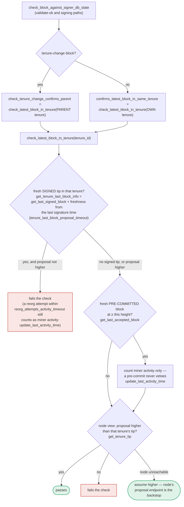

### Title
Time-window mismatch between `get_tenure_last_block_info`'s freshness check and the global `get_signed_conflicts` guard lets a signer sign two conflicting blocks at the same height/tenure - ([File: stacks-signer/src/chainstate/mod.rs])

### Summary
The reported bug is a class of TOCTOU/boundary-drift issue: a state-changing action (`claim`) records a value (`LAST_CLAIMED_EPOCH`) based on a *mutable, time/height-dependent boundary* (`preliminary_end_epoch`, gated by `farm_expiration_time`), and a second action (`expand_farm`) can shift that boundary afterward, leaving a gap the first commitment can never retroactively cover. The analogous mechanism in `stacks-signer` is the freshness window used to decide whether a signer's own prior signature still "pins"/vetoes a conflicting proposal at the same height. `get_tenure_last_block_info` [1](#0-0)  treats a previously signed block as vetoing a new proposal only while `signed_self.max(signed_group) + tenure_last_block_proposal_timeout > now`; once that wall-clock window elapses, the veto silently disappears and `check_latest_block_in_tenure` falls back to asking the node for the tenure tip [2](#0-1) .

### Finding Description
This time-window is used at three separate call sites (proposal arrival, validate-ok, and signing time), per the documented flow [3](#0-2) . Because the check is evaluated independently, at different wall-clock instants, for the *same tenure_id*, the answer can flip between calls exactly like the farm's `is_farm_expired`/`preliminary_end_epoch` boundary flips between the user's `claim` and the owner's `expand_farm`.

Concretely: two conflicting tenure-start blocks A and B can both be tracked locally after passing the async node-validation window (documented explicitly as the "sibling race" scenario) [4](#0-3) . If the signer signs A first, and B's validation OK arrives after A's `tenure_last_block_proposal_timeout` window has elapsed, `get_tenure_last_block_info` no longer reports A as the tenure tip, so the height-based veto in `check_latest_block_in_tenure` no longer blocks B [5](#0-4) . The docs themselves flag the resulting gap: "Because the duplicate check never runs again, a block that crosses the pre-commit threshold long after it was proposed relies on section 5's own-tenure conflict guard to cover the same ground" [6](#0-5) . That is, the design intentionally relies on a *second*, independent check (the cross-tenure conflict guard driven by `get_signed_conflicts`, which the search confirmed exists in `signerdb.rs` and is invoked from `signer.rs`) to compensate for the primary check's window expiring. This produces exactly the same class of hazard as the farm bug: a safety property ("don't sign a second block that conflicts with one you already signed at the same height") is enforced by a *time-bounded* check whose window can lapse between the two decision points, and the correctness of the overall system now depends on whether a second, differently-parameterized safeguard (`get_signed_conflicts`'s own freshness rules) perfectly covers every case the first one no longer does.

I was not able to fully retrieve and diff the exact freshness parameters used inside `handle_block_pre_commit`'s conflict guard (the function invoking `get_signed_conflicts`) before running out of tool budget, so I cannot confirm with certainty whether that second guard's window is strictly larger than or equal to `tenure_last_block_proposal_timeout` in all configurations, or whether there is a parameter combination (e.g. `tenure_last_block_proposal_timeout` set short relative to node validation latency, or a busy validation queue backing up B's proposal) under which both guards can be simultaneously stale and a real signer would sign both A and B.

### Impact Explanation
If the gap is real, this is a Critical-class issue per the scope's own impact bar: "a signer signing an invalid, non-canonical, or conflicting block." Signing two conflicting blocks at the same chain height within the same tenure directly breaks the one-per-height/no-conflicting-signature invariant that block validity and fork-choice depend on, and — unlike the farm bug's fund-loss impact — a network-visible double signature from an honest-looking signer undermines the safety guarantee signers are meant to provide.

### Likelihood Explanation
Likelihood is speculative rather than confirmed, because:
- The scenario requires the specific timing where node validation for a re-proposed/sibling block returns *after* the first proposal's signature has aged past `tenure_last_block_proposal_timeout`.
- The code already contains an explicit test scaffold for the "sibling race" (`run_sibling_scenario`) covering exactly this window, which strongly suggests the maintainers are aware of the race and have built a mitigating conflict guard (`get_signed_conflicts`) specifically to close it.
- Without reading the exact conflict-guard freshness parameters (out of budget), I cannot assert this is currently unmitigated; it may already be a closed race in the current code, in which case this would not qualify as a new, reachable one-miner-triggerable finding.

Given this uncertainty, and per the rules to only report a *concrete, provable* break, I cannot assert with confidence that this analog is currently exploitable in this repository's shipped logic — only that the report's bug *class* (a wall-clock/boundary check whose result can silently change between two decision points on the same mutable resource) has a structurally similar counterpart here.

### Recommendation
If pursued, a background engineer should: (1) read `handle_block_pre_commit`'s conflict-check logic and the exact `get_signed_conflicts` freshness semantics in `stacks-signer/src/signerdb.rs`; (2) construct a concrete timeline (config values for `tenure_last_block_proposal_timeout`, `block_proposal_validation_timeout`, and node validation latency) where `get_tenure_last_block_info`'s veto has expired for block A but `get_signed_conflicts`'s guard has not yet been consulted or also treats A as stale, at the moment B's validate-ok is processed; (3) if such a window exists, tighten `get_signed_conflicts` to never expire faster than `tenure_last_block_proposal_timeout`, or make the height-based veto in `check_latest_block_in_tenure` consult `get_signed_conflicts` directly instead of the tenure-scoped freshness check alone.

### Proof of Concept
Not constructed — this requires exact reproduction of the async validation race with concrete config values and a full replay of `handle_block_pre_commit`'s guard, which was not completed within the available tool budget. The existing test scaffold `run_sibling_scenario` in `stacks-signer/src/v0/tests.rs` (lines 591–678) is the natural starting point to adapt into a concrete PoC that sets `tenure_last_block_proposal_timeout` shorter than the sibling's validation-return delay and asserts whether both A and B end up signed.

### Citations

**File:** stacks-signer/src/chainstate/mod.rs (L330-364)
```rust
    pub fn get_tenure_last_block_info(
        consensus_hash: &ConsensusHash,
        signer_db: &SignerDb,
        tenure_last_block_proposal_timeout: Duration,
    ) -> Result<Option<BlockInfo>, ClientError> {
        // Get the last signed block in the tenure
        let last_signed_block = signer_db
            .get_last_signed_block(consensus_hash)
            .map_err(|e| ClientError::InvalidResponse(e.to_string()))?;

        let Some(block_info) = last_signed_block else {
            return Ok(None);
        };

        // `approved_time` may hold the pre-commit time; use the actual signature time.
        let Some(signed_over_time) = block_info.signed_self.max(block_info.signed_group) else {
            return Ok(None);
        };

        if signed_over_time.saturating_add(tenure_last_block_proposal_timeout.as_secs())
            > get_epoch_time_secs()
        {
            // The last accepted block is not timed out, return it
            Ok(Some(block_info))
        } else {
            // The last accepted block is timed out
            info!(
                "Last accepted block has timed out";
                "signer_signature_hash" => %block_info.block.header.signer_signature_hash(),
                "signed_over_time" => signed_over_time,
                "state" => %block_info.state,
            );
            Ok(None)
        }
    }
```

**File:** stacks-signer/src/chainstate/mod.rs (L376-478)
```rust
    pub fn check_latest_block_in_tenure(
        tenure_id: &ConsensusHash,
        block: &NakamotoBlock,
        signer_db: &mut SignerDb,
        client: &StacksClient,
        tenure_last_block_proposal_timeout: Duration,
        reorg_attempts_activity_timeout: Duration,
    ) -> Result<bool, ClientError> {
        let last_block_info = SortitionData::get_tenure_last_block_info(
            tenure_id,
            signer_db,
            tenure_last_block_proposal_timeout,
        )?;

        if let Some(info) = last_block_info {
            // N.B. this block might not be the last globally accepted block across the network;
            // it's just the highest one in this tenure that we know about.  If this given block is
            // no higher than it, then it's definitely no higher than the last globally accepted
            // block across the network, so we can do an early rejection here.
            if block.header.chain_length <= info.block.header.chain_length {
                warn!(
                    "Miner's block proposal does not confirm as many blocks as we expect";
                    "proposed_block_consensus_hash" => %block.header.consensus_hash,
                    "signer_signature_hash" => %block.header.signer_signature_hash(),
                    "proposed_chain_length" => block.header.chain_length,
                    "expected_at_least" => info.block.header.chain_length + 1,
                );
                if info.signed_group.is_none_or(|signed_time| {
                    signed_time + reorg_attempts_activity_timeout.as_secs() > get_epoch_time_secs()
                }) {
                    // Note if there is no signed_group time, this is a locally accepted block (i.e. tenure_last_block_proposal_timeout has not been exceeded).
                    // Treat any attempt to reorg a locally accepted block as valid miner activity.
                    // If the call returns a globally accepted block, check its globally accepted time against a quarter of the block_proposal_timeout
                    // to give the miner some extra buffer time to wait for its chain tip to advance
                    // The miner may just be slow, so count this invalid block proposal towards valid miner activity.
                    if let Err(e) = signer_db.update_last_activity_time(
                        &block.header.consensus_hash,
                        get_epoch_time_secs(),
                    ) {
                        warn!("Failed to update last activity time: {e}");
                    }
                }
                return Ok(false);
            }
        }

        // A block we have only pre-committed to must NOT veto this proposal, but, similar to above
        // this should still count as activity for the miner.
        let last_accepted_block = signer_db
            .get_last_accepted_block(tenure_id)
            .map_err(|e| ClientError::InvalidResponse(e.to_string()))?;
        if let Some(info) = last_accepted_block {
            let is_fresh_pre_commit = info.state == BlockState::PreCommitted
                && info.approved_time.is_some_and(|approved_time| {
                    approved_time.saturating_add(tenure_last_block_proposal_timeout.as_secs())
                        > get_epoch_time_secs()
                });
            if is_fresh_pre_commit && block.header.chain_length <= info.block.header.chain_length {
                info!(
                    "Miner's block proposal conflicts with a block we have only pre-committed to. Counting it as miner activity, but not rejecting the proposal.";
                    "proposed_block_consensus_hash" => %block.header.consensus_hash,
                    "signer_signature_hash" => %block.header.signer_signature_hash(),
                    "proposed_chain_length" => block.header.chain_length,
                    "pre_committed_signer_signature_hash" => %info.block.header.signer_signature_hash(),
                    "pre_committed_chain_length" => info.block.header.chain_length,
                );
                if let Err(e) = signer_db
                    .update_last_activity_time(&block.header.consensus_hash, get_epoch_time_secs())
                {
                    warn!("Failed to update last activity time: {e}");
                }
            }
        }

        let tip = match client.get_tenure_tip(tenure_id) {
            Ok(tip) => tip.anchored_header,
            Err(e) => {
                warn!(
                    "Failed to fetch the tenure tip for the parent tenure: {e:?}. Assuming proposal is higher than the parent tenure for now.";
                    "proposed_block_consensus_hash" => %block.header.consensus_hash,
                    "signer_signature_hash" => %block.header.signer_signature_hash(),
                    "parent_tenure" => %tenure_id,
                );
                return Ok(true);
            }
        };
        if let Some(nakamoto_tip) = tip.as_stacks_nakamoto() {
            // If we have seen this block already, make sure its state is updated to globally accepted.
            // Otherwise, don't worry about it.
            if let Ok(Some(mut block_info)) =
                signer_db.block_lookup(&nakamoto_tip.signer_signature_hash())
            {
                if block_info.state != BlockState::GloballyAccepted {
                    if let Err(e) = block_info.mark_globally_accepted() {
                        warn!("Failed to mark block as globally accepted: {e}");
                    } else if let Err(e) = signer_db.insert_block(&block_info) {
                        warn!("Failed to update block info in db: {e}");
                    }
                }
            }
        }
        Ok(tip.height() < block.header.chain_length)
    }
```

**File:** docs/signer-flows.md (L391-418)
```markdown
`check_latest_block_in_tenure` answers "does this block confirm the tip we
expect?" and it runs in three places: at proposal arrival (inside
`check_proposal`), at validate-ok, and at the moment of signing. _Which_ tenure
it is asked about depends on the block: a tenure-change block is checked against
its **parent** tenure, every other block against its **own**. Never both. The
pivotal helper is `get_tenure_last_block_info`, which considers only blocks that
carry a signature (`get_last_signed_block`): a pre-commit never vetoes anything,
it only counts as miner activity.


```

**File:** docs/signer-flows.md (L435-437)
```markdown
Because the duplicate check never runs again, a block that crosses the pre-commit
threshold long after it was proposed relies on section 5's own-tenure conflict
guard to cover the same ground.
```

**File:** stacks-signer/src/v0/tests.rs (L591-602)
```rust
    /// Drive the sibling race: two conflicting tenure-start blocks A and B are both tracked
    /// (as they would be after screening two proposals within the async-validation window),
    /// A's validation returns first and is signed, then B's validation returns. Returns the
    /// resulting `BlockInfo` for A (captured right after its own validation), for B (captured
    /// right after its validation), and for B after an optional re-proposal.
    ///
    /// `tenure_last_block_proposal_timeout` controls whether A's signature is still fresh when
    /// B crosses the pre-commit threshold. `serve_sibling_as_tip` controls whether the mock
    /// node reports A (height 10) or the parent (height 9) as the canonical tenure tip, which
    /// is what the signer consults once the signature has timed out. If `re_propose_b_after` is
    /// set, the miner re-submits B's proposal after that delay (as it does after a signature
    /// timeout) and B's `BlockInfo` is captured again as the third element.
```
