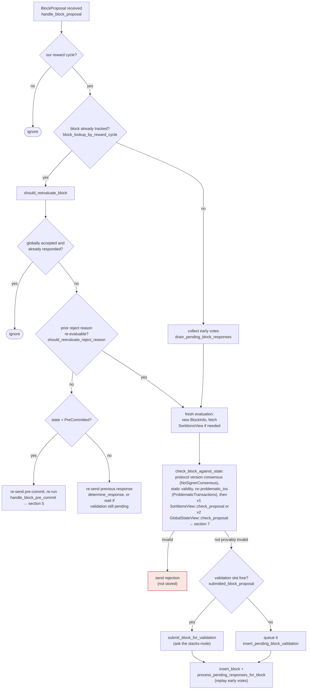

This confirms the architecture: the signer's `check_proposal` heuristic (`bitvec_all_1s`) is only a pre-filter, not the canonical PoX validation. The signer always proceeds to submit the proposal to the stacks-node via `submit_block_for_validation` [1](#0-0) , and the node's own consensus-level `check_pox_bitvector` function performs the actual length/reward-set cross-check against the on-chain `active_reward_set` and `LeaderBlockCommitOp.treatment`, rejecting any bitvec whose per-slot values disagree with the block commit's PoX handling [2](#0-1) . A signer only pre-commits/signs after receiving an `Ok` verdict from this node validation (`handle_block_validate_response` → `handle_block_validate_ok`) [3](#0-2) , and the decision flow documented in `docs/signer-flows.md` explicitly shows `check_proposal` runs before spending a node validation, with the node's actual execution check (`NODE`) as a separate, mandatory gate before any signature [4](#0-3) .

### Analysis of the claimed vulnerability

The premise — that `bitvec_all_1s` being satisfied lets a signer sign a block whose PoX-reward encoding diverges from the canonical view — does not hold given the actual code path:

1. **`bitvec_all_1s` is a heuristic filter, not the full consensus check.** In `stacks-signer/src/chainstate/v1.rs` and `v2.rs`, `check_proposal` only checks that no signer is being "punished" (all treatment bits are 1) [5](#0-4) . It intentionally does not re-derive the full PoX vector — that job belongs to the node.

2. **The node performs the exact equality check the question worries is missing.** `check_pox_bitvector` in `stackslib/src/chainstate/nakamoto/mod.rs` walks the `active_reward_set`'s `rewarded_addresses()`, maps them to bitvec indices, and compares against the block-commit's `treatment` (from the burnchain operation itself, which encodes the actual PoX cycle/anchor at the time of the sortition). If `all_1` bits disagree with a `punish` treatment, or `all_0` bits disagree with a `reward` treatment, the block is rejected with `"Bitvec does not match the block commit's PoX handling"` [6](#0-5) . This directly ties the bitvec's length and per-index meaning to the reward set active during that specific sortition/cycle — exactly the cross-check the question claims is absent.

3. **A wrong-length/wrong-cycle bitvec cannot slip through unnoticed.** If a bitvec is shorter than the reward set, missing indices default to `true` (treated as rewarded) rather than being silently accepted as matching a punish outcome [7](#0-6) , which would cause a mismatch against any real punishment in the block commit and trigger rejection — it does not create a path to acceptance of a stale/truncated vector.

4. **The existing test suite exercises exactly this scenario** (`pox_treatment` test in `stackslib/src/chainstate/nakamoto/coordinator/tests.rs`), confirming that a bitvec inconsistent with the block commit's actual PoX treatment causes `ChainstateError::InvalidStacksBlock("Bitvec does not match the block commit's PoX handling")` [8](#0-7) .

Since the signer never signs until the node returns `Ok` from this validation, and the node's validation is the canonical source of truth for the reward-cycle-bound PoX vector, the attacker's crafted stale/mismatched all-ones bitvec would be rejected at the node validation step regardless of what the signer's local `bitvec_all_1s` heuristic concludes. The signer's local check is a fast-fail optimization layered in front of, not a replacement for, the canonical check.

#No vulnerability found for this question.

### Citations

**File:** stacks-signer/src/v0/signer.rs (L2053-2080)
```rust
    /// Handle the block validate response returned from our prior calls to submit a block for validation
    fn handle_block_validate_response(
        &mut self,
        stacks_client: &StacksClient,
        block_validate_response: &BlockValidateResponse,
        sortition_state: &mut Option<SortitionsView>,
    ) {
        info!("{self}: Received a block validate response: {block_validate_response:?}");
        match block_validate_response {
            BlockValidateResponse::Ok(block_validate_ok) => {
                crate::monitoring::actions::record_block_validation_latency(
                    block_validate_ok.validation_time_ms,
                );
                self.handle_block_validate_ok(stacks_client, block_validate_ok, sortition_state);
            }
            BlockValidateResponse::Reject(block_validate_reject) => {
                self.handle_block_validate_reject(block_validate_reject, sortition_state);
            }
        };
        // Remove this block validation from the pending table
        let signer_sig_hash = block_validate_response.signer_signature_hash();
        self.signer_db
            .remove_pending_block_validation(signer_sig_hash)
            .unwrap_or_else(|e| warn!("{self}: Failed to remove pending block validation: {e:?}"));

        // Check if there is a pending block validation that we need to submit to the node
        self.check_pending_block_validations(stacks_client);
    }
```

**File:** stacks-signer/src/v0/signer.rs (L2613-2626)
```rust
        match stacks_client.submit_block_for_validation(
            block.clone(),
            if self.validate_with_replay_tx {
                self.global_state_evaluator
                    .get_global_tx_replay_set()
                    .unwrap_or_default()
                    .clone_as_optional()
            } else {
                None
            },
        ) {
            Ok(_) => {
                self.submitted_block_proposal = Some((signer_signature_hash, Instant::now()));
            }
```

**File:** stackslib/src/chainstate/nakamoto/mod.rs (L4879-4966)
```rust
    /// Verify that the PoX bitvector from the block header is consistent with the block-commit's
    /// PoX outputs, as determined by the active reward set and whether or not the 0's in the
    /// bitvector correspond to signers' PoX outputs.
    fn check_pox_bitvector(
        block_bitvec: &BitVec<4000>,
        tenure_block_commit: &LeaderBlockCommitOp,
        active_reward_set: &RewardSet,
    ) -> Result<(), ChainstateError> {
        if tenure_block_commit.treatment.is_empty() {
            return Ok(());
        }

        let rewarded_addresses = match active_reward_set.rewarded_addresses() {
            Some(addrs) => addrs,
            // Waterfall cycles have no PoX reward addresses, so no bitvector to check
            None => return Ok(()),
        };

        let address_to_indeces: HashMap<_, Vec<_>> =
            rewarded_addresses
                .iter()
                .enumerate()
                .fold(HashMap::new(), |mut map, (ix, addr)| {
                    map.entry(addr).or_default().push(ix);
                    map
                });

        // our block commit issued a punishment, check the reward set and bitvector
        //  to ensure that this was valid.
        for treated_addr in tenure_block_commit.treatment.iter() {
            if treated_addr.is_burn() {
                // Don't need to assert anything about burn addresses.
                // If they were in the reward set, "punishing" them is meaningless.
                continue;
            }
            // otherwise, we need to find the indices in the rewarded_addresses
            //  corresponding to this address.
            let empty_vec = vec![];
            let address_indices = address_to_indeces
                .get(treated_addr.deref())
                .unwrap_or(&empty_vec);

            // if any of them are 0, punishment is okay.
            // if all of them are 1, punishment is not okay.
            // if all of them are 0, *must* have punished
            let bitvec_values: Result<Vec<_>, ChainstateError> = address_indices
                .iter()
                .map(
                    |ix| {
                        let ix = u16::try_from(*ix)
                            .map_err(|_| ChainstateError::InvalidStacksBlock("Reward set index outside of u16".into()))?;
                        let bitvec_value = block_bitvec.get(ix)
                            .unwrap_or_else(|| {
                                warn!("Block header's bitvec is smaller than the reward set, defaulting higher indexes to 1");
                                true
                            });
                        Ok(bitvec_value)
                    }
                )
                .collect();
            let bitvec_values = bitvec_values?;
            let all_1 = bitvec_values.iter().all(|x| *x);
            let all_0 = bitvec_values.iter().all(|x| !x);
            if all_1 {
                if treated_addr.is_punish() {
                    warn!(
                        "Invalid Nakamoto block: punished PoX address when bitvec contained 1s for the address";
                        "reward_address" => %treated_addr.deref(),
                        "bitvec_values" => ?bitvec_values,
                    );
                    return Err(ChainstateError::InvalidStacksBlock(
                        "Bitvec does not match the block commit's PoX handling".into(),
                    ));
                }
            } else if all_0 && treated_addr.is_reward() {
                warn!(
                    "Invalid Nakamoto block: rewarded PoX address when bitvec contained 0s for the address";
                    "reward_address" => %treated_addr.deref(),
                    "bitvec_values" => ?bitvec_values,
                );
                return Err(ChainstateError::InvalidStacksBlock(
                    "Bitvec does not match the block commit's PoX handling".into(),
                ));
            }
        }

        Ok(())
    }
```

**File:** docs/signer-flows.md (L164-203)
```markdown
## 3. A block proposal arrives

The miner broadcasts a proposal. If we've seen this exact block before,
`should_reevaluate_block` decides whether the old verdict stands; a block we
only pre-committed to is deliberately routed back through the pre-commit
evaluation so a re-proposal cannot shortcut to a signature. A fresh proposal is
checked against our view of the world _before_ spending a node validation on it.



Early votes: acceptances, rejections, and pre-commits that arrived before the
proposal itself are parked in pending tables and replayed once the proposal is
known.

> Anchors: `handle_block_proposal`, `should_reevaluate_block`,
> `should_reevaluate_reject_reason`, `check_block_against_state`,
> `submit_block_for_validation`, `process_pending_responses_for_block`
> (signer.rs); `check_proposal` (chainstate/v1.rs, v2.rs)
```

**File:** stacks-signer/src/chainstate/v2.rs (L164-174)
```rust
        let bitvec_all_1s = block.header.pox_treatment.iter().all(|entry| entry);
        if !bitvec_all_1s {
            warn!(
                "Miner block proposal has bitvec field which punishes in disagreement with signer. Considering invalid.";
                "proposed_block_consensus_hash" => %block.header.consensus_hash,
                "signer_signature_hash" => %block.header.signer_signature_hash(),
                "active_miner_consensus_hash" => ?tenure_id,
                "active_miner_parent_consensus_hash" => ?parent_tenure_id,
            );
            return Err(RejectReason::InvalidBitvec);
        }
```

**File:** stackslib/src/chainstate/nakamoto/coordinator/tests.rs (L1819-1827)
```rust
    let processing_result = peer.try_process_block(&invalid_block).unwrap_err();
    assert_eq!(
        processing_result.to_string(),
        "Bitvec does not match the block commit's PoX handling".to_string(),
    );
    assert!(matches!(
        processing_result,
        ChainstateError::InvalidStacksBlock(_),
    ));
```
