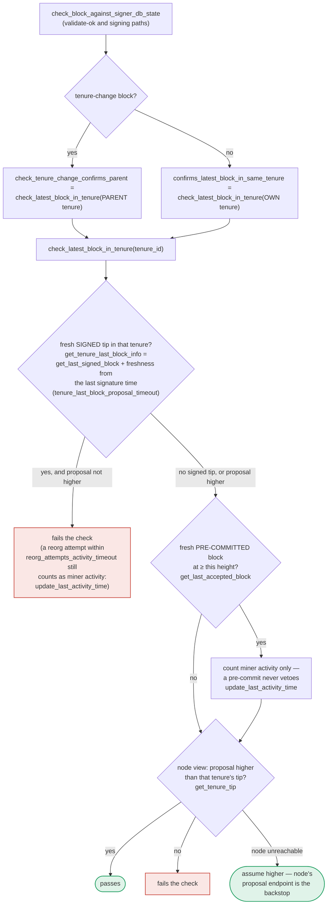

### Title
Fail-open trust of stacks-node RPC in `check_latest_block_in_tenure` lets a signer sign a conflicting/duplicate block at the same height in a tenure - (File: `stacks-signer/src/chainstate/mod.rs`)

### Summary
`SortitionData::check_latest_block_in_tenure` is the shared guard used at proposal-arrival, at validate-ok, and at signing time to stop a signer from endorsing a block that does not confirm the highest already-signed/pre-committed block in its tenure. When the signer's own local records (`get_tenure_last_block_info`/`get_last_accepted_block`) have no fresh entry, the function's *only* remaining defense is an RPC call to the local stacks-node (`client.get_tenure_tip`). If that call fails for any reason, the function does not fail closed — it returns `Ok(true)`, i.e. "assume the proposal is higher than the tenure tip," which lets the proposal pass this check.

### Finding Description [1](#0-0) 
The docstring for `check_latest_block_in_tenure` states the fail-open assumption explicitly and justifies it by claiming the stacks-node's `/v3/block_proposal` validation is a backstop: [2](#0-1) 
```
let tip = match client.get_tenure_tip(tenure_id) {
    Ok(tip) => tip.anchored_header,
    Err(e) => {
        warn!(... "Assuming proposal is higher than the parent tenure for now.");
        return Ok(true);
    }
};
```

The local-state defenses that this RPC call is meant to backstop are themselves conditional:
- `get_tenure_last_block_info` only returns a local record if it hasn't timed out per `tenure_last_block_proposal_timeout` [3](#0-2) .
- `get_last_accepted_block`/pre-commit freshness is similarly bounded by `tenure_last_block_proposal_timeout` [4](#0-3) .
- A signer that just started up, was re-registered, or whose local `signerdb` doesn't have the tenure's history (e.g. added mid-tenure, or the record timed out per the docs' own note: "Even globally accepted blocks are allowed to be timed out, as that triggers the signer to consult the Stacks node for the latest globally accepted block" [5](#0-4) ) has **no local record at all**, making the node RPC the sole check.

This function is invoked from three places that gate whether a proposal is treated as confirming the tenure's tip: `confirms_latest_block_in_same_tenure` and `check_tenure_change_confirms_parent` [6](#0-5) , which feed `check_proposal` in both v1 and v2 chainstate implementations [7](#0-6) , and per `docs/signer-flows.md` the same routine is also re-run at validate-ok and at the moment of signing [8](#0-7) .

The safety argument in the code comment — "this proposal ultimately must be passed to the `stacks-node` for proposal processing... we are relying on the `stacks-node` proposal endpoint to do the validation" — is an *external-dependency trust* argument: it assumes the node RPC used for signer-side conflict detection is unavailable only transiently, and that final node-side static/tx validation compensates. But `postblock_proposal.rs::validate` checks chain-length contiguity with the *immediate parent*, tenure/consensus-hash validity, and tx execution — it does **not** re-derive or enforce the anti-equivocation invariant that `check_latest_block_in_tenure` exists for (i.e., "don't sign two different blocks at the same height in the same tenure"). That invariant is specifically a signer-local, cross-context safety property, not something the node's stateless block-validate endpoint recomputes for the signer's own signing history. When the RPC call fails at exactly the moment this check runs (and no fresh local record exists), the fail-open path silently drops this specific defense while the caller proceeds as if the check passed.

This maps directly to the external report's bug class: a critical safety decision is delegated to an external call (here, the local `stacks-node` RPC) that is treated as trustworthy/available by default, and when that dependency does not answer, the code defaults to accepting rather than rejecting — the equivalent of "trusting a transient/unreachable external dependency" instead of failing safe.

### Impact Explanation
This is a High-impact liveness/safety-adjacent gap: it removes the equivocation guard specifically in the restart/stale-record scenario described in the rules ("acting on a stale reward set/threshold, or losing the equivocation guard on restart"). If a signer's local `signerdb` has no fresh record for a tenure (post-restart, newly registered, or after the freshness timeout elapses) and the stacks-node RPC (`get_tenure_tip`) is simultaneously unreachable or errors (node restart, resource exhaustion, temporary network partition between signer and its own node, RPC timeout under load), `check_latest_block_in_tenure` returns `Ok(true)` unconditionally. A one-slot miner can then propose a block at the same or lower chain length within that tenure — which should be rejected as non-confirming — and have it pass this particular chainstate check. Whether this ultimately produces a signature depends on the other independent checks in `check_proposal`/`check_block_against_signer_db_state`, but this specific, well-known equivocation guard is bypassed by construction whenever its external dependency does not answer, rather than failing closed.

### Likelihood Explanation
The trigger condition (no fresh local record + node RPC failure at exactly that check) is plausible during signer restarts, node restarts, or under transient node overload/network hiccups — conditions that are common in production infrastructure and require no majority collusion, no private keys, and no auth token; only a miner able to submit a competing/degenerate proposal during that narrow window plus an already-existing operational condition (node RPC unavailability) is needed. It's a race/availability condition rather than a guaranteed-repeatable exploit, so likelihood is moderate, but the code's own comments show this was a deliberate design tradeoff whose safety argument (node backstop) does not actually cover the equivocation property being checked.

### Recommendation
Fail closed (reject the proposal, or defer/retry) when `client.get_tenure_tip` errors and no fresh local record exists, rather than assuming `Ok(true)`. Alternatively, explicitly distinguish "no local record and node unreachable" from "no local record, node reachable, tip below proposal" and treat the former as `RejectReason::ConnectivityIssues` (as is already done in `check_proposal`'s error path for other client errors), rather than converting the error into an implicit acceptance inside `check_latest_block_in_tenure` itself. This preserves liveness by allowing retries while not silently discarding the equivocation guard when the "verifying" node happens to be unreachable at just the wrong moment.

### Proof of Concept
1. Bring a signer up fresh (empty/rotated `signerdb`), or wait until `tenure_last_block_proposal_timeout` elapses on an existing tenure record so `get_tenure_last_block_info`/`get_last_accepted_block` both return `None` [9](#0-8) .
2. Cause the signer's stacks-node RPC endpoint used by `get_tenure_tip` to be unreachable at that moment (node restart/overload/network blip). Note the existing test suite already demonstrates and relies on this exact fallback behavior when "nothing is listening": [10](#0-9) .
3. Submit (as the block proposer for that tenure) a competing block proposal at a chain length ≤ the tenure's true last block. `check_latest_block_in_tenure` returns `Ok(true)` instead of rejecting, because the RPC error path unconditionally short-circuits to "assume higher" [2](#0-1) .
4. The proposal passes this specific chainstate check and proceeds further down the acceptance pipeline without this guard having been enforced, despite the guard existing precisely to prevent the signer from endorsing a conflicting/duplicate-height block in the tenure.

### Citations

**File:** stacks-signer/src/chainstate/mod.rs (L317-329)
```rust
    /// Get the last signed block from the given tenure if it has not timed out.
    /// Even globally accepted blocks are allowed to be timed out, as that
    /// triggers the signer to consult the Stacks node for the latest globally
    /// accepted block. This is needed to handle Bitcoin reorgs correctly.
    ///
    /// The timeout window is measured from the last time a signature actually covered the
    /// block: our own (`signed_self`) or the observed group/global acceptance
    /// (`signed_group`), whichever is later, matching how `get_signed_conflicts` measures
    /// endorsement freshness. `approved_time` is deliberately not used: it is stamped at
    /// pre-commit, which carries no signature, so it would close the window early. This also
    /// means a globally accepted block we never signed ourselves gets a full window from the
    /// time its acceptance was observed, rather than timing out instantly for lack of a
    /// timestamp.
```

**File:** stacks-signer/src/chainstate/mod.rs (L330-448)
```rust
    pub fn get_tenure_last_block_info(
        consensus_hash: &ConsensusHash,
        signer_db: &SignerDb,
        tenure_last_block_proposal_timeout: Duration,
    ) -> Result<Option<BlockInfo>, ClientError> {
        // Get the last signed block in the tenure
        let last_signed_block = signer_db
            .get_last_signed_block(consensus_hash)
            .map_err(|e| ClientError::InvalidResponse(e.to_string()))?;

        let Some(block_info) = last_signed_block else {
            return Ok(None);
        };

        // `approved_time` may hold the pre-commit time; use the actual signature time.
        let Some(signed_over_time) = block_info.signed_self.max(block_info.signed_group) else {
            return Ok(None);
        };

        if signed_over_time.saturating_add(tenure_last_block_proposal_timeout.as_secs())
            > get_epoch_time_secs()
        {
            // The last accepted block is not timed out, return it
            Ok(Some(block_info))
        } else {
            // The last accepted block is timed out
            info!(
                "Last accepted block has timed out";
                "signer_signature_hash" => %block_info.block.header.signer_signature_hash(),
                "signed_over_time" => signed_over_time,
                "state" => %block_info.state,
            );
            Ok(None)
        }
    }

    /// Check whether or not `block` is higher than the highest block in `tenure_id`.
    ///  returns `Ok(true)` if `block` is higher, `Ok(false)` if not.
    ///
    /// If we can't look up `tenure_id`, assume `block` is higher.
    /// This assumption is safe because this proposal ultimately must be passed
    /// to the `stacks-node` for proposal processing: so, if we pass the block
    /// height check here, we are relying on the `stacks-node` proposal endpoint
    /// to do the validation on the chainstate data that it has.
    ///
    /// This updates the activity timer for the miner of `block`.
    pub fn check_latest_block_in_tenure(
        tenure_id: &ConsensusHash,
        block: &NakamotoBlock,
        signer_db: &mut SignerDb,
        client: &StacksClient,
        tenure_last_block_proposal_timeout: Duration,
        reorg_attempts_activity_timeout: Duration,
    ) -> Result<bool, ClientError> {
        let last_block_info = SortitionData::get_tenure_last_block_info(
            tenure_id,
            signer_db,
            tenure_last_block_proposal_timeout,
        )?;

        if let Some(info) = last_block_info {
            // N.B. this block might not be the last globally accepted block across the network;
            // it's just the highest one in this tenure that we know about.  If this given block is
            // no higher than it, then it's definitely no higher than the last globally accepted
            // block across the network, so we can do an early rejection here.
            if block.header.chain_length <= info.block.header.chain_length {
                warn!(
                    "Miner's block proposal does not confirm as many blocks as we expect";
                    "proposed_block_consensus_hash" => %block.header.consensus_hash,
                    "signer_signature_hash" => %block.header.signer_signature_hash(),
                    "proposed_chain_length" => block.header.chain_length,
                    "expected_at_least" => info.block.header.chain_length + 1,
                );
                if info.signed_group.is_none_or(|signed_time| {
                    signed_time + reorg_attempts_activity_timeout.as_secs() > get_epoch_time_secs()
                }) {
                    // Note if there is no signed_group time, this is a locally accepted block (i.e. tenure_last_block_proposal_timeout has not been exceeded).
                    // Treat any attempt to reorg a locally accepted block as valid miner activity.
                    // If the call returns a globally accepted block, check its globally accepted time against a quarter of the block_proposal_timeout
                    // to give the miner some extra buffer time to wait for its chain tip to advance
                    // The miner may just be slow, so count this invalid block proposal towards valid miner activity.
                    if let Err(e) = signer_db.update_last_activity_time(
                        &block.header.consensus_hash,
                        get_epoch_time_secs(),
                    ) {
                        warn!("Failed to update last activity time: {e}");
                    }
                }
                return Ok(false);
            }
        }

        // A block we have only pre-committed to must NOT veto this proposal, but, similar to above
        // this should still count as activity for the miner.
        let last_accepted_block = signer_db
            .get_last_accepted_block(tenure_id)
            .map_err(|e| ClientError::InvalidResponse(e.to_string()))?;
        if let Some(info) = last_accepted_block {
            let is_fresh_pre_commit = info.state == BlockState::PreCommitted
                && info.approved_time.is_some_and(|approved_time| {
                    approved_time.saturating_add(tenure_last_block_proposal_timeout.as_secs())
                        > get_epoch_time_secs()
                });
            if is_fresh_pre_commit && block.header.chain_length <= info.block.header.chain_length {
                info!(
                    "Miner's block proposal conflicts with a block we have only pre-committed to. Counting it as miner activity, but not rejecting the proposal.";
                    "proposed_block_consensus_hash" => %block.header.consensus_hash,
                    "signer_signature_hash" => %block.header.signer_signature_hash(),
                    "proposed_chain_length" => block.header.chain_length,
                    "pre_committed_signer_signature_hash" => %info.block.header.signer_signature_hash(),
                    "pre_committed_chain_length" => info.block.header.chain_length,
                );
                if let Err(e) = signer_db
                    .update_last_activity_time(&block.header.consensus_hash, get_epoch_time_secs())
                {
                    warn!("Failed to update last activity time: {e}");
                }
            }
        }
```

**File:** stacks-signer/src/chainstate/mod.rs (L450-461)
```rust
        let tip = match client.get_tenure_tip(tenure_id) {
            Ok(tip) => tip.anchored_header,
            Err(e) => {
                warn!(
                    "Failed to fetch the tenure tip for the parent tenure: {e:?}. Assuming proposal is higher than the parent tenure for now.";
                    "proposed_block_consensus_hash" => %block.header.consensus_hash,
                    "signer_signature_hash" => %block.header.signer_signature_hash(),
                    "parent_tenure" => %tenure_id,
                );
                return Ok(true);
            }
        };
```

**File:** stacks-signer/src/chainstate/mod.rs (L480-521)
```rust
    /// Check if the tenure change block confirms the expected parent block
    /// (i.e., the last signed block in the parent tenure, or if that block is timed out, the last globally accepted block in the parent tenure)
    /// It checks the local DB first, and if the block is not present in the local DB, it asks the
    /// Stacks node for the highest processed block header in the given tenure (and then caches it
    /// in the DB).
    ///
    /// The rationale here is that the signer DB can be out-of-sync with the node.  For example,
    /// the signer may have been added to an already-running node.
    pub fn check_tenure_change_confirms_parent(
        tenure_change: &TenureChangePayload,
        block: &NakamotoBlock,
        signer_db: &mut SignerDb,
        client: &StacksClient,
        tenure_last_block_proposal_timeout: Duration,
        reorg_attempts_activity_timeout: Duration,
    ) -> Result<bool, ClientError> {
        Self::check_latest_block_in_tenure(
            &tenure_change.prev_tenure_consensus_hash,
            block,
            signer_db,
            client,
            tenure_last_block_proposal_timeout,
            reorg_attempts_activity_timeout,
        )
    }

    fn confirms_latest_block_in_same_tenure(
        block: &NakamotoBlock,
        signer_db: &mut SignerDb,
        client: &StacksClient,
        proposal_config: &ProposalEvalConfig,
    ) -> Result<bool, ClientError> {
        Self::check_latest_block_in_tenure(
            &block.header.consensus_hash,
            block,
            signer_db,
            client,
            proposal_config.tenure_last_block_proposal_timeout,
            proposal_config.reorg_attempts_activity_timeout,
        )
    }
}
```

**File:** stacks-signer/src/chainstate/v1.rs (L317-339)
```rust
        };

        if let Some(tenure_change) = block.get_tenure_change_tx_payload() {
            self.validate_tenure_change_payload(
                &proposed_by,
                tenure_change,
                block,
                signer_db,
                client,
            )?;
        } else {
            // check if the new block confirms the last block in the current tenure
            let confirms_latest_in_tenure = SortitionData::confirms_latest_block_in_same_tenure(
                block,
                signer_db,
                client,
                &self.config,
            )
            .map_err(SignerChainstateError::from)?;
            if !confirms_latest_in_tenure {
                return Err(RejectReason::InvalidParentBlock);
            }
        }
```

**File:** docs/signer-flows.md (L391-417)
```markdown
`check_latest_block_in_tenure` answers "does this block confirm the tip we
expect?" and it runs in three places: at proposal arrival (inside
`check_proposal`), at validate-ok, and at the moment of signing. _Which_ tenure
it is asked about depends on the block: a tenure-change block is checked against
its **parent** tenure, every other block against its **own**. Never both. The
pivotal helper is `get_tenure_last_block_info`, which considers only blocks that
carry a signature (`get_last_signed_block`): a pre-commit never vetoes anything,
it only counts as miner activity.



**File:** stacks-signer/src/chainstate/tests/v2.rs (L994-1010)
```rust
    assert!(signer_db
        .get_last_activity_time(&tenure_id)
        .unwrap()
        .is_none());

    // The replacement passes the height check. (The stacks-node call inside fails since nothing
    // is listening, which makes the check fall back to assuming the proposal is higher; the
    // point here is that the pre-committed block does not early-reject it.)
    assert!(SortitionData::check_latest_block_in_tenure(
        &tenure_id,
        &replacement,
        &mut signer_db,
        &stacks_client,
        Duration::from_secs(30),
        Duration::from_secs(3),
    )
    .unwrap());
```
