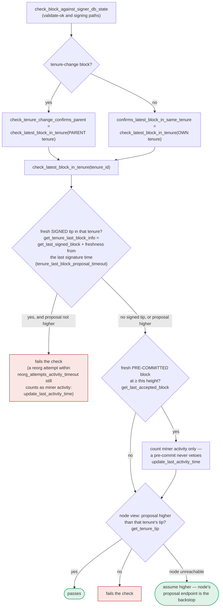

### Title
Stale reorg permit lets a signer sign a block that reorgs a tenure which has since gained a second globally-accepted block - (File: stacks-signer/src/chainstate/mod.rs, stacks-signer/src/signerdb.rs, stacks-signer/src/v0/signer.rs)

### Summary
`SortitionData::check_parent_tenure_choice` decides, at block-*proposal* time, whether a miner may reorg a prior tenure: the reorg is permitted only if every reorged tenure has **at most one** globally-accepted block (plus a timing rule). Once permitted, the reorged tenure(s) are recorded as "superseded" (`SignerDb::mark_tenure_superseded`), and from then on `Signer::reorg_permit_stands` only re-checks that the *permitting sortition* is still canonical — it never re-checks the invariant that actually justified the permit (≤1 globally-accepted block). Between the time the permit is granted and the time the reorging block actually crosses the pre-commit/signature threshold, the reorged tenure's second block can independently reach global acceptance (e.g. a delayed `NewBlock` event or a slow-arriving 70% threshold). The signer then signs the reorging block anyway, because the stale permit unconditionally excludes the conflict, exactly mirroring the ditto-eth pattern where a once-true invariant (enough collateral for `minShortErc`) is consumed by a later action (`cancelShort`) without being re-validated.

### Finding Description
`check_parent_tenure_choice` is invoked only from `validate_tenure_change_payload`, which runs inside `check_proposal` at **proposal arrival** (`stacks-signer/src/chainstate/v1.rs:497`, `v2.rs` equivalent). For each reorged tenure it queries `get_globally_accepted_block_count_in_tenure` and refuses the reorg if the count is `> 1`: [1](#0-0) 

If the tenure currently has 0 or 1 globally-accepted blocks (or fails the timing check favorably), the tenure is queued into `superseded_tenures` and, once the whole reorg is judged permitted, persisted via `mark_tenure_superseded`: [2](#0-1) [3](#0-2) 

This record is consumed later, at pre-commit-threshold-crossing time, by `get_signed_conflicts` (which annotates conflicting signed blocks with `superseded_by`) and `reorg_permit_stands`, which excludes the conflict **solely based on whether the permitting sortition is still canonical**: [4](#0-3) 

Critically, in `handle_block_pre_commit`, once the fresh-conflict filter finds `reorg_permit_stands == true` for a conflict, that conflict is excluded outright and the signer proceeds straight to signing — the count of globally-accepted blocks in the superseded tenure is never re-queried: [5](#0-4) 

Meanwhile, `check_block_against_signer_db_state` (the "RECHECK" step run at validate-ok and at signing, section 7 of the docs) only re-runs `check_latest_block_in_tenure`/`check_tenure_change_confirms_parent`, never `check_parent_tenure_choice`: [6](#0-5) 

So the only place the "≤1 globally accepted block" invariant is evaluated is at proposal arrival. If, after the permit is granted but before the reorging block is signed, the reorged tenure's second block independently reaches global acceptance (this can legitimately take time: signature aggregation across many peers, a delayed `NewBlock` announcement, or the node catching up), the signer will still sign the reorging block, now genuinely double-spending finality: two globally-accepted blocks in the old tenure plus a new signed block that discards them, something `check_parent_tenure_choice`'s own rule was written to prevent.

### Impact Explanation
This is a Critical-class break: a signer ends up signing a **non-canonical/conflicting** block — one that reorgs a tenure the chain has already finalized two blocks in, violating the exact safety invariant (`globally_accepted_blocks > 1` ⇒ refuse) that the reorg-timing logic exists to enforce. Because the permit is a durable DB record consulted independently of the invariant that created it, the equality "permit was granted under condition X" vs. "condition X still holds" is broken, letting a stale approval stand in for a canonical fact that has since changed.

### Likelihood Explanation
Reachable by a single miner (plus ordinary network/gossip timing) without needing a majority of signers, another signer's key, or local access: a miner simply needs to (1) get an early tenure-change reorg proposal evaluated and permitted while the target tenure's second block is not yet globally accepted, and (2) let enough time pass (validation + pre-commit gossip round trips) for that second block to become globally accepted before the reorging block crosses its own signature threshold. This is a timing window inherent to the asynchronous, two-phase (pre-commit → signature) design and does not require adversarial signer collusion — network latency, competing miners, or delayed `NewBlock` events are sufficient to open it.

### Recommendation
Re-derive (or re-verify) the `check_parent_tenure_choice` invariant — specifically the globally-accepted-block count in each superseded tenure — at the moment `reorg_permit_stands`/`conflict_still_blocks` is evaluated (validate-ok and pre-commit-threshold time), not only at proposal arrival. If the reorged tenure now has more than one globally-accepted block, the permit should be revoked (treat the conflict as live) regardless of whether the permitting sortition is still canonical.

### Proof of Concept
1. Tenure 1 (miner A) produces block A1, which is signed/locally-accepted by signers but has not yet reached global acceptance (e.g. `NewBlock` event delayed, or 70% signature aggregation still pending network-wide).
2. Miner B mines a tenure-change block B in tenure 2 that reorgs tenure 1. At proposal time, `check_parent_tenure_choice` queries `get_globally_accepted_block_count_in_tenure(tenure_1)`, finds it ≤1, and (subject to timing) permits the reorg, calling `mark_tenure_superseded(tenure_1, ..., superseded_by=tenure_2)`.
3. Before block B reaches its pre-commit/signature threshold, tenure 1's block A1 (and a second block A2 mined by A before being reorged) both reach global acceptance via delayed `NewBlock` events / late-arriving signatures — tenure 1 now genuinely has 2 globally-accepted blocks.
4. Block B crosses its pre-commit threshold. `handle_block_pre_commit` calls `get_signed_conflicts`, finds A1/A2 as conflicts annotated `superseded_by = tenure_2`, and `reorg_permit_stands` returns `true` because tenure 2's sortition is still canonical — the block-count invariant is never re-checked.
5. The signer signs block B, finalizing a reorg of a tenure that (per the very rule that granted the permit) should now be blocked, since it has more than one globally-accepted block.

### Citations

**File:** stacks-signer/src/chainstate/mod.rs (L210-223)
```rust
            // disallow reorg if more than one block has already been signed
            let globally_accepted_blocks =
                signer_db.get_globally_accepted_block_count_in_tenure(&tenure.consensus_hash)?;
            if globally_accepted_blocks > 1 {
                warn!(
                    "Miner is not building off of most recent tenure, but a tenure they attempted to reorg has already more than one globally accepted block.";
                    "parent_tenure" => %self.parent_tenure_id,
                    "last_sortition" => %self.prior_sortition,
                    "violating_tenure_id" => %tenure.consensus_hash,
                    "violating_tenure_first_block_id" => ?tenure.first_block_mined,
                    "globally_accepted_blocks" => globally_accepted_blocks,
                );
                return Ok(false);
            }
```

**File:** stacks-signer/src/chainstate/mod.rs (L290-315)
```rust
        // Every reorged tenure cleared the rules, so the reorg is permitted.
        for tenure in superseded_tenures {
            self.record_superseded_tenure(signer_db, tenure);
        }
        Ok(true)
    }

    /// Note that we have sanctioned `self`'s tenure replacing whatever `tenure` built, so a
    /// signature we already placed on one of its blocks must stop counting as a conflict while
    /// `self`'s sortition remains canonical.
    ///
    /// A failure to record only costs a delayed replacement -- the conflict keeps blocking until
    /// the signature goes stale -- so it is logged rather than propagated.
    fn record_superseded_tenure(&self, signer_db: &mut SignerDb, tenure: &TenureForkingInfo) {
        if let Err(e) = signer_db.mark_tenure_superseded(
            &tenure.consensus_hash,
            tenure.burn_block_height,
            &self.consensus_hash,
            &self.burn_block_hash,
        ) {
            warn!("Failed to record a tenure whose reorg we permitted: {e}";
                "superseded_tenure_id" => %tenure.consensus_hash,
                "superseded_by" => %self.consensus_hash,
            );
        }
    }
```

**File:** stacks-signer/src/signerdb.rs (L1627-1660)
```rust
    /// Record that we permitted the tenure identified by `superseded_by_*` to reorg this one
    /// under the reorg-timing rules (`first_proposal_burn_block_timing`).
    ///
    /// Having sanctioned the replacement, our own signature over what this tenure built must not
    /// then block it: its blocks stop counting as conflicts (see
    /// [`SignerDb::get_signed_conflicts`]). Recorded when the reorg is permitted rather than
    /// derived at signing time, because by the time a replacement reaches the pre-commit
    /// threshold the sortition view that sanctioned the reorg may be long gone.
    ///
    /// The permit is only honored while the permitting tenure's sortition is still canonical
    /// (checked against the node when the record is applied): if a burnchain fork orphans it,
    /// the reorg we sanctioned can no longer happen, so the record must not keep suppressing
    /// this tenure's conflicts. A re-permit by a different tenure replaces the record, so the
    /// latest permitting sortition is the one checked. Records age out via
    /// [`SignerDb::prune_superseded_tenures`].
    pub fn mark_tenure_superseded(
        &mut self,
        consensus_hash: &ConsensusHash,
        burn_block_height: u64,
        superseded_by_consensus_hash: &ConsensusHash,
        superseded_by_burn_block_hash: &BurnchainHeaderHash,
    ) -> Result<(), DBError> {
        self.db.execute(
            "INSERT OR REPLACE INTO superseded_tenures (consensus_hash, burn_block_height, superseded_by_consensus_hash, superseded_by_burn_block_hash, superseded_at) VALUES (?1, ?2, ?3, ?4, ?5)",
            params![
                consensus_hash,
                u64_to_sql(burn_block_height)?,
                superseded_by_consensus_hash,
                superseded_by_burn_block_hash,
                u64_to_sql(get_epoch_time_secs())?
            ],
        )?;
        Ok(())
    }
```

**File:** stacks-signer/src/v0/signer.rs (L1208-1248)
```rust
    /// Whether a reorg permit recorded for this conflict's tenure still stands.
    ///
    /// `check_parent_tenure_choice` records a permit when the reorg-timing rules sanction a
    /// later tenure replacing what the conflict's tenure built (see
    /// [`SignerDb::mark_tenure_superseded`]). A standing permit excludes the conflict entirely:
    /// our signature must not stand in the way of a replacement we sanctioned. But the permit
    /// is only as alive as the sortition it was granted to: if a burnchain fork orphaned the
    /// permitting sortition, the reorg we sanctioned can no longer happen, and the record must
    /// not keep suppressing the conflict.
    ///
    /// A false 404 here (e.g. from a node still catching up) only restores a conflict the
    /// permit could have excluded, which at worst delays the replacement, so unlike
    /// `conflict_still_blocks` no tip-height guard is needed. A node error voids the permit for
    /// the same reason: blocking is the direction that can be taken back.
    fn reorg_permit_stands(
        &self,
        stacks_client: &StacksClient,
        conflict: &SignedConflictInfo,
    ) -> bool {
        let Some(superseded_by) = &conflict.superseded_by else {
            return false;
        };
        match stacks_client.get_sortition_by_burn_hash(&superseded_by.burn_block_hash) {
            Ok(_) => true,
            Err(ClientError::RequestFailure(reqwest::StatusCode::NOT_FOUND)) => {
                info!("{self}: The tenure we permitted to reorg a conflicting block's tenure was itself orphaned by a burnchain fork. The permit no longer excludes the conflict.";
                    "conflicting_consensus_hash" => %conflict.consensus_hash,
                    "superseded_by_consensus_hash" => %superseded_by.consensus_hash,
                    "superseded_by_burn_block_hash" => %superseded_by.burn_block_hash,
                );
                false
            }
            Err(e) => {
                warn!("{self}: Failed to check whether the sortition that permitted a reorg is still canonical: {e:?}. Treating the permit as void.";
                    "conflicting_consensus_hash" => %conflict.consensus_hash,
                    "superseded_by_consensus_hash" => %superseded_by.consensus_hash,
                );
                false
            }
        }
    }
```

**File:** stacks-signer/src/v0/signer.rs (L1398-1421)
```rust
        // A fresh signature only blocks while the block it covers could still be part of the
        // chain: see `conflict_still_blocks`, which asks the node whether it is. Check
        // freshness first: it is a local timestamp comparison, while `reorg_permit_stands`
        // and `conflict_still_blocks` each query the node, so stale conflicts cost no
        // round-trips.
        if let Some(conflict) = conflicts.iter().find(|conflict| {
            conflict.last_endorsed > freshness_cutoff
                && !self.reorg_permit_stands(stacks_client, conflict)
                && self.conflict_still_blocks(
                    stacks_client,
                    conflict,
                    block_info.block.header.chain_length,
                )
        }) {
            warn!(
                "{self}: Reached the pre-commit threshold for a block, but we have recently signed or accepted a different block at the same or higher height. Refusing to sign.";
                "signer_signature_hash" => %block_hash,
                "block_height" => block_info.block.header.chain_length,
                "conflicting_signer_signature_hash" => %conflict.signer_signature_hash,
                "conflicting_block_height" => conflict.stacks_height,
                "conflicting_consensus_hash" => %conflict.consensus_hash,
            );
            return;
        }
```

**File:** docs/signer-flows.md (L389-424)
```markdown
## 7. The chainstate checks (shared)

`check_latest_block_in_tenure` answers "does this block confirm the tip we
expect?" and it runs in three places: at proposal arrival (inside
`check_proposal`), at validate-ok, and at the moment of signing. _Which_ tenure
it is asked about depends on the block: a tenure-change block is checked against
its **parent** tenure, every other block against its **own**. Never both. The
pivotal helper is `get_tenure_last_block_info`, which considers only blocks that
carry a signature (`get_last_signed_block`): a pre-commit never vetoes anything,
it only counts as miner activity.



A failed check becomes a different rejection depending on who asked.
`check_block_against_signer_db_state` returns `SortitionViewMismatch`, or
`ConnectivityIssues` when the lookup itself errored rather than answering; the v2
`check_proposal` path returns `InvalidParentBlock`.

```
