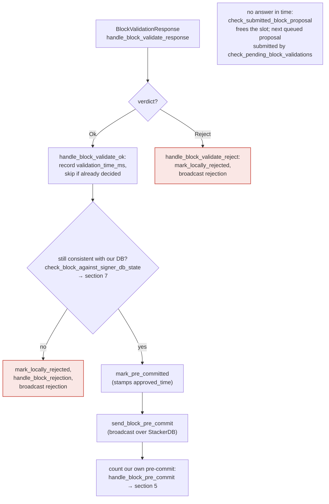

## Analysis

The CVE describes webhook endpoints that trigger security‑relevant actions without any authentication check. The direct analog in this codebase is the signer's own HTTP event listener, `SignerEventReceiver`, in `libsigner/src/events.rs`. Unlike the node's `/v3/block_proposal` endpoint (`stackslib/src/net/api/postblock_proposal.rs`), which explicitly checks an `Authorization` header against a shared secret before accepting a block proposal [1](#0-0) , the signer's listener performs **no authentication whatsoever** on any of its POST routes, including `/proposal_response`, which delivers the node's block-validation verdict back to the signer [2](#0-1) .

### Title
Unauthenticated `/proposal_response` webhook on the signer's event listener lets a network attacker forge block-validation verdicts and cause a signer to pre-commit/sign an unvalidated block - (File: libsigner/src/events.rs)

### Summary
`SignerEventReceiver::next_event` dispatches any POST to `/proposal_response` straight into `process_event::<T, BlockValidateResponse>` with no signature, token, or peer-identity check [3](#0-2) . `process_event` simply reads the HTTP body, JSON-deserializes it into `BlockValidateResponse`, and converts it into a `SignerEvent` [4](#0-3) . That event is fed directly into `handle_block_validate_response` → `handle_block_validate_ok`, which trusts the verdict as if it came from the local, trusted stacks-node [5](#0-4) .

### Finding Description
The node-side webhook (`/v3/block_proposal`) that a miner uses to *request* validation is authenticated with a shared `auth_token`/`Authorization` header [1](#0-0) . But the *reply* channel — the signer's own listener that receives `BlockValidateOk`/`BlockValidateReject` from the node — has no equivalent check. `SignerEventReceiver::bind` simply opens an `HttpServer` on the configured `endpoint` [6](#0-5) , and every route (`/stackerdb_chunks`, `/proposal_response`, `/new_burn_block`, `/new_block`) accepts any well-formed JSON body from any TCP client that can reach the port [7](#0-6) .

`handle_block_validate_ok` treats a `BlockValidateOk` for a block hash it is already tracking (`block_lookup_by_reward_cycle`) as ground truth that the node validated it: it records the validation time, and — provided `check_block_against_signer_db_state` still passes — calls `mark_pre_committed` and broadcasts a pre-commit via `send_block_pre_commit`, immediately followed by `handle_block_pre_commit` for its own vote [8](#0-7) . Per the documented flow, once pre-commit weight crosses the 70% threshold the signer proceeds straight to `mark_locally_accepted` and produces a signature — "A signature is not produced [at validate-ok], "but is produced" at 70% pre-commit weight without any further re-validation of the node's original verdict [9](#0-8) .

Because the block was actually submitted to the real node for validation (`submit_block_for_validation`), the equality the system relies on is "the `BlockValidateOk`/`BlockValidateReject` I act on came from *my own* node's `/v3/block_proposal` validation of *this exact* block." Since `/proposal_response` has no authentication, an attacker who can reach the signer's listening socket can race the genuine node response with a forged `BlockValidateOk` for the same `signer_signature_hash`. The check `if block_info.valid.is_some() { ... return; }` means whichever response — real or forged — arrives first wins and all further verdicts (including the true one) are discarded [10](#0-9) . If the forged `Ok` wins the race, the signer pre-commits/signs a block that its own node may never have actually validated as canonical/valid — breaking the "signed vs. validated" equality the whole design depends on.

The risk is implicitly acknowledged in code comments warning that exposing the signer beyond a local/trusted network is dangerous [11](#0-10) , yet nothing in `libsigner/src/events.rs` enforces loopback-only binding or authentication, unlike the corresponding node endpoint, whose documentation explicitly states it accepts only loopback connections and requires a Basic Authorization header [12](#0-11) .

### Impact Explanation
This is a Critical-class break: a signer can be made to pre-commit to / sign a block that was never actually validated by its own trusted node, which is functionally equivalent to "a signer signing an invalid/non-canonical/conflicting block." A miner who wins a sortition slot can craft a marginal/invalid proposal, broadcast it via the miner StackerDB slot (which every signer already trusts as the source of `BlockProposal`s), and then flood forged `/proposal_response` `Ok` payloads at the signers' listeners before their real nodes finish/report validation.

### Likelihood Explanation
Reaching a signer's `/proposal_response` requires the attacker to have network access to the signer's bound event-listener socket. Configuration samples in the repo show the listener can be bound to a non-loopback address (`0.0.0.0:...`), and there is no code-level restriction to loopback nor any authentication token comparable to the node's `auth_token`. This makes the attack directly reachable by any signer operator who follows a permissive sample config, and the "race the real response" requirement is a timing race rather than a cryptographic barrier, which the attacker (as the block's own proposer) can optimize by immediately following its own proposal broadcast with the forged verdict.

### Recommendation
Add an authentication mechanism (e.g., a shared secret/HMAC, or restricting `bind()` to loopback-only unless explicitly overridden with a warning-gated flag) for the signer's HTTP event-receiver routes in `libsigner/src/events.rs`, particularly `/proposal_response`, mirroring the `Authorization` header check already used by `stackslib/src/net/api/postblock_proposal.rs`. Additionally, `handle_block_validate_ok`/`handle_block_validate_reject` should validate the response corresponds to a request the signer itself issued (e.g., matching a per-request nonce/token issued at submission time) rather than trusting any inbound `BlockValidateResponse` keyed only on `signer_signature_hash`.

### Proof of Concept
1. Attacker (miner with a valid sortition slot) crafts a `NakamotoBlock` that is invalid/non-canonical from the perspective of the signer's node (e.g., violates tenure rules) and broadcasts it as a `BlockProposal` over the miner's StackerDB slot, as usual.
2. Each signer receives the proposal via `handle_block_proposal`, stores it (`insert_block`), and calls `submit_block_for_validation` against its own node's `/v3/block_proposal` [13](#0-12) .
3. Before the real node returns its (expected) `Reject`, the attacker sends an HTTP POST to the signer's `endpoint` at `/proposal_response` with a crafted JSON body deserializing to `BlockValidateResponse::Ok(BlockValidateOk { signer_signature_hash: <matching hash>, ... })`. No `Authorization` header or token is required — `process_event`/`next_event` accept it unconditionally [4](#0-3) .
4. The signer's `handle_block_validate_ok` processes the forged verdict as authoritative, marks the block pre-committed, and broadcasts/countstoward its own pre-commit and eventual signature [14](#0-13) ; the genuine `Reject` from the node, arriving afterward, is discarded because `block_info.valid` is already set [10](#0-9) .

### Citations

**File:** stackslib/src/net/api/postblock_proposal.rs (L1135-1144)
```rust
        // If no authorization is set, then the block proposal endpoint is not enabled
        let Some(password) = &self.auth else {
            return Err(Error::Http(400, "Bad Request.".into()));
        };
        let Some(auth_header) = preamble.headers.get("authorization") else {
            return Err(Error::Http(401, "Unauthorized".into()));
        };
        if auth_header != password {
            return Err(Error::Http(401, "Unauthorized".into()));
        }
```

**File:** libsigner/src/events.rs (L401-408)
```rust
    /// Start listening on the given socket address.
    /// Returns the address that was bound.
    /// Errors out if bind(2) fails
    fn bind(&mut self, listener: SocketAddr) -> Result<SocketAddr, EventError> {
        self.http_server = Some(HttpServer::http(listener).expect("failed to start HttpServer"));
        self.local_addr = Some(listener);
        Ok(listener)
    }
```

**File:** libsigner/src/events.rs (L413-458)
```rust
    fn next_event(&mut self) -> Result<SignerEvent<T>, EventError> {
        self.with_server(|event_receiver, http_server, _is_mainnet| {
            // were we asked to terminate?
            if event_receiver.is_stopped() {
                return Err(EventError::Terminated);
            }
            debug!("Request handling");
            let request = http_server.recv()?;
            debug!("Got request"; "method" => %request.method(), "path" => request.url());

            if request.url() == "/status" {
                request
                .respond(HttpResponse::from_string("OK"))
                .expect("response failed");
                return Ok(SignerEvent::StatusCheck);
            }

            if request.method() != &HttpMethod::Post {
                return Err(EventError::MalformedRequest(format!(
                    "Unrecognized method '{}'",
                    request.method(),
                )));
            }
            debug!("Processing {} event", request.url());
            if request.url() == "/stackerdb_chunks" {
                process_event::<T, StackerDBChunksEvent>(request)
            } else if request.url() == "/proposal_response" {
                process_event::<T, BlockValidateResponse>(request)
            } else if request.url() == "/new_burn_block" {
                process_event::<T, BurnBlockEvent>(request)
            } else if request.url() == "/shutdown" {
                event_receiver.stop_signal.store(true, Ordering::SeqCst);
                Err(EventError::Terminated)
            } else if request.url() == "/new_block" {
                process_event::<T, StacksBlockEvent>(request)
            } else {
                let url = request.url().to_string();
                debug!(
                    "[{:?}] next_event got request with unexpected url {}, return OK so other side doesn't keep sending this",
                    event_receiver.local_addr,
                    url
                );
                ack_dispatcher(request);
                Err(EventError::UnrecognizedEvent(url))
            }
        })?
```

**File:** libsigner/src/events.rs (L519-542)
```rust
fn process_event<T, E>(mut request: HttpRequest) -> Result<SignerEvent<T>, EventError>
where
    T: SignerEventTrait,
    E: serde::de::DeserializeOwned + TryInto<SignerEvent<T>, Error = EventError>,
{
    let mut body = String::new();

    if let Err(e) = request.as_reader().read_to_string(&mut body) {
        error!("Failed to read body: {:?}", &e);
        ack_dispatcher(request);
        return Err(EventError::MalformedRequest(format!(
            "Failed to read body: {:?}",
            e
        )));
    }
    // Regardless of whether we successfully deserialize, we should ack the dispatcher so they don't keep resending it
    ack_dispatcher(request);
    let json_event: E = serde_json::from_slice(body.as_bytes())
        .map_err(|e| EventError::Deserialize(format!("Could not decode body to JSON: {:?}", e)))?;

    let signer_event: SignerEvent<T> = json_event.try_into()?;

    Ok(signer_event)
}
```

**File:** stacks-signer/src/v0/signer.rs (L1682-1719)
```rust
            // Just in case check if the last block validation submission timed out.
            self.check_submitted_block_proposal();
            if self.submitted_block_proposal.is_none() {
                // We don't know if proposal is valid, submit to stacks-node for further checks and store it locally.
                info!(
                    "{self}: submitting block proposal for validation";
                    "signer_signature_hash" => %signer_signature_hash,
                    "block_id" => %block_proposal.block.block_id(),
                    "block_height" => block_proposal.block.header.chain_length,
                    "burn_height" => block_proposal.burn_height,
                );

                #[cfg(any(test, feature = "testing"))]
                self.test_stall_block_validation_submission();
                self.submit_block_for_validation(
                    stacks_client,
                    &block_proposal.block,
                    get_epoch_time_secs(),
                );
            } else {
                // Still store the block but log we can't submit it for validation. We may receive enough signatures/rejections
                // from other signers to push the proposed block into a global rejection/acceptance regardless of our participation.
                // However, we will not be able to participate beyond this until our block submission times out or we receive a response
                // from our node.
                warn!("{self}: cannot submit block proposal for validation as we are already waiting for a response for a prior submission. Inserting pending proposal.";
                    "signer_signature_hash" => signer_signature_hash.to_string(),
                );
                self.signer_db
                    .insert_pending_block_validation(&signer_signature_hash, get_epoch_time_secs())
                    .unwrap_or_else(|e| {
                        warn!("{self}: Failed to insert pending block validation: {e:?}")
                    });
            }

            // Do not store KNOWN invalid blocks as this could DOS the signer. We only store blocks that are valid or unknown.
            self.signer_db
                .insert_block(&block_info)
                .unwrap_or_else(|e| self.handle_insert_block_error(e));
```

**File:** stacks-signer/src/v0/signer.rs (L1882-1985)
```rust
    /// Handle the block validate ok response
    fn handle_block_validate_ok(
        &mut self,
        stacks_client: &StacksClient,
        block_validate_ok: &BlockValidateOk,
        sortition_state: &mut Option<SortitionsView>,
    ) {
        crate::monitoring::actions::increment_block_validation_responses(true);
        let signer_signature_hash = &block_validate_ok.signer_signature_hash;
        if self
            .submitted_block_proposal
            .as_ref()
            .map(|(proposal_hash, _)| proposal_hash == signer_signature_hash)
            .unwrap_or(false)
        {
            self.submitted_block_proposal = None;
        }
        if let Some(replay_tx_hash) = block_validate_ok.replay_tx_hash {
            info!("Inserting block validated by replay tx";
                "signer_signature_hash" => %signer_signature_hash,
                "replay_tx_hash" => replay_tx_hash
            );
            self.signer_db
                .insert_block_validated_by_replay_tx(
                    signer_signature_hash,
                    replay_tx_hash,
                    block_validate_ok.replay_tx_exhausted,
                )
                .unwrap_or_else(|e| {
                    warn!("{self}: Failed to insert block validated by replay tx: {e:?}")
                });
        }
        // For mutability reasons, we need to take the block_info out of the map and add it back after processing
        let Some(mut block_info) = self.block_lookup_by_reward_cycle(signer_signature_hash) else {
            // We have not seen this block before. Why are we getting a response for it?
            debug!("{self}: Received a block validate response for a block we have are not tracking. Ignoring...");
            return;
        };

        // Record the block validation time but do not consider stx transfers or boot contract calls
        block_info.validation_time_ms = if block_validate_ok.cost.is_zero() {
            Some(0)
        } else {
            Some(block_validate_ok.validation_time_ms)
        };

        self.signer_db
            .insert_block(&block_info)
            .unwrap_or_else(|e| self.handle_insert_block_error(e));

        if block_info.valid.is_some() {
            // We should only have valid set if we have already processed a validation response for this block OR we locally marked it as rejected
            // and responded to it. If we received a new proposal for it that we wished to consider, we would have reset valid to None.
            // This is only really possible when a signer is sharing a node or we have timed out a pending validation and it suddenly arrives.
            warn!(
                "{self}: Already processed a block validate response for block {}. Ignoring validation response.", block_info.block.header.signer_signature_hash(); "valid" => ?block_info.valid,
            );
            return;
        }
        if !block_info.check_static_valid_block() {
            debug!("{self}: Block is syntatically invalid; will not store");
            return;
        }

        if let Some(block_rejection) =
            self.check_block_against_signer_db_state(stacks_client, &block_info.block)
        {
            // The signer db state has changed. We no longer view this block as valid. Override the validation response.
            if let Err(e) = block_info.mark_locally_rejected() {
                if !block_info.has_reached_consensus() {
                    warn!("{self}: Failed to mark block as locally rejected: {e:?}");
                }
            };
            self.signer_db
                .insert_block(&block_info)
                .unwrap_or_else(|e| self.handle_insert_block_error(e));
            self.handle_block_rejection(&block_rejection, sortition_state);
            self.send_block_response(&block_info.block, block_rejection.into());
        } else {
            if let Err(e) = block_info.mark_pre_committed() {
                // The block may have reached enough signatures before we validated the block so should fail to mark pre-committed
                // but still call to make sure the timestamps and validity are updated correctly.
                if !block_info.has_reached_consensus()
                    && block_info.state != BlockState::LocallyAccepted
                {
                    warn!("{self}: Failed to mark block as approved: {e:?}",);
                    return;
                }
            }

            self.signer_db
                .insert_block(&block_info)
                .unwrap_or_else(|e| self.handle_insert_block_error(e));
            self.send_block_pre_commit(signer_signature_hash.clone());
            // have to save the signature _after_ the block info
            let address = self.stacks_address.clone();
            self.handle_block_pre_commit(
                stacks_client,
                sortition_state,
                &address,
                signer_signature_hash,
            );
        }
    }
```

**File:** docs/signer-flows.md (L205-223)
```markdown
## 4. The node's validation verdict

The stacks-node answers the `/v3/block_proposal` submission. On OK, the signer
re-checks its own DB state and only then advertises willingness to sign by
broadcasting a **pre-commit**. A signature is _not_ produced here.


```

**File:** stacks-signer/src/lib.rs (L124-132)
```rust
        info!("Starting signer with config: {:?}", config);
        warn!(
            "Reminder: The signer is primarily designed for use with a local or subnet network stacks node. \
            It's important to exercise caution if you are communicating with an external node, \
            as this could potentially expose sensitive data or functionalities to security risks \
            if additional proper security checks are not integrated in place. \
            For more information, check the documentation at \
            https://docs.stacks.co/guides-and-tutorials/running-a-signer#preflight-setup"
        );
```

**File:** docs/rpc-endpoints.md (L490-495)
```markdown
### POST /v3/block_proposal

Used by miner to validate a proposed Stacks block using JSON encoding.

**This endpoint will only accept requests over the local loopback network interface.**

```
