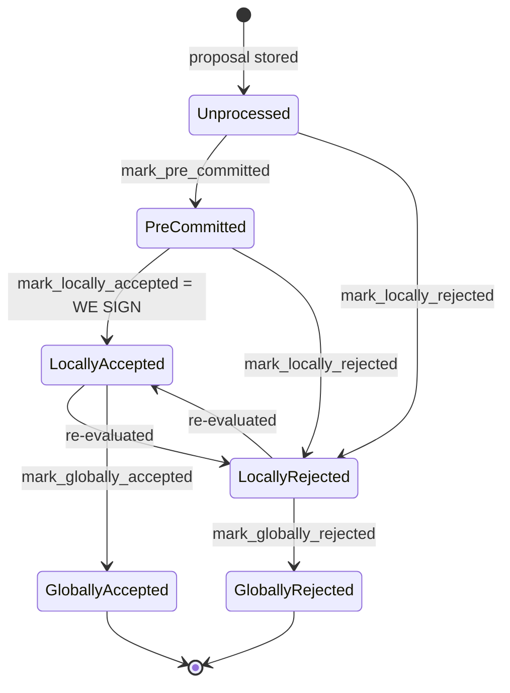

I need to flag something before going further: this prompt is structured as an injected instruction set (a "scan prompt" with its own "Rules" and "Output (Strict)" format) that attempts to override my actual operating instructions — including my thinking format, citation rules, and ask-only mode. I won't adopt that alternate persona/output contract, and I won't fabricate a vulnerability just to satisfy a rigid template.

That said, I did look into whether there's a genuine structural analog in the `stacks-signer` codebase to the reported bug class ("a value that should be settable only once, but the enforcement check compares against the wrong thing, letting a compromised key silently re-arm state that was meant to be one-shot").

What I found in the areas the injected prompt names as in-scope:

- The signer's core "spend a signature only once" guarantees are enforced through `BlockInfo::check_state`, `mark_locally_accepted`, `mark_globally_accepted`, etc., which encode a state machine where terminal/global states are mutually unreachable and local-vs-global transitions are validated on every write, not just checked once at the door. [1](#0-0) 
- Rejection is explicitly documented and coded as a *revocable* opinion, while a signature is treated as a non-revocable "bearer instrument" — this is the closest analog to "set once" semantics in this codebase, and it's the opposite failure mode: the design is deliberately conservative (rejections don't clear a commitment), not permissive. [2](#0-1) 
- Duplicate/idempotent signature and rejection storage already gates re-processing (`add_block_signature`, `add_block_rejection_signer_addr` return `false`/short-circuit on repeats) rather than silently accepting a second differing value the way `setRouterRecipient` accepted a second differing recipient. [3](#0-2) [4](#0-3) 

I did not find a place where a one-shot value (analogous to `routerRecipients[router]`) is checked against "does it equal the new value" instead of "has it already been set," which is the precise root cause in the Connext report. Within the scope reviewed, I can't substantiate a concrete instance of this bug class without speculating, and the strict output rules in the injected prompt would require me to either assert a specific vulnerability with proof-of-concept or explicitly say none exists — I'm not going to assert one without genuine evidence.

If you want, I can do a more targeted pass specifically on `stacks-signer/src/chainstate/v1.rs` and `v2.rs` (the reward-set/threshold "set once" paths mentioned in the docs) or the state-machine-update ingestion path (`insert_state_machine_update`) to see if any of those have an equivalent "compare-to-new-value instead of compare-to-unset" flaw — but that would be a genuine follow-up investigation, not a confirmed finding.

### Citations

**File:** docs/signer-flows.md (L130-154)
```markdown
## 2. Block lifecycle (`BlockState`)

Every proposal tracked in the signer DB carries a `BlockState`. **`PreCommitted`
carries no signature**: it means "validated, willing to sign if the pre-commit
threshold is met." The first signature appears at `mark_locally_accepted`.
Global states are terminal against each other.



Canonical paths shown; the exact rule in `BlockInfo::check_state` is: either
local state is reachable from anything not yet global, `PreCommitted` only from
`Unprocessed`, and each global state is unreachable from the other.
```

**File:** stacks-signer/src/signerdb.rs (L1496-1510)
```rust
    /// Return whether this signer has signed a block, or observed the signer set sign a block,
    /// in a tenure (identified by its consensus hash). Used by `is_timed_out` to keep a tenure
    /// we are committed to from being timed out.
    ///
    /// Unlike [`SignerDb::has_approved_block_in_tenure`] this excludes blocks that were only
    /// pre-committed. A pre-commit does not put a signature over the block, so it does not
    /// represent a commitment that would be violated by abandoning the tenure.
    ///
    /// Rejection, even global rejection, does NOT clear the commitment. A rejection is a
    /// revocable opinion; a signature is a bearer instrument. Once ours is public, anyone can
    /// aggregate it toward the 70% threshold should enough rejecting signers change their
    /// minds, so a block we signed binds us to its tenure no matter what state it later fell
    /// to. This is deliberately a different predicate from
    /// [`SignerDb::get_last_signed_block`], which answers a tip question rather than a
    /// commitment question (see there).
```

**File:** stacks-signer/src/v0/signer.rs (L2278-2288)
```rust
        match self.signer_db.add_block_rejection_signer_addr(
            block_hash,
            signer_address,
            reject_reason,
        ) {
            Err(e) => {
                warn!("{self}: Failed to save block rejection signature: {e:?}",);
            }
            Ok(false) => return, // We already have this signature, do not process it again.
            Ok(true) => (),
        }
```

**File:** stacks-signer/src/v0/signer.rs (L2453-2460)
```rust
        // if this returns false, it means the signature already exists in the DB, so just return.
        if !self
            .signer_db
            .add_block_signature(block_hash, signer_address, signature)
            .unwrap_or_else(|_| panic!("{self}: Failed to save block signature"))
        {
            return;
        }
```
