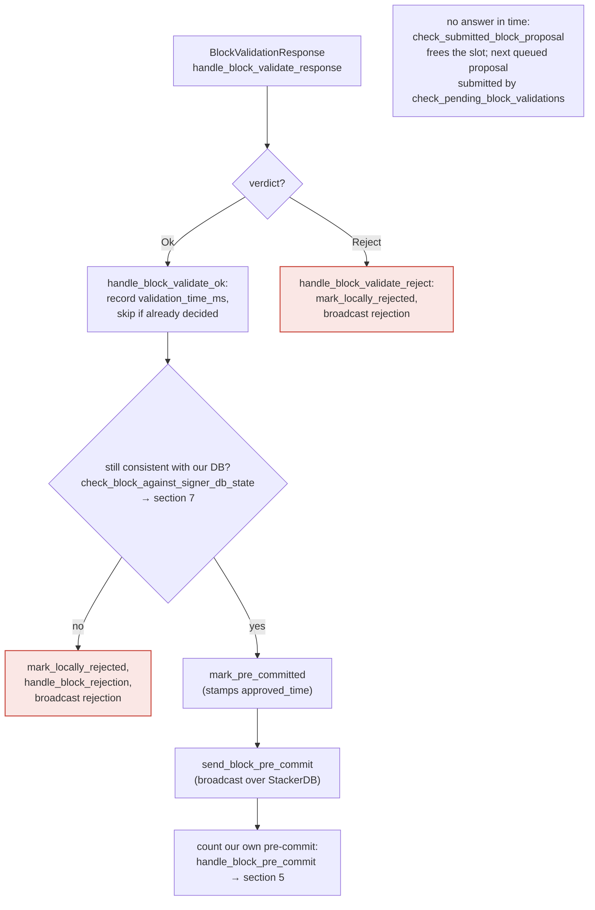

### Title
Signer's local event-receiver HTTP endpoint accepts unauthenticated `/proposal_response` POSTs, letting an attacker forge a node validation verdict and get an unvalidated/invalid block signed - ([File: libsigner/src/events.rs])

### Summary
`SignerEventReceiver::next_event` dispatches any POST to `/proposal_response` straight into `process_event::<T, BlockValidateResponse>` with no authentication or origin check whatsoever [1](#0-0) . Unlike the node's `/v3/block_proposal` RPC endpoint, which requires a matching `Authorization` header/`auth_token` before it will even queue a proposal for validation [2](#0-1) [3](#0-2) , the signer's inbound listener that receives the *result* of that validation has no equivalent check anywhere in `libsigner/src/events.rs` (confirmed absent by search: no `Authorization`/`auth_token` handling in `libsigner/src`). This is the direct structural analog of the Jenkins Simple Queue CSRF bug: a state-changing endpoint that omits verification that the caller is the legitimate origin (there, missing POST/CSRF-token enforcement; here, missing any authentication on a POST that drives signer state).

### Finding Description
The event flow is: `bind()` opens a plain `tiny_http::Server` [4](#0-3) ; `next_event()` reads any HTTP request, and for any POST to `/proposal_response` calls `process_event::<T, BlockValidateResponse>(request)`, which just reads the body, JSON-deserializes it into a `BlockValidateResponse`, and converts it into a `SignerEvent` — with zero checks on the sender's identity [5](#0-4) [6](#0-5) .

That forged `SignerEvent::BlockValidationResponse` is handed to `handle_event_match` → `handle_block_validate_response` → `handle_block_validate_ok` [7](#0-6) . `handle_block_validate_ok` looks the block up purely by `signer_signature_hash` in its own tracking table, and — provided `block_info.valid` is still unset (i.e., the real node hasn't answered yet) — proceeds to treat the forged "Ok" as ground truth: it records `validation_time_ms`, calls `check_block_against_signer_db_state` (which only re-checks tenure/parent/conflict bookkeeping, not full transaction/state validity), and then calls `mark_pre_committed` and `send_block_pre_commit` [8](#0-7) . Once enough pre-commits accumulate (including the signer's own), the pre-commit path signs via `create_block_acceptance`/`mark_locally_accepted` per the documented flow [9](#0-8) .

Critically, this bypasses the node's actual `NakamotoBlockProposal::validate` logic — the code path that runs the block's transactions against chainstate, checks costs, timestamps, and problematic transactions — none of which the signer re-derives itself [10](#0-9) . The signer's own re-check (`check_block_against_signer_db_state`) is a much narrower "still fits my view of the chain" check, not a substitute for the node's full validation.

The signer's listener is also configured to bind broadly (`endpoint = "0.0.0.0:30000"`) in the shipped sample configs, not restricted to loopback [11](#0-10) [12](#0-11) , and nothing in `libsigner` enforces that only the paired `stacks-node` (or a caller possessing the `auth_token`) may post to it.

### Impact Explanation
This breaks the "signed vs validated" equality: the design guarantees a signature is produced only after the node's real validation returns `Ok` [13](#0-12) . Because the receiving endpoint performs no authentication, any party able to reach the signer's bound port can inject a fabricated `BlockValidateOk` for a block the signer is already tracking (from a genuine proposal broadcast by a one-slot miner), before the real node validation completes or even if the real node would reject it. The signer then proceeds toward `mark_pre_committed`/signature issuance as if the node had approved a block that never actually passed chainstate/transaction validation — i.e., a signer can be induced to co-sign an invalid or non-canonical block.

### Likelihood Explanation
The precondition is only network reachability to the signer's event-receiver port (which the sample configs bind to `0.0.0.0`) and knowledge of the pending block's `signer_signature_hash` — both trivially obtainable, since a proposer/miner broadcasts the proposal (and hence the hash) before the node's asynchronous validation completes, giving a window to race a forged `/proposal_response`. No signer key, majority collusion, or `auth_token` is required to reach or exploit this endpoint, unlike the node-side `/v3/block_proposal` path which is explicitly authenticated.

### Recommendation
Require the `SignerEventReceiver` to verify a shared secret (the same `auth_token`/`auth_password` already used elsewhere in the signer↔node pairing) on every inbound POST, especially `/proposal_response`, `/new_block`, and `/new_burn_block`, before constructing a `SignerEvent`; reject unauthenticated requests. Additionally, default the sample/documented bind address to loopback-only and document that binding to `0.0.0.0` is unsafe without additional network-layer restrictions.

### Proof of Concept
1. Attacker observes a `BlockProposal` broadcast (e.g., over the miner→signers channel) and extracts its `signer_signature_hash`.
2. Before the real stacks-node's `/v3/block_proposal` validation completes (or even if it would reject), attacker sends:
   `POST /proposal_response` to the target signer's bound endpoint (e.g. `0.0.0.0:30000`) with a JSON body encoding `BlockValidateResponse::Ok(BlockValidateOk { signer_signature_hash, .. })` — no `Authorization` header needed, per `libsigner/src/events.rs` `process_event`.
3. `SignerEventReceiver::next_event` accepts it, `process_event` deserializes it, and `handle_block_validate_ok` (`stacks-signer/src/v0/signer.rs`) processes it as if the node had validated the block, moving it to `PreCommitted` and eventually contributing to/producing a signature.

### Citations

**File:** libsigner/src/events.rs (L404-408)
```rust
    fn bind(&mut self, listener: SocketAddr) -> Result<SocketAddr, EventError> {
        self.http_server = Some(HttpServer::http(listener).expect("failed to start HttpServer"));
        self.local_addr = Some(listener);
        Ok(listener)
    }
```

**File:** libsigner/src/events.rs (L430-440)
```rust
            if request.method() != &HttpMethod::Post {
                return Err(EventError::MalformedRequest(format!(
                    "Unrecognized method '{}'",
                    request.method(),
                )));
            }
            debug!("Processing {} event", request.url());
            if request.url() == "/stackerdb_chunks" {
                process_event::<T, StackerDBChunksEvent>(request)
            } else if request.url() == "/proposal_response" {
                process_event::<T, BlockValidateResponse>(request)
```

**File:** libsigner/src/events.rs (L519-542)
```rust
fn process_event<T, E>(mut request: HttpRequest) -> Result<SignerEvent<T>, EventError>
where
    T: SignerEventTrait,
    E: serde::de::DeserializeOwned + TryInto<SignerEvent<T>, Error = EventError>,
{
    let mut body = String::new();

    if let Err(e) = request.as_reader().read_to_string(&mut body) {
        error!("Failed to read body: {:?}", &e);
        ack_dispatcher(request);
        return Err(EventError::MalformedRequest(format!(
            "Failed to read body: {:?}",
            e
        )));
    }
    // Regardless of whether we successfully deserialize, we should ack the dispatcher so they don't keep resending it
    ack_dispatcher(request);
    let json_event: E = serde_json::from_slice(body.as_bytes())
        .map_err(|e| EventError::Deserialize(format!("Could not decode body to JSON: {:?}", e)))?;

    let signer_event: SignerEvent<T> = json_event.try_into()?;

    Ok(signer_event)
}
```

**File:** docs/rpc/openapi.yaml (L905-916)
```yaml
  /v3/block_proposal:
    post:
      summary: Validate a proposed Stacks block
      tags:
        - Mining
      operationId: postBlockProposal
      description: |
        Used by stackers to validate a proposed Stacks block from a miner.
        **This API endpoint requires a basic Authorization header.**
      security:
        - rpcAuth: []
      requestBody:
```

**File:** stackslib/src/config/mod.rs (L3802-3816)
```rust
    /// HTTP auth password to use when communicating with stacks-signer binary.
    ///
    /// This token is used in the `Authorization` header for certain requests.
    /// Primarily, it secures the communication channel between this node and a
    /// connected `stacks-signer` instance.
    ///
    /// It is also used to authenticate requests to `/v2/blocks?broadcast=1`.
    /// ---
    /// @default: `None` (authentication disabled for relevant endpoints)
    /// @notes:
    ///   - This field **must** be configured if the node needs to receive
    ///     block proposals from a configured `stacks-signer` [[events_observer]]
    ///     via the `/v3/block_proposal` endpoint.
    ///   - The value must match the token configured on the signer.
    pub auth_token: Option<String>,
```

**File:** stacks-signer/src/v0/signer.rs (L1928-1975)
```rust
        self.signer_db
            .insert_block(&block_info)
            .unwrap_or_else(|e| self.handle_insert_block_error(e));

        if block_info.valid.is_some() {
            // We should only have valid set if we have already processed a validation response for this block OR we locally marked it as rejected
            // and responded to it. If we received a new proposal for it that we wished to consider, we would have reset valid to None.
            // This is only really possible when a signer is sharing a node or we have timed out a pending validation and it suddenly arrives.
            warn!(
                "{self}: Already processed a block validate response for block {}. Ignoring validation response.", block_info.block.header.signer_signature_hash(); "valid" => ?block_info.valid,
            );
            return;
        }
        if !block_info.check_static_valid_block() {
            debug!("{self}: Block is syntatically invalid; will not store");
            return;
        }

        if let Some(block_rejection) =
            self.check_block_against_signer_db_state(stacks_client, &block_info.block)
        {
            // The signer db state has changed. We no longer view this block as valid. Override the validation response.
            if let Err(e) = block_info.mark_locally_rejected() {
                if !block_info.has_reached_consensus() {
                    warn!("{self}: Failed to mark block as locally rejected: {e:?}");
                }
            };
            self.signer_db
                .insert_block(&block_info)
                .unwrap_or_else(|e| self.handle_insert_block_error(e));
            self.handle_block_rejection(&block_rejection, sortition_state);
            self.send_block_response(&block_info.block, block_rejection.into());
        } else {
            if let Err(e) = block_info.mark_pre_committed() {
                // The block may have reached enough signatures before we validated the block so should fail to mark pre-committed
                // but still call to make sure the timestamps and validity are updated correctly.
                if !block_info.has_reached_consensus()
                    && block_info.state != BlockState::LocallyAccepted
                {
                    warn!("{self}: Failed to mark block as approved: {e:?}",);
                    return;
                }
            }

            self.signer_db
                .insert_block(&block_info)
                .unwrap_or_else(|e| self.handle_insert_block_error(e));
            self.send_block_pre_commit(signer_signature_hash.clone());
```

**File:** stacks-signer/src/v0/signer.rs (L2053-2071)
```rust
    /// Handle the block validate response returned from our prior calls to submit a block for validation
    fn handle_block_validate_response(
        &mut self,
        stacks_client: &StacksClient,
        block_validate_response: &BlockValidateResponse,
        sortition_state: &mut Option<SortitionsView>,
    ) {
        info!("{self}: Received a block validate response: {block_validate_response:?}");
        match block_validate_response {
            BlockValidateResponse::Ok(block_validate_ok) => {
                crate::monitoring::actions::record_block_validation_latency(
                    block_validate_ok.validation_time_ms,
                );
                self.handle_block_validate_ok(stacks_client, block_validate_ok, sortition_state);
            }
            BlockValidateResponse::Reject(block_validate_reject) => {
                self.handle_block_validate_reject(block_validate_reject, sortition_state);
            }
        };
```

**File:** docs/signer-flows.md (L205-227)
```markdown
## 4. The node's validation verdict

The stacks-node answers the `/v3/block_proposal` submission. On OK, the signer
re-checks its own DB state and only then advertises willingness to sign by
broadcasting a **pre-commit**. A signature is _not_ produced here.



> Anchors: `handle_block_validate_response`, `handle_block_validate_ok`,
> `handle_block_validate_reject`, `check_block_against_signer_db_state`,
> `send_block_pre_commit` (signer.rs)
```

**File:** stackslib/src/net/api/postblock_proposal.rs (L541-571)
```rust
    pub fn validate(
        &self,
        sortdb: &SortitionDB,
        chainstate: &mut StacksChainState, // not directly used; used as a handle to open other chainstates
        timeout_secs: u64,
        max_tx_execution_time_secs: u64,
        max_tx_analysis_time_secs: u64,
        max_tx_mem_bytes: u64,
        auth_token: Option<String>,
    ) -> Result<BlockValidateOk, BlockValidateRejectReason> {
        fault_injection_validation_stall(auth_token);
        let start = Instant::now();

        fault_injection_validation_delay();

        let mainnet = self.chain_id == CHAIN_ID_MAINNET;
        if self.chain_id != chainstate.chain_id || mainnet != chainstate.mainnet {
            warn!(
                "Rejected block proposal";
                "reason" => "Wrong network/chain_id",
                "expected_chain_id" => chainstate.chain_id,
                "expected_mainnet" => chainstate.mainnet,
                "received_chain_id" => self.chain_id,
                "received_mainnet" => mainnet,
            );
            return Err(BlockValidateRejectReason {
                reason_code: ValidateRejectCode::NetworkChainMismatch,
                reason: "Wrong network/chain_id".into(),
                failed_txid: None,
            });
        }
```

**File:** sample/conf/signer/mainnet-signer-conf.toml (L37-39)
```text
# REQUIRED: Local endpoint this signer listens on for events from the node.
# Must match the endpoint in the node's [[events_observer]] section.
endpoint = "0.0.0.0:30000"
```
