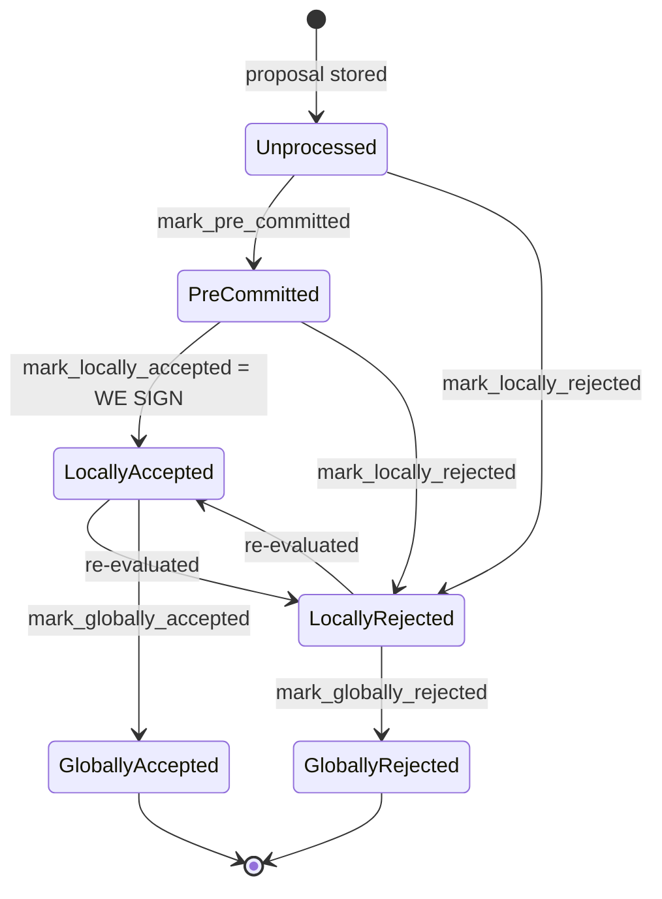

## Title
Node-side `StackerDBListener` never revokes an approved-weight tally when a signer later rejects the same block, letting stale accepts push a now-invalid/conflicting block — ([File: stacks-node/src/nakamoto_node/stackerdb_listener.rs])

### Summary
The miner-side `StackerDBListener` accumulates `total_weight_approved` and `total_weight_rejected` per block from `BlockResponse` gossip, but the two counters are never reconciled when a signer legitimately changes its vote from `Accepted` to `Rejected` for the same block. Because a `Rejected` message from a signer who already has an entry in `responded_signers` is silently dropped, that signer's earlier approval weight is never removed from `total_weight_approved`, so the coordinator can conclude the 70% signing threshold is met and push the block even though the *current* set of live votes no longer reaches consensus.

### Finding Description
The signer-local state machine explicitly allows a signer to move from `LocallyAccepted` to `LocallyRejected` on re-evaluation: [1](#0-0) 
and the flow documentation confirms this transition happens in practice ("re-evaluated"): [2](#0-1) 

On the signer-local DB, this transition is handled correctly: `add_block_signature` deletes any stale rejection row for that signer, and `add_block_rejection_signer_addr` refuses to record a rejection if a signature row already exists for that signer: [3](#0-2) [4](#0-3) 

However the **node-side** `StackerDBListener`, which independently tallies gossiped `BlockResponse` messages to decide when to gather signatures and push the block, has no such reconciliation. On `Accepted`, weight is added to `total_weight_approved` keyed off `gathered_signatures`, and the slot is marked in `responded_signers`: [5](#0-4) 

On a subsequent `Rejected` from the same signer, the code only proceeds if `block.responded_signers.insert(slot_id)` returns `true` (i.e., first response ever): [6](#0-5) 
Since the slot was already inserted into `responded_signers` when the earlier `Accepted` arrived, `insert` returns `false` and the whole rejection-processing block (weight increment, tally, logging) is skipped entirely — the later `Rejected` message is a no-op. `total_weight_approved` is never decremented, and `gathered_signatures` still holds the stale (but cryptographically valid) old signature.

The coordinator then uses exactly these two counters to decide the block's fate: [7](#0-6) 
`total_weight_approved >= self.weight_threshold` returns `Ok(block_status.gathered_signatures.values().cloned().collect())`, i.e. it pushes the block using a signature set that can contain a valid signature from a signer whose *current* vote is a rejection. This is the same class of accounting bug as the FERC20 report: a state-reversing action (`burnFrom` decreasing balance / a signer withdrawing its accept) occurs without the corresponding decrement to the aggregate counter (`_totalSupply` / `total_weight_approved`), producing systemic inconsistency between the tally and ground truth.

### Impact Explanation
This breaks the "aggregated-weight vs verified-accepts" equality the coordinator relies on to decide whether a block has real, current 70% support. A single signer (no majority needed) that first accepts and then, per protocol, legitimately re-evaluates and rejects the same block (e.g., because a conflicting block became canonical, or `check_block_against_signer_db_state` now fails) has its stale acceptance permanently retained in the miner's `total_weight_approved` tally. Combined with other signers' genuine accepts, this stale weight can push the tally over `weight_threshold`, causing the node to assemble and push a block backed by a signature set that no longer reflects the live quorum — i.e., the miner can broadcast/adopt a block that a supermajority of currently-live votes would not support, effectively counting a withdrawn/rejected vote as an accept. This maps to the Critical category ("a rejection recounted as an accept").

### Likelihood Explanation
Vote re-evaluation from Accepted to Rejected is an explicit, supported state transition (`BlockInfo::check_state` permits `LocallyAccepted -> LocallyRejected`), and the flow doc confirms it happens in normal operation whenever chainstate changes between signing and consensus (conflicting tenures, reorg-permit expiry, etc.). A miner can increase the odds of triggering this by timing proposals so that a signer signs early and then observes a conflicting block/tenure change before the 70% threshold is reached — entirely within a single miner's control plus normal gossip, no cooperation from other signers required.

### Recommendation
In `stackerdb_listener.rs`, track the signer's last known vote kind per slot (not just presence in `responded_signers`) and reconcile the counters symmetrically when a vote flips in either direction: on `Rejected`, if the slot already has an entry in `gathered_signatures`, remove it and subtract the weight from `total_weight_approved` before adding it to `total_weight_rejected` (and vice versa for `Accepted` overriding a prior `Rejected`, mirroring what `add_block_signature`/`add_block_rejection_signer_addr` already do on the signer-local DB).

### Proof of Concept
1. Signer weights: A=40, B=35, C=25 (threshold ≈70, i.e., need ≥70 to accept, >30 to reject).
2. `StackerDBListener::insert_block` initializes `total_weight_approved = 0`, `total_weight_rejected = 0` for block `H`. [8](#0-7) 
3. A sends `Accepted(H)` → `total_weight_approved = 40`, `responded_signers = {A}`, `gathered_signatures = {A: sigA}`.
4. Chainstate changes (e.g., a conflicting tenure becomes canonical); A legitimately re-evaluates and sends `Rejected(H)`. In `stackerdb_listener.rs`, `block.responded_signers.insert(A)` returns `false` (already present) → the whole reject branch is skipped: `total_weight_rejected` stays `0`, `gathered_signatures` still contains `sigA`, `total_weight_approved` still `40`.
5. B sends `Accepted(H)` → `total_weight_approved = 75 ≥ weight_threshold(70)`.
6. Coordinator's `get_block_status` sees `total_weight_approved >= self.weight_threshold` and returns `Ok(gathered_signatures.values())`, which includes `sigA`, even though A's live/current vote is `Rejected`. The node proceeds to push/adopt block `H` using a signature set that includes a withdrawn signer's stale signature, with the real current approving weight (B + C, or just B) potentially below the 70% requirement.

### Citations

**File:** stacks-signer/src/signerdb.rs (L313-329)
```rust
    /// Check if the block state transition is valid
    fn check_state(&self, state: BlockState) -> bool {
        let prev_state = &self.state;
        if *prev_state == state {
            return true;
        }
        match state {
            BlockState::Unprocessed => false,
            BlockState::LocallyAccepted | BlockState::LocallyRejected => !matches!(
                prev_state,
                BlockState::GloballyRejected | BlockState::GloballyAccepted
            ),
            BlockState::GloballyAccepted => !matches!(prev_state, BlockState::GloballyRejected),
            BlockState::GloballyRejected => !matches!(prev_state, BlockState::GloballyAccepted),
            BlockState::PreCommitted => matches!(prev_state, BlockState::Unprocessed),
        }
    }
```

**File:** stacks-signer/src/signerdb.rs (L1870-1906)
```rust
    /// Record an observed block signature
    pub fn add_block_signature(
        &self,
        block_sighash: &Sha512Trunc256Sum,
        signer_addr: &StacksAddress,
        signature: &MessageSignature,
    ) -> Result<bool, DBError> {
        // Remove any block rejection entry for this signer and block hash
        let del_qry = "DELETE FROM block_rejection_signer_addrs WHERE signer_signature_hash = ?1 AND signer_addr = ?2";
        let del_args = params![block_sighash, signer_addr.to_string()];
        self.db.execute(del_qry, del_args)?;

        // Insert the block signature
        let qry = "INSERT OR IGNORE INTO block_signatures (signer_signature_hash, signer_addr, signature) VALUES (?1, ?2, ?3);";
        let args = params![
            block_sighash,
            signer_addr.to_string(),
            serde_json::to_string(signature).map_err(DBError::SerializationError)?
        ];
        let rows_added = self.db.execute(qry, args)?;

        let is_new_signature = rows_added > 0;
        if is_new_signature {
            debug!("Added block signature.";
                "signer_signature_hash" => %block_sighash,
                "signer_address" => %signer_addr,
                "signature" => %signature
            );
        } else {
            debug!("Duplicate block signature.";
                "signer_signature_hash" => %block_sighash,
                "signer_address" => %signer_addr,
                "signature" => %signature
            );
        }
        Ok(is_new_signature)
    }
```

**File:** stacks-signer/src/signerdb.rs (L1922-1940)
```rust
    /// Record an observed block rejection_signature
    pub fn add_block_rejection_signer_addr(
        &self,
        block_sighash: &Sha512Trunc256Sum,
        addr: &StacksAddress,
        reject_reason: RejectReasonPrefix,
    ) -> Result<bool, DBError> {
        // If this signer/block already has a signature, do not allow a rejection
        let sig_qry = "SELECT EXISTS(SELECT 1 FROM block_signatures WHERE signer_signature_hash = ?1 AND signer_addr = ?2)";
        let sig_args = params![block_sighash, addr.to_string()];
        let exists = self.db.query_row(sig_qry, sig_args, |row| row.get(0))?;
        if exists {
            warn!("Cannot add block rejection because a signature already exists.";
                "signer_signature_hash" => %block_sighash,
                "signer_address" => %addr,
                "reject_reason" => ?reject_reason
            );
            return Ok(false);
        }
```

**File:** docs/signer-flows.md (L137-150)
```markdown

```

**File:** stacks-node/src/nakamoto_node/stackerdb_listener.rs (L443-465)
```rust
                        if !block.gathered_signatures.contains_key(&slot_id) {
                            block.total_weight_approved = block
                                .total_weight_approved
                                .saturating_add(signer_entry.weight);

                            info!("StackerDBListener: Signature Added to block";
                                "signer_signature_hash" => %block_sighash,
                                "signer_pubkey" => signer_pubkey.to_hex(),
                                "signer_slot_id" => slot_id,
                                "signature" => %signature,
                                "signer_weight" => signer_entry.weight,
                                "total_weight_approved" => block.total_weight_approved,
                                "percent_approved" => block.total_weight_approved as f64 / self.total_weight as f64 * 100.0,
                                "total_weight_rejected" => block.total_weight_rejected,
                                "percent_rejected" => block.total_weight_rejected as f64 / self.total_weight as f64 * 100.0,
                                "weight_threshold" => self.weight_threshold,
                                "tenure_extend_timestamp" => tenure_extend_timestamp,
                                "read_count_extend_timestamp" => read_count_extend_timestamp,
                                "server_version" => metadata.server_version,
                            );
                        }
                        block.gathered_signatures.insert(slot_id, signature);
                        block.responded_signers.insert(slot_id);
```

**File:** stacks-node/src/nakamoto_node/stackerdb_listener.rs (L515-518)
```rust
                        if block.responded_signers.insert(slot_id) {
                            block.total_weight_rejected = block
                                .total_weight_rejected
                                .saturating_add(signer_entry.weight);
```

**File:** stacks-node/src/nakamoto_node/stackerdb_listener.rs (L692-704)
```rust
    /// Insert a block into the block status map with initial values.
    pub fn insert_block(&self, block: &NakamotoBlockHeader) {
        let (lock, _cvar) = &*self.blocks;
        let mut blocks = lock.lock().expect("FATAL: failed to lock block status");
        let block_status = BlockStatus {
            responded_signers: HashSet::new(),
            gathered_signatures: BTreeMap::new(),
            total_weight_approved: 0,
            total_weight_rejected: 0,
            failed_txids: HashMap::new(),
        };
        blocks.insert(block.signer_signature_hash(), block_status);
    }
```

**File:** stacks-node/src/nakamoto_node/signer_coordinator.rs (L509-545)
```rust
            if block_status
                .total_weight_rejected
                .saturating_add(self.weight_threshold)
                > self.total_weight
            {
                info!(
                    "{}/{} signer weight votes to reject block",
                    block_status.total_weight_rejected, self.total_weight;
                    "signer_signature_hash" => %block_signer_sighash,
                );
                counters.bump_naka_rejected_blocks();

                // Only act on failed txids that a blocking minority (>30% weight) agrees on
                let blocking_minority = self.total_weight.saturating_sub(self.weight_threshold);
                let mut temporarily_excluded_txids = HashSet::new();
                let mut permanently_excluded_txids = HashSet::new();
                for (txid, info) in &block_status.failed_txids {
                    if info.total_weight > blocking_minority {
                        // Do not perma ban txids that only a small minority of signers reported as problematic
                        // But make sure its removed from the next block proposal
                        if info.problematic_weight > blocking_minority {
                            permanently_excluded_txids.insert(txid.clone());
                        } else {
                            temporarily_excluded_txids.insert(txid.clone());
                        }
                    }
                }

                return Err(NakamotoNodeError::SignersRejected {
                    temporarily_excluded_txids,
                    permanently_excluded_txids,
                });
            } else if block_status.total_weight_approved >= self.weight_threshold {
                info!("Received enough signatures, block accepted";
                    "signer_signature_hash" => %block_signer_sighash,
                );
                return Ok(block_status.gathered_signatures.values().cloned().collect());
```
