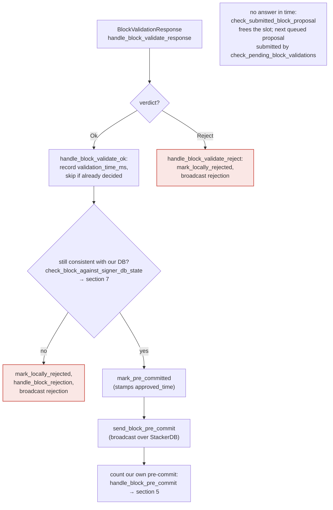

### Title
Signer re-validates chainstate but never re-checks miner/global-state validity before signing, allowing a signature on a block whose miner is no longer the active/canonical miner - ([File: stacks-signer/src/v0/signer.rs])

### Summary
`SuperPool.togglePause()` exists but no state-changing function checks `paused()`, so the guard is decorative. In the stacks-signer, the analogous validity gate is the miner/global-state check performed by `check_block_against_state` → `check_block_against_global_state`/`check_block_against_local_state` → `GlobalStateView::check_proposal` (or `SortitionsView::check_proposal`), which enforces that the proposed block's `consensus_hash` matches the *current active miner's tenure*, that the miner pubkey hash matches, etc. This gate runs exactly once, at proposal arrival [1](#0-0) . It is never re-invoked at the two later points where the signer's belief can have changed and where the irreversible action (producing a signature) actually happens: the validate-ok recheck and the pre-commit-threshold recheck. Both of those points call only `check_block_against_signer_db_state`, a narrower chainstate/tenure-continuity check that does not verify miner pubkey hash, consensus-hash/tenure-id match against the current global state, or sortition winner validity.

### Finding Description
`check_block_against_state` is the function that performs the "pause"-analogous validity gate: it checks protocol-version consensus, static block validity, absence of problematic txs, and then dispatches to `check_block_against_global_state`/`check_block_against_local_state`, which call `GlobalStateView::check_proposal`/`SortitionsView::check_proposal` [2](#0-1) . `GlobalStateView::check_proposal` rejects the block with `InvalidMiner` if there is no valid current miner, and with `ConsensusHashMismatch` if the block's `consensus_hash` does not match the active miner's `tenure_id`, and with `IrrecoverablePubkeyHash`/pubkey-hash-mismatch if the miner key doesn't match [3](#0-2) . The v1 equivalent additionally checks that the miner is still the valid/most-recent sortition winner (`InvalidMiner`, `NotLatestSortitionWinner`) [4](#0-3) .

This entire gate is only invoked from `handle_block_proposal` at proposal arrival, via `check_block_against_state` [5](#0-4) . The two later re-evaluation points instead call only `check_block_against_signer_db_state`:
- On a validation OK response, `handle_block_validate_ok` re-checks via `check_block_against_signer_db_state` [6](#0-5) .
- When the pre-commit weight crosses the 70% threshold — the point where the signer actually places its signature — the recheck before signing is again only `check_block_against_signer_db_state`, immediately followed by the conflict/height checks; there is no call back into `check_block_against_state`/`check_block_against_global_state` [7](#0-6) .

`check_block_against_signer_db_state` itself only verifies tenure-continuity (`check_tenure_change_confirms_parent` / `check_latest_block_in_tenure`) against the signer DB and the node's tenure tip; it never re-derives or re-checks the current miner, consensus-hash match, or miner pubkey [8](#0-7) . This gap is explicitly documented: "Two things belong to the proposal path only and are not re-run at validate-ok or at signing: ... the v2 `check_proposal` wrapper checks miner pubkey hash, consensus hash, the pox bitvec, and tenure-extend rules before delegating here" [9](#0-8) .

Between proposal arrival and the moment the pre-commit threshold is crossed, the signer's view of the active miner is not frozen: `process_event` runs `handle_pending_update` and `capitulate_viewpoint` on every pass, and incoming `StateMachineUpdate` messages continuously update `global_state_evaluator` via `handle_state_machine_update` [10](#0-9) , [11](#0-10) . So the global state's notion of "current active miner" can change (e.g., due to timeout-based capitulation to a new miner, or a majority of signers updating their `current_miner`) after a block was validated/pre-committed but before the 70% pre-commit threshold is reached and the signature is produced, and the signer's own recheck at that decisive moment cannot see this change because it never re-runs `check_proposal`.

### Impact Explanation
This breaks the equality "signed block's miner/tenure == the global-state-approved active miner at signing time." A signer can end up placing its actual, irreversible signature (`mark_locally_accepted` / `handle_block_signature`) on a block belonging to a miner tenure that the rest of the signer set — and this signer's own state machine, had it re-checked — would now consider invalid/superseded, because the only gate that enforces "this consensus_hash matches the currently active miner" is skipped at both re-evaluation points. This falls under the "signer signing an invalid or non-canonical block" impact category, since the signature is produced against a stale miner-validity view rather than the view active at signing time.

### Likelihood Explanation
Reachable purely through normal gossip timing without requiring a signer majority: any miner-switch event (timeout-based capitulation, a new `BlockFound`/tenure-extend, or `StateMachineUpdate` traffic arriving mid-flight) that lands between "block validated / pre-committed" and "pre-commit threshold crossed" reproduces the gap. Given pre-commit accumulation can take up to the propagation delay across signers (documented as "can be minutes" in the codebase's own performance notes) [12](#0-11) , there is a realistic window for the global state to move on before this signer's own signature is produced.

### Recommendation
Re-run the miner/global-state validity check (`check_block_against_state` → `check_block_against_global_state`/`check_block_against_local_state`) — not just `check_block_against_signer_db_state` — both in `handle_block_validate_ok`'s recheck and immediately before signing in `handle_block_pre_commit`, so that the "is this still the active/canonical miner's tenure" gate is enforced at the same point the irreversible signature is produced, not only at proposal arrival.

### Proof of Concept
1. A miner `M1` proposes block `B` for tenure `T1`; the signer validates `B` and, since `M1`/`T1` currently matches the global state's `current_miner`, `check_block_against_state` passes and the signer pre-commits (`handle_block_validate_ok` → `mark_pre_committed` → `send_block_pre_commit`) [13](#0-12) .
2. Before 70% of signers pre-commit, enough `StateMachineUpdate` traffic (or a capitulation timeout) causes this signer's `global_state_evaluator` to flip `current_miner` to `M2`/`T2` via `handle_state_machine_update`/`capitulate_viewpoint` [10](#0-9) , [14](#0-13) .
3. Pre-commits for `B` (from peers still on the old view, or replayed) still cross the 70% threshold at this signer. `handle_block_pre_commit`'s threshold branch calls only `check_block_against_signer_db_state`, which checks tenure continuity but not that `T1`/`M1` is still the globally-approved active miner [7](#0-6) .
4. The signer proceeds to sign `B` (`mark_locally_accepted`, `handle_block_signature`) for a miner/tenure that its own current global state view would now reject via `InvalidMiner`/`ConsensusHashMismatch`, had `check_proposal` been re-run — a concrete instance of the validity gate that is only checked once at proposal time and never re-verified at the point the signature actually leaves the box.

### Citations

**File:** docs/signer-flows.md (L184-203)
```markdown
    REASON -- yes --> FRESH
    KNOWN -- no --> DRAIN["collect early votes<br/>drain_pending_block_responses"] --> FRESH["fresh evaluation:<br/>new BlockInfo, fetch<br/>SortitionsView if needed"]
    FRESH --> CHECK["check_block_against_state:<br/>protocol version consensus (NoSignerConsensus),<br/>static validity, no problematic_txs<br/>(ProblematicTransactions), then<br/>v1 SortitionsView::check_proposal or<br/>v2 GlobalStateView::check_proposal → section 7"]
    CHECK -- invalid --> REJ["send rejection<br/>(not stored)"]:::bad
    CHECK -- "not provably invalid" --> BUSY{"validation slot free?<br/>submitted_block_proposal"}
    BUSY -- yes --> SUBMIT["submit_block_for_validation<br/>(ask the stacks-node)"]
    BUSY -- no --> QUEUE["queue it<br/>insert_pending_block_validation"]
    SUBMIT --> STORE["insert_block +<br/>process_pending_responses_for_block<br/>(replay early votes)"]
    QUEUE --> STORE
    classDef bad fill:#d84a3f22,stroke:#c9473d,stroke-width:1.5px;
```

Early votes: acceptances, rejections, and pre-commits that arrived before the
proposal itself are parked in pending tables and replayed once the proposal is
known.

> Anchors: `handle_block_proposal`, `should_reevaluate_block`,
> `should_reevaluate_reject_reason`, `check_block_against_state`,
> `submit_block_for_validation`, `process_pending_responses_for_block`
> (signer.rs); `check_proposal` (chainstate/v1.rs, v2.rs)
```

**File:** docs/signer-flows.md (L205-227)
```markdown
## 4. The node's validation verdict

The stacks-node answers the `/v3/block_proposal` submission. On OK, the signer
re-checks its own DB state and only then advertises willingness to sign by
broadcasting a **pre-commit**. A signature is _not_ produced here.



> Anchors: `handle_block_validate_response`, `handle_block_validate_ok`,
> `handle_block_validate_reject`, `check_block_against_signer_db_state`,
> `send_block_pre_commit` (signer.rs)
```

**File:** docs/signer-flows.md (L286-287)
```markdown
  other guard, which is what the own-tenure branch above covers.

```

**File:** docs/signer-flows.md (L425-433)
```markdown
Two things belong to the proposal path only and are **not** re-run at validate-ok
or at signing:

- `validate_tenure_change_payload` rejects with `DuplicateBlockFound` when we
  have already accepted a block in the tenure a tenure-change block is starting.
  v2 counts locally or globally accepted blocks (`get_last_signed_block`); v1
  counts only globally accepted ones (`get_last_globally_accepted_block`).
- the v2 `check_proposal` wrapper checks miner pubkey hash, consensus hash, the
  pox bitvec, and tenure-extend rules before delegating here.
```

**File:** stacks-signer/src/v0/signer.rs (L333-362)
```rust
    fn process_event(
        &mut self,
        stacks_client: &StacksClient,
        sortition_state: &mut Option<SortitionsView>,
        event: Option<&SignerEvent<SignerMessage>>,
        _res: &Sender<SignerResult>,
        current_reward_cycle: u64,
    ) {
        self.check_submitted_block_proposal();
        self.check_pending_block_validations(stacks_client);

        let mut prior_state = self.local_state_machine.clone();
        let local_signer_protocol_version = self.get_signer_protocol_version();
        if self.reward_cycle <= current_reward_cycle {
            self.local_state_machine.handle_pending_update(&mut self.signer_db, stacks_client,
                &self.proposal_config,
                &mut self.tx_replay_scope, &self.global_state_evaluator, local_signer_protocol_version)
                .unwrap_or_else(|e| error!("{self}: failed to update local state machine for pending update"; "err" => ?e));
        }
        // See if we should capitulate our viewpoint...
        self.local_state_machine.capitulate_viewpoint(
            stacks_client,
            &mut self.signer_db,
            &mut self.global_state_evaluator,
            local_signer_protocol_version,
            sortition_state,
            self.capitulate_miner_view_timeout,
            self.proposal_config.tenure_last_block_proposal_timeout,
            &mut self.last_capitulate_miner_view,
        );
```

**File:** stacks-signer/src/v0/signer.rs (L809-870)
```rust
    /// Check if block should be rejected based on the appropriate state (either local or global)
    /// Will return a BlockRejection if the block is invalid, none otherwise.
    fn check_block_against_state(
        &mut self,
        stacks_client: &StacksClient,
        sortition_state: &mut Option<SortitionsView>,
        block_info: &BlockInfo,
    ) -> Option<BlockRejection> {
        // First update our global state evaluator with our local state if we have one
        let local_version = self.get_signer_protocol_version();
        if let Ok(update) = self
            .local_state_machine
            .try_into_update_message_with_version(local_version)
        {
            self.global_state_evaluator
                .insert_update(self.stacks_address.clone(), update);
        };
        let Some(state_version) = self.determine_active_signer_protocol_version() else {
            warn!(
                "{self}: No consensus on signer protocol version. Unable to validate block. Rejecting.";
                "signer_signature_hash" => %block_info.block.header.signer_signature_hash(),
                "block_id" => %block_info.block.block_id(),
            );
            return Some(
                self.create_block_rejection(RejectReason::NoSignerConsensus, &block_info.block),
            );
        };

        // reject if the block itself is malformed
        if !block_info.check_static_valid_block() {
            debug!("{self}: Block is syntatically invalid; will not process");
            return Some(self.create_block_rejection(
                RejectReason::ValidationFailed(ValidateRejectCode::InvalidBlock),
                &block_info.block,
            ));
        }

        // For this first version, reject any block that marks transactions as
        // problematic. The criteria for what may legitimately appear in
        // `problematic_txs` has not been decided yet, so signers reject all
        // such blocks until that policy is established.
        if !block_info.block.header.problematic_txs.is_empty() {
            warn!(
                "{self}: Block proposal marks transactions as problematic, which signers do not yet allow; rejecting";
                "signer_signature_hash" => %block_info.block.header.signer_signature_hash(),
                "block_id" => %block_info.block.block_id(),
                "problematic_tx_count" => block_info.block.header.problematic_txs.len(),
            );
            return Some(
                self.create_block_rejection(
                    RejectReason::ProblematicTransactions,
                    &block_info.block,
                ),
            );
        }

        if state_version.uses_global_state() {
            self.check_block_against_global_state(stacks_client, &block_info.block)
        } else {
            self.check_block_against_local_state(stacks_client, sortition_state, &block_info.block)
        }
    }
```

**File:** stacks-signer/src/v0/signer.rs (L1082-1106)
```rust
    fn handle_state_machine_update(
        &mut self,
        signer_public_key: &Secp256k1PublicKey,
        update: &StateMachineUpdate,
        received_time: &SystemTime,
    ) {
        let replay_txids = update.content.replay_txids();
        let pubkey = signer_public_key.to_hex();
        info!(
            "{self}: Received state machine update from signer {pubkey}: {update}";
            "replay_txids" => ?replay_txids
        );
        let address = StacksAddress::p2pkh(self.mainnet, signer_public_key);
        // Store the state machine update so we can reload it if we crash
        if let Err(e) = self.signer_db.insert_state_machine_update(
            self.reward_cycle,
            &address,
            update,
            received_time,
        ) {
            warn!("{self}: Failed to update global state in signerdb: {e}");
        }
        self.global_state_evaluator
            .insert_update(address, update.clone());
    }
```

**File:** stacks-signer/src/v0/signer.rs (L1340-1366)
```rust
        // The chain and signer db state may have changed materially since this block passed the
        // proposal-time checks (e.g. between validation and reaching the pre-commit threshold we
        // may have signed a block that this one would reorg). Re-run the chainstate checks
        // before putting a signature over the block, and respond with a rejection if they no
        // longer pass, just as the block validation response handler does.
        if let Some(block_rejection) =
            self.check_block_against_signer_db_state(stacks_client, &block_info.block)
        {
            warn!(
                "{self}: Reached the pre-commit threshold for a block, but it no longer passes the chainstate checks. Rejecting.";
                "signer_signature_hash" => %block_hash,
                "block_height" => block_info.block.header.chain_length,
                "reject_code" => %block_rejection.reason_code,
                "reject_reason" => &block_rejection.reason,
            );
            if let Err(e) = block_info.mark_locally_rejected() {
                if !block_info.has_reached_consensus() {
                    warn!("{self}: Failed to mark block as locally rejected: {e:?}");
                }
            };
            self.signer_db
                .insert_block(&block_info)
                .unwrap_or_else(|e| self.handle_insert_block_error(e));
            self.handle_block_rejection(&block_rejection, sortition_state);
            self.send_block_response(&block_info.block, block_rejection.into());
            return;
        }
```

**File:** stacks-signer/src/v0/signer.rs (L1799-1880)
```rust
    /// WARNING: This is an incomplete check. Do NOT call this function PRIOR to check_proposal or block_proposal validation succeeds.
    ///
    /// Re-verify a block's chain length against the last signed block within signerdb.
    /// This is required in case a block has been approved since the initial checks of the block validation endpoint.
    fn check_block_against_signer_db_state(
        &mut self,
        stacks_client: &StacksClient,
        proposed_block: &NakamotoBlock,
    ) -> Option<BlockRejection> {
        let signer_signature_hash = proposed_block.header.signer_signature_hash();
        // If this is a tenure change block, ensure that it confirms the correct number of blocks from the parent tenure.
        if let Some(tenure_change) = proposed_block.get_tenure_change_tx_payload() {
            // Ensure that the tenure change block confirms the expected parent block
            match SortitionData::check_tenure_change_confirms_parent(
                tenure_change,
                proposed_block,
                &mut self.signer_db,
                stacks_client,
                self.proposal_config.tenure_last_block_proposal_timeout,
                self.proposal_config.reorg_attempts_activity_timeout,
            ) {
                Ok(true) => return None,
                Ok(false) => {
                    return Some(self.create_block_rejection(
                        RejectReason::SortitionViewMismatch,
                        proposed_block,
                    ))
                }
                Err(e) => {
                    warn!("{self}: Error checking block proposal: {e}";
                        "signer_signature_hash" => %signer_signature_hash,
                        "block_id" => %proposed_block.block_id()
                    );
                    return Some(self.create_block_rejection(
                        RejectReason::ConnectivityIssues(
                            "error checking block proposal".to_string(),
                        ),
                        proposed_block,
                    ));
                }
            }
        }

        // Ensure that the block is the last block in the chain of its current tenure.
        match SortitionData::check_latest_block_in_tenure(
            &proposed_block.header.consensus_hash,
            proposed_block,
            &mut self.signer_db,
            stacks_client,
            self.proposal_config.tenure_last_block_proposal_timeout,
            self.proposal_config.reorg_attempts_activity_timeout,
        ) {
            Ok(is_latest) => {
                if !is_latest {
                    warn!(
                        "Miner's block proposal does not confirm as many blocks as we expect";
                        "proposed_block_consensus_hash" => %proposed_block.header.consensus_hash,
                        "proposed_block_signer_signature_hash" => %signer_signature_hash,
                        "proposed_chain_length" => proposed_block.header.chain_length,
                    );
                    Some(self.create_block_rejection(
                        RejectReason::SortitionViewMismatch,
                        proposed_block,
                    ))
                } else {
                    None
                }
            }
            Err(e) => {
                warn!("{self}: Failed to check block against signer db: {e}";
                    "signer_signature_hash" => %signer_signature_hash,
                    "block_id" => %proposed_block.block_id()
                );
                Some(self.create_block_rejection(
                    RejectReason::ConnectivityIssues(
                        "failed to check block against signer db".to_string(),
                    ),
                    proposed_block,
                ))
            }
        }
    }
```

**File:** stacks-signer/src/chainstate/v2.rs (L111-152)
```rust
impl GlobalStateView {
    /// Apply checks from the signer state machine on the block proposal.
    pub fn check_proposal(
        &self,
        client: &StacksClient,
        signer_db: &mut SignerDb,
        block: &NakamotoBlock,
    ) -> Result<(), RejectReason> {
        let MinerState::ActiveMiner {
            current_miner_pkh,
            tenure_id,
            parent_tenure_id,
            ..
        } = &self.signer_state.current_miner
        else {
            info!(
                "No valid current miner. Considering invalid.";
                "block_height" => block.header.chain_length,
                "signer_signature_hash" => %block.header.signer_signature_hash()
            );
            return Err(RejectReason::InvalidMiner);
        };
        if &block.header.consensus_hash != tenure_id {
            info!("Miner block proposal consensus hash does not match the current miner's tenure id. Considering invalid.";
                "block_height" => block.header.chain_length,
                "signer_signature_hash" => %block.header.signer_signature_hash(),
                "block_consensus_hash" => %block.header.consensus_hash,
                "active_miner_tenure_id" => %tenure_id,
                "active_miner_parent_tenure_id" => %parent_tenure_id,
            );
            return Err(RejectReason::ConsensusHashMismatch {
                actual: block.header.consensus_hash.clone(),
                expected: tenure_id.clone(),
            });
        }
        let Some(miner_pk) = block.header.recover_miner_pk() else {
            warn!("Failed to recover miner pubkey";
                  "signer_signature_hash" => %block.header.signer_signature_hash(),
                  "consensus_hash" => %block.header.consensus_hash);
            return Err(RejectReason::IrrecoverablePubkeyHash);
        };
        let miner_pkh = Hash160::from_data(&miner_pk.to_bytes_compressed());
```

**File:** stacks-signer/src/chainstate/v1.rs (L276-317)
```rust
        if proposed_by.state().data.miner_pkh != miner_pkh {
            warn!(
                "Miner block proposal pubkey does not match the winning pubkey hash for its sortition. Considering invalid.";
                "proposed_block_consensus_hash" => %block.header.consensus_hash,
                "signer_signature_hash" => %block.header.signer_signature_hash(),
                "proposed_block_pubkey" => &miner_pk.to_hex(),
                "proposed_block_pubkey_hash" => %miner_pkh,
                "sortition_winner_pubkey_hash" => %proposed_by.state().data.miner_pkh,
            );
            return Err(RejectReason::PubkeyHashMismatch);
        }

        // check that this miner is the most recent sortition
        match proposed_by {
            ProposedBy::CurrentSortition(sortition) => {
                if sortition.miner_status != SortitionMinerStatus::Valid {
                    warn!(
                        "Current miner behaved improperly, this signer views the miner as invalid.";
                        "proposed_block_consensus_hash" => %block.header.consensus_hash,
                        "signer_signature_hash" => %block.header.signer_signature_hash(),
                        "current_sortition_miner_status" => ?sortition.miner_status,
                    );
                    return Err(RejectReason::InvalidMiner);
                }
            }
            ProposedBy::LastSortition(last_sortition) => {
                // should only consider blocks from the last sortition if the new sortition was invalidated
                //  before we signed their first block.
                if self.cur_sortition.miner_status
                    != SortitionMinerStatus::InvalidatedBeforeFirstBlock
                {
                    warn!(
                        "Miner block proposal is from last sortition winner, when the new sortition winner is still valid. Considering proposal invalid.";
                        "proposed_block_consensus_hash" => %block.header.consensus_hash,
                        "signer_signature_hash" => %block.header.signer_signature_hash(),
                        "current_sortition_miner_status" => ?self.cur_sortition.miner_status,
                        "last_sortition" => %last_sortition.data.consensus_hash
                    );
                    return Err(RejectReason::NotLatestSortitionWinner);
                }
            }
        };
```
