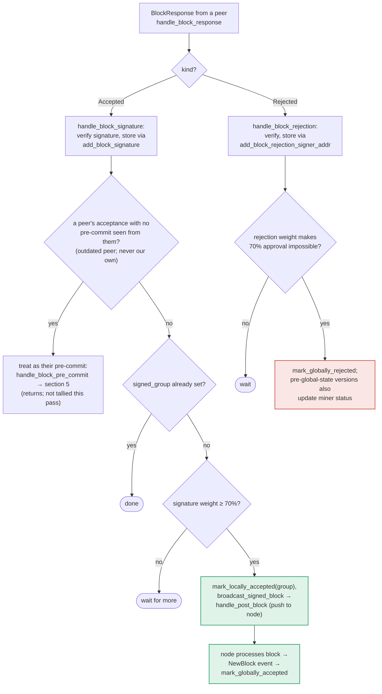

### Title
Signer broadcasts/pushes a peer-signed block without re-validating chainstate consistency, unlike the pre-commit path - ([File: stacks-signer/src/v0/signer.rs])

### Summary
The v0 signer has two independent paths that tally weight toward the 70% signature threshold and can push an assembled block to the node: the pre-commit path (`handle_block_pre_commit`) and the acceptance path (`store_and_process_block_signature`, reached via `handle_block_signature`/`handle_block_response`). The pre-commit path explicitly re-checks the block against fresh chainstate (`check_block_against_signer_db_state`) and the own/any-tenure signed-conflict guard immediately before signing. The acceptance-tally path does neither: it only checks cryptographic signature validity and whether the local `block_info` is already tracked, then directly calls `mark_locally_accepted` and `broadcast_signed_block` once peer signature weight crosses the threshold.

### Finding Description
`handle_block_pre_commit` re-validates state right before signing: [1](#0-0) 

By contrast, `store_and_process_block_signature`, which is invoked when this signer observes a `BlockResponse::Accepted` from a peer, stores the signature and, once threshold weight is reached, immediately marks the block locally accepted and broadcasts it — with no analogous call to `check_block_against_signer_db_state` or the signed-conflict/reorg-permit guard used in section 5: [2](#0-1) 

The documentation's own decision map confirms this asymmetry: section 5 (pre-commit → signature) has an explicit `RECHECK` node before `SIGN`, while section 6 (`handle_block_response`/acceptance tally) goes straight from `TALLY` to `BCAST` with no recheck step: [3](#0-2) 

The design intent (stated directly in the docs) is that between validation and reaching threshold, "we may have signed a different block at the same height, possibly in another tenure, so the world must be re-checked before the signature leaves the box" — but this guarantee is only implemented on the pre-commit path, not on the peer-acceptance-tally path: [4](#0-3) 

Concretely: a single miner can propose block `C` (a reorg attempt / sibling at the same height as an earlier proposal `B`) after this signer has already received and validated `B` but before this signer accumulated enough pre-commits/signatures for `B`. If this signer signs `C` first via the own-tenure fallback in the pre-commit flow (`TIP -- "no — never confirmed" --> SIGN`), it now holds a self-signed conflicting block. When peer `BlockResponse::Accepted` messages for `B` subsequently arrive (a normal gossip occurrence — most of the network validated and accepted `B` before `C` ever propagated), `store_and_process_block_signature` tallies them, crosses the 70% threshold, and unconditionally calls `mark_locally_accepted(true)` + `broadcast_signed_block` for `B` — without ever consulting `get_signed_conflicts`/`conflict_still_blocks`/`check_block_against_signer_db_state` to notice that this signer already signed the conflicting `C`. The state machine permits the `LocallyRejected`/other-state → `LocallyAccepted` transition on re-evaluation, and there is no separate guard blocking acceptance-tally-driven transitions the way there is for pre-commit-tally-driven ones.

### Impact Explanation
This lets a single signer end up assembling and pushing to its own node two conflicting blocks at/around the same height (one it signed directly, one it relayed via aggregated peer signatures) without the safety re-check the codebase explicitly built to prevent exactly this. That is a broken equality between "aggregated weight" and "verified-accepts" — the signer relays as accepted a block whose freshness/conflict status was never re-confirmed at the moment its own tally crossed threshold, unlike every other code path that reaches the same effect (mark_locally_accepted + broadcast). This falls in the Critical impact bucket described (a signer aiding acceptance of a conflicting block via a rejection/accept-recount asymmetry between two structurally similar code paths).

### Likelihood Explanation
No majority of signers, no key compromise, and no auth_token access is required. A single miner proposing a conflicting/reorg block at the right time, combined with ordinary network gossip delay (peer `BlockResponse::Accepted` messages for the earlier block arriving after this signer already signed the later conflicting one), is sufficient to trigger the path. This is a timing/ordering condition reachable by normal operation of a one-slot miner plus gossip, matching the in-scope threat model.

### Recommendation
Add the same re-check performed in `handle_block_pre_commit` (`check_block_against_signer_db_state`, plus the signed-conflict/`reorg_permit_stands` guard) into `store_and_process_block_signature` before calling `mark_locally_accepted`/`broadcast_signed_block`, so that crossing the acceptance threshold via peer signatures cannot bypass the freshness/conflict checks that crossing the pre-commit threshold enforces.

### Proof of Concept
1. Signer S receives and validates proposal `B` at height `h` (state `PreCommitted`), but has not yet reached the pre-commit threshold for `B`.
2. Miner (or a forked tenure) proposes conflicting block `C` at height `h` in another tenure; S evaluates `C` via the pre-commit path, and because it has no recorded conflict for `B` yet at the moment of the "own-tenure" check, it signs `C` (`mark_locally_accepted` via `SIGN` branch in `handle_block_pre_commit`).
3. Shortly after, peer `BlockResponse::Accepted` messages for `B` (from signers who validated and accepted `B` earlier/faster) arrive at S and are handled by `handle_block_signature` → `store_and_process_block_signature`.
4. Once tallied weight for `B` crosses the 70% threshold, `store_and_process_block_signature` calls `mark_locally_accepted(true)` and `broadcast_signed_block` for `B` with no call to `check_block_against_signer_db_state` or `get_signed_conflicts`, even though S already signed the conflicting `C`.
5. S has now contributed to pushing/broadcasting both conflicting blocks `B` and `C`, which the pre-commit-path guard was specifically designed to prevent.

### Citations

**File:** stacks-signer/src/v0/signer.rs (L1340-1366)
```rust
        // The chain and signer db state may have changed materially since this block passed the
        // proposal-time checks (e.g. between validation and reaching the pre-commit threshold we
        // may have signed a block that this one would reorg). Re-run the chainstate checks
        // before putting a signature over the block, and respond with a rejection if they no
        // longer pass, just as the block validation response handler does.
        if let Some(block_rejection) =
            self.check_block_against_signer_db_state(stacks_client, &block_info.block)
        {
            warn!(
                "{self}: Reached the pre-commit threshold for a block, but it no longer passes the chainstate checks. Rejecting.";
                "signer_signature_hash" => %block_hash,
                "block_height" => block_info.block.header.chain_length,
                "reject_code" => %block_rejection.reason_code,
                "reject_reason" => &block_rejection.reason,
            );
            if let Err(e) = block_info.mark_locally_rejected() {
                if !block_info.has_reached_consensus() {
                    warn!("{self}: Failed to mark block as locally rejected: {e:?}");
                }
            };
            self.signer_db
                .insert_block(&block_info)
                .unwrap_or_else(|e| self.handle_insert_block_error(e));
            self.handle_block_rejection(&block_rejection, sortition_state);
            self.send_block_response(&block_info.block, block_rejection.into());
            return;
        }
```

**File:** stacks-signer/src/v0/signer.rs (L2442-2537)
```rust
    /// Store the block acceptance signature and check if we have reached a consensus decision on the block because of it. If we have, update the block state accordingly and broadcast the block if accepted.
    fn store_and_process_block_signature(
        &mut self,
        stacks_client: &StacksClient,
        sortition_state: &mut Option<SortitionsView>,
        block_info: &mut BlockInfo,
        signer_address: &StacksAddress,
        signature: &MessageSignature,
    ) {
        let block_hash = &block_info.signer_signature_hash();
        // signature is valid! store it.
        // if this returns false, it means the signature already exists in the DB, so just return.
        if !self
            .signer_db
            .add_block_signature(block_hash, signer_address, signature)
            .unwrap_or_else(|_| panic!("{self}: Failed to save block signature"))
        {
            return;
        }

        // If this isn't our own signature and we haven't seen a pre-commit from this signer yet, try treating it as a pre-commit in case the caller is running an outdated version
        if signer_address != &self.stacks_address && !self.signer_db.has_committed(block_hash, signer_address).inspect_err(|e| warn!("Failed to check if pre-commit message already considered for {signer_address:?} for {block_hash}: {e}")).unwrap_or(false) {
            self.handle_block_pre_commit(stacks_client, sortition_state, signer_address, block_hash);
            return;
        }

        if block_info.signed_group.is_some() {
            // We have already processed this block to the accepted state. Adding more signatures will not change anything so nothing to check.
            return;
        }
        // do we have enough signatures to broadcast?
        // i.e. is the threshold reached?
        let signatures = self
            .signer_db
            .get_block_signatures(block_hash)
            .unwrap_or_else(|_| panic!("{self}: Failed to load block signatures"));

        // put signatures in order by signer address (i.e. reward cycle order)
        let addrs_to_sigs: HashMap<_, _> = signatures
            .into_iter()
            .filter_map(|sig| {
                let Ok(public_key) = Secp256k1PublicKey::recover_to_pubkey_without_validating_low_s(
                    block_hash.bits(),
                    &sig,
                ) else {
                    return None;
                };
                let addr = StacksAddress::p2pkh(self.mainnet, &public_key);
                Some((addr, sig))
            })
            .collect();

        let signature_weight = self.signer_weights.get(signer_address).unwrap_or(&0);
        let total_signature_weight = self.compute_signature_signing_weight(addrs_to_sigs.keys());
        let total_weight = self.compute_signature_total_weight();

        let min_weight = NakamotoBlockHeader::compute_voting_weight_threshold(total_weight)
            .unwrap_or_else(|_| {
                panic!("{self}: Failed to compute threshold weight for {total_weight}")
            });

        if min_weight > total_signature_weight {
            info!("{self}: Received block acceptance, but have not yet reached the acceptance threshold.";
                "signer_signature_hash" => %block_hash,
                "signature_weight" => signature_weight,
                "consensus_hash" => %block_info.block.header.consensus_hash,
                "block_height" => block_info.block.header.chain_length,
                "total_weight_approved" => total_signature_weight,
                "total_weight" => total_weight,
                "percent_approved" => (total_signature_weight as f64 / total_weight as f64 * 100.0),
            );
            return;
        }
        info!("{self}: have reached the block acceptance threshold";
            "signer_signature_hash" => %block_hash,
            "signature_weight" => signature_weight,
            "consensus_hash" => %block_info.block.header.consensus_hash,
            "block_height" => block_info.block.header.chain_length,
            "total_weight_approved" => total_signature_weight,
            "total_weight" => total_weight,
            "percent_approved" => (total_signature_weight as f64 / total_weight as f64 * 100.0),
        );

        // have enough signatures to broadcast!
        // move block to LOCALLY accepted state.
        // It is only considered globally accepted IFF we receive a new block event confirming it OR see the chain tip of the node advance to it.
        if let Err(e) = block_info.mark_locally_accepted(true) {
            if !block_info.has_reached_consensus() {
                warn!("{self}: Failed to mark block as locally accepted: {e:?}");
            }
        }
        let _ = self.signer_db.insert_block(block_info).map_err(|e| {
            warn!("Failed to set group threshold signature timestamp for {block_hash}: {e:?}");
            panic!("{self} Failed to write block to signerdb: {e}");
        });
        self.broadcast_signed_block(stacks_client, block_info.block.clone(), &addrs_to_sigs);
```

**File:** docs/signer-flows.md (L229-236)
```markdown
## 5. Pre-commit threshold → signature

The only place the signer produces a block signature by counting votes.
Pre-commits from peers (and our own) accumulate; at ≥70% weight the signer
decides whether to follow through. Between validation and threshold, we may have
signed a _different_ block at the same height, possibly in another tenure, so
the world must be re-checked before the signature leaves the box.

```

**File:** docs/signer-flows.md (L357-375)
```markdown

```
