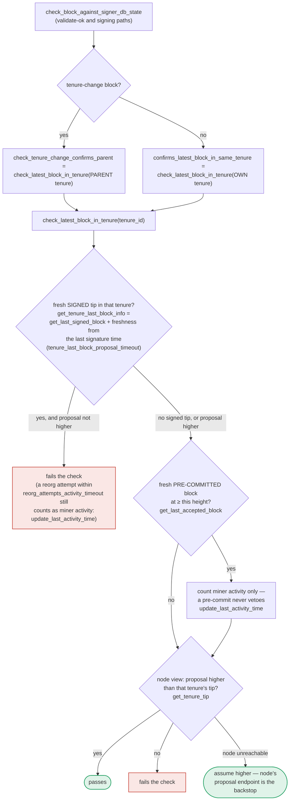

### Title
Signer may sign a duplicate/conflicting tenure-change block because the `DuplicateBlockFound` check only runs at proposal time, not at pre-commit/signing time - ([File: stacks-signer/src/chainstate/v1.rs], [File: stacks-signer/src/v0/signer.rs])

### Summary
The Cilium advisory shows a class of bug where a security check is enforced on one code path but silently skipped when traffic (or, here, a block proposal) reaches the same terminal action through a different path (WireGuard-decrypted traffic bypassing the interface the host-policy check assumed). The stacks-signer codebase has a structurally identical gap: the check that prevents a signer from endorsing a second, duplicate tenure-change block for a tenure that already has an accepted block (`validate_tenure_change_payload` → `RejectReason::DuplicateBlockFound`) is only executed when a fresh `BlockProposal` message is first evaluated (`check_block_against_state`). It is explicitly **not** re-run on the two other paths that can still produce a signature: the node's validate-ok callback (`check_block_against_signer_db_state`) and the pre-commit-threshold signing path in `handle_block_pre_commit`. This is documented as a known limitation in `docs/signer-flows.md:425-437`, which states the duplicate check "never runs again" and that a late pre-commit threshold "relies on section 5's own-tenure conflict guard to cover the same ground" — a different, weight/height-keyed mechanism (`get_signed_conflicts`) that is not proven to cover every case the original check covered.

### Finding Description
`validate_tenure_change_payload` in `stacks-signer/src/chainstate/v1.rs:461-520` is the only place that explicitly rejects a tenure-change block with `RejectReason::DuplicateBlockFound` when `signer_db.get_last_globally_accepted_block(&block.header.consensus_hash)` already returns a block for that tenure: [1](#0-0) 

This function is invoked only from the fresh-proposal evaluation path (`check_proposal` → `check_block_against_state`), which the flow documentation confirms: [2](#0-1) 

By contrast, the re-checks that run at validate-ok time and at the moment the pre-commit threshold is crossed both go through `check_block_against_signer_db_state`, whose tenure-change branch only re-verifies the **parent** tenure (`check_tenure_change_confirms_parent`), never the block's own tenure: [3](#0-2) 

The only remaining guard at signing time is the own/any-tenure conflict check in `handle_block_pre_commit`, which is keyed on `get_signed_conflicts(chain_length, block_hash)` — height and freshness based, and scoped to what *this* signer has locally recorded as signed/endorsed: [4](#0-3) [5](#0-4) 

The equality that must hold is: *"a tenure has at most one accepted starting (tenure-change) block, enforced identically regardless of which of the three paths (proposal, validate-ok, pre-commit-threshold) produces the signature."* The duplicate-tenure-change guard is only wired into the proposal path. If a signer:

1. Never received/evaluated (or discarded as stale) the original tenure-change proposal for a tenure — so it never recorded `signed_self`/`approved_time` for it in its own `signerdb`, and
2. Later receives a **second, competing** tenure-change block proposal for the *same* `consensus_hash` (e.g., because of a Bitcoin-chain race where two different tenure-change transactions reference the same sortition winner, or a replay/duplicate proposal crafted by the miner) that is submitted, validated OK by the node, and gathers pre-commit weight from other signers before this signer's local conflict-tracking would notice,

then `check_block_against_signer_db_state`'s tenure-change branch checks only the **parent** tenure and passes; `get_signed_conflicts` finds nothing because this signer recorded no local endorsement of the true original block; and the signer proceeds to sign the duplicate, since `validate_tenure_change_payload`'s own-tenure `DuplicateBlockFound` check is simply never invoked again.

### Impact Explanation
If this path is reachable, it breaks the "one accepted tenure-change per tenure" invariant that `DuplicateBlockFound` exists to protect — i.e. a single signer would put a valid signature over two conflicting blocks that both claim to start the same tenure. That is a "signer signing a conflicting block" scenario, which the ruleset classifies as Critical impact. Because signatures are irreversible acts (per the signer-flows documentation's own framing) and are counted toward the 70% weight threshold that authorizes the node to adopt a block, a stray signature on a duplicate tenure-change block from even one signer materially assists an attacker (a single malicious/miscoordinated miner with control over proposal timing/content) attempting to split the tenure history.

### Likelihood Explanation
This requires only a one-slot miner (plus normal message gossip) to craft or race a duplicate tenure-change proposal for a tenure whose original starting block a given signer has not yet locally recorded as signed/endorsed — no majority of signers or another signer's key is needed to trigger the *individual* signer's gap. However, the actual likelihood of a successful end-to-end conflict is bounded by two mitigating factors that could not be fully confirmed from the available code: (1) the exact semantics of `get_signed_conflicts` (its implementation in `signerdb.rs` was not directly inspected, so it is unverified whether it also captures peers' endorsements the signer itself has recorded via early-vote replay, which would narrow the window); and (2) whether a genuinely distinct, non-timed-out competing tenure-change block for the identical `consensus_hash` can realistically be produced and independently validated OK by the node without itself being rejected by the node's own tenure/parent checks in `postblock_proposal.rs`. These are the aspects that remain unverified due to not fully tracing `get_signed_conflicts`'s SQL/logic.

### Recommendation
Re-run the own-tenure `DuplicateBlockFound` check (not just the parent-tenure check) inside `check_block_against_signer_db_state` for tenure-change blocks, at both the validate-ok and pre-commit-threshold signing paths, mirroring what `validate_tenure_change_payload` does at proposal time — analogous to how the Cilium fix ensured host-policy enforcement is applied consistently regardless of which interface/path decrypted traffic arrives on.

### Proof of Concept
A concrete, fully-verified PoC could not be constructed without confirming the exact query semantics of `SignerDb::get_signed_conflicts` (not retrieved in this investigation). Conceptually:
1. Two competing tenure-change block proposals `B1` and `B2` are both anchored to the same `consensus_hash` (same tenure).
2. Signer `S` never processes/records `B1` (e.g., it arrives while `S` is behind, or `S`'s proposal for it was superseded/dropped before being stored), so `S`'s `signerdb` has no entry with `signed_self`/`approved_time` for that tenure.
3. `B2` is proposed later, passes node validation (validate-ok), and only the parent-tenure check runs in `check_block_against_signer_db_state`; `get_signed_conflicts` returns empty for `S` since it tracked no local endorsement for that tenure.
4. `S` pre-commits and eventually signs `B2` even though (from the network's point of view) another block already started that tenure — reproducing the "duplicate tenure-change" condition that `validate_tenure_change_payload`'s `DuplicateBlockFound` was designed to prevent, but that check is never invoked on this path.

### Citations

**File:** stacks-signer/src/chainstate/v1.rs (L505-518)
```rust
        let last_in_current_tenure = signer_db
            .get_last_globally_accepted_block(&block.header.consensus_hash)
            .map_err(|e| {
                SignerChainstateError::from(ClientError::InvalidResponse(e.to_string()))
            })?;
        if let Some(last_in_current_tenure) = last_in_current_tenure {
            warn!(
                "Miner block proposal contains a tenure change, but we've already signed a block in this tenure. Considering proposal invalid.";
                "proposed_block_consensus_hash" => %block.header.consensus_hash,
                "proposed_block_signer_signature_hash" => %block.header.signer_signature_hash(),
                "last_in_tenure_signer_signature_hash" => %last_in_current_tenure.block.header.signer_signature_hash(),
            );
            return Err(RejectReason::DuplicateBlockFound);
        }
```

**File:** docs/signer-flows.md (L389-418)
```markdown
## 7. The chainstate checks (shared)

`check_latest_block_in_tenure` answers "does this block confirm the tip we
expect?" and it runs in three places: at proposal arrival (inside
`check_proposal`), at validate-ok, and at the moment of signing. _Which_ tenure
it is asked about depends on the block: a tenure-change block is checked against
its **parent** tenure, every other block against its **own**. Never both. The
pivotal helper is `get_tenure_last_block_info`, which considers only blocks that
carry a signature (`get_last_signed_block`): a pre-commit never vetoes anything,
it only counts as miner activity.


```

**File:** docs/signer-flows.md (L425-437)
```markdown
Two things belong to the proposal path only and are **not** re-run at validate-ok
or at signing:

- `validate_tenure_change_payload` rejects with `DuplicateBlockFound` when we
  have already accepted a block in the tenure a tenure-change block is starting.
  v2 counts locally or globally accepted blocks (`get_last_signed_block`); v1
  counts only globally accepted ones (`get_last_globally_accepted_block`).
- the v2 `check_proposal` wrapper checks miner pubkey hash, consensus hash, the
  pox bitvec, and tenure-extend rules before delegating here.

Because the duplicate check never runs again, a block that crosses the pre-commit
threshold long after it was proposed relies on section 5's own-tenure conflict
guard to cover the same ground.
```

**File:** stacks-signer/src/v0/signer.rs (L1368-1421)
```rust
        // A pre-commit may be superseded by a competing proposal at the same height (e.g. a
        // re-proposed tenure-start block after the first failed to reach consensus), but a
        // signature must not be superseded while it's still "fresh". A signed block at the
        // same or higher height in ANY tenure is a conflict: two blocks at the same height are
        // siblings no matter which tenure they belong to (e.g. the next tenure's tenure-start
        // block conflicts with the current tenure's block at the same height). Blocks in
        // tenures whose reorg we sanctioned under the reorg-timing rules are excluded, but
        // only while the sortition the permit was granted to is still canonical
        // (`check_parent_tenure_choice` records the permit, `reorg_permit_stands` re-derives
        // its validity from the node); every other question about whether a conflict is
        // still live is derived from the node in `conflict_still_blocks`.
        //
        // Unlike the chainstate check above, a refusal here is "for now" rather than a
        // broadcast rejection: a later pre-commit re-evaluation may still sign the block once
        // the conflicting signature has gone stale.
        let conflicts = match self
            .signer_db
            .get_signed_conflicts(block_info.block.header.chain_length, &block_hash)
        {
            Ok(conflicts) => conflicts,
            Err(e) => {
                warn!("{self}: Failed to query the signed blocks. Refusing to sign block {block_hash}: {e:?}");
                return;
            }
        };
        let freshness_cutoff = get_epoch_time_secs().saturating_sub(
            self.proposal_config
                .tenure_last_block_proposal_timeout
                .as_secs(),
        );
        // A fresh signature only blocks while the block it covers could still be part of the
        // chain: see `conflict_still_blocks`, which asks the node whether it is. Check
        // freshness first: it is a local timestamp comparison, while `reorg_permit_stands`
        // and `conflict_still_blocks` each query the node, so stale conflicts cost no
        // round-trips.
        if let Some(conflict) = conflicts.iter().find(|conflict| {
            conflict.last_endorsed > freshness_cutoff
                && !self.reorg_permit_stands(stacks_client, conflict)
                && self.conflict_still_blocks(
                    stacks_client,
                    conflict,
                    block_info.block.header.chain_length,
                )
        }) {
            warn!(
                "{self}: Reached the pre-commit threshold for a block, but we have recently signed or accepted a different block at the same or higher height. Refusing to sign.";
                "signer_signature_hash" => %block_hash,
                "block_height" => block_info.block.header.chain_length,
                "conflicting_signer_signature_hash" => %conflict.signer_signature_hash,
                "conflicting_block_height" => conflict.stacks_height,
                "conflicting_consensus_hash" => %conflict.consensus_hash,
            );
            return;
        }
```

**File:** stacks-signer/src/v0/signer.rs (L1422-1457)
```rust

        // No conflict is both fresh and still live. A conflict that no longer matters, i.e.
        // stale, or provably dead per `conflict_still_blocks`, cannot veto on its own. A
        // stale conflict in another tenure in particular no longer speaks for us: whether this
        // block may replace what another tenure built is settled by the chainstate checks above.
        // A stale conflict in this block's own tenure still blocks if the node already has that
        // tenure at or above the proposed height, since the proposal then duplicates state the
        // node has already built on. (The chainstate checks don't cover this for tenure-change
        // blocks: those check the parent tenure instead of their own.)
        // The permit check is deferred to here so that only same-tenure conflicts pay for it.
        if conflicts.iter().any(|conflict| {
            conflict.consensus_hash == block_info.block.header.consensus_hash
                && !self.reorg_permit_stands(stacks_client, conflict)
        }) {
            match stacks_client.get_tenure_tip(&block_info.block.header.consensus_hash) {
                Ok(tip) => {
                    let tip_height = tip.anchored_header.height();
                    if tip_height >= block_info.block.header.chain_length {
                        warn!(
                            "{self}: Reached the pre-commit threshold for a block that conflicts with previously signed or accepted blocks, and the canonical tip of its tenure is already at or above the proposed height. Refusing to sign.";
                            "signer_signature_hash" => %block_hash,
                            "block_height" => block_info.block.header.chain_length,
                            "canonical_tip_height" => tip_height,
                        );
                        return;
                    }
                }
                Err(e) => {
                    warn!(
                        "{self}: Failed to fetch the canonical tip of the proposed block's tenure: {e:?}. Treating the tenure as unconfirmed.";
                        "signer_signature_hash" => %block_hash,
                        "consensus_hash" => %block_info.block.header.consensus_hash,
                    );
                }
            }
        }
```
