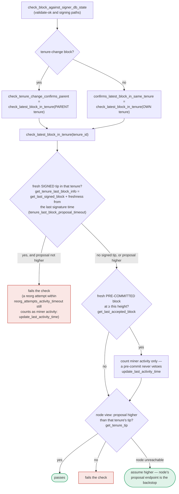

### Title
Signer re-validates only tenure-confirmation at validate-ok/pre-commit time, letting proposal-time-only miner/bitvec/tenure-extend checks go stale before signing - (File: stacks-signer/src/v0/signer.rs, stacks-signer/src/chainstate/v1.rs, stacks-signer/src/chainstate/v2.rs)

### Summary
The Paladin finding is a class of bug where a resource is validated once at creation time (reward-token whitelist) but a later state-mutating action (extend) on the same object skips re-checking that validation, letting a condition that would now fail (delisted token) continue to be relied on indefinitely. The stacks-signer codebase has a structurally identical gap: several proposal-time-only checks in `SortitionsView::check_proposal` (v1) / `GlobalStateView::check_proposal` (v2) — miner-pubkey-hash match, bitvec-all-ones, "is this the currently active/valid miner" (`SortitionMinerStatus`/`MinerState::ActiveMiner`), and tenure-extend timing rules — are evaluated only once, when the block proposal first arrives. The re-validation performed later in the pipeline, `check_block_against_signer_db_state` (called from `handle_block_validate_ok` and again at the pre-commit-threshold moment in `handle_block_pre_commit`), only re-runs `check_latest_block_in_tenure`/`check_tenure_change_confirms_parent` (tenure-tip confirmation) — it does **not** re-invoke `check_proposal`, so it never re-checks miner legitimacy, bitvec, or tenure-extend-timing.

### Finding Description
`should_reevaluate_block` / `handle_block_proposal` run the full `check_proposal` (v1: `SortitionsView::check_proposal`, v2: `GlobalStateView::check_proposal`) only once, at first sight of a proposal: [1](#0-0) 

That single pass validates, among other things, that the block's recovered miner public key matches the sortition winner (`PubkeyHashMismatch`), that the block's `pox_treatment` bitvec is all 1s (`InvalidBitvec`), that the proposing sortition is the currently valid/active miner (v1 `SortitionMinerStatus::Valid` / v2 `MinerState::ActiveMiner`), and — for tenure-extend transactions — that enough time has passed or the burn view changed (`InvalidTenureExtend`): [2](#0-1) [3](#0-2) [4](#0-3) [5](#0-4) 

If the validation slot is busy, the proposal is parked (`insert_pending_block_validation`) rather than submitted immediately, and only submitted later once a slot frees: [6](#0-5) 

When the node's validation response finally arrives, `handle_block_validate_ok` re-checks the signer DB state via `check_block_against_signer_db_state` — but this call only exercises the "confirms latest block in tenure" logic (`check_latest_block_in_tenure` / `check_tenure_change_confirms_parent`), not the miner-identity, bitvec, or tenure-extend-timing checks that live inside `check_proposal`: [7](#0-6) [8](#0-7) 

The same limited re-check runs again at the pre-commit-threshold moment, immediately before the signer actually signs: [9](#0-8) 

The documentation itself flags that this gap is real and only partially compensated: it explicitly calls out that the duplicate-block check (`DuplicateBlockFound`, inside `validate_tenure_change_payload`) is "proposal path only" and is not re-run at validate-ok or signing, relying instead on the own-tenure conflict guard in section 5 to cover the same ground: [10](#0-9) 

However, that documented mitigation is scoped specifically to the duplicate-tenure-block case (via `get_signed_conflicts`/`get_tenure_last_block_info`). It does not cover the sibling proposal-only checks: miner-pubkey/bitvec/`ActiveMiner`-status and tenure-extend timing. Nothing in `handle_block_pre_commit`'s conflict-resolution logic (section 5) re-derives or re-verifies those conditions — it only reasons about *conflicting signed blocks at other heights/tenures*, not about whether the proposing miner is still the one the signer's state machine currently trusts.

Concretely: a proposal can be screened by `check_proposal` while a given sortition is `ActiveMiner`/`SortitionMinerStatus::Valid`, queued behind a busy validation slot, and only actually validated/pre-committed/signed well after the signer's state machine (`SignerStateMachine`/`MinerState`) has moved on (e.g., the miner timed out per `SortitionState::is_timed_out`, or `capitulate_miner_view` adopted a new threshold view). At that later point, `check_block_against_signer_db_state` will not detect that the block's miner is no longer the trusted/active one, since it never re-invokes the pubkey/bitvec/miner-status portion of `check_proposal`.

### Impact Explanation
If exploitable, this would let a signer sign a block whose "is this the legitimate/active miner" condition, verified once at proposal time, is stale/false by the time the signature is actually produced — a case of "a signer signing an invalid/non-canonical block" per the Critical bucket in scope. It also risks a rejection-vs-acceptance equality break if the same block would be rejected were `check_proposal` re-run fresh.

### Likelihood Explanation
I could not fully verify, within the remaining budget, that the timing window (validation-slot congestion or `capitulate_miner_view`/`is_timed_out` transitions) is realistically reachable by a lone miner without requiring a majority of signers to already disagree, nor could I trace precisely how large the "stale" window can grow in practice, or whether some other unseen guard (e.g., in `handle_block_signature`/`get_signed_conflicts`) indirectly re-derives miner validity before the final signature leaves the box. The documentation explicitly acknowledges and defends against the analogous duplicate-block gap but is silent on whether the pubkey/bitvec/miner-status/tenure-extend-timing gap is likewise covered elsewhere, which I was not able to rule out with certainty given the tool budget.

### Recommendation
Re-run (or a targeted subset of) `check_proposal` — at minimum the miner-pubkey/bitvec/`ActiveMiner`-or-`SortitionMinerStatus` and tenure-extend-timing checks — inside `check_block_against_signer_db_state`, both at `handle_block_validate_ok` and immediately before signing in `handle_block_pre_commit`, so that a block whose miner has since become invalid/inactive cannot be signed off stale proposal-time state.

### Proof of Concept
I was not able to construct or verify a concrete reproducible trace (e.g., a unit/integration test) demonstrating the timing window within the available tool budget; this should be validated by tracing `insert_pending_block_validation`/`check_pending_block_validations` queuing delay against `SortitionState::is_timed_out`/`capitulate_miner_view` transition timing in a running signer test harness (similar in spirit to `stacks-signer/src/v0/tests.rs`'s `async_sibling_validation` module) before treating this as confirmed.

### Citations

**File:** docs/signer-flows.md (L184-203)
```markdown
    REASON -- yes --> FRESH
    KNOWN -- no --> DRAIN["collect early votes<br/>drain_pending_block_responses"] --> FRESH["fresh evaluation:<br/>new BlockInfo, fetch<br/>SortitionsView if needed"]
    FRESH --> CHECK["check_block_against_state:<br/>protocol version consensus (NoSignerConsensus),<br/>static validity, no problematic_txs<br/>(ProblematicTransactions), then<br/>v1 SortitionsView::check_proposal or<br/>v2 GlobalStateView::check_proposal → section 7"]
    CHECK -- invalid --> REJ["send rejection<br/>(not stored)"]:::bad
    CHECK -- "not provably invalid" --> BUSY{"validation slot free?<br/>submitted_block_proposal"}
    BUSY -- yes --> SUBMIT["submit_block_for_validation<br/>(ask the stacks-node)"]
    BUSY -- no --> QUEUE["queue it<br/>insert_pending_block_validation"]
    SUBMIT --> STORE["insert_block +<br/>process_pending_responses_for_block<br/>(replay early votes)"]
    QUEUE --> STORE
    classDef bad fill:#d84a3f22,stroke:#c9473d,stroke-width:1.5px;
```

Early votes: acceptances, rejections, and pre-commits that arrived before the
proposal itself are parked in pending tables and replayed once the proposal is
known.

> Anchors: `handle_block_proposal`, `should_reevaluate_block`,
> `should_reevaluate_reject_reason`, `check_block_against_state`,
> `submit_block_for_validation`, `process_pending_responses_for_block`
> (signer.rs); `check_proposal` (chainstate/v1.rs, v2.rs)
```

**File:** docs/signer-flows.md (L391-423)
```markdown
`check_latest_block_in_tenure` answers "does this block confirm the tip we
expect?" and it runs in three places: at proposal arrival (inside
`check_proposal`), at validate-ok, and at the moment of signing. _Which_ tenure
it is asked about depends on the block: a tenure-change block is checked against
its **parent** tenure, every other block against its **own**. Never both. The
pivotal helper is `get_tenure_last_block_info`, which considers only blocks that
carry a signature (`get_last_signed_block`): a pre-commit never vetoes anything,
it only counts as miner activity.



A failed check becomes a different rejection depending on who asked.
`check_block_against_signer_db_state` returns `SortitionViewMismatch`, or
`ConnectivityIssues` when the lookup itself errored rather than answering; the v2
`check_proposal` path returns `InvalidParentBlock`.
```

**File:** docs/signer-flows.md (L425-437)
```markdown
Two things belong to the proposal path only and are **not** re-run at validate-ok
or at signing:

- `validate_tenure_change_payload` rejects with `DuplicateBlockFound` when we
  have already accepted a block in the tenure a tenure-change block is starting.
  v2 counts locally or globally accepted blocks (`get_last_signed_block`); v1
  counts only globally accepted ones (`get_last_globally_accepted_block`).
- the v2 `check_proposal` wrapper checks miner pubkey hash, consensus hash, the
  pox bitvec, and tenure-extend rules before delegating here.

Because the duplicate check never runs again, a block that crosses the pre-commit
threshold long after it was proposed relies on section 5's own-tenure conflict
guard to cover the same ground.
```

**File:** stacks-signer/src/chainstate/v2.rs (L119-174)
```rust
        let MinerState::ActiveMiner {
            current_miner_pkh,
            tenure_id,
            parent_tenure_id,
            ..
        } = &self.signer_state.current_miner
        else {
            info!(
                "No valid current miner. Considering invalid.";
                "block_height" => block.header.chain_length,
                "signer_signature_hash" => %block.header.signer_signature_hash()
            );
            return Err(RejectReason::InvalidMiner);
        };
        if &block.header.consensus_hash != tenure_id {
            info!("Miner block proposal consensus hash does not match the current miner's tenure id. Considering invalid.";
                "block_height" => block.header.chain_length,
                "signer_signature_hash" => %block.header.signer_signature_hash(),
                "block_consensus_hash" => %block.header.consensus_hash,
                "active_miner_tenure_id" => %tenure_id,
                "active_miner_parent_tenure_id" => %parent_tenure_id,
            );
            return Err(RejectReason::ConsensusHashMismatch {
                actual: block.header.consensus_hash.clone(),
                expected: tenure_id.clone(),
            });
        }
        let Some(miner_pk) = block.header.recover_miner_pk() else {
            warn!("Failed to recover miner pubkey";
                  "signer_signature_hash" => %block.header.signer_signature_hash(),
                  "consensus_hash" => %block.header.consensus_hash);
            return Err(RejectReason::IrrecoverablePubkeyHash);
        };
        let miner_pkh = Hash160::from_data(&miner_pk.to_bytes_compressed());
        if current_miner_pkh != &miner_pkh {
            warn!(
                "Miner block proposal pubkey does not match the winning pubkey hash for its sortition. Considering invalid.";
                "proposed_block_consensus_hash" => %block.header.consensus_hash,
                "signer_signature_hash" => %block.header.signer_signature_hash(),
                "proposed_block_pubkey" => &miner_pk.to_hex(),
                "proposed_block_pubkey_hash" => %miner_pkh,
                "active_miner_pubkey_hash" => %current_miner_pkh,
            );
            return Err(RejectReason::PubkeyHashMismatch);
        }
        let bitvec_all_1s = block.header.pox_treatment.iter().all(|entry| entry);
        if !bitvec_all_1s {
            warn!(
                "Miner block proposal has bitvec field which punishes in disagreement with signer. Considering invalid.";
                "proposed_block_consensus_hash" => %block.header.consensus_hash,
                "signer_signature_hash" => %block.header.signer_signature_hash(),
                "active_miner_consensus_hash" => ?tenure_id,
                "active_miner_parent_consensus_hash" => ?parent_tenure_id,
            );
            return Err(RejectReason::InvalidBitvec);
        }
```

**File:** stacks-signer/src/chainstate/v2.rs (L199-250)
```rust
        // is there an unsupported tenure extend type?
        if let Some(tenure_extend) = block.get_tenure_extend_tx_payload().filter(|extend| {
            !(extend.cause.is_full_extend() || extend.cause.is_read_count_extend())
        }) {
            warn!(
                "Miner block proposal contains a tenure extend with an unsupported cause";
                "tenure_extend_cause" => %tenure_extend.cause,
            );
            return Err(RejectReason::InvalidTenureExtend);
        }

        // is there a full tenure extend in this block?
        if let Some(tenure_extend) = block
            .get_tenure_extend_tx_payload()
            .filter(|extend| extend.cause.is_full_extend())
        {
            // in full tenure extends, we need to check:
            // (1) if this is the most recent sortition, an extend is allowed if it changes the burnchain view
            // (2) if this is the most recent sortition, an extend is allowed if enough time has passed to refresh the block limit
            // (3) if we are in replay, an extend is allowed
            let tenure_tip = client.get_tenure_tip(tenure_id)
                .map_err(|e| {
                    warn!("Could not load current tenure tip while evaluating a tenure-extend; cannot approve."; "err" => %e);
                    RejectReason::InvalidTenureExtend
                })?;
            let Some(current_burn_view) = tenure_tip.burn_view else {
                warn!("Tenure-extend attempted in tenure without burn-view.");
                return Err(RejectReason::InvalidTenureExtend);
            };
            let changed_burn_view = tenure_extend.burn_view_consensus_hash != current_burn_view;
            let extend_timestamp = signer_db.calculate_full_extend_timestamp(
                self.config.tenure_idle_timeout,
                block,
                false,
            );
            let epoch_time = get_epoch_time_secs();
            let enough_time_passed = epoch_time >= extend_timestamp;
            let is_in_replay = self.signer_state.tx_replay_set.is_some();
            if !changed_burn_view && !enough_time_passed && !is_in_replay {
                warn!(
                    "Miner block proposal contains a tenure extend, but the conditions for allowing a tenure extend are not met. Considering proposal invalid.";
                    "proposed_block_consensus_hash" => %block.header.consensus_hash,
                    "signer_signature_hash" => %block.header.signer_signature_hash(),
                    "extend_timestamp" => extend_timestamp,
                    "epoch_time" => epoch_time,
                    "is_in_replay" => is_in_replay,
                    "changed_burn_view" => changed_burn_view,
                    "enough_time_passed" => enough_time_passed,
                );
                return Err(RejectReason::InvalidTenureExtend);
            }
        }
```

**File:** stacks-signer/src/chainstate/v1.rs (L221-238)
```rust
        let Some(miner_pk) = block.header.recover_miner_pk() else {
            warn!("Failed to recover miner pubkey";
                  "signer_signature_hash" => %block.header.signer_signature_hash(),
                  "consensus_hash" => %block.header.consensus_hash);
            return Err(RejectReason::IrrecoverablePubkeyHash);
        };
        let bitvec_all_1s = block.header.pox_treatment.iter().all(|entry| entry);
        if !bitvec_all_1s {
            warn!(
                "Miner block proposal has bitvec field which punishes in disagreement with signer. Considering invalid.";
                "proposed_block_consensus_hash" => %block.header.consensus_hash,
                "signer_signature_hash" => %block.header.signer_signature_hash(),
                "current_sortition_consensus_hash" => ?self.cur_sortition.data.consensus_hash,
                "last_sortition_consensus_hash" => ?self.last_sortition.as_ref().map(|x| &x.data.consensus_hash),
            );
            return Err(RejectReason::InvalidBitvec);
        }
        let miner_pkh = Hash160::from_data(&miner_pk.to_bytes_compressed());
```

**File:** stacks-signer/src/chainstate/v1.rs (L288-316)
```rust
        // check that this miner is the most recent sortition
        match proposed_by {
            ProposedBy::CurrentSortition(sortition) => {
                if sortition.miner_status != SortitionMinerStatus::Valid {
                    warn!(
                        "Current miner behaved improperly, this signer views the miner as invalid.";
                        "proposed_block_consensus_hash" => %block.header.consensus_hash,
                        "signer_signature_hash" => %block.header.signer_signature_hash(),
                        "current_sortition_miner_status" => ?sortition.miner_status,
                    );
                    return Err(RejectReason::InvalidMiner);
                }
            }
            ProposedBy::LastSortition(last_sortition) => {
                // should only consider blocks from the last sortition if the new sortition was invalidated
                //  before we signed their first block.
                if self.cur_sortition.miner_status
                    != SortitionMinerStatus::InvalidatedBeforeFirstBlock
                {
                    warn!(
                        "Miner block proposal is from last sortition winner, when the new sortition winner is still valid. Considering proposal invalid.";
                        "proposed_block_consensus_hash" => %block.header.consensus_hash,
                        "signer_signature_hash" => %block.header.signer_signature_hash(),
                        "current_sortition_miner_status" => ?self.cur_sortition.miner_status,
                        "last_sortition" => %last_sortition.data.consensus_hash
                    );
                    return Err(RejectReason::NotLatestSortitionWinner);
                }
            }
```

**File:** stacks-signer/src/v0/signer.rs (L1345-1366)
```rust
        if let Some(block_rejection) =
            self.check_block_against_signer_db_state(stacks_client, &block_info.block)
        {
            warn!(
                "{self}: Reached the pre-commit threshold for a block, but it no longer passes the chainstate checks. Rejecting.";
                "signer_signature_hash" => %block_hash,
                "block_height" => block_info.block.header.chain_length,
                "reject_code" => %block_rejection.reason_code,
                "reject_reason" => &block_rejection.reason,
            );
            if let Err(e) = block_info.mark_locally_rejected() {
                if !block_info.has_reached_consensus() {
                    warn!("{self}: Failed to mark block as locally rejected: {e:?}");
                }
            };
            self.signer_db
                .insert_block(&block_info)
                .unwrap_or_else(|e| self.handle_insert_block_error(e));
            self.handle_block_rejection(&block_rejection, sortition_state);
            self.send_block_response(&block_info.block, block_rejection.into());
            return;
        }
```

**File:** stacks-signer/src/v0/signer.rs (L1946-1959)
```rust
        if let Some(block_rejection) =
            self.check_block_against_signer_db_state(stacks_client, &block_info.block)
        {
            // The signer db state has changed. We no longer view this block as valid. Override the validation response.
            if let Err(e) = block_info.mark_locally_rejected() {
                if !block_info.has_reached_consensus() {
                    warn!("{self}: Failed to mark block as locally rejected: {e:?}");
                }
            };
            self.signer_db
                .insert_block(&block_info)
                .unwrap_or_else(|e| self.handle_insert_block_error(e));
            self.handle_block_rejection(&block_rejection, sortition_state);
            self.send_block_response(&block_info.block, block_rejection.into());
```
