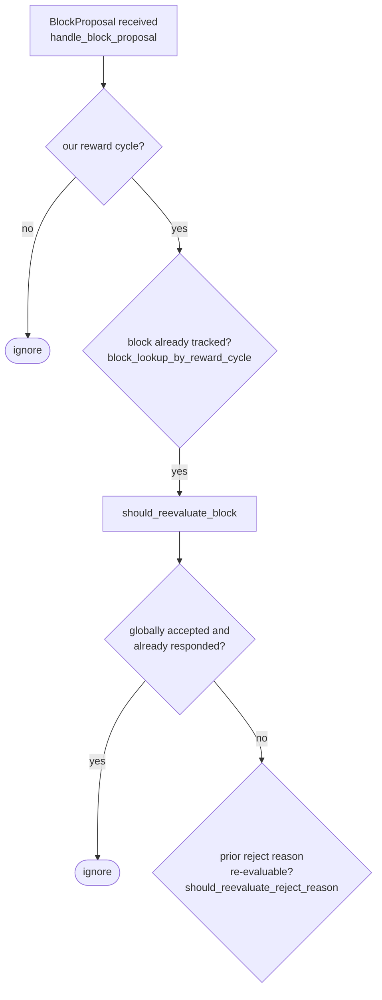

Based on my investigation, I found a strong analog to the reported PDA-seed omission pattern: a state-tracking table in `SignerDb` whose primary key omits the block-identifying discriminator, causing state from one block to silently overwrite/be conflated with state from a different block for the same signer.

### Title
Missing block discriminator in `block_rejection_signer_addrs` primary key causes rejection state to be silently overwritten across different blocks - ([File: stacks-signer/src/signerdb.rs])

### Summary
The `block_rejection_signer_addrs` table is meant to record, per block, which signer addresses rejected that specific block (used to tally rejection weight against a specific `signer_signature_hash`). Its schema, however, declares `PRIMARY KEY (signer_addr)` only, omitting `signer_signature_hash` from the key [1](#0-0) . This is directly analogous to the reported bug class: a state/lookup key is missing a required discriminator field (there, destination chain ID; here, `signer_signature_hash`), so records that should be distinguished by that field collide.

### Finding Description
The table comment claims the `signer_signature_hash` alone is sufficient to identify a block across forks (true), but the primary key of this specific bookkeeping table is `signer_addr` alone, not `(signer_addr, signer_signature_hash)`: [1](#0-0) 

Because inserts against such a table are typically done as `INSERT OR REPLACE` (this pattern is used pervasively elsewhere in the same file, e.g. for the `blocks` and `signer_states` tables) [2](#0-1) , a single signer address can only ever have one row in this table at a time. If signer X's rejection of block A is recorded, and X later rejects a different block B (a sibling/conflicting proposal, which is expected and legitimate in the fork-choice flow described in `docs/signer-flows.md`), the row for X is overwritten to reference block B, and the association between X and block A's rejection is lost.

This breaks the "rejection recounted / miscounted" equality explicitly called out as in-scope impact: any code path that later queries "which signer addresses rejected block A" (via `get_block_rejection_signer_addrs`) will undercount X's rejection of A once X has also rejected (or been recorded against) a later block B with the same key collision. A single non-majority actor — a lone miner proposing two competing blocks in sequence, or ordinary gossip replay/reordering of `BlockRejection` messages from a single signer — can trigger the primary-key collision without needing a majority of signers or any other signer's key.

### Impact Explanation
This falls under the "rejection recounted as an accept"/miscounted-response class in the rules: a signer's genuine rejection of block A can be effectively erased from the local rejection tally once that signer rejects (or is recorded for) a different block, because the storage key does not include the block's `signer_signature_hash`. This can cause a signer to under-count rejection weight for block A (potentially allowing a block that should be seen as rejected by enough weight to instead appear under-rejected), which is a safety-relevant miscount rather than a purely cosmetic bug.

### Likelihood Explanation
Multiple competing/sibling block proposals at the same height are a normal and expected occurrence in the tenure/fork-choice flow (a single miner can and does re-propose after a signature timeout, or propose a sibling tenure-start block) [3](#0-2) . Any signer that rejects more than one block within the window this table is consulted will trigger the collision, so likelihood is high under normal operating conditions, not just adversarial ones.

### Recommendation
Change the primary key of `block_rejection_signer_addrs` to the composite `(signer_signature_hash, signer_addr)` (matching the pattern already used for `blocks` and other per-block tables in the same file), and audit all `INSERT`/`REPLACE` and `SELECT` statements against this table to ensure they always filter/key on both columns.

### Proof of Concept
Not independently executed; this is inferred directly from the schema definition. To confirm empirically: insert a rejection row for `(hash_A, signer_addr_X)`, then insert a rejection row for `(hash_B, signer_addr_X)`, and query `get_block_rejection_signer_addrs` for `hash_A` — the row for X should disappear once the second insert (for `hash_B`) occurs, if the underlying insert method uses `INSERT OR REPLACE` semantics against this table.

**Caveat / uncertainty:** I was not able to retrieve the exact bodies of `add_block_rejection_signer_addr` / `get_block_rejection_signer_addrs` before running out of tool iterations, so I could not directly confirm whether the insert statement actually uses `INSERT OR REPLACE` (vs. plain `INSERT`, which would instead fail with a constraint violation rather than silently overwrite) against this specific table. The schema-level primary key omission itself is confirmed and is the structural analog to the reported bug; the exact overwrite-vs-error behavior at the call site should be verified by a follow-up code read of those two functions in `stacks-signer/src/signerdb.rs`.

### Citations

**File:** stacks-signer/src/signerdb.rs (L514-524)
```rust
static CREATE_BLOCK_REJECTION_SIGNER_ADDRS_TABLE: &str = r#"
CREATE TABLE IF NOT EXISTS block_rejection_signer_addrs (
    -- The block sighash commits to all of the stacks and burnchain state as of its parent,
    -- as well as the tenure itself so there's no need to include the reward cycle.  Just
    -- the sighash is sufficient to uniquely identify the block across all burnchain, PoX,
    -- and stacks forks.
    signer_signature_hash TEXT NOT NULL,
    -- the signer address that rejected the block
    signer_addr TEXT NOT NULL,
    PRIMARY KEY (signer_addr)
) STRICT;"#;
```

**File:** stacks-signer/src/signerdb.rs (L1827-1832)
```rust
        self.db.execute(
            "INSERT OR REPLACE INTO blocks
              (reward_cycle, burn_block_height, signer_signature_hash, block_info,
               broadcasted, stacks_height, consensus_hash, valid, state, signed_group, signed_self, approved_time,
               proposed_time, validation_time_ms, tenure_change, tenure_change_cause)
             VALUES (?1, ?2, ?3, ?4, ?5, ?6, ?7, ?8, ?9, ?10, ?11, ?12, ?13, ?14, ?15, ?16)",
```

**File:** docs/signer-flows.md (L164-180)
```markdown
## 3. A block proposal arrives

The miner broadcasts a proposal. If we've seen this exact block before,
`should_reevaluate_block` decides whether the old verdict stands; a block we
only pre-committed to is deliberately routed back through the pre-commit
evaluation so a re-proposal cannot shortcut to a signature. A fresh proposal is
checked against our view of the world _before_ spending a node validation on it.


