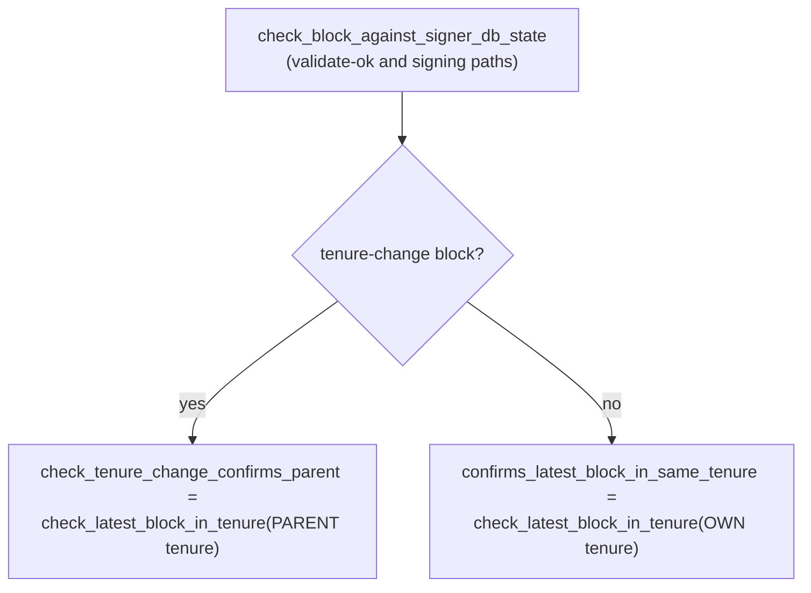

### Title
Own-tenure equivocation guard fails open on node error/404, letting a signer sign a conflicting tenure-start block - ([File: stacks-signer/src/v0/signer.rs])

### Summary
When a signer's pre-commit weight for a block reaches the 70% threshold, `handle_block_pre_commit` re-checks whether the block conflicts with anything the signer already signed via `get_signed_conflicts` and, for a same-tenure conflict, asks the node's `get_tenure_tip` whether the tenure has already confirmed a block at or above the proposed height. If that RPC call errors (including a 404 for "no blocks yet"), the code logs a warning and treats the tenure as "unconfirmed" — it does **not** refuse to sign. This turns a safety guard against double-signing within the same tenure into a fail-open check: the very case where the node hasn't yet ingested the first signed sibling (the expected state right after crossing threshold) is treated the same as "no conflict exists," and the signer proceeds to place a second, conflicting signature in the same tenure.

### Finding Description
`validate_tenure_change_payload` in `stacks-signer/src/chainstate/v2.rs` (and v1's counterpart) rejects a tenure-change proposal with `RejectReason::DuplicateBlockFound` only when `signer_db.get_last_signed_block(&block.header.consensus_hash)` already returns a signed block for that tenure [1](#0-0) . This check runs **only at proposal arrival**, as the accompanying documentation states explicitly: "the `DuplicateBlockFound` check ... lives in `check_proposal` and runs only at proposal arrival, never again" [2](#0-1) .

Because it only runs once, two competing tenure-start (tenure-change) proposals for the *same* new tenure (same `consensus_hash`, different content — the natural shape of a one-slot-miner equivocation or a race between two proposals gossiped before either is signed) can both pass the duplicate check if neither has a signed block recorded yet at the time each was evaluated.

The re-check that runs at validate-ok and at the pre-commit/signing moment, `check_block_against_signer_db_state` → `check_latest_block_in_tenure`, does **not** cover this case for tenure-change blocks: for a tenure-change block it checks the **parent** tenure's tip, not the new tenure's own tip [3](#0-2) . So a same-tenure sibling is invisible to that check.

The only remaining guard is the own-tenure conflict branch inside `handle_block_pre_commit`:

```rust
if conflicts.iter().any(|conflict| {
    conflict.consensus_hash == block_info.block.header.consensus_hash
        && !self.reorg_permit_stands(stacks_client, conflict)
}) {
    match stacks_client.get_tenure_tip(&block_info.block.header.consensus_hash) {
        Ok(tip) => {
            let tip_height = tip.anchored_header.height();
            if tip_height >= block_info.block.header.chain_length {
                warn!(...); // refuse
                return;
            }
        }
        Err(e) => {
            warn!(
                "... Treating the tenure as unconfirmed.";
                ...
            );
            // falls through — no refusal
        }
    }
}
``` [4](#0-3) 

Note the asymmetry with the "sibling conflict in another tenure" branch just above it: for cross-tenure conflicts, any node-query failure defaults to *keeping the conflict blocking* ("Whenever the node cannot be asked, the conflict keeps blocking... wrongly signing cannot be taken back") [5](#0-4) . But for the own-tenure branch, an unreachable node or a 404 (the node not yet having ingested the sibling block — which is exactly the expected transient state right after the sibling crossed its own 70% threshold and was just signed) is treated as "unconfirmed," and the code falls straight through to `mark_locally_accepted` and signs the block:

```rust
if let Err(e) = block_info.mark_locally_accepted(false) { ... }
...
let accepted = self.create_block_acceptance(&block_info.block);
self.handle_block_signature(stacks_client, sortition_state, &accepted);
self.send_block_response(&block_info.block, accepted.into());
``` [6](#0-5) 

This breaks the invariant that a signer never places two signatures over conflicting blocks in the same tenure (the "signed" equality this guard exists to protect, per the doc's own framing: "signing both would be the double-sign this guard exists for") [7](#0-6) .

### Impact Explanation
This is a Critical-class break per the rules: a signer signing a conflicting block. If a single miner (one slot) equivocates by gossiping two different tenure-start blocks for the same tenure to different, possibly overlapping subsets of signers before either has been signed, or a race lets both proposals pass the one-time `DuplicateBlockFound` check, then the surviving guard against double-signing in the same tenure can be defeated simply by the node not yet having ingested the first sibling — the ordinary state immediately after that sibling crosses its own 70% threshold — or by any transient RPC failure to `get_tenure_tip`. The signer then contributes a second, conflicting signature in the same tenure, directly undermining the equivocation/one-signed-block-per-tenure-start guarantee that section 5 of the doc says exists specifically to stop this.

### Likelihood Explanation
No majority of signers or key compromise is required — this is reachable by a single miner (plus ordinary gossip timing) crafting or racing two tenure-start proposals for the same tenure, combined with the ordinary node-ingestion lag or any transient error on the `/v3/tenures/tip` (or equivalent) endpoint. The fail-open branch is on the common path (network hiccup, node still processing the just-pushed sibling block), not an exotic corner case.

### Recommendation
Make the own-tenure conflict check fail closed, symmetric with the cross-tenure conflict branch: on `Err` from `get_tenure_tip` (including 404), refuse to sign ("for now") rather than falling through to `mark_locally_accepted`. Only proceed to sign once the node's tenure tip is confirmed to be below the proposed height (or the node authoritatively reports no blocks in the tenure via a positively-checked state, not merely a query failure).

### Proof of Concept
1. A single miner wins a sortition slot and produces two different tenure-start blocks, A and B, for the same new tenure (same `consensus_hash`), and gossips them to (possibly overlapping) subsets of the signer set before either has accumulated a signed block in signerdb.
2. Both A and B pass `validate_tenure_change_payload`'s `DuplicateBlockFound` check at proposal time because, at each evaluation, `get_last_signed_block(consensus_hash)` returns `None` (neither has been signed yet) [1](#0-0) .
3. A crosses 70% pre-commit weight first among its subset of signers; `check_block_against_signer_db_state` passes (it checks the parent tenure, not this tenure), and the signer signs A, calling `handle_block_signature` which pushes it toward the node.
4. Shortly after, B crosses 70% weight among its (different/overlapping) subset. In `handle_block_pre_commit`, `get_signed_conflicts` finds A as a same-tenure conflict. `get_tenure_tip(consensus_hash)` is called, but the node has not yet processed the just-signed A (or the RPC transiently errors) — returning `Err`.
5. Per the code at `stacks-signer/src/v0/signer.rs:1449-1455`, this is logged as "Treating the tenure as unconfirmed" and does **not** refuse; execution falls through to `mark_locally_accepted(false)` and the signer broadcasts a signature/acceptance for B [6](#0-5) .
6. The signer has now signed two conflicting blocks (A and B) in the same tenure — the exact double-sign the guard was designed to prevent.

### Citations

**File:** stacks-signer/src/chainstate/v2.rs (L340-357)
```rust
        // We already confirmed in check miner activity that the current tenure is valid. So check we are not
        // reorging the tenure blocks. Only blocks we have signed (locally or globally accepted) count
        // here: a block we have merely pre-committed to carries no signature from us, so it is safe to
        // accept a competing tenure-start block in its place if it failed to reach consensus.
        let last_in_current_tenure = signer_db
            .get_last_signed_block(&block.header.consensus_hash)
            .map_err(|e| {
                SignerChainstateError::from(ClientError::InvalidResponse(e.to_string()))
            })?;
        if let Some(last_in_current_tenure) = last_in_current_tenure {
            warn!(
                "Miner block proposal contains a tenure change, but we've already signed a block in this tenure. Considering proposal invalid.";
                "proposed_block_consensus_hash" => %block.header.consensus_hash,
                "proposed_block_signer_signature_hash" => %block.header.signer_signature_hash(),
                "last_in_tenure_signer_signature_hash" => %last_in_current_tenure.block.header.signer_signature_hash(),
            );
            return Err(RejectReason::DuplicateBlockFound);
        }
```

**File:** docs/signer-flows.md (L314-320)
```markdown
   - **it does not, and the block was never globally accepted** — a block is
     not handed to the node until the whole signer set has signed it, so this
     may mean "not yet seen" rather than "dead". A sibling at the same height
     therefore keeps blocking, since signing both would be the double-sign this
     guard exists for; a block _above_ the proposal does not, because it is no
     sibling and abandoning an unconfirmed block to restart beneath it is a
     reorg, not an equivocation.
```

**File:** docs/signer-flows.md (L329-341)
```markdown
Whenever the node cannot be asked, the conflict keeps blocking: that only delays
the replacement until the signature goes stale, whereas wrongly signing cannot be
taken back. The one recorded exception is a tenure whose reorg we sanctioned
under the reorg-timing rules (section 8): there the node still serves the
conflict as fully live — replacing it is only legitimate because we permitted it
— so no question asked of the node about the _conflict_ could clear it. Instead
the record carries the permitting tenure's sortition, and `reorg_permit_stands`
asks the node whether that sortition is still canonical: while it is, the
conflict is excluded outright; if a burnchain fork orphaned it, the reorg we
sanctioned can no longer happen and the conflict gets its voice back. A false
404 there needs no tip-height guard — it merely restores a conflict, which at
worst delays the replacement. For the own-tenure question below, an unreachable
node is instead treated as unconfirmed and the signature goes out.
```

**File:** docs/signer-flows.md (L391-404)
```markdown
`check_latest_block_in_tenure` answers "does this block confirm the tip we
expect?" and it runs in three places: at proposal arrival (inside
`check_proposal`), at validate-ok, and at the moment of signing. _Which_ tenure
it is asked about depends on the block: a tenure-change block is checked against
its **parent** tenure, every other block against its **own**. Never both. The
pivotal helper is `get_tenure_last_block_info`, which considers only blocks that
carry a signature (`get_last_signed_block`): a pre-commit never vetoes anything,
it only counts as miner activity.



**File:** docs/signer-flows.md (L428-437)
```markdown
- `validate_tenure_change_payload` rejects with `DuplicateBlockFound` when we
  have already accepted a block in the tenure a tenure-change block is starting.
  v2 counts locally or globally accepted blocks (`get_last_signed_block`); v1
  counts only globally accepted ones (`get_last_globally_accepted_block`).
- the v2 `check_proposal` wrapper checks miner pubkey hash, consensus hash, the
  pox bitvec, and tenure-extend rules before delegating here.

Because the duplicate check never runs again, a block that crosses the pre-commit
threshold long after it was proposed relies on section 5's own-tenure conflict
guard to cover the same ground.
```

**File:** stacks-signer/src/v0/signer.rs (L1432-1457)
```rust
        if conflicts.iter().any(|conflict| {
            conflict.consensus_hash == block_info.block.header.consensus_hash
                && !self.reorg_permit_stands(stacks_client, conflict)
        }) {
            match stacks_client.get_tenure_tip(&block_info.block.header.consensus_hash) {
                Ok(tip) => {
                    let tip_height = tip.anchored_header.height();
                    if tip_height >= block_info.block.header.chain_length {
                        warn!(
                            "{self}: Reached the pre-commit threshold for a block that conflicts with previously signed or accepted blocks, and the canonical tip of its tenure is already at or above the proposed height. Refusing to sign.";
                            "signer_signature_hash" => %block_hash,
                            "block_height" => block_info.block.header.chain_length,
                            "canonical_tip_height" => tip_height,
                        );
                        return;
                    }
                }
                Err(e) => {
                    warn!(
                        "{self}: Failed to fetch the canonical tip of the proposed block's tenure: {e:?}. Treating the tenure as unconfirmed.";
                        "signer_signature_hash" => %block_hash,
                        "consensus_hash" => %block_info.block.header.consensus_hash,
                    );
                }
            }
        }
```

**File:** stacks-signer/src/v0/signer.rs (L1466-1478)
```rust
        // It is only considered globally accepted IFF we receive a new block event confirming it OR see the chain tip of the node advance to it.
        if let Err(e) = block_info.mark_locally_accepted(false) {
            if !block_info.has_reached_consensus() {
                warn!("{self}: Failed to mark block as locally accepted: {e:?}",);
            }
        }
        self.signer_db
            .insert_block(&block_info)
            .unwrap_or_else(|e| self.handle_insert_block_error(e));
        let accepted = self.create_block_acceptance(&block_info.block);
        // have to save the signature _after_ the block info
        self.handle_block_signature(stacks_client, sortition_state, &accepted);
        self.send_block_response(&block_info.block, accepted.into());
```
