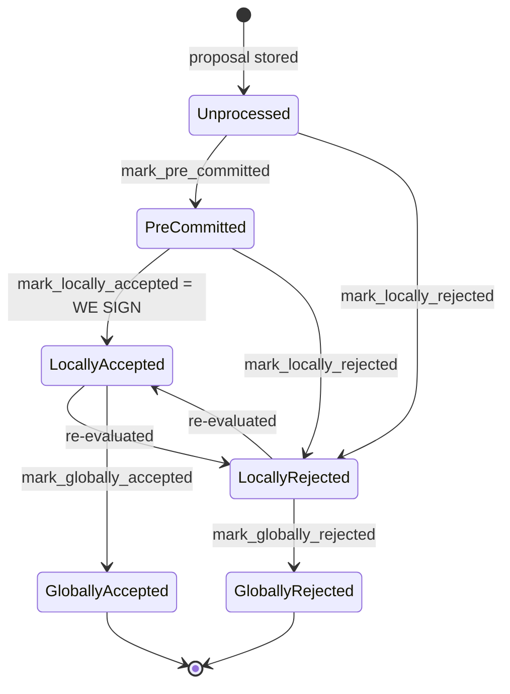

### Title
Signature-tally path (`store_and_process_block_signature`) can resurrect a block already marked `LocallyRejected` and broadcast it, bypassing the conflict/chainstate recheck that the pre-commit path enforces - ([File: stacks-signer/src/v0/signer.rs])

### Summary
The external report is a privilege-escalation bug where an authorization server's response is trusted to imply "the exact scope originally requested was approved" without independently re-verifying that assumption, letting an attacker force approval of a broader grant than was actually consented to. The analogous class in this repo is a signer accepting an aggregated tally (peer `Accepted` signatures) as proof that a block is still safe to sign/push, without re-running the safety checks that gate every other path to a signature.

### Finding Description
Every path that produces or counts a signature re-verifies the block against current chainstate/conflict state immediately before acting on it:
- `handle_block_validate_ok` re-runs `check_block_against_signer_db_state` before moving to `PreCommitted` [1](#0-0) 
- `handle_block_pre_commit` re-runs `check_block_against_signer_db_state` and the signed-conflict check right before the local signer signs [2](#0-1) 

The one path that does **not** re-run this check is `store_and_process_block_signature`, which processes a peer's `BlockAccepted` signature, tallies weight, and — once weight crosses threshold — flips the block to locally accepted and broadcasts it: [3](#0-2) 

This function stores the incoming signature unconditionally (subject only to dedup), then either routes it into the pre-commit fallback (for signers whose pre-commit was never seen) or — if `has_committed` is already true for that signer — falls straight through to weight computation and, on reaching threshold, `mark_locally_accepted(true)` + `broadcast_signed_block`, with **no call** to `check_block_against_signer_db_state` or `get_signed_conflicts`. Per `docs/signer-flows.md`'s state diagram, `LocallyRejected -> LocallyAccepted` is an explicitly permitted transition ("re-evaluated") [4](#0-3) , meaning a block this signer already locally rejected (e.g., because `handle_block_pre_commit`'s recheck found it now conflicts with a fresher signed sibling, or the tenure it belongs to was found stale/superseded) can be pulled back into `LocallyAccepted` purely by accumulating stored peer signatures, and pushed to the node via `handle_post_block`, without the safety re-check that caused the rejection being run again.

Concretely: a one-slot miner (or gossiping signer) can drip-feed `BlockAccepted` messages for a block that this signer previously rejected via the pre-commit recheck (section 5 in the docs) due to a signed conflict at the same/higher height. Because `add_block_signature` stores every valid signature regardless of the block's current rejection state, and `store_and_process_block_signature`'s only gate before broadcasting is `signed_group.is_some()` — not `block_info.valid`/`reject_reason`/conflict state — enough accumulated peer signatures (which do not themselves need to be a majority *of this signer's decision*, just enough to cross the pre-existing 70% weight threshold from signatures already on file) will cause this signer to sign/broadcast a block it had determined was unsafe, breaking the "signed vs validated" / "aggregated-weight vs verified-accepts" equality that every other path enforces.

### Impact Explanation
This falls in the Critical bucket: a signer signing (or, more precisely, re-affirming and pushing) a conflicting/rejected block without re-validating it against current chainstate, because the aggregate-weight tally path skips the recheck that all sibling paths (`handle_block_validate_ok`, `handle_block_pre_commit`) perform.

### Likelihood Explanation
Reachable by a normal miner/gossip flow: it only requires that peer `BlockAccepted` messages for a block already accumulate (which happens naturally once other signers signed it before this signer's local rejection), and does not require compromising a majority of signers or any keys beyond what is already visible on StackerDB.

### Recommendation
Add a re-verification step (mirroring `handle_block_pre_commit`'s `check_block_against_signer_db_state` / `get_signed_conflicts` recheck) inside `store_and_process_block_signature` before calling `mark_locally_accepted`/`broadcast_signed_block`, or gate on `block_info.state`/`reject_reason` so a `LocallyRejected` block cannot be silently promoted back to `LocallyAccepted` purely by pre-existing stored signature weight.

### Proof of Concept
1. Signer S receives enough pre-commits and signs a valid block B — no, actually the reachable sequence: S receives peer signatures for B, has_committed already true, weight not yet at threshold (`min_weight > total_signature_weight`), so it waits.
2. Meanwhile S's local pre-commit-threshold recheck for B (`handle_block_pre_commit` for its own or another peer's pre-commit) discovers a conflicting signed sibling and calls `mark_locally_rejected` on B, broadcasting a rejection [5](#0-4) .
3. Additional `BlockAccepted` messages for B continue to arrive from other signers (who signed before/without knowing of the conflict) and are processed by `store_and_process_block_signature`, which adds them to `signer_db` and recomputes `total_signature_weight` from all stored signatures — with no check of B's current `valid`/rejection state.
4. Once accumulated weight crosses `min_weight`, S calls `mark_locally_accepted(true)` and `broadcast_signed_block`, pushing B to the node despite S's own, more recent, safety determination that B conflicts with a fresher signed block.

I was unable to fully inspect `BlockInfo::mark_locally_accepted`'s internal `check_state` enforcement logic in `signerdb.rs` (only located via grep, not read directly) to confirm there is no additional software guard blocking this exact transition beyond what the documentation states; this should be verified directly against `signerdb.rs`'s `check_state`/`move_to` implementation before treating this as fully confirmed.

### Citations

**File:** stacks-signer/src/v0/signer.rs (L1340-1366)
```rust
        // The chain and signer db state may have changed materially since this block passed the
        // proposal-time checks (e.g. between validation and reaching the pre-commit threshold we
        // may have signed a block that this one would reorg). Re-run the chainstate checks
        // before putting a signature over the block, and respond with a rejection if they no
        // longer pass, just as the block validation response handler does.
        if let Some(block_rejection) =
            self.check_block_against_signer_db_state(stacks_client, &block_info.block)
        {
            warn!(
                "{self}: Reached the pre-commit threshold for a block, but it no longer passes the chainstate checks. Rejecting.";
                "signer_signature_hash" => %block_hash,
                "block_height" => block_info.block.header.chain_length,
                "reject_code" => %block_rejection.reason_code,
                "reject_reason" => &block_rejection.reason,
            );
            if let Err(e) = block_info.mark_locally_rejected() {
                if !block_info.has_reached_consensus() {
                    warn!("{self}: Failed to mark block as locally rejected: {e:?}");
                }
            };
            self.signer_db
                .insert_block(&block_info)
                .unwrap_or_else(|e| self.handle_insert_block_error(e));
            self.handle_block_rejection(&block_rejection, sortition_state);
            self.send_block_response(&block_info.block, block_rejection.into());
            return;
        }
```

**File:** stacks-signer/src/v0/signer.rs (L1946-1959)
```rust
        if let Some(block_rejection) =
            self.check_block_against_signer_db_state(stacks_client, &block_info.block)
        {
            // The signer db state has changed. We no longer view this block as valid. Override the validation response.
            if let Err(e) = block_info.mark_locally_rejected() {
                if !block_info.has_reached_consensus() {
                    warn!("{self}: Failed to mark block as locally rejected: {e:?}");
                }
            };
            self.signer_db
                .insert_block(&block_info)
                .unwrap_or_else(|e| self.handle_insert_block_error(e));
            self.handle_block_rejection(&block_rejection, sortition_state);
            self.send_block_response(&block_info.block, block_rejection.into());
```

**File:** stacks-signer/src/v0/signer.rs (L2443-2538)
```rust
    fn store_and_process_block_signature(
        &mut self,
        stacks_client: &StacksClient,
        sortition_state: &mut Option<SortitionsView>,
        block_info: &mut BlockInfo,
        signer_address: &StacksAddress,
        signature: &MessageSignature,
    ) {
        let block_hash = &block_info.signer_signature_hash();
        // signature is valid! store it.
        // if this returns false, it means the signature already exists in the DB, so just return.
        if !self
            .signer_db
            .add_block_signature(block_hash, signer_address, signature)
            .unwrap_or_else(|_| panic!("{self}: Failed to save block signature"))
        {
            return;
        }

        // If this isn't our own signature and we haven't seen a pre-commit from this signer yet, try treating it as a pre-commit in case the caller is running an outdated version
        if signer_address != &self.stacks_address && !self.signer_db.has_committed(block_hash, signer_address).inspect_err(|e| warn!("Failed to check if pre-commit message already considered for {signer_address:?} for {block_hash}: {e}")).unwrap_or(false) {
            self.handle_block_pre_commit(stacks_client, sortition_state, signer_address, block_hash);
            return;
        }

        if block_info.signed_group.is_some() {
            // We have already processed this block to the accepted state. Adding more signatures will not change anything so nothing to check.
            return;
        }
        // do we have enough signatures to broadcast?
        // i.e. is the threshold reached?
        let signatures = self
            .signer_db
            .get_block_signatures(block_hash)
            .unwrap_or_else(|_| panic!("{self}: Failed to load block signatures"));

        // put signatures in order by signer address (i.e. reward cycle order)
        let addrs_to_sigs: HashMap<_, _> = signatures
            .into_iter()
            .filter_map(|sig| {
                let Ok(public_key) = Secp256k1PublicKey::recover_to_pubkey_without_validating_low_s(
                    block_hash.bits(),
                    &sig,
                ) else {
                    return None;
                };
                let addr = StacksAddress::p2pkh(self.mainnet, &public_key);
                Some((addr, sig))
            })
            .collect();

        let signature_weight = self.signer_weights.get(signer_address).unwrap_or(&0);
        let total_signature_weight = self.compute_signature_signing_weight(addrs_to_sigs.keys());
        let total_weight = self.compute_signature_total_weight();

        let min_weight = NakamotoBlockHeader::compute_voting_weight_threshold(total_weight)
            .unwrap_or_else(|_| {
                panic!("{self}: Failed to compute threshold weight for {total_weight}")
            });

        if min_weight > total_signature_weight {
            info!("{self}: Received block acceptance, but have not yet reached the acceptance threshold.";
                "signer_signature_hash" => %block_hash,
                "signature_weight" => signature_weight,
                "consensus_hash" => %block_info.block.header.consensus_hash,
                "block_height" => block_info.block.header.chain_length,
                "total_weight_approved" => total_signature_weight,
                "total_weight" => total_weight,
                "percent_approved" => (total_signature_weight as f64 / total_weight as f64 * 100.0),
            );
            return;
        }
        info!("{self}: have reached the block acceptance threshold";
            "signer_signature_hash" => %block_hash,
            "signature_weight" => signature_weight,
            "consensus_hash" => %block_info.block.header.consensus_hash,
            "block_height" => block_info.block.header.chain_length,
            "total_weight_approved" => total_signature_weight,
            "total_weight" => total_weight,
            "percent_approved" => (total_signature_weight as f64 / total_weight as f64 * 100.0),
        );

        // have enough signatures to broadcast!
        // move block to LOCALLY accepted state.
        // It is only considered globally accepted IFF we receive a new block event confirming it OR see the chain tip of the node advance to it.
        if let Err(e) = block_info.mark_locally_accepted(true) {
            if !block_info.has_reached_consensus() {
                warn!("{self}: Failed to mark block as locally accepted: {e:?}");
            }
        }
        let _ = self.signer_db.insert_block(block_info).map_err(|e| {
            warn!("Failed to set group threshold signature timestamp for {block_hash}: {e:?}");
            panic!("{self} Failed to write block to signerdb: {e}");
        });
        self.broadcast_signed_block(stacks_client, block_info.block.clone(), &addrs_to_sigs);
    }
```

**File:** docs/signer-flows.md (L137-150)
```markdown

```
