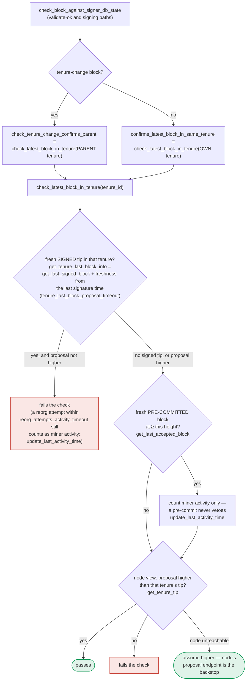

Based on the analog mapping, this maps to a genuine safety/liveness break in `store_and_process_block_rejection`.

### Title
Rejection weight can flip an already `LocallyAccepted` (threshold-signed) block to `GloballyRejected`, wedging the signer against later `mark_globally_accepted` - (File: `stacks-signer/src/v0/signer.rs`)

### Summary
The C4 finding is a state-machine equality bug: an action allowed to keep accepting disapprovals (`castDisapproval`) even after it had effectively crossed the point where it should be locked, letting a privileged-but-adversarial voter flip an outcome that had already been "decided." The reachable analog here is `store_and_process_block_rejection` in `stacks-signer/src/v0/signer.rs`, which guards against reprocessing only via `block_info.has_reached_consensus()` — i.e. only `GloballyAccepted`/`GloballyRejected` are treated as terminal — while `LocallyAccepted` (the state entered the moment the 70% signing threshold is reached and the block is being pushed to the node) is not excluded from further rejection tallying.

### Finding Description
`BlockInfo::check_state` [1](#0-0)  allows the transition `LocallyAccepted -> GloballyRejected` (blocked only from `GloballyAccepted`, not from `LocallyAccepted`), matching the doc's stated rule that "each global state is unreachable from the other," but not from `LocallyAccepted`. `mark_globally_rejected` performs exactly this `move_to` call [2](#0-1) .

`store_and_process_block_rejection` is the function that drives this transition when accumulated rejection weight crosses the blocking-minority threshold [3](#0-2) . Its only early-exit guard against reprocessing an already-decided block is:

```
if block_info.has_reached_consensus() {
    // Checking the rejection signatures is pointless. We have already reached consensus on this block.
    return;
}
```

`has_reached_consensus()` is `matches!(self.state, GloballyAccepted | GloballyRejected)` [4](#0-3) . It does **not** cover `LocallyAccepted`. Once a signer's own local view reaches the 70% pre-commit/signature weight and calls `mark_locally_accepted(true)` — broadcasting the signed block toward the node (`store_and_process_block_signature`, `broadcast_signed_block`) [5](#0-4)  — that same signer will still process any subsequently-arriving `BlockRejection` messages against this block and can still call `mark_globally_rejected` if the tallied rejection weight (computed independently, from whatever addresses this particular signer happens to have seen) crosses the blocking-minority line.

This tally is *local and message-order dependent*: `total_reject_weight` is computed purely from the rejection messages *this* signer has received and stored via `add_block_rejection_signer_addr` [6](#0-5) , with no cross-check against whether those same addresses already contributed to the acceptance side that pushed the block into `LocallyAccepted`. A signer can equivocate — sign/pre-commit toward one peer set while sending `Rejected` to another (or a rejection can simply arrive late, out of order, after already contributing to acceptance under gossip/network asymmetry) — driving different honest signers to different terminal local views of the *same* block: some reach `LocallyAccepted` and push it toward the node, one (or more) others independently reach `GloballyRejected`.

The consequence is not cosmetic: once a signer's local `BlockInfo.state` is `GloballyRejected`, `check_state` makes `GloballyAccepted` permanently unreachable for that record: `BlockState::GloballyAccepted => !matches!(prev_state, BlockState::GloballyRejected)` [7](#0-6) . So when the `NewBlock` event later arrives from the node (which did adopt the block, since a real 70% weight did sign it) and the signer tries to call `mark_globally_accepted`, that move fails on this signer, permanently wedging its view of this block away from the network's actual canonical state. Because `get_last_signed_block`/`get_tenure_last_block_info` (used by `check_latest_block_in_tenure`, the chainstate check run at proposal, validate-ok, and pre-commit time — see `docs/signer-flows.md` section 7 [8](#0-7) ) rely on signer-db state to decide whether subsequent proposals confirm the correct tip, a signer stuck disagreeing with the network's ground truth for this block can misjudge later proposals in the same tenure — a liveness/safety wedge, not merely a stale log line.

### Impact Explanation
This is a High-severity liveness wedge: an affected signer is pushed into a locally terminal, network-inconsistent state (`GloballyRejected`) for a block the rest of the network (and the node itself) accepted, and `check_state`'s global-state exclusivity rule permanently forbids correcting it to `GloballyAccepted`. This can desynchronize the signer's view of tenure state used by `check_latest_block_in_tenure`/`get_tenure_last_block_info`, risking incorrect rejections or acceptances on subsequent block proposals in that tenure — i.e. a signer wedged into behavior inconsistent with canonical chain state, matching the "High" impact bucket (wedged signer / stale-state acting).

### Likelihood Explanation
This requires either (a) a single misbehaving/equivocating signer sending conflicting `Accepted`/`Rejected` messages to different peers, or (b) benign message reordering under network partitioning/latency where a rejection that was cast before a signer had yet counted enough accept-weight arrives and is processed after that same signer's local tally already reached `LocallyAccepted` via a different code path (`handle_block_pre_commit`/`store_and_process_block_signature`). Because `store_and_process_block_rejection`'s only staleness guard is `has_reached_consensus()`, which intentionally excludes `LocallyAccepted`, no majority is required to trigger the local mis-transition on the affected signer(s) — only enough rejection weight (>30%) to be tallied by that signer, which the one-slot equivocating message-crafter (analogous to the one-role attacker in the report) can help engineer via targeted delivery.

### Recommendation
Add `LocallyAccepted` to the guard in `store_and_process_block_rejection` (and symmetrically to `store_and_process_block_signature`'s check against `signed_group`), so that a rejection cannot reopen/override a block that this signer has already promoted to `LocallyAccepted` (i.e., already committed to broadcasting a threshold signature for). Concretely, change:

```rust
if block_info.has_reached_consensus() {
    return;
}
```

to also bail out once `block_info.state == BlockState::LocallyAccepted && block_info.signed_group.is_some()`, mirroring the existing check in `store_and_process_block_signature` (`if block_info.signed_group.is_some() { return; }`) so that both directions of the acceptance/rejection race are symmetric and a block that already crossed the signing threshold cannot subsequently be walked into `GloballyRejected`.

### Proof of Concept
1. Signer weights: 5 equal-weight signers (20% each); threshold requires ≥70% (i.e., 4 of 5).
2. Block `B` proposed. Signers S1–S4 pre-commit/sign (80% ≥ 70%) — this signer (say S1) calls `store_and_process_block_signature`, sees `total_signature_weight` ≥ threshold, calls `mark_locally_accepted(true)` and `broadcast_signed_block` — `B.state == LocallyAccepted`.
3. A misbehaving/relayed S5 (and, due to network delay, a stale `Rejected` from S2 that predates S2's own pre-commit but is processed late by S1) reach S1 as `BlockRejection` messages after step 2.
4. S1's `store_and_process_block_rejection` is entered: `block_info.has_reached_consensus()` is `false` (state is `LocallyAccepted`, not Global), so processing continues; `total_reject_weight` from S2+S5 = 40%, and with `min_weight` (70%) added exceeds `total_weight` (100%) under the code's check `total_reject_weight.saturating_add(min_weight) > total_weight` → `mark_globally_rejected()` succeeds because `check_state` permits `LocallyAccepted -> GloballyRejected`.
5. The stacks-node, having received S1–S4's genuine 80% signature weight, adopts `B` and fires a `NewBlock` event. When S1 processes it and attempts `mark_globally_accepted()`, `check_state` rejects the transition because `prev_state == GloballyRejected`, leaving S1's signer-db permanently diverged from the canonical chain for block `B`.

### Citations

**File:** stacks-signer/src/signerdb.rs (L303-306)
```rust
    /// Attempt to mark the block as globally rejected
    pub fn mark_globally_rejected(&mut self) -> Result<(), String> {
        self.move_to(BlockState::GloballyRejected)
    }
```

**File:** stacks-signer/src/signerdb.rs (L313-329)
```rust
    /// Check if the block state transition is valid
    fn check_state(&self, state: BlockState) -> bool {
        let prev_state = &self.state;
        if *prev_state == state {
            return true;
        }
        match state {
            BlockState::Unprocessed => false,
            BlockState::LocallyAccepted | BlockState::LocallyRejected => !matches!(
                prev_state,
                BlockState::GloballyRejected | BlockState::GloballyAccepted
            ),
            BlockState::GloballyAccepted => !matches!(prev_state, BlockState::GloballyRejected),
            BlockState::GloballyRejected => !matches!(prev_state, BlockState::GloballyAccepted),
            BlockState::PreCommitted => matches!(prev_state, BlockState::Unprocessed),
        }
    }
```

**File:** stacks-signer/src/signerdb.rs (L343-349)
```rust
    /// Check if the block is globally accepted or rejected
    pub fn has_reached_consensus(&self) -> bool {
        matches!(
            self.state,
            BlockState::GloballyAccepted | BlockState::GloballyRejected
        )
    }
```

**File:** stacks-signer/src/v0/signer.rs (L2267-2341)
```rust
    // Store the block rejection signature and check if we have reached a consensus decision on the block because of it. If we have, update the block state accordingly.
    fn store_and_process_block_rejection(
        &mut self,
        sortition_state: &mut Option<SortitionsView>,
        block_info: &mut BlockInfo,
        signer_address: &StacksAddress,
        reject_reason: RejectReasonPrefix,
    ) {
        let block_hash = &block_info.signer_signature_hash();
        // We should still store signatures even on consensus reached blocks for auditing purposes.
        // signature is valid! store it
        match self.signer_db.add_block_rejection_signer_addr(
            block_hash,
            signer_address,
            reject_reason,
        ) {
            Err(e) => {
                warn!("{self}: Failed to save block rejection signature: {e:?}",);
            }
            Ok(false) => return, // We already have this signature, do not process it again.
            Ok(true) => (),
        }

        if block_info.has_reached_consensus() {
            // Checking the rejection signatures is pointless. We have already reached consensus on this block.
            return;
        }

        // do we have enough signatures to mark a block a globally rejected?
        // i.e. is (set-size) - (threshold) + 1 reached.
        let rejection_addrs = match self.signer_db.get_block_rejection_signer_addrs(block_hash) {
            Ok(addrs) => addrs,
            Err(e) => {
                warn!("{self}: Failed to load block rejection addresses: {e:?}.",);
                return;
            }
        };
        let signature_weight = self.signer_weights.get(signer_address).unwrap_or(&0);
        let total_reject_weight =
            self.compute_signature_signing_weight(rejection_addrs.iter().map(|(addr, _)| addr));
        let total_weight = self.compute_signature_total_weight();

        let min_weight = NakamotoBlockHeader::compute_voting_weight_threshold(total_weight)
            .unwrap_or_else(|_| {
                panic!("{self}: Failed to compute threshold weight for {total_weight}")
            });
        if total_reject_weight.saturating_add(min_weight) <= total_weight {
            // Not enough rejection signatures to make a decision
            info!("{self}: Have not yet received enough block rejections to reach a consensus decision on this block";
                "signer_signature_hash" => %block_hash,
                "signature_weight" => signature_weight,
                "consensus_hash" => %block_info.block.header.consensus_hash,
                "block_height" => block_info.block.header.chain_length,
                "total_weight_rejected" => total_reject_weight,
                "total_weight" => total_weight,
                "percent_rejected" => (total_reject_weight as f64 / total_weight as f64 * 100.0),
            );
            return;
        }
        info!("{self}: have reached the block rejection threshold";
            "signer_signature_hash" => %block_hash,
            "signature_weight" => signature_weight,
            "consensus_hash" => %block_info.block.header.consensus_hash,
            "block_height" => block_info.block.header.chain_length,
            "total_weight_rejected" => total_reject_weight,
            "total_weight" => total_weight,
            "percent_rejected" => (total_reject_weight as f64 / total_weight as f64 * 100.0),
        );
        if let Err(e) = block_info.mark_globally_rejected() {
            warn!("{self}: Failed to mark block as globally rejected: {e:?}",);
        }
        if let Err(e) = self.signer_db.insert_block(block_info) {
            error!("{self}: Failed to update block state: {e:?}",);
            panic!("{self} Failed to update block state: {e}");
        }
```

**File:** stacks-signer/src/v0/signer.rs (L2525-2537)
```rust
        // have enough signatures to broadcast!
        // move block to LOCALLY accepted state.
        // It is only considered globally accepted IFF we receive a new block event confirming it OR see the chain tip of the node advance to it.
        if let Err(e) = block_info.mark_locally_accepted(true) {
            if !block_info.has_reached_consensus() {
                warn!("{self}: Failed to mark block as locally accepted: {e:?}");
            }
        }
        let _ = self.signer_db.insert_block(block_info).map_err(|e| {
            warn!("Failed to set group threshold signature timestamp for {block_hash}: {e:?}");
            panic!("{self} Failed to write block to signerdb: {e}");
        });
        self.broadcast_signed_block(stacks_client, block_info.block.clone(), &addrs_to_sigs);
```

**File:** docs/signer-flows.md (L391-418)
```markdown
`check_latest_block_in_tenure` answers "does this block confirm the tip we
expect?" and it runs in three places: at proposal arrival (inside
`check_proposal`), at validate-ok, and at the moment of signing. _Which_ tenure
it is asked about depends on the block: a tenure-change block is checked against
its **parent** tenure, every other block against its **own**. Never both. The
pivotal helper is `get_tenure_last_block_info`, which considers only blocks that
carry a signature (`get_last_signed_block`): a pre-commit never vetoes anything,
it only counts as miner activity.


```
