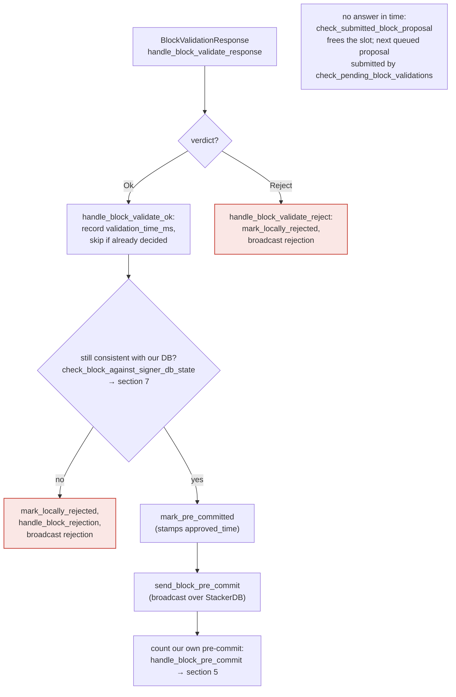
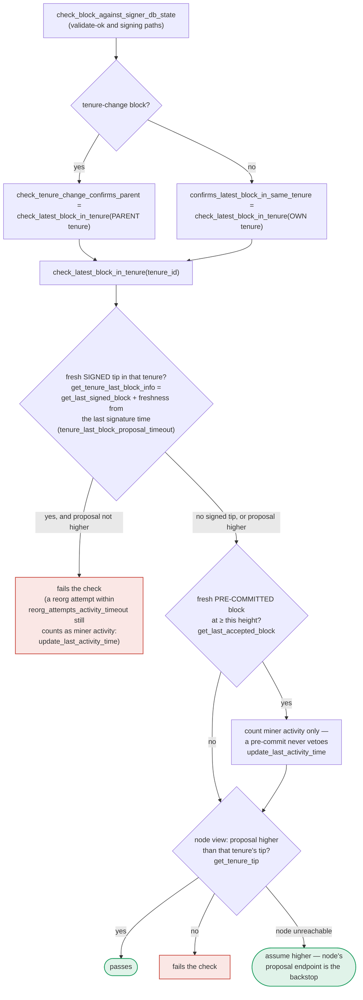

### Title
Stale `is_timed_out` view lets a signer sign after miner invalidation because pre-commit/validate-ok RECHECK never re-derives the timeout - ([File: stacks-signer/src/chainstate/v1.rs], [File: stacks-signer/src/v0/signer.rs])

### Summary
`SortitionsView::check_proposal` derives `SortitionMinerStatus` (including the `block_proposal_timeout`-based `InvalidatedBeforeFirstBlock` transition) only at the moment a *fresh* proposal is evaluated [1](#0-0) . Once a signer has moved a block to `PreCommitted`, subsequent re-evaluations (the validate-ok RECHECK and the 70%-threshold pre-commit RECHECK) route through `check_block_against_signer_db_state`, which only re-checks tenure-tip confirmation (`check_latest_block_in_tenure`) and never re-invokes `SortitionState::is_timed_out` [2](#0-1) . A boundary-timed proposal from the current-tenure miner can therefore be pre-committed by a signer whose *first* evaluation happened just before the local timeout fired, and that signer will carry the stale "Valid" verdict all the way to signature without ever re-checking it, while a peer whose first evaluation happened moments later rejects the same `signer_signature_hash` with `InvalidMiner`.

### Finding Description
`check_proposal` computes `is_timed_out` from purely local state — `get_last_activity_time`/`get_burn_block_receive_time_ch` compared against `SystemTime::now()` on the evaluating node — with no cross-signer agreement [3](#0-2) . If the current sortition is still `Valid` and not timed out, `check_proposal` proceeds to full validation and, on the node's OK, the signer marks the block `PreCommitted` and broadcasts a pre-commit [4](#0-3) .

From that point on, `should_reevaluate_block` intentionally does **not** replay `check_proposal` for a `PreCommitted` block; it instead resends the pre-commit and re-runs `handle_block_pre_commit`'s RECHECK (`check_block_against_signer_db_state`) [5](#0-4) . That RECHECK is documented to answer only "does this block confirm the tip we expect" via `check_latest_block_in_tenure`/`get_tenure_last_block_info`, with no mention of, or call to, `is_timed_out` [6](#0-5) ; the 70%-weight pre-commit-threshold RECHECK in section 5 of the flow documentation calls the same `check_block_against_signer_db_state` function [7](#0-6) .

Exploit flow: the attacker, as the current sortition's miner, withholds any proposal until wall-clock time is right at the `block_proposal_timeout` boundary, then gossips a single `BlockProposal` for that consensus hash. Signers whose local clock/evaluation happens to land just before the boundary see `miner_status == Valid` in `check_proposal`, submit for validation, get OK, and mark `PreCommitted`; from there they never re-derive `is_timed_out` again. Signers who evaluate a moment later see `InvalidatedBeforeFirstBlock` and reject at `check_proposal` per the early-return path [8](#0-7) , matching the test `check_block_proposal_timeout`, which shows the same block flipping from valid to rejected purely due to elapsed local time [9](#0-8) .

### Impact Explanation
This breaks the VALIDITY guarantee that a signer's signature reflects its live/current view of miner validity: a signer can carry forward a "Valid" verdict established before the timeout and sign later without ever re-checking that the timeout has since fired, purely because the RECHECK helper used post-pre-commit checks a different, narrower property (tenure-tip confirmation) than the one (`is_timed_out`) that gated the original acceptance. If enough weight lands on the "early" side of the race before the divergence is caught by other signers rejecting, a boundary-timed block can accumulate signatures that should have been withheld as `InvalidMiner`.

### Likelihood Explanation
The attacker needs only their own miner slot (no majority of signers, no privileged access) and the ability to gossip one crafted `BlockProposal` timed at the `block_proposal_timeout` boundary — well within the stated attacker model. However, reaching the 70% pre-commit weight threshold requires that a supermajority of *honest* signers' independent, uncoordinated local clock/evaluation timings land on the "before-timeout" side of the race, which the attacker cannot directly control or reliably force; this is a probabilistic timing race rather than a deterministic, repeatable one. The window is also narrow (bounded by `block_proposal_timeout`, default 120s) and shrinks further because signers must independently receive, validate, and pre-commit within that window.

### Recommendation
Re-derive (or at minimum re-check) `SortitionState::is_timed_out` for the block's sortition inside `check_block_against_signer_db_state` (or equivalently at both the validate-ok RECHECK and the pre-commit-threshold RECHECK) so that a status transition to `InvalidatedBeforeFirstBlock` discovered after the initial `check_proposal` call is honored before a signature is ever produced, closing the gap between the local-clock-derived timeout and pre-commit/sign-time consistency checks.

### Proof of Concept
Rust test plan (in `stacks-signer/src/chainstate/tests/v1.rs` style, driving the signer state machine rather than raw `check_proposal`):
1. Build a `SignerTest`/mocked environment with a `SignerDb` and a `SortitionsView` where `cur_sortition.miner_status == Valid` and burn-block receive time is set so that `block_proposal_timeout` is close to elapsing.
2. Call `check_proposal` for a block from the current sortition — assert it succeeds and the block is marked `PreCommitted` (simulate node OK + `mark_pre_committed`).
3. Advance the clock past `block_proposal_timeout` (e.g., `std::thread::sleep`), so a fresh call to `SortitionState::is_timed_out` on the same consensus hash now returns `true`.
4. Invoke the pre-commit-threshold RECHECK path (`check_block_against_signer_db_state`/`handle_block_pre_commit`) directly — assert whether it independently calls `SortitionState::is_timed_out` and reverts the block to a rejection state.
5. Compare against a fresh `check_proposal` call on the same consensus hash performed after the clock advance, which does return `InvalidMiner` — asserting the divergence: `check_proposal` catches the timeout, but the RECHECK path used post-pre-commit does not, letting `mark_locally_accepted`/signature proceed on a stale verdict.

### Citations

**File:** stacks-signer/src/chainstate/v1.rs (L52-94)
```rust
impl SortitionState {
    /// Check if the given sortition identified by its ConsensusHash has timed out based on current signed blocks
    /// and the time at which the burn block for it was first recorded in the provided signerdb
    pub fn is_timed_out(
        sortition: &ConsensusHash,
        db: &SignerDb,
        block_proposal_timeout: Duration,
    ) -> Result<bool, SignerChainstateError> {
        // If we've already signed a block in this tenure, the miner can't have timed out: we have
        // committed a signature to this tenure and must not help abandon it.
        //
        // Importantly, a block we have only pre-committed to does not count! A pre-commit carries
        // no signature, and if it never reaches the pre-commit threshold the tenure can stall
        // indefinitely. Treating it as signed here would suppress the inactivity timeout for
        // exactly the signers that pre-committed, so they could never fall back to the prior
        // miner and the tenure could never recover.
        let has_block = db.has_signed_block_in_tenure(sortition)?;
        if has_block {
            return Ok(false);
        }
        let Some(received_ts) = db.get_burn_block_receive_time_ch(sortition)? else {
            return Ok(false);
        };
        let received_time = UNIX_EPOCH + Duration::from_secs(received_ts);
        let last_activity = db
            .get_last_activity_time(sortition)?
            .map(|time| UNIX_EPOCH + Duration::from_secs(time))
            .unwrap_or(received_time);

        let Ok(elapsed) = std::time::SystemTime::now().duration_since(last_activity) else {
            return Ok(false);
        };

        if elapsed > block_proposal_timeout {
            info!(
                "Tenure miner was inactive too long and timed out";
                "tenure_ch" => %sortition,
                "elapsed_inactive" => elapsed.as_secs(),
                "config_block_proposal_timeout" => block_proposal_timeout.as_secs()
            );
        }
        Ok(elapsed > block_proposal_timeout)
    }
```

**File:** stacks-signer/src/chainstate/v1.rs (L144-163)
```rust
        if self.cur_sortition.miner_status == SortitionMinerStatus::Valid
            && SortitionState::is_timed_out(
                &self.cur_sortition.data.consensus_hash,
                signer_db,
                self.config.block_proposal_timeout,
            )?
        {
            info!(
                "Current miner timed out, marking as invalid.";
                "block_height" => block.header.chain_length,
                "block_proposal_timeout" => ?self.config.block_proposal_timeout,
                "current_sortition_consensus_hash" => ?self.cur_sortition.data.consensus_hash,
            );
            self.cur_sortition.miner_status = SortitionMinerStatus::InvalidatedBeforeFirstBlock;

            // If the current proposal is also for this current
            // sortition, then we can return early here.
            if self.cur_sortition.data.consensus_hash == block.header.consensus_hash {
                return Err(RejectReason::InvalidMiner);
            }
```

**File:** docs/signer-flows.md (L211-223)
```markdown

```

**File:** docs/signer-flows.md (L238-250)
```markdown
flowchart TB
    IN["BlockPreCommit received or replayed<br/>handle_block_pre_commit"] --> KNOWN{"block known?"}
    KNOWN -- no --> PEND["park it:<br/>add_pending_block_pre_commit_response"]
    KNOWN -- yes --> STORE["record it: add_block_pre_commit,<br/>tally weight (logged every time)"]
    STORE --> ALREADY{"signed_self already set?"}
    ALREADY -- yes --> N1(["nothing to do"])
    ALREADY -- no --> VALID{"validated ok?<br/>valid = true"}
    VALID -- no --> N2(["wait for validation"])
    VALID -- yes --> TH{"pre-commit weight ≥ 70%?<br/>NakamotoBlockHeader::<br/>compute_voting_weight_threshold"}
    TH -- no --> N3(["wait for more pre-commits"])
    TH -- yes --> RECHECK{"chainstate checks still pass?<br/>check_block_against_signer_db_state<br/>→ section 7"}
    RECHECK -- no --> REJ["mark_locally_rejected,<br/>handle_block_rejection,<br/>broadcast rejection"]:::bad
    RECHECK -- yes --> CONF["signed conflicts at height ≥ h,<br/>in ANY tenure<br/>get_signed_conflicts"]
```

**File:** docs/signer-flows.md (L391-423)
```markdown
`check_latest_block_in_tenure` answers "does this block confirm the tip we
expect?" and it runs in three places: at proposal arrival (inside
`check_proposal`), at validate-ok, and at the moment of signing. _Which_ tenure
it is asked about depends on the block: a tenure-change block is checked against
its **parent** tenure, every other block against its **own**. Never both. The
pivotal helper is `get_tenure_last_block_info`, which considers only blocks that
carry a signature (`get_last_signed_block`): a pre-commit never vetoes anything,
it only counts as miner activity.



A failed check becomes a different rejection depending on who asked.
`check_block_against_signer_db_state` returns `SortitionViewMismatch`, or
`ConnectivityIssues` when the lookup itself errored rather than answering; the v2
`check_proposal` path returns `InvalidParentBlock`.
```

**File:** stacks-signer/src/v0/signer.rs (L1505-1529)
```rust
        if !should_reevaluate_reject_reason(block_info) {
            if block_info.state == BlockState::PreCommitted {
                // We validated this block but haven't signed it. Signing requires the
                // pre-commit threshold and the conflict checks in `handle_block_pre_commit`.
                // Re-broadcast our pre-commit and re-run that evaluation instead of
                // responding with a signature directly, so a re-proposed block can't
                // bypass those checks.
                info!(
                    "{self}: received a block proposal for a block we have pre-committed to but not signed. Re-evaluating the pre-commit.";
                    "signer_signature_hash" => %signer_signature_hash,
                    "block_id" => %block_info.block.block_id(),
                    "block_height" => block_info.block.header.chain_length,
                    "burn_height" => block_proposal.burn_height,
                    "consensus_hash" => %block_info.block.header.consensus_hash
                );
                self.send_block_pre_commit(signer_signature_hash.clone());
                let address = self.stacks_address.clone();
                self.handle_block_pre_commit(
                    stacks_client,
                    sortition_state,
                    &address,
                    &signer_signature_hash,
                );
                return false;
            }
```

**File:** stacks-signer/src/chainstate/tests/v1.rs (L602-629)
```rust
    view.check_proposal(
        &stacks_client,
        &mut signer_db,
        &curr_sortition_block,
        false,
        ReplayTransactionSet::none(),
    )
    .expect("Proposal should validate");

    view.check_proposal(
        &stacks_client,
        &mut signer_db,
        &last_sortition_block,
        false,
        ReplayTransactionSet::none(),
    )
    .expect_err("Proposal should not validate");

    // Sleep a bit to time out the block proposal
    std::thread::sleep(Duration::from_secs(5));
    view.check_proposal(
        &stacks_client,
        &mut signer_db,
        &curr_sortition_block,
        false,
        ReplayTransactionSet::none(),
    )
    .expect_err("Proposal should not validate");
```
