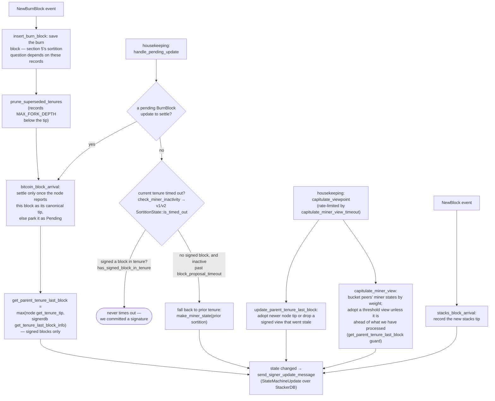

### Title
Signer re-checks before signing skip the "is this still the authorized miner" gate, letting a proposal signed against a stale authorization state slip through — ([File: stacks-signer/src/v0/signer.rs])

### Summary
`aedes` bypassed its publish-authorization rules for a client-supplied "Last Will" message: the Will was authorized once at CONNECT time and then delivered later without re-running the authorization check that applied to normal publishes. The stacks-signer has the same shape of bug: a block proposal's *miner authorization* (is the proposer the pubkey-hash the signer currently recognizes as the active/winning miner, `MinerState::ActiveMiner{current_miner_pkh,...}`) is checked only once, at proposal-arrival time, inside `check_proposal` [1](#0-0) . All later re-checks that gate the *actual signature-producing paths* — at block-validate-ok and at pre-commit-threshold crossing — call the strictly weaker `check_block_against_signer_db_state`, which the code itself flags as incomplete: [2](#0-1) 

That function only re-verifies chain-length/tenure-continuity (`check_tenure_change_confirms_parent` / `check_latest_block_in_tenure`); it never re-derives or re-compares `current_miner_pkh`, the consensus-hash-to-active-miner binding, or the bitvec check [3](#0-2) . The project's own flow documentation confirms this asymmetry explicitly: "the v2 `check_proposal` wrapper checks miner pubkey hash, consensus hash, the pox bitvec, and tenure-extend rules before delegating here" and lists this as one of "Two things [that] belong to the proposal path only and are **not** re-run at validate-ok or at signing" [4](#0-3) .

### Finding Description
The signature-issuing pipeline has two points where the world can change between the initial "who is authorized" gate and the moment a signature is actually placed:

1. Proposal arrival → `check_block_against_state` → (v1) `SortitionsView::check_proposal` / (v2) `GlobalStateView::check_proposal`. This is the *only* place `current_miner_pkh`/`miner_pkh` equality and consensus-hash-to-tenure binding are verified [5](#0-4) . If this passes, the proposal is submitted to the node for validation and stored, per `handle_block_proposal` [6](#0-5) .
2. `handle_block_validate_ok` — once the node answers OK — re-checks only via `check_block_against_signer_db_state` before broadcasting a pre-commit [7](#0-6) .
3. `handle_block_pre_commit` — once ≥70% pre-commit weight is reached — re-checks again only via `check_block_against_signer_db_state` before actually producing the signature (`mark_locally_accepted`) [8](#0-7) .

Between steps 1 and 3, the signer's notion of the *currently authorized miner* is not static: it is a state machine (`LocalStateMachine` / `MinerState::ActiveMiner`) that is updated by burn-block arrival, `check_miner_inactivity` (falling back to a prior tenure's miner on timeout), and `capitulate_miner_view` (adopting a majority-weighted peer view) — all independent, asynchronous inputs described in the flow docs section 8 [9](#0-8) . `check_block_against_signer_db_state` is explicitly a signerdb-height/tenure check, not a re-derivation of `current_miner_pkh`/authorization state, and the function's own doc comment warns it must never substitute for `check_proposal` [10](#0-9) , yet it is exactly the check used at the two places (`handle_block_validate_ok`, `handle_block_pre_commit`) where the signature is actually produced.

Concretely: a one-slot miner proposes a block while it is still the current sortition winner (passes `check_proposal`'s miner-pubkey-hash gate). The proposal is submitted for node validation (can take time) and/or waits for the pre-commit weight to reach 70% (can also take time, especially with slow/partitioned peers per the `signers_wait_for_validation.rs` test scenario, which the codebase itself demonstrates can span multiple seconds to minutes across validation stalls and threshold waits [11](#0-10) ). During that window, the signer's local state machine can capitulate to a different `current_miner_pkh` (e.g., the tenure timing out and falling back to a prior tenure's miner, or a majority-weight peer state update). When the node's OK response arrives, or when the 70% pre-commit threshold is crossed, `check_block_against_signer_db_state` is invoked — but it never asks "is the proposer of this specific block still the miner pubkey-hash we currently authorize?" It only asks tenure/height continuity questions. If those pass (which they can, since a stale-but-still-highest block in its own tenure trivially satisfies `check_latest_block_in_tenure`), the signer proceeds to sign a block from a miner it no longer recognizes as authorized — breaking the equality between "signed" and "currently-authorized-miner-validated."

This mirrors the aedes bug class precisely: authorization was checked once at an entry event (CONNECT / proposal-arrival) and cached implicitly into a later privileged action (Will delivery / signature issuance) without re-running the authorization predicate that guards that action everywhere else.

### Impact Explanation
This falls under the Critical bucket defined by the scan rules: "a signer signing an invalid, non-canonical, or conflicting block." A signature placed on a block from a miner the signer's own state machine no longer considers active breaks the core equality the signer set is supposed to enforce (only the currently-authorized miner's blocks get signed). Because `StateMachineUpdate`/`current_miner_pkh` is the consensus-visible equality key described in section 8 of the flow docs, a signer that signs against a stale authorization view can diverge from its peers' view of "who is allowed to build," undermining the miner-selection guarantee the whole pre-commit/signature protocol is built on.

### Likelihood Explanation
This requires no majority collusion and no attacker key compromise — the "attacker" role is simply the one currently-authorized miner (or ordinary network delay/timeout) sending a normal proposal early and having the network naturally advance the state machine (timeout fallback or peer capitulation) before the pre-commit threshold or node-validation response lands. The repository's own tests (e.g. `signers_wait_for_validation.rs`) demonstrate that the gap between proposal-time checks and pre-commit-threshold-crossing is a real, already-exercised race window in this codebase, and the `check_block_against_signer_db_state` doc-comment is a direct acknowledgment by the developers that this function is not a full substitute for `check_proposal`. This makes the precondition (state-machine drift during the validation/threshold window) plausible under normal operational conditions such as slow node validation, signer restarts and capitulation timing, or a stalled miner falling back to a prior tenure.

### Recommendation
Re-run the miner-authorization predicate (miner pubkey-hash vs. current `MinerState::ActiveMiner`/`current_miner_pkh`, and the consensus-hash binding) inside `check_block_against_signer_db_state`, or otherwise gate `handle_block_validate_ok` and `handle_block_pre_commit` on a fresh authorization check equivalent to the one in `check_proposal`, before allowing `mark_pre_committed`/`mark_locally_accepted` to proceed. At minimum, if the signer's active-miner view has changed since the block was accepted for validation, the block should be treated as no longer provably valid and re-routed through the full `check_proposal` path (as is already done for re-proposals via `should_reevaluate_block`).

### Proof of Concept
1. Miner M is the currently active miner (per `MinerState::ActiveMiner{current_miner_pkh}`); it proposes block B, which passes `check_proposal`'s pubkey-hash gate [1](#0-0)  and is submitted for node validation / accumulates pre-commits.
2. Before the node's validation response returns, or before pre-commit weight crosses 70%, the burn-block/tenure-inactivity logic causes the signer's local state machine to fall back to a different active miner (`check_miner_inactivity` → `make_miner_state(prior sortition)`, or a `capitulate_miner_view` update from peers) [12](#0-11) , changing `current_miner_pkh` away from M's pubkey hash.
3. The validation-OK response for B arrives, `handle_block_validate_ok` calls `check_block_against_signer_db_state(stacks_client, &block_info.block)` [13](#0-12) , which only checks tenure/height continuity, not `current_miner_pkh`; since B is still the highest block in its own tenure, the check passes and a pre-commit is broadcast.
4. Once ≥70% pre-commit weight accumulates, `handle_block_pre_commit` again calls only `check_block_against_signer_db_state` [14](#0-13)  before calling `mark_locally_accepted` and broadcasting the signature — despite the signer no longer recognizing M as the authorized miner.

Note: I was not able to execute this scenario end-to-end (no test harness run), so this is a structural/code-path analysis rather than an empirically reproduced exploit; the referenced `signers_wait_for_validation.rs` test confirms the timing window exists but doesn't itself trigger a miner-view change, so the exact trigger conditions for state-machine drift during that window would need to be validated with an integration test.

### Citations

**File:** stacks-signer/src/chainstate/v2.rs (L146-163)
```rust
        let Some(miner_pk) = block.header.recover_miner_pk() else {
            warn!("Failed to recover miner pubkey";
                  "signer_signature_hash" => %block.header.signer_signature_hash(),
                  "consensus_hash" => %block.header.consensus_hash);
            return Err(RejectReason::IrrecoverablePubkeyHash);
        };
        let miner_pkh = Hash160::from_data(&miner_pk.to_bytes_compressed());
        if current_miner_pkh != &miner_pkh {
            warn!(
                "Miner block proposal pubkey does not match the winning pubkey hash for its sortition. Considering invalid.";
                "proposed_block_consensus_hash" => %block.header.consensus_hash,
                "signer_signature_hash" => %block.header.signer_signature_hash(),
                "proposed_block_pubkey" => &miner_pk.to_hex(),
                "proposed_block_pubkey_hash" => %miner_pkh,
                "active_miner_pubkey_hash" => %current_miner_pkh,
            );
            return Err(RejectReason::PubkeyHashMismatch);
        }
```

**File:** stacks-signer/src/v0/signer.rs (L1345-1366)
```rust
        if let Some(block_rejection) =
            self.check_block_against_signer_db_state(stacks_client, &block_info.block)
        {
            warn!(
                "{self}: Reached the pre-commit threshold for a block, but it no longer passes the chainstate checks. Rejecting.";
                "signer_signature_hash" => %block_hash,
                "block_height" => block_info.block.header.chain_length,
                "reject_code" => %block_rejection.reason_code,
                "reject_reason" => &block_rejection.reason,
            );
            if let Err(e) = block_info.mark_locally_rejected() {
                if !block_info.has_reached_consensus() {
                    warn!("{self}: Failed to mark block as locally rejected: {e:?}");
                }
            };
            self.signer_db
                .insert_block(&block_info)
                .unwrap_or_else(|e| self.handle_insert_block_error(e));
            self.handle_block_rejection(&block_rejection, sortition_state);
            self.send_block_response(&block_info.block, block_rejection.into());
            return;
        }
```

**File:** stacks-signer/src/v0/signer.rs (L1670-1727)
```rust
        // Check if proposal can be rejected now if not valid against sortition view
        let block_rejection =
            self.check_block_against_state(stacks_client, sortition_state, &block_info);

        #[cfg(any(test, feature = "testing"))]
        let block_rejection =
            self.test_reject_block_proposal(block_proposal, &mut block_info, block_rejection);

        if let Some(block_rejection) = block_rejection {
            // We know proposal is invalid. Send rejection message, do not do further validation and do not store it.
            self.send_block_response(&block_info.block, block_rejection.into());
        } else {
            // Just in case check if the last block validation submission timed out.
            self.check_submitted_block_proposal();
            if self.submitted_block_proposal.is_none() {
                // We don't know if proposal is valid, submit to stacks-node for further checks and store it locally.
                info!(
                    "{self}: submitting block proposal for validation";
                    "signer_signature_hash" => %signer_signature_hash,
                    "block_id" => %block_proposal.block.block_id(),
                    "block_height" => block_proposal.block.header.chain_length,
                    "burn_height" => block_proposal.burn_height,
                );

                #[cfg(any(test, feature = "testing"))]
                self.test_stall_block_validation_submission();
                self.submit_block_for_validation(
                    stacks_client,
                    &block_proposal.block,
                    get_epoch_time_secs(),
                );
            } else {
                // Still store the block but log we can't submit it for validation. We may receive enough signatures/rejections
                // from other signers to push the proposed block into a global rejection/acceptance regardless of our participation.
                // However, we will not be able to participate beyond this until our block submission times out or we receive a response
                // from our node.
                warn!("{self}: cannot submit block proposal for validation as we are already waiting for a response for a prior submission. Inserting pending proposal.";
                    "signer_signature_hash" => signer_signature_hash.to_string(),
                );
                self.signer_db
                    .insert_pending_block_validation(&signer_signature_hash, get_epoch_time_secs())
                    .unwrap_or_else(|e| {
                        warn!("{self}: Failed to insert pending block validation: {e:?}")
                    });
            }

            // Do not store KNOWN invalid blocks as this could DOS the signer. We only store blocks that are valid or unknown.
            self.signer_db
                .insert_block(&block_info)
                .unwrap_or_else(|e| self.handle_insert_block_error(e));
            self.process_pending_responses_for_block(
                stacks_client,
                sortition_state,
                &mut block_info,
                pending_responses,
            );
        }
    }
```

**File:** stacks-signer/src/v0/signer.rs (L1799-1808)
```rust
    /// WARNING: This is an incomplete check. Do NOT call this function PRIOR to check_proposal or block_proposal validation succeeds.
    ///
    /// Re-verify a block's chain length against the last signed block within signerdb.
    /// This is required in case a block has been approved since the initial checks of the block validation endpoint.
    fn check_block_against_signer_db_state(
        &mut self,
        stacks_client: &StacksClient,
        proposed_block: &NakamotoBlock,
    ) -> Option<BlockRejection> {
        let signer_signature_hash = proposed_block.header.signer_signature_hash();
```

**File:** stacks-signer/src/v0/signer.rs (L1810-1880)
```rust
        if let Some(tenure_change) = proposed_block.get_tenure_change_tx_payload() {
            // Ensure that the tenure change block confirms the expected parent block
            match SortitionData::check_tenure_change_confirms_parent(
                tenure_change,
                proposed_block,
                &mut self.signer_db,
                stacks_client,
                self.proposal_config.tenure_last_block_proposal_timeout,
                self.proposal_config.reorg_attempts_activity_timeout,
            ) {
                Ok(true) => return None,
                Ok(false) => {
                    return Some(self.create_block_rejection(
                        RejectReason::SortitionViewMismatch,
                        proposed_block,
                    ))
                }
                Err(e) => {
                    warn!("{self}: Error checking block proposal: {e}";
                        "signer_signature_hash" => %signer_signature_hash,
                        "block_id" => %proposed_block.block_id()
                    );
                    return Some(self.create_block_rejection(
                        RejectReason::ConnectivityIssues(
                            "error checking block proposal".to_string(),
                        ),
                        proposed_block,
                    ));
                }
            }
        }

        // Ensure that the block is the last block in the chain of its current tenure.
        match SortitionData::check_latest_block_in_tenure(
            &proposed_block.header.consensus_hash,
            proposed_block,
            &mut self.signer_db,
            stacks_client,
            self.proposal_config.tenure_last_block_proposal_timeout,
            self.proposal_config.reorg_attempts_activity_timeout,
        ) {
            Ok(is_latest) => {
                if !is_latest {
                    warn!(
                        "Miner's block proposal does not confirm as many blocks as we expect";
                        "proposed_block_consensus_hash" => %proposed_block.header.consensus_hash,
                        "proposed_block_signer_signature_hash" => %signer_signature_hash,
                        "proposed_chain_length" => proposed_block.header.chain_length,
                    );
                    Some(self.create_block_rejection(
                        RejectReason::SortitionViewMismatch,
                        proposed_block,
                    ))
                } else {
                    None
                }
            }
            Err(e) => {
                warn!("{self}: Failed to check block against signer db: {e}";
                    "signer_signature_hash" => %signer_signature_hash,
                    "block_id" => %proposed_block.block_id()
                );
                Some(self.create_block_rejection(
                    RejectReason::ConnectivityIssues(
                        "failed to check block against signer db".to_string(),
                    ),
                    proposed_block,
                ))
            }
        }
    }
```

**File:** stacks-signer/src/v0/signer.rs (L1946-1984)
```rust
        if let Some(block_rejection) =
            self.check_block_against_signer_db_state(stacks_client, &block_info.block)
        {
            // The signer db state has changed. We no longer view this block as valid. Override the validation response.
            if let Err(e) = block_info.mark_locally_rejected() {
                if !block_info.has_reached_consensus() {
                    warn!("{self}: Failed to mark block as locally rejected: {e:?}");
                }
            };
            self.signer_db
                .insert_block(&block_info)
                .unwrap_or_else(|e| self.handle_insert_block_error(e));
            self.handle_block_rejection(&block_rejection, sortition_state);
            self.send_block_response(&block_info.block, block_rejection.into());
        } else {
            if let Err(e) = block_info.mark_pre_committed() {
                // The block may have reached enough signatures before we validated the block so should fail to mark pre-committed
                // but still call to make sure the timestamps and validity are updated correctly.
                if !block_info.has_reached_consensus()
                    && block_info.state != BlockState::LocallyAccepted
                {
                    warn!("{self}: Failed to mark block as approved: {e:?}",);
                    return;
                }
            }

            self.signer_db
                .insert_block(&block_info)
                .unwrap_or_else(|e| self.handle_insert_block_error(e));
            self.send_block_pre_commit(signer_signature_hash.clone());
            // have to save the signature _after_ the block info
            let address = self.stacks_address.clone();
            self.handle_block_pre_commit(
                stacks_client,
                sortition_state,
                &address,
                signer_signature_hash,
            );
        }
```

**File:** docs/signer-flows.md (L425-433)
```markdown
Two things belong to the proposal path only and are **not** re-run at validate-ok
or at signing:

- `validate_tenure_change_payload` rejects with `DuplicateBlockFound` when we
  have already accepted a block in the tenure a tenure-change block is starting.
  v2 counts locally or globally accepted blocks (`get_last_signed_block`); v1
  counts only globally accepted ones (`get_last_globally_accepted_block`).
- the v2 `check_proposal` wrapper checks miner pubkey hash, consensus hash, the
  pox bitvec, and tenure-extend rules before delegating here.
```

**File:** docs/signer-flows.md (L450-480)
```markdown
## 8. Burn blocks & the miner-view state machine

Independent of any single block, the signer maintains a view of _who the current
miner is and what they should build on_, and broadcasts it as a
`StateMachineUpdate`. The whole miner state, including
`parent_tenure_last_block`, is the equality key for global agreement, so what
this flow computes is consensus-visible.



The two housekeeping entry points are distinct. `handle_pending_update` either
settles a deferred burn-block arrival or, when nothing is pending, asks whether
the current miner has gone inactive; both v1 and v2 `is_timed_out` measure one
```

**File:** stacks-node/src/tests/signer/v0/signers_wait_for_validation.rs (L33-56)
```rust
#[test]
#[ignore]
/// Test that signers don't issue signatures until they have validated the block
///
/// This test verifies a race condition where a signer receives enough pre-commits
/// to exceed the 70% threshold before receiving its own block validation response.
/// The signer should NOT issue a signature until it has confirmed the block is valid.
///
/// Test Setup:
/// - Distribute signers across two miners (4 on miner 1, 1 on miner 2)
/// - Signers on different miners use different validation endpoints
///
/// Test Execution:
/// 1. Propose a block to all signers
/// 2. Pause block validation on miner 2 (the single signer)
/// 3. 4 signers on miner 1 issue pre-commits, pushing threshold over 70%
/// 4. The single signer on miner 2 receives all pre-commits but its validation is stalled
/// 5. Verify the single signer does NOT issue a signature until validation completes
/// 6. Resume validation and confirm the block is accepted
///
/// Test Assertion:
/// The signer waits for its own validation before issuing a signature, preventing
/// race conditions where it could sign before discovering the block is invalid.
fn signer_waits_for_validation_before_signing() {
```
