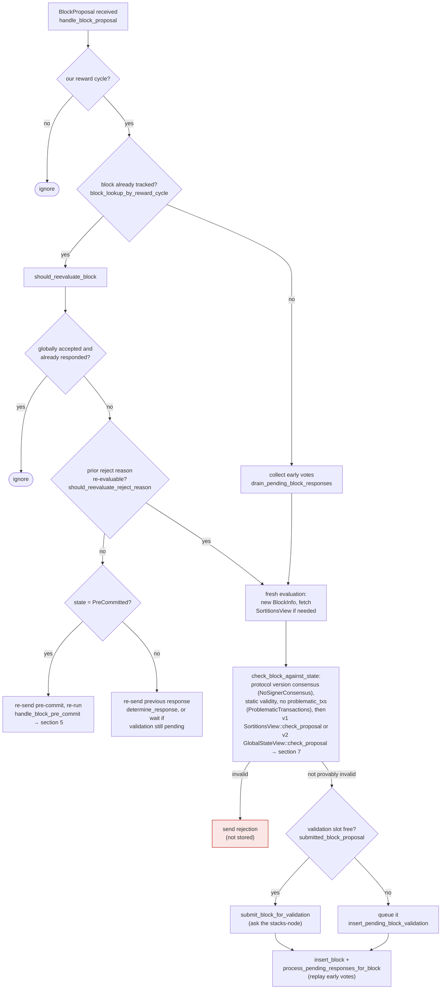

Based on the investigation of the block-acceptance weight tallying in the miner-side coordinator, I found a legitimate analog to the reported "aggregate value not corrected when the underlying vote changes" bug class.

### Title
Node-side signer weight tally never decrements `total_weight_rejected` when a signer flips its vote from reject to accept, letting a stale rejection permanently poison the aggregate threshold check - (File: `stacks-node/src/nakamoto_node/stackerdb_listener.rs`)

### Summary
The miner's `StackerDBListener` accumulates two independent, monotonically-increasing counters, `total_weight_approved` and `total_weight_rejected`, as `BlockResponse` messages arrive from signers. The signer-side state machine explicitly permits a signer to change its mind and move from `LocallyRejected` back to `LocallyAccepted` after re-evaluation, but the listener never subtracts a signer's earlier rejection weight when that signer later accepts the same block. `total_weight_rejected` is only ever reset wholesale on a timeout, not corrected per-signer on a vote flip.

### Finding Description
The signer-local state diagram documented from `signerdb.rs`/`v0/signer.rs` explicitly allows `LocallyRejected --> LocallyAccepted : re-evaluated` [1](#0-0) , and `handle_block_proposal`'s reevaluation path (`should_reevaluate_reject_reason`) is precisely the mechanism that lets a signer legitimately flip a prior rejection into a later signature broadcast [2](#0-1) .

On the node/miner side, `StackerDBListener` tracks per-block `BlockStatus.total_weight_approved` and (by the parallel pattern) `total_weight_rejected` as it observes `BlockResponse` messages over StackerDB. The accepted-signature path guards against double counting the *same* vote type via `gathered_signatures.contains_key(&slot_id)` before adding weight [3](#0-2) , but nothing in the observed code subtracts previously-added rejection weight from `total_weight_rejected` when that same signer's later `Accepted` message arrives. The counters are combined additively via `saturating_add`, which can only grow.

`SigningCoordinator::wait_for_signer_signature` (or its analog) then treats `total_weight_rejected` as ground truth for whether a supermajority *currently* opposes the block: it raises `NakamotoNodeError::SignersRejected` once `total_weight_rejected.saturating_add(weight_threshold) > total_weight` [4](#0-3) . The only place that clears rejection weight is `reset_rejections`, invoked solely on the overall wait timeout, not on a per-signer switch to acceptance [5](#0-4) .

This is structurally the same defect class as the reported bug: an aggregate accounting value (`yIntercept` there, `total_weight_rejected` here) is credited for an initial outcome and is never decremented when the real, final outcome supersedes it, so the aggregate diverges from truth.

### Impact Explanation
Because `total_weight_rejected` can never shrink except via a full timeout-triggered reset, a block that legitimately crosses the 70% *approval* threshold after some signers reconsidered and switched from reject to accept can simultaneously appear to have crossed the 30% *rejection* blocking-minority threshold from stale votes that no longer represent any signer's current position. This lets the coordinator kill (`SignersRejected`) a block that should have been signed and accepted — a liveness wedge on block production caused purely by stale, uncorrected aggregate weight, not by any current majority of dissenting signers.

### Likelihood Explanation
This requires only ordinary, permitted signer behavior (no need for a malicious majority or key compromise): a signer that initially validates a proposal as invalid, broadcasts a rejection, and then legitimately re-evaluates and accepts it after a subsequent proposal/pre-commit resend, which the state machine explicitly allows. Any transient network reordering, brief validation flakiness, or timing race around the pre-commit/threshold window (as covered by the existing race-condition test `signer_waits_for_validation_before_signing`) could trigger this vote-flip pattern.

### Recommendation
When a `BlockResponse::Accepted` arrives from a signer for whom `total_weight_rejected` previously credited a rejection (or vice versa), subtract that signer's weight from the stale bucket before adding it to the new one, mirroring the "reject removes an existing signature can't happen / signature removes existing rejection" invariant already enforced in the signer-local `signerdb.rs` (`add_block_rejection_signer_addr` refuses to record a rejection once a signature exists) [6](#0-5) . The node-side aggregate tally should enforce the same mutual-exclusion/decrement discipline per signer slot.

### Proof of Concept
1. Miner proposes block `B` at height `h`.
2. Signer `S` initially fails validation (e.g., transient node RPC error) and broadcasts `BlockResponse::Rejected` — the coordinator increments `total_weight_rejected` by `S`'s weight.
3. `S` receives a re-proposal or additional pre-commits and, per `should_reevaluate_reject_reason`/`should_reevaluate_block`, re-evaluates and now signs, broadcasting `BlockResponse::Accepted` — the coordinator increments `total_weight_approved` by `S`'s weight but does **not** decrement `total_weight_rejected`.
4. With enough other signers behaving normally, `total_weight_approved` can reach the 70% threshold while `total_weight_rejected` (inflated by `S`'s stale, superseded rejection) still independently exceeds the 30% blocking minority.
5. Depending on evaluation order in the coordinator's poll loop, the stale `total_weight_rejected` can trigger `SignersRejected` and abort block production even though a genuine current supermajority has signed.

### Citations

**File:** docs/signer-flows.md (L142-149)
```markdown
    Unprocessed --> LocallyRejected : mark_locally_rejected
    PreCommitted --> LocallyRejected : mark_locally_rejected
    LocallyRejected --> LocallyAccepted : re-evaluated
    LocallyAccepted --> LocallyRejected : re-evaluated
    LocallyAccepted --> GloballyAccepted : mark_globally_accepted
    LocallyRejected --> GloballyRejected : mark_globally_rejected
    GloballyAccepted --> [*]
    GloballyRejected --> [*]
```

**File:** docs/signer-flows.md (L164-203)
```markdown
## 3. A block proposal arrives

The miner broadcasts a proposal. If we've seen this exact block before,
`should_reevaluate_block` decides whether the old verdict stands; a block we
only pre-committed to is deliberately routed back through the pre-commit
evaluation so a re-proposal cannot shortcut to a signature. A fresh proposal is
checked against our view of the world _before_ spending a node validation on it.



Early votes: acceptances, rejections, and pre-commits that arrived before the
proposal itself are parked in pending tables and replayed once the proposal is
known.

> Anchors: `handle_block_proposal`, `should_reevaluate_block`,
> `should_reevaluate_reject_reason`, `check_block_against_state`,
> `submit_block_for_validation`, `process_pending_responses_for_block`
> (signer.rs); `check_proposal` (chainstate/v1.rs, v2.rs)
```

**File:** stacks-node/src/nakamoto_node/stackerdb_listener.rs (L443-465)
```rust
                        if !block.gathered_signatures.contains_key(&slot_id) {
                            block.total_weight_approved = block
                                .total_weight_approved
                                .saturating_add(signer_entry.weight);

                            info!("StackerDBListener: Signature Added to block";
                                "signer_signature_hash" => %block_sighash,
                                "signer_pubkey" => signer_pubkey.to_hex(),
                                "signer_slot_id" => slot_id,
                                "signature" => %signature,
                                "signer_weight" => signer_entry.weight,
                                "total_weight_approved" => block.total_weight_approved,
                                "percent_approved" => block.total_weight_approved as f64 / self.total_weight as f64 * 100.0,
                                "total_weight_rejected" => block.total_weight_rejected,
                                "percent_rejected" => block.total_weight_rejected as f64 / self.total_weight as f64 * 100.0,
                                "weight_threshold" => self.weight_threshold,
                                "tenure_extend_timestamp" => tenure_extend_timestamp,
                                "read_count_extend_timestamp" => read_count_extend_timestamp,
                                "server_version" => metadata.server_version,
                            );
                        }
                        block.gathered_signatures.insert(slot_id, signature);
                        block.responded_signers.insert(slot_id);
```

**File:** stacks-node/src/nakamoto_node/signer_coordinator.rs (L509-540)
```rust
            if block_status
                .total_weight_rejected
                .saturating_add(self.weight_threshold)
                > self.total_weight
            {
                info!(
                    "{}/{} signer weight votes to reject block",
                    block_status.total_weight_rejected, self.total_weight;
                    "signer_signature_hash" => %block_signer_sighash,
                );
                counters.bump_naka_rejected_blocks();

                // Only act on failed txids that a blocking minority (>30% weight) agrees on
                let blocking_minority = self.total_weight.saturating_sub(self.weight_threshold);
                let mut temporarily_excluded_txids = HashSet::new();
                let mut permanently_excluded_txids = HashSet::new();
                for (txid, info) in &block_status.failed_txids {
                    if info.total_weight > blocking_minority {
                        // Do not perma ban txids that only a small minority of signers reported as problematic
                        // But make sure its removed from the next block proposal
                        if info.problematic_weight > blocking_minority {
                            permanently_excluded_txids.insert(txid.clone());
                        } else {
                            temporarily_excluded_txids.insert(txid.clone());
                        }
                    }
                }

                return Err(NakamotoNodeError::SignersRejected {
                    temporarily_excluded_txids,
                    permanently_excluded_txids,
                });
```

**File:** stacks-node/src/nakamoto_node/signer_coordinator.rs (L546-557)
```rust
            } else if rejections_timer.elapsed() > *rejections_timeout {
                warn!("Timed out while waiting for responses from signers";
                    "elapsed" => rejections_timer.elapsed().as_secs(),
                    "rejections_timeout" => rejections_timeout.as_secs(),
                    "rejections" => rejections,
                    "rejections_threshold" => self.total_weight.saturating_sub(self.weight_threshold)
                );

                // Reset the rejections in the stackerdb listener
                self.stackerdb_comms.reset_rejections(block_signer_sighash);

                return Err(NakamotoNodeError::SignatureTimeout);
```

**File:** stacks-signer/src/signerdb.rs (L1922-1940)
```rust
    /// Record an observed block rejection_signature
    pub fn add_block_rejection_signer_addr(
        &self,
        block_sighash: &Sha512Trunc256Sum,
        addr: &StacksAddress,
        reject_reason: RejectReasonPrefix,
    ) -> Result<bool, DBError> {
        // If this signer/block already has a signature, do not allow a rejection
        let sig_qry = "SELECT EXISTS(SELECT 1 FROM block_signatures WHERE signer_signature_hash = ?1 AND signer_addr = ?2)";
        let sig_args = params![block_sighash, addr.to_string()];
        let exists = self.db.query_row(sig_qry, sig_args, |row| row.get(0))?;
        if exists {
            warn!("Cannot add block rejection because a signature already exists.";
                "signer_signature_hash" => %block_sighash,
                "signer_address" => %addr,
                "reject_reason" => ?reject_reason
            );
            return Ok(false);
        }
```
