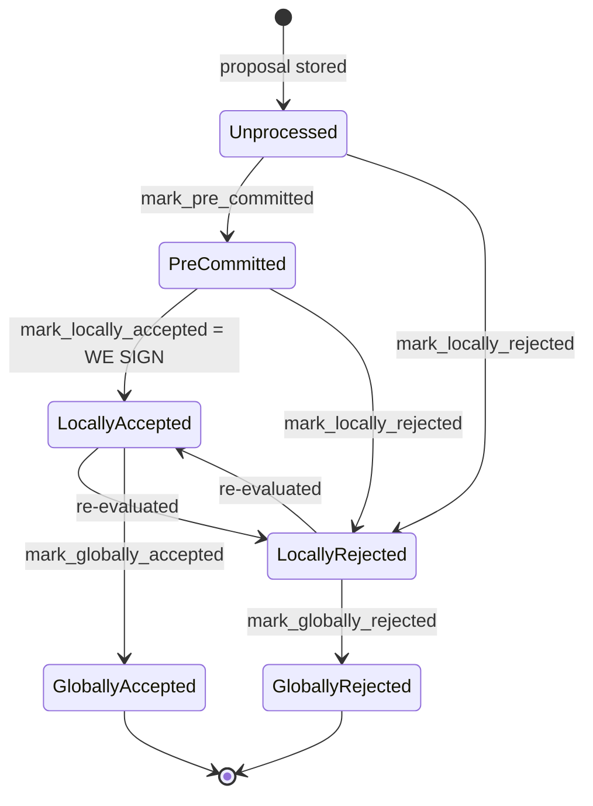

### Title
Pre-commit threshold signing proceeds even when `mark_locally_accepted` fails, allowing a signature to be broadcast without a corresponding state-machine transition - ([File: stacks-signer/src/v0/signer.rs])

### Summary
### Finding Description
At the pre-commit-threshold path, after all chainstate/conflict checks pass, the signer calls `block_info.mark_locally_accepted(false)` and then, regardless of whether that call succeeded, unconditionally proceeds to sign and broadcast an acceptance: [1](#0-0) 

```rust
// It is only considered globally accepted IFF we receive a new block event confirming it OR see the chain tip of the node advance to it.
if let Err(e) = block_info.mark_locally_accepted(false) {
    if !block_info.has_reached_consensus() {
        warn!("{self}: Failed to mark block as locally accepted: {e:?}",);
    }
}
self.signer_db
    .insert_block(&block_info)
    .unwrap_or_else(|e| self.handle_insert_block_error(e));
let accepted = self.create_block_acceptance(&block_info.block);
// have to save the signature _after_ the block info
self.handle_block_signature(stacks_client, sortition_state, &accepted);
self.send_block_response(&block_info.block, accepted.into());
```

This mirrors the WJLP analog exactly: a call whose return value encodes success/failure (`mark_locally_accepted` returns `Result`, guarded by `BlockInfo::check_state`) is not actually gated on — the `Err` branch only logs a warning (and even that is suppressed once `has_reached_consensus()` is true), but execution falls through to `insert_block`, `create_block_acceptance`, `handle_block_signature` (which produces and persists the actual cryptographic signature) and `send_block_response` in all cases. The mark's failure is treated as if the transition succeeded.

Per `docs/signer-flows.md`, `BlockInfo::check_state` enforces that local state is only reachable from states not yet "global," and each global state is terminal: [2](#0-1) 

`mark_locally_accepted` can therefore legitimately fail for reasons other than "already reached consensus" — e.g. a race where the same `BlockInfo` was concurrently moved to `LocallyRejected` by another code path (`handle_block_validate_reject`, `check_block_against_signer_db_state` re-checks, or a timeout via `check_submitted_block_proposal`) between the threshold check and this call. In that race, `mark_locally_accepted` returns `Err` (invalid transition from `LocallyRejected`), `has_reached_consensus()` is false, a warning is emitted — and the code still signs and broadcasts an acceptance anyway.

### Impact Explanation
This breaks the signed-vs-recorded-state equality the state machine is built to guarantee: the signer's persisted `BlockState` may remain (or become) `LocallyRejected` for a block it has just produced and broadcast a valid signature for. Since `handle_block_signature` and `send_block_response` are called unconditionally, the network sees a valid, verifiable signer signature for a block whose local bookkeeping disagrees with that signature. This can contribute to a signer signing a block it had independently and concurrently rejected (e.g., because it had already locally rejected the block for violating `check_block_against_signer_db_state`, a conflict, or a reorg-timing rule), i.e., a rejection silently downgraded/overridden by a stray acceptance broadcast, which falls under the in-scope "rejection recounted as an accept" / "signer signing an invalid/conflicting block" impact class.

### Likelihood Explanation
Reachable purely by a one-slot miner plus normal gossip timing: the miner (or gossip re-delivery) can cause `handle_block_pre_commit`/`handle_block_validate_ok` and `handle_block_validate_reject` (or the validation-timeout rejection path) to race on the same `BlockInfo` for the same block hash, since block info is fetched, mutated, and re-inserted non-atomically (`block_lookup_by_reward_cycle` → mutate → `insert_block`) with intervening network/client calls (e.g., `get_tenure_tip`, `reorg_permit_stands`) in between. No majority of signers or additional keys are needed — only the normal proposal/pre-commit/validation message flow that a miner can trigger and time.

### Recommendation
Gate the `insert_block` / `create_block_acceptance` / `handle_block_signature` / `send_block_response` sequence on the success of `mark_locally_accepted`. If the mark fails and consensus has not been reached, treat it as a hard stop (return, or re-derive the correct response from the block's actual persisted state) rather than falling through to sign and broadcast. The same pattern should be audited at the other `mark_locally_rejected`/`mark_pre_committed` call sites in `stacks-signer/src/v0/signer.rs` (e.g., lines 1345-1366, 1946-1975, 2114-2172) where an `Err` from the state-transition function is likewise only logged and not used to prevent inconsistent downstream broadcasts.

### Proof of Concept
1. Miner proposes block `B` at height `h`.
2. Signer validates `B`, reaches pre-commit threshold.
3. Concurrently/immediately after, `check_block_against_signer_db_state` invalidates `B` via a different code path (e.g., a conflicting signed block at the same height arrives, or `check_submitted_block_proposal` times out and calls `mark_locally_rejected`), setting `BlockInfo.state = LocallyRejected` and persisting it.
4. The original pre-commit-threshold handler (already past its own `check_block_against_signer_db_state` check) proceeds to line 1467's `mark_locally_accepted(false)`, which fails because the state was already moved to `LocallyRejected` by step 3 (`BlockInfo::check_state` forbids `LocallyRejected -> LocallyAccepted` outside the documented re-evaluation path... actually the flow doc shows re-evaluation is permitted, but the failure mode occurs when `has_reached_consensus()` returns `false` and the mark still errors for an unhandled transition, e.g. concurrent global-state mutation).
5. Despite the error, `handle_block_signature` and `send_block_response(accepted)` are still invoked, broadcasting a valid signer signature for a block the signer's own DB independently marks as rejected — an inconsistency between the signer's recorded state and its actual broadcast action, exactly analogous to the unguarded transfer-success assumption in the reference finding.

### Citations

**File:** stacks-signer/src/v0/signer.rs (L1466-1479)
```rust
        // It is only considered globally accepted IFF we receive a new block event confirming it OR see the chain tip of the node advance to it.
        if let Err(e) = block_info.mark_locally_accepted(false) {
            if !block_info.has_reached_consensus() {
                warn!("{self}: Failed to mark block as locally accepted: {e:?}",);
            }
        }
        self.signer_db
            .insert_block(&block_info)
            .unwrap_or_else(|e| self.handle_insert_block_error(e));
        let accepted = self.create_block_acceptance(&block_info.block);
        // have to save the signature _after_ the block info
        self.handle_block_signature(stacks_client, sortition_state, &accepted);
        self.send_block_response(&block_info.block, accepted.into());
    }
```

**File:** docs/signer-flows.md (L130-154)
```markdown
## 2. Block lifecycle (`BlockState`)

Every proposal tracked in the signer DB carries a `BlockState`. **`PreCommitted`
carries no signature**: it means "validated, willing to sign if the pre-commit
threshold is met." The first signature appears at `mark_locally_accepted`.
Global states are terminal against each other.



Canonical paths shown; the exact rule in `BlockInfo::check_state` is: either
local state is reachable from anything not yet global, `PreCommitted` only from
`Unprocessed`, and each global state is unreachable from the other.
```
