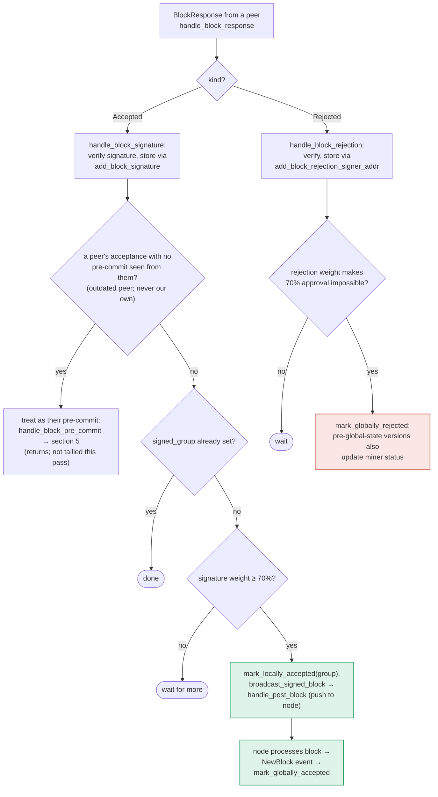

### Title
Signature-aggregation path skips the equivocation/chainstate re-check that the pre-commit path enforces, letting a signer broadcast a block it would otherwise refuse to sign - (File: `stacks-signer/src/v0/signer.rs`)

### Summary
`stacks-signer` gates *its own* decision to put a signature over a block behind two re-checks performed immediately before signing: `check_block_against_signer_db_state` (chainstate re-validation) and a conflict/equivocation scan via `SignerDb::get_signed_conflicts` + `conflict_still_blocks` + `reorg_permit_stands`. These re-checks exist precisely because the signer's local state can change materially between validation and the moment enough weight has accumulated to act. `handle_block_pre_commit` enforces both re-checks before calling `handle_block_signature` to sign.

`store_and_process_block_signature`, which aggregates *other* signers' `Accepted` responses toward the 70% threshold and then broadcasts the fully-signed block to the node, has no equivalent re-check. Once `total_signature_weight >= min_weight`, it goes straight to `block_info.mark_locally_accepted(true)` and `self.broadcast_signed_block(...)`, pushing the block to the node without ever asking whether this signer's own signer-db state now shows the block as a conflict (e.g. this signer has itself already signed a competing block at the same or higher height).

### Finding Description
Two code paths in `stacks-signer/src/v0/signer.rs` can cause a signer to help finalize a block once 70% signing weight is observed:

1. Own-signature path — `handle_block_pre_commit` (lines 1340-1478): before calling `handle_block_signature` to add this signer's own signature, it re-runs `check_block_against_signer_db_state` and then queries `get_signed_conflicts(chain_length, block_hash)`, applying freshness (`tenure_last_block_proposal_timeout`), `reorg_permit_stands`, and `conflict_still_blocks` to decide whether a previously-signed conflicting block still blocks signing. [1](#0-0) 

2. Peer-signature aggregation path — `store_and_process_block_signature` (lines 2442-2538): stores an incoming signature via `add_block_signature`, tallies `total_signature_weight`, and once it crosses `min_weight`, directly calls `mark_locally_accepted(true)` and `broadcast_signed_block`. There is no call to `check_block_against_signer_db_state` or `get_signed_conflicts`/`conflict_still_blocks` anywhere in this path. [2](#0-1) 

The `docs/signer-flows.md` state diagrams corroborate this asymmetry: the pre-commit flow (section 5) explicitly shows a `RECHECK` step ("chainstate checks still pass?") before the block can be signed and a `CONF` conflict-lookup gate after that, whereas the peer-response/"Accepted" flow (section 6) goes straight from `TALLY` (weight ≥ 70%?) to `BCAST` (`mark_locally_accepted(group)`, `broadcast_signed_block`) with no recheck box in between. [3](#0-2) 

Because `get_signed_conflicts`/`conflict_still_blocks` is the mechanism that stops a signer from endorsing two blocks that could both end up in the chain — described as necessary because "the re-check only ever looks at _one_ tenure ... so a signed sibling at the same height in a third tenure is invisible to it" and because a stale/expired guard must be re-derived per evaluation — omitting it from the aggregation-and-broadcast path breaks the same invariant it protects in the pre-commit path. [4](#0-3) 

Concretely: if signer S has already signed block B (via its own `handle_block_pre_commit` → `handle_block_signature` path, which recorded B as a signed conflict in `SignerDb`), and later receives enough `BlockResponse::Accepted` messages from *other* signers over a competing block A at the same/higher height (each of those signers reached their own accept decision independently, e.g. before B existed in their view, or under conditions where their own conflict check passed), S's `store_and_process_block_signature` will happily tally that weight and broadcast A to the node — even though S's own `SignerDb::get_signed_conflicts` would have refused to *sign* A itself under `conflict_still_blocks`. S is not forging a signature, but S becomes the finalizing conduit that hands the node a fully-signed conflicting block, which is exactly the "signed vs validated" equality the pre-commit path exists to enforce.

### Impact Explanation
This lets a signer push a block that conflicts with (or is non-canonical relative to) a block it has itself already signed, bypassing the signer's own equivocation guard for the *broadcast* decision even though that guard is enforced for the *sign* decision. This matches the Critical impact class: a signer effectively assisting a conflicting/non-canonical block's finalization, which the equivocation/conflict-check machinery (`get_signed_conflicts`, `conflict_still_blocks`, `reorg_permit_stands`) exists specifically to prevent.

### Likelihood Explanation
No majority collusion or key compromise is required — this only needs ordinary gossip of legitimately-signed `BlockResponse::Accepted` messages from other signers (each acting correctly under their own view) arriving at a signer that independently already signed a conflicting block. A miner able to produce competing proposals across forks/tenures (a one-slot miner capability) can create the timing conditions (differing views of which block came "first") that make this divergence between signers' local states plausible without needing a majority or forged signatures.

### Recommendation
Add the same re-checks that `handle_block_pre_commit` performs — `check_block_against_signer_db_state` and the `get_signed_conflicts`/freshness/`reorg_permit_stands`/`conflict_still_blocks` conflict scan — to `store_and_process_block_signature` before calling `mark_locally_accepted(true)` and `broadcast_signed_block`, so that reaching the 70% threshold via peer signatures cannot bypass the equivocation guard that gates this signer's own signing decision.

### Proof of Concept
Not directly executable without a live multi-signer/multi-tenure test harness, but reproducible via the existing integration-test scaffolding (`stacks-node/src/tests/signer/v0/mod.rs`) by: (1) having signer S sign block B in tenure T1 via the normal pre-commit path so `SignerDb::get_signed_conflicts` records B; (2) constructing a competing block A at the same height in tenure T2 and getting ≥70% weight of `BlockResponse::Accepted` from other signers (who never observed B) delivered to S via StackerDB gossip; (3) observing that S's `store_and_process_block_signature` marks A `mark_locally_accepted(true)` and calls `broadcast_signed_block` without ever consulting `get_signed_conflicts`/`conflict_still_blocks`, unlike the equivalent pre-commit-driven signing path. [5](#0-4)

### Citations

**File:** stacks-signer/src/v0/signer.rs (L1345-1421)
```rust
        if let Some(block_rejection) =
            self.check_block_against_signer_db_state(stacks_client, &block_info.block)
        {
            warn!(
                "{self}: Reached the pre-commit threshold for a block, but it no longer passes the chainstate checks. Rejecting.";
                "signer_signature_hash" => %block_hash,
                "block_height" => block_info.block.header.chain_length,
                "reject_code" => %block_rejection.reason_code,
                "reject_reason" => &block_rejection.reason,
            );
            if let Err(e) = block_info.mark_locally_rejected() {
                if !block_info.has_reached_consensus() {
                    warn!("{self}: Failed to mark block as locally rejected: {e:?}");
                }
            };
            self.signer_db
                .insert_block(&block_info)
                .unwrap_or_else(|e| self.handle_insert_block_error(e));
            self.handle_block_rejection(&block_rejection, sortition_state);
            self.send_block_response(&block_info.block, block_rejection.into());
            return;
        }

        // A pre-commit may be superseded by a competing proposal at the same height (e.g. a
        // re-proposed tenure-start block after the first failed to reach consensus), but a
        // signature must not be superseded while it's still "fresh". A signed block at the
        // same or higher height in ANY tenure is a conflict: two blocks at the same height are
        // siblings no matter which tenure they belong to (e.g. the next tenure's tenure-start
        // block conflicts with the current tenure's block at the same height). Blocks in
        // tenures whose reorg we sanctioned under the reorg-timing rules are excluded, but
        // only while the sortition the permit was granted to is still canonical
        // (`check_parent_tenure_choice` records the permit, `reorg_permit_stands` re-derives
        // its validity from the node); every other question about whether a conflict is
        // still live is derived from the node in `conflict_still_blocks`.
        //
        // Unlike the chainstate check above, a refusal here is "for now" rather than a
        // broadcast rejection: a later pre-commit re-evaluation may still sign the block once
        // the conflicting signature has gone stale.
        let conflicts = match self
            .signer_db
            .get_signed_conflicts(block_info.block.header.chain_length, &block_hash)
        {
            Ok(conflicts) => conflicts,
            Err(e) => {
                warn!("{self}: Failed to query the signed blocks. Refusing to sign block {block_hash}: {e:?}");
                return;
            }
        };
        let freshness_cutoff = get_epoch_time_secs().saturating_sub(
            self.proposal_config
                .tenure_last_block_proposal_timeout
                .as_secs(),
        );
        // A fresh signature only blocks while the block it covers could still be part of the
        // chain: see `conflict_still_blocks`, which asks the node whether it is. Check
        // freshness first: it is a local timestamp comparison, while `reorg_permit_stands`
        // and `conflict_still_blocks` each query the node, so stale conflicts cost no
        // round-trips.
        if let Some(conflict) = conflicts.iter().find(|conflict| {
            conflict.last_endorsed > freshness_cutoff
                && !self.reorg_permit_stands(stacks_client, conflict)
                && self.conflict_still_blocks(
                    stacks_client,
                    conflict,
                    block_info.block.header.chain_length,
                )
        }) {
            warn!(
                "{self}: Reached the pre-commit threshold for a block, but we have recently signed or accepted a different block at the same or higher height. Refusing to sign.";
                "signer_signature_hash" => %block_hash,
                "block_height" => block_info.block.header.chain_length,
                "conflicting_signer_signature_hash" => %conflict.signer_signature_hash,
                "conflicting_block_height" => conflict.stacks_height,
                "conflicting_consensus_hash" => %conflict.consensus_hash,
            );
            return;
        }
```

**File:** stacks-signer/src/v0/signer.rs (L2442-2538)
```rust
    /// Store the block acceptance signature and check if we have reached a consensus decision on the block because of it. If we have, update the block state accordingly and broadcast the block if accepted.
    fn store_and_process_block_signature(
        &mut self,
        stacks_client: &StacksClient,
        sortition_state: &mut Option<SortitionsView>,
        block_info: &mut BlockInfo,
        signer_address: &StacksAddress,
        signature: &MessageSignature,
    ) {
        let block_hash = &block_info.signer_signature_hash();
        // signature is valid! store it.
        // if this returns false, it means the signature already exists in the DB, so just return.
        if !self
            .signer_db
            .add_block_signature(block_hash, signer_address, signature)
            .unwrap_or_else(|_| panic!("{self}: Failed to save block signature"))
        {
            return;
        }

        // If this isn't our own signature and we haven't seen a pre-commit from this signer yet, try treating it as a pre-commit in case the caller is running an outdated version
        if signer_address != &self.stacks_address && !self.signer_db.has_committed(block_hash, signer_address).inspect_err(|e| warn!("Failed to check if pre-commit message already considered for {signer_address:?} for {block_hash}: {e}")).unwrap_or(false) {
            self.handle_block_pre_commit(stacks_client, sortition_state, signer_address, block_hash);
            return;
        }

        if block_info.signed_group.is_some() {
            // We have already processed this block to the accepted state. Adding more signatures will not change anything so nothing to check.
            return;
        }
        // do we have enough signatures to broadcast?
        // i.e. is the threshold reached?
        let signatures = self
            .signer_db
            .get_block_signatures(block_hash)
            .unwrap_or_else(|_| panic!("{self}: Failed to load block signatures"));

        // put signatures in order by signer address (i.e. reward cycle order)
        let addrs_to_sigs: HashMap<_, _> = signatures
            .into_iter()
            .filter_map(|sig| {
                let Ok(public_key) = Secp256k1PublicKey::recover_to_pubkey_without_validating_low_s(
                    block_hash.bits(),
                    &sig,
                ) else {
                    return None;
                };
                let addr = StacksAddress::p2pkh(self.mainnet, &public_key);
                Some((addr, sig))
            })
            .collect();

        let signature_weight = self.signer_weights.get(signer_address).unwrap_or(&0);
        let total_signature_weight = self.compute_signature_signing_weight(addrs_to_sigs.keys());
        let total_weight = self.compute_signature_total_weight();

        let min_weight = NakamotoBlockHeader::compute_voting_weight_threshold(total_weight)
            .unwrap_or_else(|_| {
                panic!("{self}: Failed to compute threshold weight for {total_weight}")
            });

        if min_weight > total_signature_weight {
            info!("{self}: Received block acceptance, but have not yet reached the acceptance threshold.";
                "signer_signature_hash" => %block_hash,
                "signature_weight" => signature_weight,
                "consensus_hash" => %block_info.block.header.consensus_hash,
                "block_height" => block_info.block.header.chain_length,
                "total_weight_approved" => total_signature_weight,
                "total_weight" => total_weight,
                "percent_approved" => (total_signature_weight as f64 / total_weight as f64 * 100.0),
            );
            return;
        }
        info!("{self}: have reached the block acceptance threshold";
            "signer_signature_hash" => %block_hash,
            "signature_weight" => signature_weight,
            "consensus_hash" => %block_info.block.header.consensus_hash,
            "block_height" => block_info.block.header.chain_length,
            "total_weight_approved" => total_signature_weight,
            "total_weight" => total_weight,
            "percent_approved" => (total_signature_weight as f64 / total_weight as f64 * 100.0),
        );

        // have enough signatures to broadcast!
        // move block to LOCALLY accepted state.
        // It is only considered globally accepted IFF we receive a new block event confirming it OR see the chain tip of the node advance to it.
        if let Err(e) = block_info.mark_locally_accepted(true) {
            if !block_info.has_reached_consensus() {
                warn!("{self}: Failed to mark block as locally accepted: {e:?}");
            }
        }
        let _ = self.signer_db.insert_block(block_info).map_err(|e| {
            warn!("Failed to set group threshold signature timestamp for {block_hash}: {e:?}");
            panic!("{self} Failed to write block to signerdb: {e}");
        });
        self.broadcast_signed_block(stacks_client, block_info.block.clone(), &addrs_to_sigs);
    }
```

**File:** docs/signer-flows.md (L274-297)
```markdown
Order matters here: the chainstate re-check runs first and produces an explicit
(sticky) rejection when the block now conflicts with a signed one. The conflict
guard behind it is the silent backstop for what that re-check cannot see, and
silence keeps the door open to sign later once the conflict goes stale. Two
blind spots make the guard necessary:

- the re-check only ever looks at _one_ tenure (a tenure-change block's parent,
  or any other block's own), so a signed sibling at the same height in a third
  tenure is invisible to it;
- the `DuplicateBlockFound` check that would catch a second block in the same
  tenure lives in `check_proposal` and runs only at proposal arrival, never
  again. A block that crosses the pre-commit threshold minutes later has no
  other guard, which is what the own-tenure branch above covers.

Freshness alone is not enough to hold a signature back, because a signature can
outlive the block it covers: a Bitcoin reorg can kill the block, and a dead
signature must not stall the chain restarting beneath it until it goes stale. So
`conflict_still_blocks` derives, per evaluation, whether the conflict could still
end up in the chain. Deriving this here — instead of recording it when a fork is
observed — is deliberate: the node's view mid-reorg is a moving target (burn
block events fire before the sortition transaction commits, and a node error can
wipe the local state machine), so a fact recorded once at observation time can be
silently wrong, while a question asked per evaluation self-corrects on the next
pre-commit or re-proposal. Two questions, in order:
```

**File:** docs/signer-flows.md (L357-375)
```markdown

```
