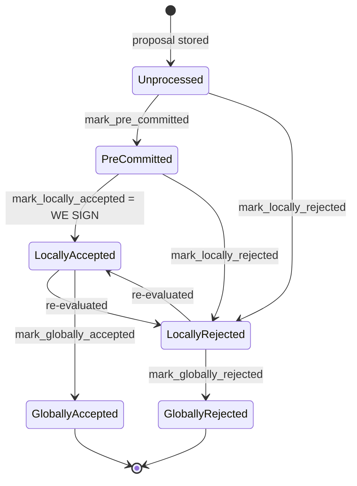
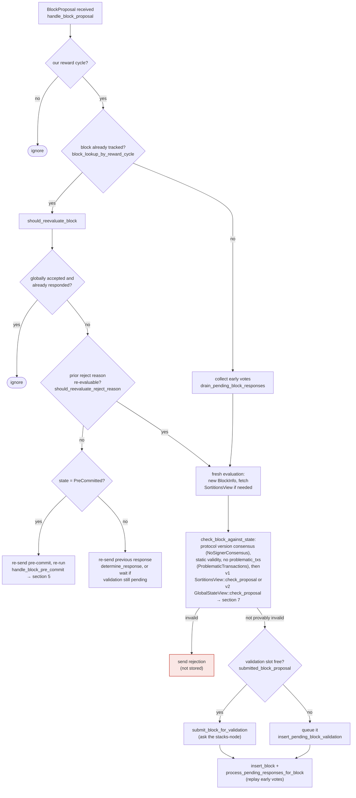

### Title
Signer vote-flip (Reject → Accept) double-counts weight across `total_weight_rejected` and `total_weight_approved` in `StackerDBListener` - (File: `stacks-node/src/nakamoto_node/stackerdb_listener.rs`)

### Summary
`StackerDBListener::run` maintains two mutually-exclusive-by-design weight tallies per block, `total_weight_approved` and `total_weight_rejected`, gated by two *different* keys: the accept path gates on `gathered_signatures.contains_key(&slot_id)` while the reject path gates on `responded_signers.insert(slot_id)`. Because a single `HashSet<u32>` (`responded_signers`) is written unconditionally by the accept branch but is the *only* guard checked by the reject branch, a signer that rejects a block and later legitimately re-evaluates it to an acceptance (a transition the signer state machine explicitly allows) has its weight credited to `total_weight_rejected` once and then, independently, to `total_weight_approved` again, because the accept branch never consults `responded_signers` before crediting weight.

### Finding Description
In the reject branch, weight is only added once per signer, gated on `responded_signers`: [1](#0-0) 

In the accept branch, weight is added while gated on a *different* map, `gathered_signatures`, and `responded_signers` is inserted into unconditionally as a side effect, but never checked before crediting weight: [2](#0-1) 

This is exactly the "logical key vs. alias key" class of bug from the report: the intended invariant is "a signer's weight counts toward at most one of the two tallies for a given block," enforced correctly in one direction (accept-then-reject is safe, since the reject branch's `responded_signers.insert` returns `false` if the slot already responded) but not the other (reject-then-accept), because the accept branch's guard (`gathered_signatures`) is blind to prior rejections recorded only in `responded_signers`.

A signer legitimately flipping from rejection to acceptance is an expected, protocol-sanctioned transition, not a fault: the signer-side state machine explicitly allows `LocallyRejected → LocallyAccepted` on re-evaluation, e.g. via `should_reevaluate_block`/`should_reevaluate_reject_reason` when a miner re-proposes the same block after the original reject reason becomes stale: [3](#0-2) [4](#0-3) 

The `SigningCoordinator` polling loop in `stacks-node/src/nakamoto_node/signer_coordinator.rs` consumes exactly these two counters to decide the block's fate, checking the rejection condition first: [5](#0-4) 

Because a single signer's weight can now land in both `total_weight_approved` and `total_weight_rejected` for the same block, the invariant `total_weight_approved + total_weight_rejected <= total_weight` (which the threshold arithmetic implicitly relies on to make the two branches mutually exclusive) can be violated. This lets a block that has genuinely reached the ≥70% approval weight_threshold also simultaneously satisfy `total_weight_rejected.saturating_add(weight_threshold) > total_weight` purely because of the double-counted weight — and since the rejection check is evaluated first in the loop, a legitimately-signed block can be discarded as `SignersRejected` by the miner even though a real signer supermajority approved it.

### Impact Explanation
This breaks the aggregated-weight-vs-verified-accepts equality the coordinator relies on to make an accept/reject decision. A single signer (no majority required) simply changing its mind in a protocol-sanctioned way — which happens routinely during re-proposals — can cause the node's weight tallies to become internally inconsistent, causing a validly-signed block (real ≥70% signatures) to be wrongly discarded as rejected. This is a liveness wedge on the miner side of the aggregation logic: valid signer approvals stop being honored correctly, stalling block production/acceptance until a fresh proposal round resets the tally state for a new block hash.

### Likelihood Explanation
High likelihood of occurrence in normal operation: re-proposals of the same block (timeouts, competing tenure-start proposals, reorg-permit re-evaluation) are a designed part of the flow (`should_reevaluate_block`), and any signer transitioning `LocallyRejected → LocallyAccepted` for the same `signer_signature_hash` on a *second* message triggers the bug deterministically — no majority, no key compromise, and no malicious signer behavior is required, only ordinary vote reconsideration by one signer plus the miner/coordinator observing both messages for the same block hash.

### Recommendation
Use a single authoritative "already counted" guard shared by both branches (e.g., check-and-insert into `responded_signers` before crediting weight in *both* the accept and reject branches, and remove/adjust the previous tally if a signer's stored response type changes for a given slot), so a signer's weight is credited to exactly one of `total_weight_approved` / `total_weight_rejected` at a time, matching the semantics the threshold check in `signer_coordinator.rs` assumes.

### Proof of Concept
1. Node's `StackerDBListener` is tracking `BlockStatus` for hash `H` with `weight_threshold` set for supermajority.
2. Signer `S` (weight `w`) sends `BlockResponse::Rejected` for `H`. Accept-branch code path is not touched; reject branch runs: `block.responded_signers.insert(slot_id)` → `true`, `total_weight_rejected += w`. [1](#0-0) 
3. Miner re-proposes (or `S`'s own signer instance re-evaluates per `should_reevaluate_reject_reason`/`should_reevaluate_block`) and `S` now sends `BlockResponse::Accepted` for the same `H` (a normal, allowed `LocallyRejected → LocallyAccepted` transition).
4. Accept branch runs: `!block.gathered_signatures.contains_key(&slot_id)` is `true` (S never accepted before) → `total_weight_approved += w` again; `responded_signers.insert(slot_id)` is a no-op (already present) but is never checked as a gate here. [2](#0-1) 
5. Now `total_weight_approved + total_weight_rejected` exceeds `total_weight` by `w`. With enough legitimate honest approvals to otherwise cross `weight_threshold`, `total_weight_rejected.saturating_add(weight_threshold) > total_weight` can also become true purely from this double count, and `signer_coordinator.rs`'s poll loop returns `Err(NakamotoNodeError::SignersRejected{..})` before ever checking `total_weight_approved >= weight_threshold`, discarding a block that a real signer supermajority signed. [5](#0-4)

### Citations

**File:** stacks-node/src/nakamoto_node/stackerdb_listener.rs (L443-465)
```rust
                        if !block.gathered_signatures.contains_key(&slot_id) {
                            block.total_weight_approved = block
                                .total_weight_approved
                                .saturating_add(signer_entry.weight);

                            info!("StackerDBListener: Signature Added to block";
                                "signer_signature_hash" => %block_sighash,
                                "signer_pubkey" => signer_pubkey.to_hex(),
                                "signer_slot_id" => slot_id,
                                "signature" => %signature,
                                "signer_weight" => signer_entry.weight,
                                "total_weight_approved" => block.total_weight_approved,
                                "percent_approved" => block.total_weight_approved as f64 / self.total_weight as f64 * 100.0,
                                "total_weight_rejected" => block.total_weight_rejected,
                                "percent_rejected" => block.total_weight_rejected as f64 / self.total_weight as f64 * 100.0,
                                "weight_threshold" => self.weight_threshold,
                                "tenure_extend_timestamp" => tenure_extend_timestamp,
                                "read_count_extend_timestamp" => read_count_extend_timestamp,
                                "server_version" => metadata.server_version,
                            );
                        }
                        block.gathered_signatures.insert(slot_id, signature);
                        block.responded_signers.insert(slot_id);
```

**File:** stacks-node/src/nakamoto_node/stackerdb_listener.rs (L515-518)
```rust
                        if block.responded_signers.insert(slot_id) {
                            block.total_weight_rejected = block
                                .total_weight_rejected
                                .saturating_add(signer_entry.weight);
```

**File:** docs/signer-flows.md (L130-150)
```markdown
## 2. Block lifecycle (`BlockState`)

Every proposal tracked in the signer DB carries a `BlockState`. **`PreCommitted`
carries no signature**: it means "validated, willing to sign if the pre-commit
threshold is met." The first signature appears at `mark_locally_accepted`.
Global states are terminal against each other.


```

**File:** docs/signer-flows.md (L164-203)
```markdown
## 3. A block proposal arrives

The miner broadcasts a proposal. If we've seen this exact block before,
`should_reevaluate_block` decides whether the old verdict stands; a block we
only pre-committed to is deliberately routed back through the pre-commit
evaluation so a re-proposal cannot shortcut to a signature. A fresh proposal is
checked against our view of the world _before_ spending a node validation on it.



Early votes: acceptances, rejections, and pre-commits that arrived before the
proposal itself are parked in pending tables and replayed once the proposal is
known.

> Anchors: `handle_block_proposal`, `should_reevaluate_block`,
> `should_reevaluate_reject_reason`, `check_block_against_state`,
> `submit_block_for_validation`, `process_pending_responses_for_block`
> (signer.rs); `check_proposal` (chainstate/v1.rs, v2.rs)
```

**File:** stacks-node/src/nakamoto_node/signer_coordinator.rs (L509-545)
```rust
            if block_status
                .total_weight_rejected
                .saturating_add(self.weight_threshold)
                > self.total_weight
            {
                info!(
                    "{}/{} signer weight votes to reject block",
                    block_status.total_weight_rejected, self.total_weight;
                    "signer_signature_hash" => %block_signer_sighash,
                );
                counters.bump_naka_rejected_blocks();

                // Only act on failed txids that a blocking minority (>30% weight) agrees on
                let blocking_minority = self.total_weight.saturating_sub(self.weight_threshold);
                let mut temporarily_excluded_txids = HashSet::new();
                let mut permanently_excluded_txids = HashSet::new();
                for (txid, info) in &block_status.failed_txids {
                    if info.total_weight > blocking_minority {
                        // Do not perma ban txids that only a small minority of signers reported as problematic
                        // But make sure its removed from the next block proposal
                        if info.problematic_weight > blocking_minority {
                            permanently_excluded_txids.insert(txid.clone());
                        } else {
                            temporarily_excluded_txids.insert(txid.clone());
                        }
                    }
                }

                return Err(NakamotoNodeError::SignersRejected {
                    temporarily_excluded_txids,
                    permanently_excluded_txids,
                });
            } else if block_status.total_weight_approved >= self.weight_threshold {
                info!("Received enough signatures, block accepted";
                    "signer_signature_hash" => %block_signer_sighash,
                );
                return Ok(block_status.gathered_signatures.values().cloned().collect());
```
