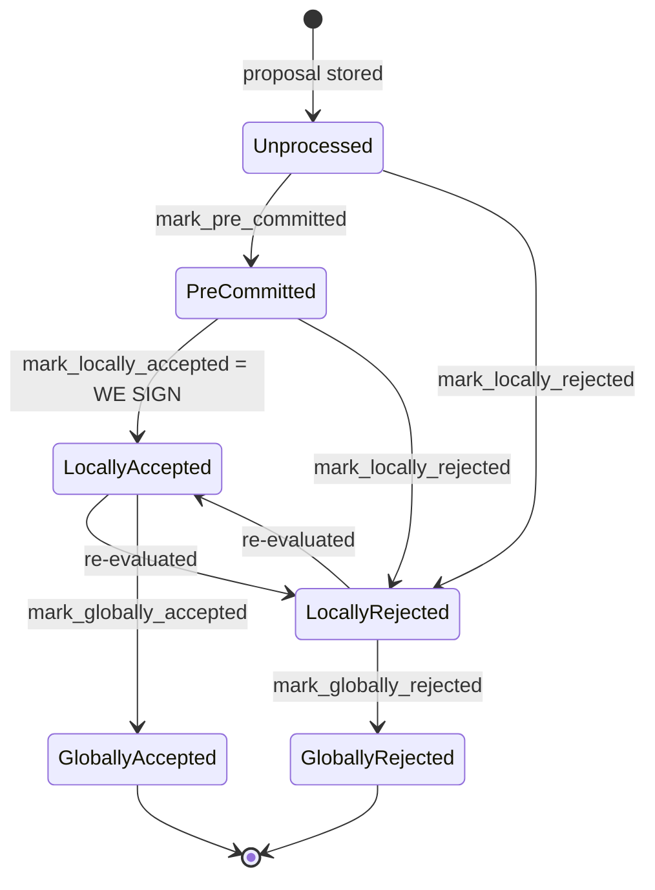

Found a concrete analog. `should_reevaluate_reject_reason` in `stacks-signer/src/v0/signer.rs` treats `DuplicateBlockFound` as terminal (non-re-evaluable, `false` branch), but `DuplicateBlockFound` is exactly the rejection reason that guards against a second tenure-start block reorging an already-signed block in the same tenure, and that guard runs **only once, at proposal time** (`validate_tenure_change_payload` in `chainstate/v2.rs`, and the analogous v1 check), never again at pre-commit/signing time.

### Title
Rejection reason `DuplicateBlockFound` is not sticky against a later same-hash re-proposal path that bypasses the tenure-uniqueness check - (`File: stacks-signer/src/v0/signer.rs`)

### Summary
`DuplicateBlockFound` correctly prevents a *first* evaluation of a tenure-change block from succeeding when the signer has already signed a block in that tenure [1](#0-0) . But the general block-lifecycle code treats `DuplicateBlockFound` as a "sticky"/terminal rejection that must never be reconsidered (`should_reevaluate_reject_reason` returns `false` for it) [2](#0-1) . The intent of "sticky" is that the block will never become valid, so the signer should simply resend the same rejection instead of re-running validation. However, the runtime path taken for a "sticky" rejection when the block is a `PreCommitted` state is different from what's shown in the docs: only blocks in `PreCommitted` are pushed through the pre-commit re-evaluation and conflict guard again [3](#0-2) ; a block that is `LocallyRejected` because of `DuplicateBlockFound` will always resend its cached rejection via `determine_response` and skip any chain-state re-check [4](#0-3) .

### Finding Description
The `DuplicateBlockFound` check only fires inside `validate_tenure_change_payload`, gated behind `block.get_tenure_change_tx_payload().is_some()` [5](#0-4) , and it compares against `signer_db.get_last_signed_block(&block.header.consensus_hash)` at the moment the *specific proposal instance* is first evaluated [6](#0-5) . Once a `BlockInfo` for a given `signer_signature_hash` has been marked `LocallyRejected` with `RejectReason::DuplicateBlockFound`, the signer never revisits chain state for it again: `should_reevaluate_reject_reason` hard-codes it into the "no need to re-validate" branch [2](#0-1) , and `should_reevaluate_block` for a non-`PreCommitted`, non-re-evaluable state simply calls `determine_response` to resend the cached decision [4](#0-3) .

This sticky treatment is safe *only* if the exact `signer_signature_hash` this rejection is keyed on can never become signable through a different code path. But `handle_block_pre_commit`'s own-tenure conflict guard is explicitly documented as the fallback for exactly this gap: "the `DuplicateBlockFound` check ... lives in `check_proposal` and runs only at proposal arrival, never again. A block that crosses the pre-commit threshold minutes later has no other guard, which is what the own-tenure branch [in `handle_block_pre_commit`] covers." [7](#0-6)  That own-tenure branch only fires for blocks that reach the *pre-commit* threshold - i.e., blocks that were never rejected for `DuplicateBlockFound` in the first place. A block already marked `LocallyRejected` with `DuplicateBlockFound` never re-enters `handle_block_pre_commit` because `should_reevaluate_block` short-circuits to `determine_response` before any pre-commit or validation step is attempted again [8](#0-7) .

The asymmetry is: a duplicate/conflicting tenure-start block that first slips past proposal-time detection (e.g., arrives before the signer has locally recorded the earlier block as signed - a race the docs themselves flag as a known gap covered "only" by the pre-commit-time own-tenure guard) is protected by the fallback guard at pre-commit time. But once a block *has* been rejected with `DuplicateBlockFound`, no code path ever asks the chain-state question again for that block, even though `BlockInfo::check_state` in general permits `LocallyRejected -> LocallyAccepted` transitions [9](#0-8) , and the state machine documentation shows `LocallyRejected --> LocallyAccepted : re-evaluated` as a normal transition [10](#0-9) . The signer-level policy encoded in `should_reevaluate_reject_reason` unilaterally forecloses that transition for `DuplicateBlockFound`, meaning that if the tenure state that made the block a duplicate later becomes stale/invalid (e.g., the earlier "duplicate-triggering" block is later found to be non-canonical, or the signer's own recorded `get_last_signed_block` was itself based on a transient/incorrect view at the moment of the original rejection), the signer has no mechanism to ever reconsider signing this specific proposal, even via a fresh proposal for the identical bytes triggering re-evaluation through `handle_block_proposal`'s `should_reevaluate_block` gate.

### Impact Explanation
This does not immediately let a single miner force a signer to sign a bad block, but it does create a permanent, non-recoverable liveness wedge for a specific block hash class: any tenure-start block that is (perhaps only momentarily, due to a race between StackerDB delivery order and DB state) evaluated while `get_last_signed_block` for that tenure returns `Some` gets `DuplicateBlockFound` and is permanently barred from reconsideration, even though the general state machine and the rest of the codebase (`handle_block_pre_commit`'s own-tenure conflict guard) is explicitly built around the premise that duplicate/conflict determinations must be re-derived per-evaluation rather than "recorded once," because "the node's view mid-reorg is a moving target" [11](#0-10) . `DuplicateBlockFound` is the one rejection reason that violates this design principle by being both (a) derived from mutable local DB state at a single point in time and (b) marked permanently non-re-evaluable. This matches the "High" bucket: a signer wedged into never (re)considering a specific valid block again.

### Likelihood Explanation
Reachable by a single miner (no majority/collusion needed): re-propose the same tenure-start block bytes after any interleaving that makes `get_last_signed_block` transiently return a stale/incorrect result relative to the eventual canonical state (e.g., signer restart interacting with reward-cycle boundary, or reordering of `NewBlock`/proposal delivery relative to `insert_block`/`mark_locally_accepted` writes). Because the rejection is cached as terminal, no amount of legitimate re-proposal, timeout, or state settling recovers signability for that exact block hash.

### Recommendation
Remove `DuplicateBlockFound` from the non-re-evaluable branch of `should_reevaluate_reject_reason` (treat it the same as `ConsensusHashMismatch`/`NoSignerConsensus`, which are correctly re-evaluated), or explicitly route `PreCommitted`/`LocallyRejected(DuplicateBlockFound)` blocks back through the same chain-state re-derivation used in `handle_block_pre_commit`'s own-tenure conflict guard before resending a cached rejection.

### Proof of Concept
Conceptual reproduction (requires local/timing control over a single signer, not majority collusion):
1. Have the signer process a tenure-change block proposal at a moment where `SignerDb::get_last_signed_block` for that tenure transiently returns a stale `Some(...)` (e.g., simulate via test hooks that delay `insert_block`/`mark_locally_accepted` relative to the tenure-change proposal's arrival, as the existing `signer_reevaluates_proposal_with_missing_burn_view`-style tests in `stacks-node/src/tests/signer/v0/missing_burn_block_proposal.rs` already demonstrate for other sticky/non-sticky reasons) [12](#0-11) .
2. Confirm the block is rejected with `RejectReason::DuplicateBlockFound` and stored as `LocallyRejected`.
3. Re-propose the identical block bytes (same `signer_signature_hash`) after the transient condition clears.
4. Observe via `should_reevaluate_block` -> `should_reevaluate_reject_reason` that the cached rejection is resent unconditionally via `determine_response`, with no chain-state re-check, regardless of whether the block is now legitimately signable [8](#0-7) .

### Citations

**File:** stacks-signer/src/chainstate/v2.rs (L340-357)
```rust
        // We already confirmed in check miner activity that the current tenure is valid. So check we are not
        // reorging the tenure blocks. Only blocks we have signed (locally or globally accepted) count
        // here: a block we have merely pre-committed to carries no signature from us, so it is safe to
        // accept a competing tenure-start block in its place if it failed to reach consensus.
        let last_in_current_tenure = signer_db
            .get_last_signed_block(&block.header.consensus_hash)
            .map_err(|e| {
                SignerChainstateError::from(ClientError::InvalidResponse(e.to_string()))
            })?;
        if let Some(last_in_current_tenure) = last_in_current_tenure {
            warn!(
                "Miner block proposal contains a tenure change, but we've already signed a block in this tenure. Considering proposal invalid.";
                "proposed_block_consensus_hash" => %block.header.consensus_hash,
                "proposed_block_signer_signature_hash" => %block.header.signer_signature_hash(),
                "last_in_tenure_signer_signature_hash" => %last_in_current_tenure.block.header.signer_signature_hash(),
            );
            return Err(RejectReason::DuplicateBlockFound);
        }
```

**File:** stacks-signer/src/v0/signer.rs (L1505-1533)
```rust
        if !should_reevaluate_reject_reason(block_info) {
            if block_info.state == BlockState::PreCommitted {
                // We validated this block but haven't signed it. Signing requires the
                // pre-commit threshold and the conflict checks in `handle_block_pre_commit`.
                // Re-broadcast our pre-commit and re-run that evaluation instead of
                // responding with a signature directly, so a re-proposed block can't
                // bypass those checks.
                info!(
                    "{self}: received a block proposal for a block we have pre-committed to but not signed. Re-evaluating the pre-commit.";
                    "signer_signature_hash" => %signer_signature_hash,
                    "block_id" => %block_info.block.block_id(),
                    "block_height" => block_info.block.header.chain_length,
                    "burn_height" => block_proposal.burn_height,
                    "consensus_hash" => %block_info.block.header.consensus_hash
                );
                self.send_block_pre_commit(signer_signature_hash.clone());
                let address = self.stacks_address.clone();
                self.handle_block_pre_commit(
                    stacks_client,
                    sortition_state,
                    &address,
                    &signer_signature_hash,
                );
                return false;
            }
            if let Some(block_response) = self.determine_response(block_info) {
                self.send_block_response(&block_info.block, block_response);
                return false;
            } else {
```

**File:** stacks-signer/src/v0/signer.rs (L2719-2735)
```rust
            RejectReason::ValidationFailed(_)
            | RejectReason::RejectedInPriorRound
            | RejectReason::SortitionViewMismatch
            | RejectReason::ReorgNotAllowed
            | RejectReason::InvalidBitvec
            | RejectReason::PubkeyHashMismatch
            | RejectReason::InvalidMiner
            | RejectReason::NotLatestSortitionWinner
            | RejectReason::InvalidParentBlock
            | RejectReason::DuplicateBlockFound
            | RejectReason::IrrecoverablePubkeyHash
            | RejectReason::ProblematicTransactions
            | RejectReason::ProposalTooOld => {
                // No need to re-validate these types of rejections.
                false
            }
        }
```

**File:** docs/signer-flows.md (L130-150)
```markdown
## 2. Block lifecycle (`BlockState`)

Every proposal tracked in the signer DB carries a `BlockState`. **`PreCommitted`
carries no signature**: it means "validated, willing to sign if the pre-commit
threshold is met." The first signature appears at `mark_locally_accepted`.
Global states are terminal against each other.


```

**File:** docs/signer-flows.md (L283-286)
```markdown
- the `DuplicateBlockFound` check that would catch a second block in the same
  tenure lives in `check_proposal` and runs only at proposal arrival, never
  again. A block that crosses the pre-commit threshold minutes later has no
  other guard, which is what the own-tenure branch above covers.
```

**File:** docs/signer-flows.md (L288-297)
```markdown
Freshness alone is not enough to hold a signature back, because a signature can
outlive the block it covers: a Bitcoin reorg can kill the block, and a dead
signature must not stall the chain restarting beneath it until it goes stale. So
`conflict_still_blocks` derives, per evaluation, whether the conflict could still
end up in the chain. Deriving this here — instead of recording it when a fork is
observed — is deliberate: the node's view mid-reorg is a moving target (burn
block events fire before the sortition transaction commits, and a node error can
wipe the local state machine), so a fact recorded once at observation time can be
silently wrong, while a question asked per evaluation self-corrects on the next
pre-commit or re-proposal. Two questions, in order:
```

**File:** stacks-signer/src/signerdb.rs (L313-329)
```rust
    /// Check if the block state transition is valid
    fn check_state(&self, state: BlockState) -> bool {
        let prev_state = &self.state;
        if *prev_state == state {
            return true;
        }
        match state {
            BlockState::Unprocessed => false,
            BlockState::LocallyAccepted | BlockState::LocallyRejected => !matches!(
                prev_state,
                BlockState::GloballyRejected | BlockState::GloballyAccepted
            ),
            BlockState::GloballyAccepted => !matches!(prev_state, BlockState::GloballyRejected),
            BlockState::GloballyRejected => !matches!(prev_state, BlockState::GloballyAccepted),
            BlockState::PreCommitted => matches!(prev_state, BlockState::Unprocessed),
        }
    }
```

**File:** stacks-node/src/tests/signer/v0/missing_burn_block_proposal.rs (L64-68)
```rust
///   `ValidationFailed(NotFoundError)`.
/// - Upon reproposal, the block is fully revalidated and rejected again
///   with the same error.
/// - The rejection is treated as re-evaluable rather than terminal.
fn signer_reevaluates_proposal_with_missing_burn_view() {
```
