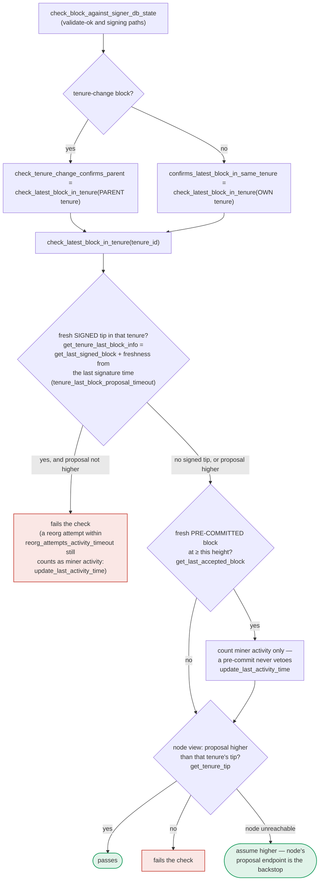

### Title
Signer skips miner-identity/consensus-hash re-validation at validate-ok and pre-commit-threshold time, allowing a signature on a block from a now-superseded miner — (File: `stacks-signer/src/v0/signer.rs`, `stacks-signer/src/chainstate/v2.rs`)

### Summary
The Gitea advisory's root cause is that a security check (`checkTokenPublicOnly`) is enforced on one route (`GET /api/v1/orgs/{org}`) but is silently skipped on other routes (`GET /api/v1/user/orgs`, `GET /api/v1/users/{username}/orgs/{org}/permissions`) that reach the same underlying data through a different code path, because those alternate paths don't populate/re-run the same context the check depends on. The stacks-signer v0 code has the structurally identical pattern: the full set of "is this block still legitimately from the active miner" checks lives in `GlobalStateView::check_proposal` (`stacks-signer/src/chainstate/v2.rs:113-301`), and is only invoked once, at proposal arrival, from `check_block_against_global_state` (`stacks-signer/src/v0/signer.rs:941-999`). The two later code paths that can still produce a *signature* — `handle_block_validate_ok` and the pre-commit-threshold re-check in `handle_block_pre_commit` — instead call the narrower `check_block_against_signer_db_state`, which (per `docs/signer-flows.md:391-448`) only re-runs `check_latest_block_in_tenure`/tip-confirmation logic, not the miner-pubkey-hash, consensus-hash, pox-bitvec, or tenure-extend checks that `check_proposal` performs.

### Finding Description
`check_proposal` (`stacks-signer/src/chainstate/v2.rs:113-208`) verifies, against the signer's *current* `MinerState::ActiveMiner` view, that:
- the block's `consensus_hash` matches the currently active tenure (`tenure_id`),
- the block's recovered miner pubkey hash matches `current_miner_pkh`,
- the pox-treatment bitvec is all-1s,
- tenure-extend causes/timing are legitimate.

This function is only reached from `handle_block_proposal` at the moment the proposal first arrives (`docs/signer-flows.md:186,203`, `stacks-signer/src/v0/signer.rs:944-975`, calling into `check_block_against_global_state`). Documented explicitly in `docs/signer-flows.md:425-433`:

> "Two things belong to the proposal path only and are **not** re-run at validate-ok or at signing: ... the v2 `check_proposal` wrapper checks miner pubkey hash, consensus hash, the pox bitvec, and tenure-extend rules before delegating here."

But block signing does not happen at proposal time — it happens later, either when the node's validation result comes back (`handle_block_validate_ok`, section 4 of the doc) or, more importantly, only once 70% pre-commit weight is reached (`handle_block_pre_commit`, `stacks-signer/src/v0/signer.rs:1345-1374`). Both of these later paths call only `check_block_against_signer_db_state`, whose scope is `check_latest_block_in_tenure` (tip-confirmation) plus the same-height conflict guard — it never re-invokes the miner-pubkey/consensus-hash/bitvec/tenure-extend checks that live in `check_proposal`.

The doc itself acknowledges the gap for the `DuplicateBlockFound` case is patched by a same-height/same-tenure conflict backstop in section 5 (`stacks-signer/src/v0/signer.rs:1368-` conflict/sibling logic). No equivalent backstop is documented for miner-pubkey-hash / consensus-hash / bitvec staleness: if the signer's *own state machine's* notion of the active miner changes between proposal-arrival and the (potentially much later, per doc: "minutes later") pre-commit-threshold crossing — e.g., via `capitulate_miner_view` adopting a new peer-reported miner state (`docs/signer-flows.md:470`, section 8) — the already-tracked `BlockInfo` for the old miner's block is never re-run through `check_proposal`. It only has to still satisfy `check_latest_block_in_tenure`'s tip-confirmation logic, which is a weaker property than "this is still the currently active/canonical miner."

This is the same class of bug as the Gitea advisory: the authorization/legitimacy predicate is bound to one entry-point's context (`check_proposal`, populated only during `handle_block_proposal`) instead of being enforced uniformly on every path capable of producing the sensitive action (a signature), and the alternate paths (`handle_block_validate_ok`, `handle_block_pre_commit`) reach the same terminal action without that context/check.

### Impact Explanation
If exploitable, a signer could produce a valid signature (`mark_locally_accepted` / `handle_block_signature`, `stacks-signer/src/v0/signer.rs:1268` area, section 5 of the doc) over a block whose miner is no longer the signer's own state machine's recognized active miner for that tenure — i.e., a block that is stale/non-canonical from the signer's own perspective at the moment of signing. That is a Critical-class outcome per the rubric: a signer signing a non-canonical/conflicting block, because the equality "signed == validated-as-currently-legitimate" is broken; the block was only validated as legitimate at an earlier point in time whose legitimacy conditions (current miner identity) have since changed.

### Likelihood Explanation
This requires a naturally-occurring or attacker-influenced timing window (a burnchain reorg / capitulated miner-view change between proposal arrival and pre-commit-threshold crossing) rather than a majority of malicious signers, and the pre-commit round can legitimately take "minutes" per the docs, widening the window. However, I was not able to fully trace, within the remaining tool budget, whether `handle_block_validate_ok`'s "skip if already decided" gate or some other guard elsewhere (e.g., checks tied to `local_state_machine`/`global_state_evaluator` re-evaluation on every `process_event` tick) independently re-validates miner identity before the final signature is emitted. `docs/signer-flows.md` is explicit that `check_proposal`'s checks are proposal-path-only and not re-run at validate-ok or signing, but I could not directly read the full body of `handle_block_pre_commit`/`handle_block_validate_ok` in `stacks-signer/src/v0/signer.rs` beyond the snippet at lines 1345-1374 to rule out an additional, undocumented guard.

### Recommendation
Re-run (or a smaller reused subset of) `check_proposal`'s miner-identity checks — at minimum the consensus-hash and miner-pubkey-hash comparisons against the signer's *current* `MinerState` — inside `check_block_against_signer_db_state`, so that both the validate-ok and pre-commit-threshold paths cannot sign a block whose originating miner the signer's own state machine no longer recognizes as active, closing the same "route-specific enforcement" gap described in the Gitea advisory.

### Proof of Concept
Conceptual PoC (I could not run this against a live cluster within this investigation):
1. Miner M1 wins sortition for tenure T and proposes tenure-change block B (`consensus_hash = T`, signed by M1's key). `check_proposal` passes at proposal time (`stacks-signer/src/chainstate/v2.rs:119-163`).
2. The signer submits B for node validation; before that validation result returns, or before 70% pre-commit weight accumulates (a window that can legitimately be minutes long per `docs/signer-flows.md`, section 5), a burnchain event causes the signer's local/global state machine to capitulate to a different active miner for the current tenure view (`capitulate_miner_view`, `docs/signer-flows.md:470`).
3. `handle_block_validate_ok` then re-checks B only via `check_block_against_signer_db_state` (tip-confirmation only), not `check_proposal`; if `check_latest_block_in_tenure` still passes, B is `mark_pre_committed`.
4. Once 70% pre-commit weight accumulates, `handle_block_pre_commit` (`stacks-signer/src/v0/signer.rs:1345-1374`) again re-checks only via `check_block_against_signer_db_state`, not `check_proposal`, and — absent a same-height conflict from a *different* block — proceeds to sign B, even though B's miner (M1) is no longer the signer's recognized active miner. [1](#0-0) [2](#0-1) [3](#0-2) [4](#0-3)

### Citations

**File:** stacks-signer/src/chainstate/v2.rs (L113-163)
```rust
    pub fn check_proposal(
        &self,
        client: &StacksClient,
        signer_db: &mut SignerDb,
        block: &NakamotoBlock,
    ) -> Result<(), RejectReason> {
        let MinerState::ActiveMiner {
            current_miner_pkh,
            tenure_id,
            parent_tenure_id,
            ..
        } = &self.signer_state.current_miner
        else {
            info!(
                "No valid current miner. Considering invalid.";
                "block_height" => block.header.chain_length,
                "signer_signature_hash" => %block.header.signer_signature_hash()
            );
            return Err(RejectReason::InvalidMiner);
        };
        if &block.header.consensus_hash != tenure_id {
            info!("Miner block proposal consensus hash does not match the current miner's tenure id. Considering invalid.";
                "block_height" => block.header.chain_length,
                "signer_signature_hash" => %block.header.signer_signature_hash(),
                "block_consensus_hash" => %block.header.consensus_hash,
                "active_miner_tenure_id" => %tenure_id,
                "active_miner_parent_tenure_id" => %parent_tenure_id,
            );
            return Err(RejectReason::ConsensusHashMismatch {
                actual: block.header.consensus_hash.clone(),
                expected: tenure_id.clone(),
            });
        }
        let Some(miner_pk) = block.header.recover_miner_pk() else {
            warn!("Failed to recover miner pubkey";
                  "signer_signature_hash" => %block.header.signer_signature_hash(),
                  "consensus_hash" => %block.header.consensus_hash);
            return Err(RejectReason::IrrecoverablePubkeyHash);
        };
        let miner_pkh = Hash160::from_data(&miner_pk.to_bytes_compressed());
        if current_miner_pkh != &miner_pkh {
            warn!(
                "Miner block proposal pubkey does not match the winning pubkey hash for its sortition. Considering invalid.";
                "proposed_block_consensus_hash" => %block.header.consensus_hash,
                "signer_signature_hash" => %block.header.signer_signature_hash(),
                "proposed_block_pubkey" => &miner_pk.to_hex(),
                "proposed_block_pubkey_hash" => %miner_pkh,
                "active_miner_pubkey_hash" => %current_miner_pkh,
            );
            return Err(RejectReason::PubkeyHashMismatch);
        }
```

**File:** stacks-signer/src/v0/signer.rs (L941-975)
```rust
    /// Check if block should be rejected based on global signer state
    /// Will return a BlockRejection if the block is invalid, none otherwise.
    /// This is the Post-global signer state activation path
    fn check_block_against_global_state(
        &mut self,
        stacks_client: &StacksClient,
        block: &NakamotoBlock,
    ) -> Option<BlockRejection> {
        let signer_signature_hash = block.header.signer_signature_hash();
        let block_id = block.block_id();
        let Some(global_state) = self.global_state_evaluator.determine_global_state() else {
            warn!(
                "{self}: Cannot validate block, no global signer state";
                "signer_signature_hash" => %signer_signature_hash,
                "block_id" => %block_id,
                "local_signer_state" => ?self.local_state_machine
            );
            return Some(self.create_block_rejection(RejectReason::NoSignerConsensus, block));
        };

        let global_state_view = GlobalStateView {
            signer_state: global_state,
            config: self.proposal_config.clone(),
        };

        info!(
            "{self}: Evaluating proposal against global state";
            "signer_state" => ?global_state_view.signer_state,
            "signer_signature_hash" => %signer_signature_hash,
            "block_id" => %block_id,
            "local_signer_state" => ?self.local_state_machine,
        );

        // Check if proposal can be rejected now if not valid against the global state
        match global_state_view.check_proposal(stacks_client, &mut self.signer_db, block) {
```

**File:** stacks-signer/src/v0/signer.rs (L1345-1374)
```rust
        if let Some(block_rejection) =
            self.check_block_against_signer_db_state(stacks_client, &block_info.block)
        {
            warn!(
                "{self}: Reached the pre-commit threshold for a block, but it no longer passes the chainstate checks. Rejecting.";
                "signer_signature_hash" => %block_hash,
                "block_height" => block_info.block.header.chain_length,
                "reject_code" => %block_rejection.reason_code,
                "reject_reason" => &block_rejection.reason,
            );
            if let Err(e) = block_info.mark_locally_rejected() {
                if !block_info.has_reached_consensus() {
                    warn!("{self}: Failed to mark block as locally rejected: {e:?}");
                }
            };
            self.signer_db
                .insert_block(&block_info)
                .unwrap_or_else(|e| self.handle_insert_block_error(e));
            self.handle_block_rejection(&block_rejection, sortition_state);
            self.send_block_response(&block_info.block, block_rejection.into());
            return;
        }

        // A pre-commit may be superseded by a competing proposal at the same height (e.g. a
        // re-proposed tenure-start block after the first failed to reach consensus), but a
        // signature must not be superseded while it's still "fresh". A signed block at the
        // same or higher height in ANY tenure is a conflict: two blocks at the same height are
        // siblings no matter which tenure they belong to (e.g. the next tenure's tenure-start
        // block conflicts with the current tenure's block at the same height). Blocks in
        // tenures whose reorg we sanctioned under the reorg-timing rules are excluded, but
```

**File:** docs/signer-flows.md (L391-437)
```markdown
`check_latest_block_in_tenure` answers "does this block confirm the tip we
expect?" and it runs in three places: at proposal arrival (inside
`check_proposal`), at validate-ok, and at the moment of signing. _Which_ tenure
it is asked about depends on the block: a tenure-change block is checked against
its **parent** tenure, every other block against its **own**. Never both. The
pivotal helper is `get_tenure_last_block_info`, which considers only blocks that
carry a signature (`get_last_signed_block`): a pre-commit never vetoes anything,
it only counts as miner activity.



A failed check becomes a different rejection depending on who asked.
`check_block_against_signer_db_state` returns `SortitionViewMismatch`, or
`ConnectivityIssues` when the lookup itself errored rather than answering; the v2
`check_proposal` path returns `InvalidParentBlock`.

Two things belong to the proposal path only and are **not** re-run at validate-ok
or at signing:

- `validate_tenure_change_payload` rejects with `DuplicateBlockFound` when we
  have already accepted a block in the tenure a tenure-change block is starting.
  v2 counts locally or globally accepted blocks (`get_last_signed_block`); v1
  counts only globally accepted ones (`get_last_globally_accepted_block`).
- the v2 `check_proposal` wrapper checks miner pubkey hash, consensus hash, the
  pox bitvec, and tenure-extend rules before delegating here.

Because the duplicate check never runs again, a block that crosses the pre-commit
threshold long after it was proposed relies on section 5's own-tenure conflict
guard to cover the same ground.
```
