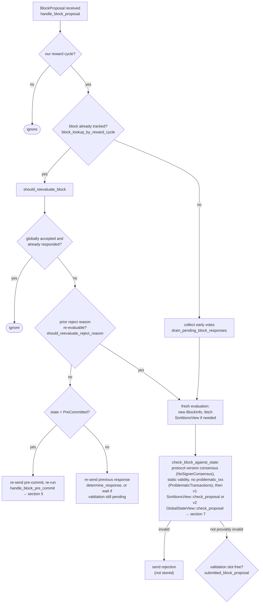

### Title
Node-side signer weight double-counted when a signer's vote flips from Rejected to Accepted for the same block, breaking the aggregated-weight vs. verified-accepts equality - ([File: stacks-node/src/nakamoto_node/stackerdb_listener.rs])

### Summary
The external report's core defect is that a contract mutates dependent, incrementally-tallied state (rewards) via a side path (`getReward()` inside `withdraw()`) without going through the normal "diff against a recorded baseline" bookkeeping, so the same underlying event gets counted inconsistently. The same class of bug — a per-participant contribution being folded into an aggregate tally through two different bookkeeping sets that are not kept mutually exclusive — exists in the mining node's StackerDB listener that tallies signer block votes to decide when a block has reached the signing/rejection threshold.

### Finding Description
`StackerDBListener` maintains, per proposed block, a `BlockStatus` with two independent tracking collections plus two weight counters: [1](#0-0) 

When an `Accepted` message arrives, the code dedups solely against `gathered_signatures` (keyed by slot id) before adding the signer's weight to `total_weight_approved`: [2](#0-1) 

When a `Rejected` message arrives, the code dedups against the separate `responded_signers` set before adding the signer's weight to `total_weight_rejected`: [3](#0-2) 

Note that the `Accepted` branch also unconditionally inserts into `responded_signers` (line 465), but the `Rejected` branch never touches `gathered_signatures`. Consequently:

- If a signer rejects first, then later accepts the *same* block (`signer_signature_hash` unchanged), `responded_signers` already contains its slot id, but `gathered_signatures` does not. The `Accepted` handler's guard `!block.gathered_signatures.contains_key(&slot_id)` is true, so the signer's weight is added to `total_weight_approved` *in addition to* the weight already recorded in `total_weight_rejected`. The same signer's weight is now counted in both buckets simultaneously.
- The reverse order (accept-then-reject) is correctly protected, because `responded_signers` is already populated by the `Accepted` branch, so the `Rejected` branch's `insert` returns `false` and skips the increment.

This is not a contrived scenario: the signer-side logic explicitly supports re-evaluating and reversing a prior rejection for the *same* block hash when the reject reason is judged re-evaluable (`should_reevaluate_reject_reason`), routing the block back through fresh evaluation and potentially producing a fresh `Accepted` response for a block it previously rejected: [4](#0-3) 

A single ordinary signer (no majority, no key compromise) can therefore legitimately cause its own weight to be present in both `total_weight_approved` and `total_weight_rejected` for one block at the mining node. This breaks the equality the coordinator relies on: "aggregated approved/rejected weight == weight of currently-held, mutually-exclusive votes." `signer_coordinator.rs` consumes these two counters directly to decide rejection (checked first) or acceptance: [5](#0-4) 

Because a rejecting signer's weight is never retracted from `total_weight_rejected` when it later accepts, and its weight is simultaneously added to `total_weight_approved`, the sum of the two counters can exceed `self.total_weight`. This means the acceptance threshold can be crossed using weight that is also, at the same time, counted toward blocking the block — i.e. the tally no longer reflects real, distinct signer consent, and the node's accept/reject decision is derived from an inflated, self-contradictory aggregate rather than the actual current, verified set of accepting signers.

### Impact Explanation
This is a state-tally miscount at the node/coordinator layer that directly corresponds to the "aggregated-weight vs verified-accepts" equality the scope singles out. A block can be pushed to the network as signed (crossing `weight_threshold`) using weight that partially double-counts a single signer who is simultaneously recorded as having rejected the block, meaning the actual distinct approving weight may be lower than what governance/security assumptions require. This can let a block that does not truly have 70% distinct signer support get treated as approved, undermining the safety guarantee that block approval requires a genuine supermajority of *current* signer weight.

### Likelihood Explanation
Reachable by a single ordinary signer switching its vote for the same block after a legitimate reject-then-reconsider cycle (explicitly supported by `should_reevaluate_reject_reason`/fresh-evaluation logic), requiring no majority, no key compromise, and no protocol violation — only normal signer behavior plus the timing of two StackerDB messages for the same `signer_signature_hash`. This makes it fairly likely to occur during ordinary reproposal/timeout cycles that the codebase already anticipates and tests (e.g. `signers_reprocess_late_block_proposals_signatures`, `signers_reprocess_bitcoin_block_not_found_proposals`).

### Recommendation
Use a single per-signer vote-state map (e.g. `HashMap<u32, VoteKind>` storing the signer's current vote) instead of two independently-updated sets. On any new vote for a block, if the signer previously voted the opposite way, subtract its weight from the old counter before adding it to the new one, ensuring `total_weight_approved` and `total_weight_rejected` always reflect mutually exclusive, up-to-date per-signer votes (analogous to properly updating a baseline/snapshot before applying a delta, as recommended in the reward-accounting fix in the external report).

### Proof of Concept
1. Node proposes block `B` with `signer_signature_hash = H` to a signer set with `weight_threshold = 70`, `total_weight = 100`.
2. Signer `S` (weight 15) initially rejects `B` (e.g. transient chainstate check failure): `total_weight_rejected = 15`, `responded_signers = {S}`.
3. Other signers accumulate `total_weight_approved = 55` (not yet enough alone to reach 70).
4. `S` re-evaluates `B` (same `H`) per `should_reevaluate_reject_reason` and now sends `Accepted` for `H`.
5. In `stackerdb_listener.rs`, the `Accepted` handler checks `!gathered_signatures.contains_key(S)` — true (never inserted during the reject) — so it adds `S`'s weight: `total_weight_approved = 55 + 15 = 70`.
6. `total_weight_rejected` remains `15` (never decremented).
7. `signer_coordinator.rs` observes `total_weight_approved (70) >= weight_threshold (70)` and accepts/pushes the block, even though `S`'s weight is simultaneously still recorded in `total_weight_rejected`, i.e., the tally is internally inconsistent and the true distinct-approving weight guarantee is not actually verified.

### Citations

**File:** stacks-node/src/nakamoto_node/stackerdb_listener.rs (L70-82)
```rust
#[derive(Debug, Clone)]
pub struct BlockStatus {
    /// Set of the slot ids of signers who have responded
    pub responded_signers: HashSet<u32>,
    /// Map of the slot id of signers who have signed the block and their signature
    pub gathered_signatures: BTreeMap<u32, MessageSignature>,
    /// Total weight of signers who have signed the block
    pub total_weight_approved: u32,
    /// Total weight of signers who have rejected the block
    pub total_weight_rejected: u32,
    /// Per-txid rejection tracking from signers
    pub failed_txids: HashMap<Txid, FailedTxInfo>,
}
```

**File:** stacks-node/src/nakamoto_node/stackerdb_listener.rs (L443-465)
```rust
                        if !block.gathered_signatures.contains_key(&slot_id) {
                            block.total_weight_approved = block
                                .total_weight_approved
                                .saturating_add(signer_entry.weight);

                            info!("StackerDBListener: Signature Added to block";
                                "signer_signature_hash" => %block_sighash,
                                "signer_pubkey" => signer_pubkey.to_hex(),
                                "signer_slot_id" => slot_id,
                                "signature" => %signature,
                                "signer_weight" => signer_entry.weight,
                                "total_weight_approved" => block.total_weight_approved,
                                "percent_approved" => block.total_weight_approved as f64 / self.total_weight as f64 * 100.0,
                                "total_weight_rejected" => block.total_weight_rejected,
                                "percent_rejected" => block.total_weight_rejected as f64 / self.total_weight as f64 * 100.0,
                                "weight_threshold" => self.weight_threshold,
                                "tenure_extend_timestamp" => tenure_extend_timestamp,
                                "read_count_extend_timestamp" => read_count_extend_timestamp,
                                "server_version" => metadata.server_version,
                            );
                        }
                        block.gathered_signatures.insert(slot_id, signature);
                        block.responded_signers.insert(slot_id);
```

**File:** stacks-node/src/nakamoto_node/stackerdb_listener.rs (L515-518)
```rust
                        if block.responded_signers.insert(slot_id) {
                            block.total_weight_rejected = block
                                .total_weight_rejected
                                .saturating_add(signer_entry.weight);
```

**File:** docs/signer-flows.md (L166-188)
```markdown
The miner broadcasts a proposal. If we've seen this exact block before,
`should_reevaluate_block` decides whether the old verdict stands; a block we
only pre-committed to is deliberately routed back through the pre-commit
evaluation so a re-proposal cannot shortcut to a signature. A fresh proposal is
checked against our view of the world _before_ spending a node validation on it.



**File:** stacks-node/src/nakamoto_node/signer_coordinator.rs (L505-545)
```rust
                counters.set_miner_current_rejections_timeout_secs(rejections_timeout.as_secs());
                counters.set_miner_current_rejections(rejections);
            }

            if block_status
                .total_weight_rejected
                .saturating_add(self.weight_threshold)
                > self.total_weight
            {
                info!(
                    "{}/{} signer weight votes to reject block",
                    block_status.total_weight_rejected, self.total_weight;
                    "signer_signature_hash" => %block_signer_sighash,
                );
                counters.bump_naka_rejected_blocks();

                // Only act on failed txids that a blocking minority (>30% weight) agrees on
                let blocking_minority = self.total_weight.saturating_sub(self.weight_threshold);
                let mut temporarily_excluded_txids = HashSet::new();
                let mut permanently_excluded_txids = HashSet::new();
                for (txid, info) in &block_status.failed_txids {
                    if info.total_weight > blocking_minority {
                        // Do not perma ban txids that only a small minority of signers reported as problematic
                        // But make sure its removed from the next block proposal
                        if info.problematic_weight > blocking_minority {
                            permanently_excluded_txids.insert(txid.clone());
                        } else {
                            temporarily_excluded_txids.insert(txid.clone());
                        }
                    }
                }

                return Err(NakamotoNodeError::SignersRejected {
                    temporarily_excluded_txids,
                    permanently_excluded_txids,
                });
            } else if block_status.total_weight_approved >= self.weight_threshold {
                info!("Received enough signatures, block accepted";
                    "signer_signature_hash" => %block_signer_sighash,
                );
                return Ok(block_status.gathered_signatures.values().cloned().collect());
```
