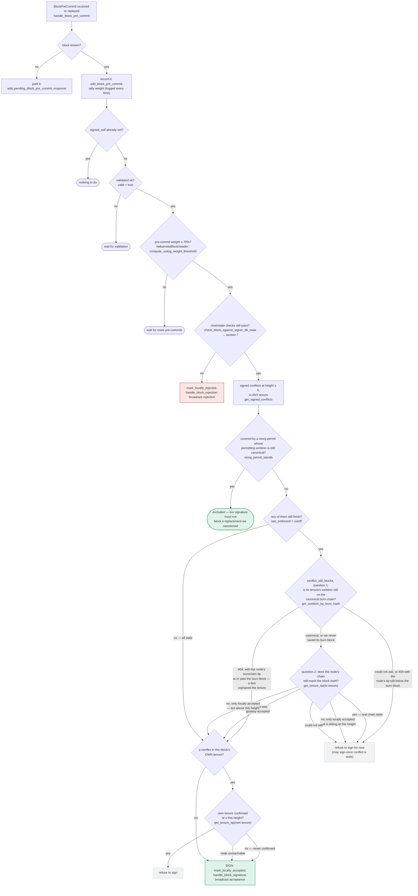
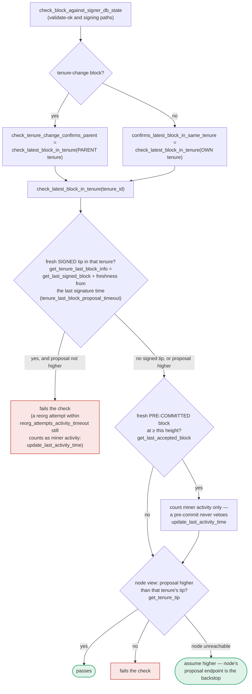

### Title
Signature-threshold path assembles and broadcasts a block without re-running the chainstate/conflict recheck that the pre-commit-threshold path performs - (File: `stacks-signer/src/v0/signer.rs`)

### Summary
`store_and_process_block_signature` can cross the 70% signature threshold and immediately call `mark_locally_accepted` + `broadcast_signed_block` without ever calling `check_block_against_signer_db_state` (the chainstate/conflict recheck), whereas the parallel pre-commit-threshold path (`handle_block_pre_commit`) explicitly re-runs that recheck immediately before treating a threshold crossing as final.

### Finding Description
Two independent code paths can cross the ≥70% weight threshold and act on it:

- `handle_block_pre_commit` tallies pre-commit weight and, on reaching threshold, explicitly re-runs `check_block_against_signer_db_state` before doing anything further: [1](#0-0) 

- `store_and_process_block_signature` tallies *signature* weight (`BlockResponse::Accepted` messages) and, on reaching threshold, goes straight to `mark_locally_accepted(true)` and `broadcast_signed_block` — with no equivalent call to `check_block_against_signer_db_state`: [2](#0-1) 

The only guard that routes a signature back through the (checked) pre-commit path is the "outdated peer" fallback, which applies **only** when the sender has not yet been recorded as having pre-committed: [3](#0-2) 

Once a peer's pre-commit has already been recorded (`self.signer_db.has_committed(...) == true`), that peer's subsequent `Accepted` signature bypasses `handle_block_pre_commit` entirely and falls through directly to the weight tally and, if it crosses the threshold, straight to `mark_locally_accepted`/broadcast — skipping the fresh chainstate recheck. This exactly mirrors the reported bug class: one code path (`PERMISSION_LEVEL_FUND_MANAGER` / `handle_block_pre_commit`) performs the integrity/consistency check, while a functionally parallel path (`PERMISSION_LEVEL_ALL` / `store_and_process_block_signature`) that reaches the same "act on threshold" decision point omits it.

The project's own documentation confirms the recheck is deliberately placed at "validate-ok and signing paths" via `check_block_against_signer_db_state`, and that the pre-commit path re-verifies "chainstate checks still pass" right before signing: [4](#0-3) [5](#0-4) 

No equivalent anchor documents a chainstate recheck inside `store_and_process_block_signature`'s threshold-crossing branch.

### Impact Explanation
Between the time this signer recorded pre-commits from peers and the time enough of those peers' *signatures* arrive to cross the signature threshold, this signer's own local chainstate/signerdb state may have moved on (e.g., it may have since signed a different, conflicting block at the same or higher height, or the tenure's canonical status may have changed). `check_block_against_signer_db_state` exists precisely to catch this drift before a threshold crossing is acted upon (as the pre-commit path does). Because `store_and_process_block_signature`'s threshold branch omits this recheck, the signer will mark the block as locally accepted and assemble+broadcast (`broadcast_signed_block`/`handle_post_block`) an aggregate-signed block to the stacks-node even though the signer's own local view would otherwise now reject it as conflicting/stale. This risks pushing a non-canonical/conflicting block toward node acceptance based on a signer's own stale-but-unchecked local state, undermining the "approved-parent vs canonical" consistency guarantee that the recheck is meant to preserve on every threshold-crossing path.

### Likelihood Explanation
This does not require a majority of colluding signers or any key compromise — it only requires ordinary asynchronous message arrival: a set of honest peers first send pre-commits (recorded, no recheck since threshold not yet reached from pre-commits alone), and then their `Accepted` signatures arrive later, by which point *this* signer's own view has changed (e.g., due to a Bitcoin reorg or a competing block it separately signed). This is squarely within the class of conditions the pre-commit path's comment ("we may have signed a _different_ block at the same height... the world must be re-checked before the signature leaves the box") warns about, but the signature path never performs the equivalent re-check.

### Recommendation
Add a call to `check_block_against_signer_db_state` (or equivalent) in `store_and_process_block_signature` immediately before `mark_locally_accepted`/`broadcast_signed_block`, mirroring the recheck already performed in `handle_block_pre_commit`, so that both threshold-crossing paths enforce the same consistency guarantee before acting.

### Proof of Concept
1. Signer S receives and records pre-commits from peers P1..Pn for block B (reward-cycle/height H), recorded via `add_block_pre_commit`, but pre-commit weight has not yet reached 70%, so no recheck fires.
2. Independently, S signs (or otherwise locally accepts) a different, conflicting block B' at height H (or a later tenure change), altering S's own `signer_db` state (e.g., a fresh `get_last_signed_block` entry) such that B would now fail `check_block_against_signer_db_state`.
3. P1..Pn (who already pre-committed) later broadcast `BlockResponse::Accepted` signatures for B. Each arrives at S via `handle_block_response` → `handle_block_signature` → `store_and_process_block_signature`.
4. Because `has_committed` is already true for each of P1..Pn, the "outdated peer" fallback (line 2463) does not fire; each signature falls straight through to the weight tally.
5. Once the accumulated *signature* weight for B crosses 70%, `store_and_process_block_signature` calls `mark_locally_accepted(true)` and `broadcast_signed_block` for B without ever calling `check_block_against_signer_db_state` — unlike the equivalent moment in `handle_block_pre_commit`, which would have rejected B here. [2](#0-1)

### Citations

**File:** stacks-signer/src/v0/signer.rs (L1340-1366)
```rust
        // The chain and signer db state may have changed materially since this block passed the
        // proposal-time checks (e.g. between validation and reaching the pre-commit threshold we
        // may have signed a block that this one would reorg). Re-run the chainstate checks
        // before putting a signature over the block, and respond with a rejection if they no
        // longer pass, just as the block validation response handler does.
        if let Some(block_rejection) =
            self.check_block_against_signer_db_state(stacks_client, &block_info.block)
        {
            warn!(
                "{self}: Reached the pre-commit threshold for a block, but it no longer passes the chainstate checks. Rejecting.";
                "signer_signature_hash" => %block_hash,
                "block_height" => block_info.block.header.chain_length,
                "reject_code" => %block_rejection.reason_code,
                "reject_reason" => &block_rejection.reason,
            );
            if let Err(e) = block_info.mark_locally_rejected() {
                if !block_info.has_reached_consensus() {
                    warn!("{self}: Failed to mark block as locally rejected: {e:?}");
                }
            };
            self.signer_db
                .insert_block(&block_info)
                .unwrap_or_else(|e| self.handle_insert_block_error(e));
            self.handle_block_rejection(&block_rejection, sortition_state);
            self.send_block_response(&block_info.block, block_rejection.into());
            return;
        }
```

**File:** stacks-signer/src/v0/signer.rs (L2462-2466)
```rust
        // If this isn't our own signature and we haven't seen a pre-commit from this signer yet, try treating it as a pre-commit in case the caller is running an outdated version
        if signer_address != &self.stacks_address && !self.signer_db.has_committed(block_hash, signer_address).inspect_err(|e| warn!("Failed to check if pre-commit message already considered for {signer_address:?} for {block_hash}: {e}")).unwrap_or(false) {
            self.handle_block_pre_commit(stacks_client, sortition_state, signer_address, block_hash);
            return;
        }
```

**File:** stacks-signer/src/v0/signer.rs (L2494-2538)
```rust
        let signature_weight = self.signer_weights.get(signer_address).unwrap_or(&0);
        let total_signature_weight = self.compute_signature_signing_weight(addrs_to_sigs.keys());
        let total_weight = self.compute_signature_total_weight();

        let min_weight = NakamotoBlockHeader::compute_voting_weight_threshold(total_weight)
            .unwrap_or_else(|_| {
                panic!("{self}: Failed to compute threshold weight for {total_weight}")
            });

        if min_weight > total_signature_weight {
            info!("{self}: Received block acceptance, but have not yet reached the acceptance threshold.";
                "signer_signature_hash" => %block_hash,
                "signature_weight" => signature_weight,
                "consensus_hash" => %block_info.block.header.consensus_hash,
                "block_height" => block_info.block.header.chain_length,
                "total_weight_approved" => total_signature_weight,
                "total_weight" => total_weight,
                "percent_approved" => (total_signature_weight as f64 / total_weight as f64 * 100.0),
            );
            return;
        }
        info!("{self}: have reached the block acceptance threshold";
            "signer_signature_hash" => %block_hash,
            "signature_weight" => signature_weight,
            "consensus_hash" => %block_info.block.header.consensus_hash,
            "block_height" => block_info.block.header.chain_length,
            "total_weight_approved" => total_signature_weight,
            "total_weight" => total_weight,
            "percent_approved" => (total_signature_weight as f64 / total_weight as f64 * 100.0),
        );

        // have enough signatures to broadcast!
        // move block to LOCALLY accepted state.
        // It is only considered globally accepted IFF we receive a new block event confirming it OR see the chain tip of the node advance to it.
        if let Err(e) = block_info.mark_locally_accepted(true) {
            if !block_info.has_reached_consensus() {
                warn!("{self}: Failed to mark block as locally accepted: {e:?}");
            }
        }
        let _ = self.signer_db.insert_block(block_info).map_err(|e| {
            warn!("Failed to set group threshold signature timestamp for {block_hash}: {e:?}");
            panic!("{self} Failed to write block to signerdb: {e}");
        });
        self.broadcast_signed_block(stacks_client, block_info.block.clone(), &addrs_to_sigs);
    }
```

**File:** docs/signer-flows.md (L237-272)
```markdown

```

**File:** docs/signer-flows.md (L391-423)
```markdown
`check_latest_block_in_tenure` answers "does this block confirm the tip we
expect?" and it runs in three places: at proposal arrival (inside
`check_proposal`), at validate-ok, and at the moment of signing. _Which_ tenure
it is asked about depends on the block: a tenure-change block is checked against
its **parent** tenure, every other block against its **own**. Never both. The
pivotal helper is `get_tenure_last_block_info`, which considers only blocks that
carry a signature (`get_last_signed_block`): a pre-commit never vetoes anything,
it only counts as miner activity.



A failed check becomes a different rejection depending on who asked.
`check_block_against_signer_db_state` returns `SortitionViewMismatch`, or
`ConnectivityIssues` when the lookup itself errored rather than answering; the v2
`check_proposal` path returns `InvalidParentBlock`.
```
